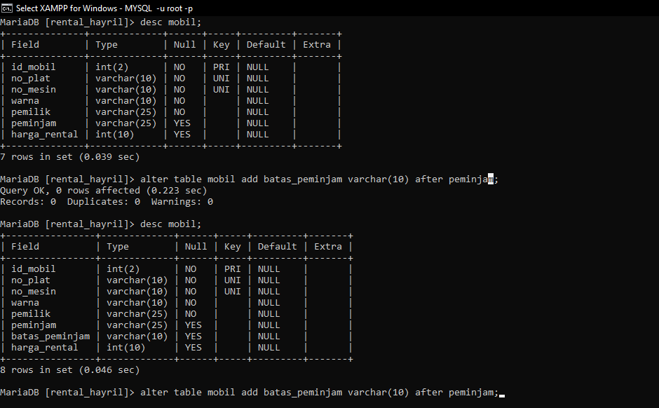
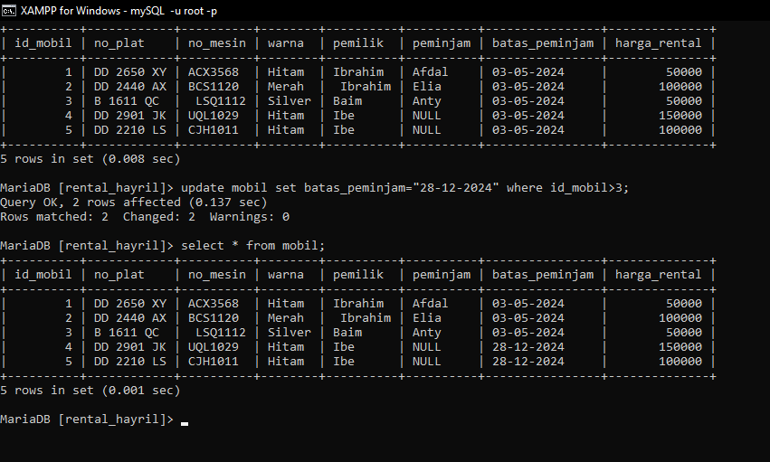
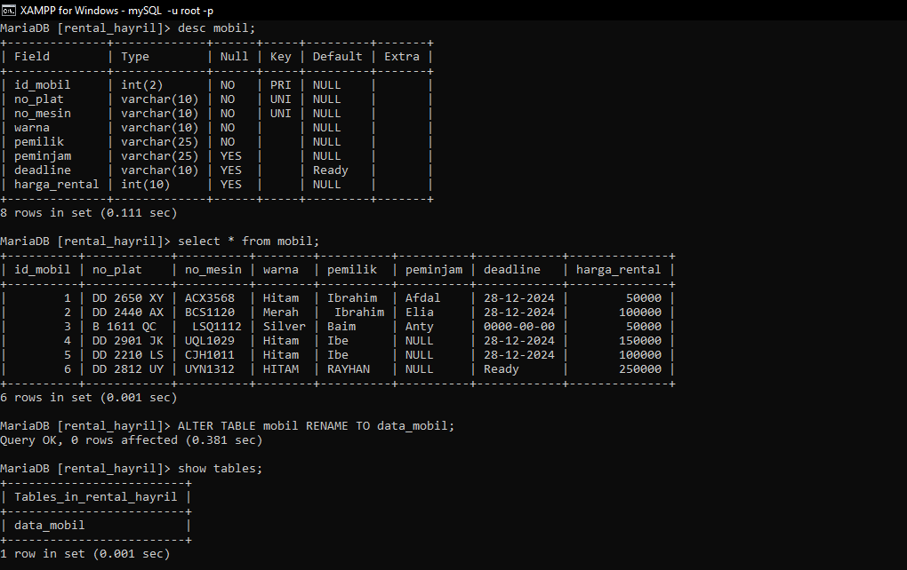
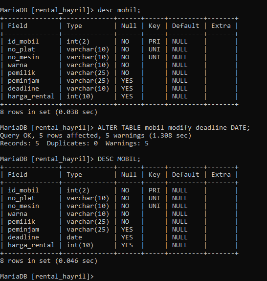
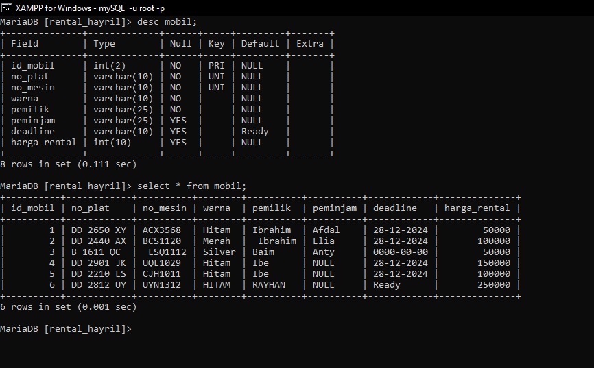
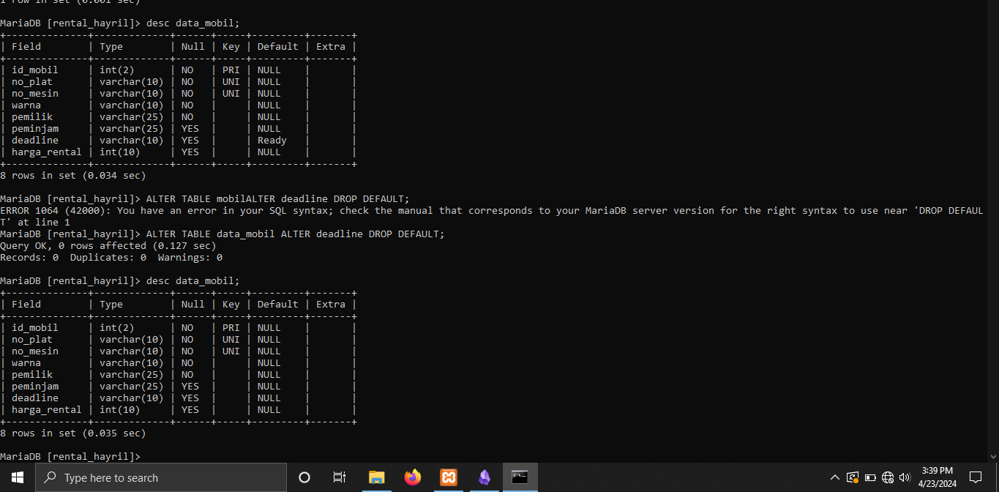
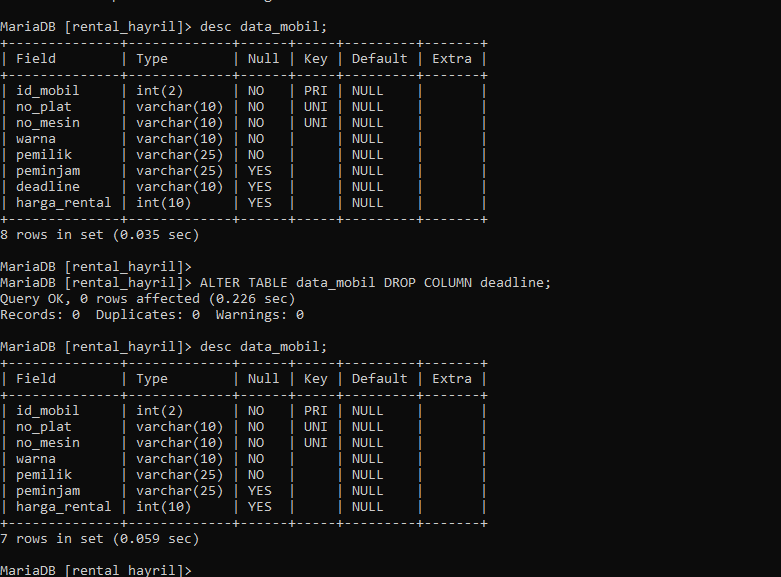

# ALTER 

1. MENAMBAH KOLOM
```MYSQL 
ALTER TABLE mobil ADD batas_peminjaman varchar(10) AFTER peminjam
```

- **AFTER** opsional untuk digunakan,jika tidak menggunakan klausa ini maka secara default kolom yang dibuat akan berada di akhir.jika kolom ingin ditaruh pada awal kolom gunakan klausa **FIRST**.
- silahkan tampilkan struktur tabel dan masukkan data ke kolom batas_peminjaman.

## HASIL:


## ANALISIS:
 `ALTER TABLE mobil`: Perintah untuk mengubah struktur tabel `mobil`.
- `ADD batas_peminjaman varchar(10)`: Menambahkan kolom baru dengan nama `batas_peminjaman` yang memiliki tipe data `varchar(10)`.
- `AFTER peminjam`: Menentukan bahwa kolom baru akan ditambahkan setelah kolom `peminjam` dalam struktur tabel.

## KESIMPULAN:
Perintah ini digunakan untuk menambahkan kolom `batas_peminjaman` dengan tipe data `varchar(10)` ke tabel `mobil` setelah kolom `peminjam`. Dengan menambahkan kolom ini, Anda dapat menyimpan informasi tentang batas peminjaman untuk setiap mobil dalam tabel.

Setelah menambahkan kolom kita dapat mengisi kolom tersebut dengan query:
## STRUKTUR
```mysql
 update mobil set batas_peminjam="28-12-2024" where id_mobil>3;
```

## HASIL:


2. MENGUBAH NAMA KOLOM
## STRUKTUR:
```MYSQL
ALTER TABLE NAMA_TABEL CHANGE NAMA_TABEL_VIRTUAL NAMA_BARU_TABEL_VIRTUAL VARCHAR(10);
```

```mysql
ALTER TABLE mobil CHANGE batas_peminjam deadline VARCHAR(10);
```

- **RENAME COLUMN:** digunakan pada mysql versi lawas yang mengharuskan menyertakan tipe datanya juga.
## HASIL:


## ANALISIS:
- `ALTER TABLE mobil`: Perintah untuk mengubah struktur tabel `mobil`.
- `CHANGE COLUMN batas_peminjaman deadline varchar(10)`: Mengubah kolom `batas_peminjaman` menjadi `deadline` dengan tipe data `varchar(10)`.
## KESIMPULAN:
Perintah ini mengubah nama kolom `batas_peminjaman` menjadi `deadline` dan mengubah tipe data menjadi `varchar(10)` dalam tabel `mobil`. Dengan ini, Anda dapat menggunakan nama kolom baru `deadline` untuk menyimpan informasi tentang batas peminjaman untuk setiap mobil dalam tabel.

3.MENGUBAH TIPE DATA KOLOM 
## STRUKTUR
```MYSQL 
ALTER TABLE mobil MODIFY deadline DATE;
```

## HASIL:

## ANALISIS:
- `ALTER TABLE mobil`: Perintah untuk mengubah struktur tabel `mobil`.
- `MODIFY deadline DATE`: Mengubah tipe data kolom `deadline` menjadi `DATE`.

## KESIMPULAN:
Perintah ini mengubah tipe data kolom `deadline` dalam tabel `mobil` menjadi `DATE`. Dengan ini, Anda dapat menggunakan kolom `deadline` untuk menyimpan informasi tentang batas peminjaman dalam format tanggal, yang lebih tepat dan mudah untuk dikelola.

4. MENAMBAHKAN CONSTRAINT
## STRUKTUR
```MYSQL 
ALTER TABLE mobil 
	ALTER deadline SET DEFAULT 'ready';
```

## HASIL:

## ANALISIS:
- `ALTER TABLE mobil`: Perintah untuk mengubah struktur tabel `mobil`.
- `ALTER deadline SET DEFAULT 'Ready'`: Mengatur nilai default kolom `deadline` menjadi 'Ready'.

## KESIMPULAN:
 Perintah ini mengubah nilai default kolom `deadline` dalam tabel `mobil` menjadi 'Ready'. Ini berarti jika tidak ada nilai yang diberikan untuk kolom `deadline` saat sebuah baris dimasukkan ke dalam tabel, maka nilainya akan secara otomatis diatur sebagai 'Ready'.

5. MENGHAPUS CONSTRAINT:
## STRUKTUR
```MYSQL 
ALTER TABLE mobil
	ALTER deadline DROP DEFAULT;
```

## HASIL:

## ANALISIS:
- `ALTER TABLE mobil`: Perintah untuk mengubah struktur tabel `mobil`.
- `ALTER deadline DROP DEFAULT`: Menghapus nilai default yang sebelumnya ditetapkan untuk kolom `deadline`.

## KESIMPULAN:
 Perintah ini menghapus nilai default yang sebelumnya ditetapkan untuk kolom `deadline` dalam tabel `mobil`. Setelah perintah ini dijalankan, jika tidak ada nilai yang diberikan untuk kolom `deadline` saat sebuah baris dimasukkan ke dalam tabel, maka kolom tersebut akan memiliki nilai NULL.

6. MENGHAPUS KOLOM  
## STRUKTUR
```MYSQL
ALTER TABLE mobil DROP COLUMN deadline;
```

## HASIL:

## ANALISIS:
- `ALTER TABLE mobil`: Perintah untuk mengubah struktur tabel `mobil`.
- `DROP COLUMN deadline`: Menghapus kolom `deadline` dari tabel `mobil`
## KESIMPULAN:
Perintah ini menghapus kolom `deadline` dari tabel `mobil`. Setelah perintah ini dijalankan, kolom `deadline` akan dihapus dari struktur tabel `mobil` dan tidak akan lagi tersedia untuk digunakan.

7. MENGUBAH NAMA TABEL 
## STRUKTUR
```MYSQL
ALTER TABLE mobil RENAME TO data_mobil;
```

## HASIL:

## ANALISIS:
- `ALTER TABLE mobil`: Perintah untuk mengubah tabel dengan nama `mobil`.
- `RENAME TO data_mobil`: Mengubah nama tabel `mobil` menjadi `data_mobil`.
KESIMPULAN:
Perintah ini mengubah nama tabel `mobil` menjadi `data_mobil`. Setelah perintah ini dijalankan, tabel tersebut akan dapat diakses dengan nama baru `data_mobil` dan tidak lagi dengan nama `mobil`.

