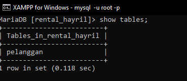
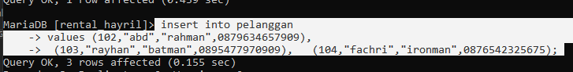
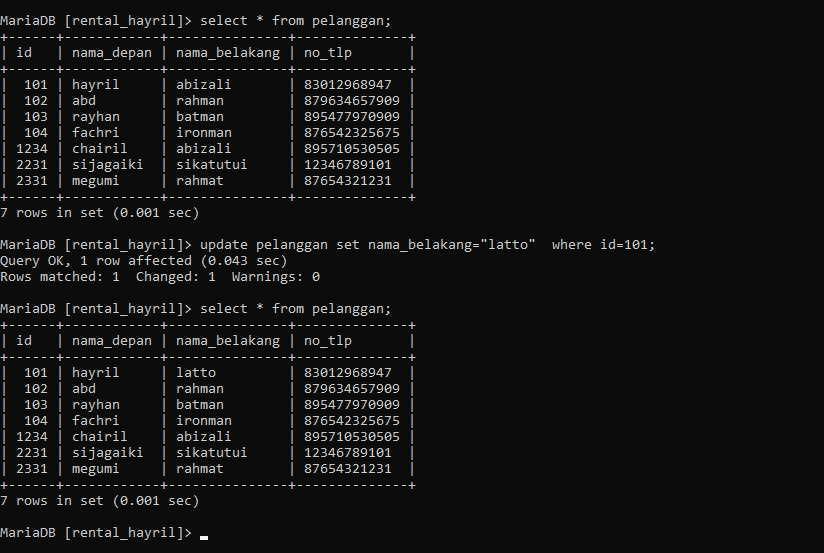
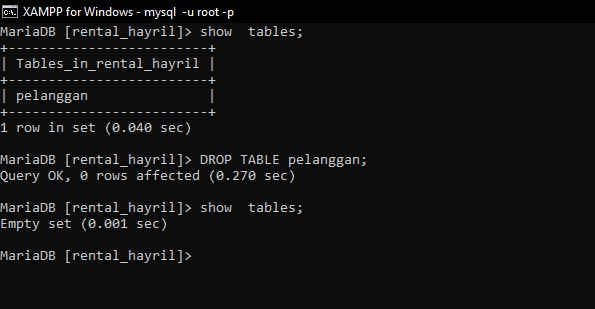

PENGENALAN BASIS DATA
# Definisi basis data 
jika dibahasakan,basis adalah tempat atau wadah yang mempunyai aturan tertentu,dan data adalah kumpulan informasi yang sesuai fakta. Tetapi jika di definisikan ==basis data adalah kumpulan data yang berhubungan Secara logika disertai dengan deskripsi data.==

# Peranan Basis Data
==Perananan basis data sangat penting dalam pengolahan data,agar terstruktur==.
contoh yang bisa saya ambil di tempat *PKL* saya yaitu **PDAM** kota makassar,terdapat ruang server yang berisi **Data** identitas konsumen dari *Nama*,*Alamat*,dan *informasi* yang berhubungan antara **PDAM** dengan konsumen di seluruh kota makassar.
m 
# Struktur Basis Data

Basis data di ibaratkan sebuah tabung yang didalamnya dapat mengolah sebuah file file dan juga tabel.pada gambar berikut terdapat ilustrasi dari basis data tersebut.


Dalam basis data terdapat juga yang dinamakan tabel,pada gambar di atas telah ditampilkan gambar tabel beserta struktur-struktur nya.

## PENJELASAN
- RECORD:**Record** adalah istilah dari sebuah baris pada tabel.
- FIELD :**Field** adalah istilah dari sebuah kolom pada tabel.
- KARAKTER : **karakter** adalah istilah dari sebuah nilai yang telah disikan pada sebuah tabel
- ITEM DATA: **Item data** adalah salah satu istilah dari nilai data sebuah tabel yang telah diisikan.

| NO | NAMA | JK | KELAS |
| :--: | :--- | ---- | ---- |
| 1 | CHAIRIL ABIZALI | LAKI-LAKI | XI RPL 1 |
| 2 | FACHRI RAMADHAN | MEN | XI RPL 1 |
| 3 | RAYHAN JULI S (SETIA) | PRIA | XI RPL 1 |
| 4 | NUR RAHMAT RAMADHAN | COWOK | XI RPL 1 |
>[!info]
>Berikut adalah contoh pengaplikasian tabel yang telah dibuat.

DATA BASE
# Membuat data base 
Data base adalah kumpulan informasi yang disimpan secara  sistematik dalam komputer sehingga kemudian  dapat diperiksa denganb mudah melalui program komputer tertentu.
Berikut adalah cara membuat data base:
1.masuk pada aplikasi xampp
2.pilih mode  mysql lalu klik start
3.kemudian klik shell.

berikut adalah tampilan sheel yang harus dimasuki

4.ketik `xampp-setup-storage`.lalu klik `allow` agar xampp dapat mengakses penyimpanan ke file explorer pada laptop.
5.saat masuk kedalam admin  ketik `mysql -u root -p` untuk masuk kedalam user databases.
6.kemudian kita akan disuruh memasukkan password,klik enter jika tidak mempunyai password.
7.tahap awal pembuatan database telah selesai.

# Penerapan mysql
setelah pembuatan database telah selesai,kita dapat menerapkan mysql dengann menggunakan fitur adalah membuat,menghapus,melihat,dan menggunakan database.

- **Membuat Database**,dalam pembuatan database pada mysql,di awali dengan menggunakan query `CRATE DATABASE [NAMA DATABASE]` setelah pengetikan query database akan terbuat.
CONTOH GAMBAR:

a.Pada tabel pertama merupakan tampilan pertama tabel berisikan nama nama-nama database sebelum membuat database yang baru
b.Pada bagian yang diblok pada gambar adalah sebuah perintah dengan *query* `create database rayhanbatman;` sebagai perintah mysql untuk membuat sebuah database dengan nama `rayhanbatman` pada mysql.
c. pada tabel kedua merupakan tampilan tabel yang telah berhasil membuat database dengan nama `rayhanbatman`. 

- **Menghapus Database**, dalam peghapusan database pada mysql,diawali dengan meggunakan query `DROP DATABASE[NAMA DATABASE]` maka mysql akan melakukan penghapusan Database setelah perintah query ini.
CONTOH GAMBAR:

a.Pada tabel pertama merupakan tampilan pertama tabel berisikan nama nama database sebelum menghapus database dengan nama `rayhanbatman` 
b.Pada bagian yang diblok pada gambar adalah sebuah perintah dengan *query* `drop database rayhanbatman;` sebagai perintah mysql untuk menghapus sebuah database dengan nama `rayhanbatman` pada mysql.
c. pada tabel kedua merupakan tampilan tabel yang telah berhasil mengahapus database dengan nama `rayhanbatman`. 

- **Menampilkan Database**,dalam peritah menampilan database pada mysql,diawali dengan query `SHOW DATABASES;` maka perintah mysql akan menampilkan Databases setelah perintah query.
CONTOH GAMBAR:

pada gambar di atas menampilkan tabel yang telah ditampilkan setelah melakukan perintah mysql dengan menggunakan *query*  `SHOW DATABASES;` maka akan ditampilkan beberapa nama-nama database pada mysql.
- **Menggunakan Database**,dalam perintah menggunakan database pada mysql,maka perintahnya menggunakan query `USE[NAMA_DATABASE]`
CONTOH GAMBAR:

pada gambar di atas tertampilkan bahwa *query* `MariaDB [("none")]`adalah database yang sedang digunakan,kemudian setelah melakukan perintah dengan *query* `use XI_RPL_1` maka pada tampilan yang diblok dengan *query*`MariaDB [XI_RPL_1]>` menandakan bawa user telah berada pada database `XI_RPL_1`

# Tabel 

## Buat tabel 
Tabel merupakan **susunan data dalam baris dan kolom, atau mungkin dalam struktur yang lebih kompleks**.Tabel juga dapat digunakan pada *Basisdata* untuk membuat data menjadi lebih terstruktur.

```mysql
CREATE TABLE pelanggan (
id_pelanggan INT(4) PRIMARY KEY NOT NULL,
nama_depan VARCHAR(25)NOT NULL,
nama_belakang VARCHAR(25)NOT NULL,
no_telp char(12)UNIQUE

);
```

`id_pelanggan` bertipe data **INT** untuk menyimpan data berupa bilangan bulat dengan panjang maksimum *4* digit, sebagai kunci utama ` (PRIMARY KEY)` yang tidak boleh kosong `(NOT NULL)`.
nama_depan bertipe data **VARCHAR** untuk menyimpan data berupa karakter dengan panjang maksimum*25* karakter, tidak boleh kosong `(NOT NULL)`.
nama_belakang bertipe data **VARCHAR** untuk menyimpan data berupa karakter dengan panjang maksimum *25* karakter, tidak boleh kosong` (NOT NULL)`.
`no_telp` bertipe data **CHAR** untuk menyimpan data berupa karakter (berbeda dengan VARCHAR tipe data ini menyimpan data terlepas dari panjang string yang sebenarnya ) dengan panjang maksimum *12* karakter, dan harus unik `(UNIQUE)`.

>[!INFO]-
>Setelah memasukkan query di atas,tekan ENTER lalu ketik `DESC [NAMA TABEL]`,Kemudian tekan ENTER.

## tampilan struktur tabel


 - `id` adalah nama data base atau variabel untuk mengisi **id**,`INT(4)`  adalah perintah untuk menambahkan data id pelanggan dengan menggunakan tipe data `INT` untuk menyimpan data berupa angka,dan angka 4 adalah jumlah data yang hanya dapat ditambahkan. `PRIMARY KEY NOT NULL` adalah perintah untuk membuat data menjadi terkunci yang artinya data tersebut wajib terisi.
 - `nama_depan` merupakan variabel untuk menambahkan data dengan inisialisasi **nama_depan** dan `VARCHAR` sebagai tipe data untuk menyimpan data berupa karakter dan *(25)* adalah sebuah keterangan yang hanya dapat berupa 25 data,`NOT NULL` adalah sebagai perintah agar menegaskan bahwa data tersebut bisa saja tidak terisi.
- sama seperti nama depan tadi `nama_belakang` merupakan variabel untuk menambahkan data dengan inisialisasi **nama_belakang** dan `VARCHAR` sebagai tipe data untuk menyimpan data berupa karakter dan *(25)* adalah sebuah keterangan yang hanya dapat berupa 25 data,`NOT NULL` adalah sebagai perintah agar menegaskan bahwa data tersebut bisa saja tidak terisi.
- pada struktur `no_telp` menggunakan variabel **no_telp** sebagai tempat menyimpan data nomor telpon ,`char(12)` tipe data char sebagai tempat menyimpan data berupa karakter,kemudian *(12)* sebagai keterangan bahwa data yang dapat diisi hanya dapat berjumlah 12 data,dan `UNIQUE`  adalah sebuah perintah bahwa data tersebut tidak boleh sama dengan data yang lainnya.
## menampilkan tabel

pada saat telah masuk kedalam data base yang kita punya,ketik `show tables;` maka *query* tersebut akan menampilkan beberapa tabel yang kita punya atau yang telah dibuat.
## QnA
1) Mengapa hanya kolom id_pelanggan yang menggunakan constraint PRIMARY KEY?
2) Mengapa pada kolom no_telp yang menggunakan data CHAR bukan VARCHAR?
3)  Mengapa hanya kolom no_telp yang menggunakan constraint UNIQUE?
4)  Mengapa kolom no_telp tidak memakai constraint NOT NULL sementara kolom lainnya menggunakan constraint tersebut?
5) Tuliskan perbedaan antara PRIMARY KEY dengan UNIQUE?
JAWABAN:
1) .Untuk membedakan id Pelanggan  yang sama, mencegah duplikasi, dan mempermudah pencarian data.
2) Tipe data char menyimpan data dalam karakter panjang lebih efisien. pencarian pada kolom tipe data CHAR dapat lebih cepat
3) Karna no_telp tidak ada yang sama semua pasti berbeda dan nilainya unik maka menggunakan constrains unique artinya data dalam tabel id_telpon berbeda tidak ada yang sama. 
4) Nomor telpon dianggap opsional. nomor telepon hanya menjadi wajib saat pengguna melakukan langkah-langkah tertentu, Anda mungkin tidak ingin mengharuskan pengguna mengisinya pada tahap awal.
5) PRIMERY KEY untuk membedakan data yang sama dan hanya boleh 1 dan tidak boleh tidak ada. 
	Kalau UNiQUE sebuah kolom yang memiliki data yang berbeda atau tidak sama unique boleh 1,2,3 Dan seterusnya dan boleh tidak ada.
	
	# INSERT
## INSERT 1 DATA
 STRUKTUR 
```mysql
INSERT INTO [NAMA_TABEL]
VALUES (nilai1,nilai2,nilai3);
```
CONTOH
```mysql
INSERT INTO pelanggan
VALUES (101,"hayril","abizali",0895710530505)
```

ANALISA:
`INSERT INTO` adalah perintah untuk memasukkan data kedalam tabel dengan nama **pelanggan** sebagai inisialisasi nama tabel yang ingin dimasukkan data. `VALUE` sebagai  penentu nilai yang akan dimasukkan,angka *101* sebagai nilai untuk mengisi kolom pertam pada tabel **pelanggan** sebagai ID pelanggan,*"hayril"* sebagai data untuk mengisi tabel nama depan pada tabel **pelanggan**, *"abizali"* sebagai data untuk mengisi tabel nama belakang pada tabel **pelanggan**, *"0895710530505"* adalah data untuk mengisi tabel no telpon pada tabel **pelanggan**.


## INSERT >1 DATA

STRUKTUR

```mysql
INSERT INTO pelanggan
VALUES (101,"hayril","abizali",0895710530505),
	   (102,"abd","rahman",0879634657909),
	   (103,"rayhan","batman",0895477970909),
	   (104,"fachri","ironman",0876542325675);

```

CONTOH:



# SELECT
## SELECT SELURUH DATA

STRUKTUR
```MYSQL
SELECT * FROM [nama_table];
```

CONTOH:

```MYSQL
SELECT * FROM pelanggan;
```


ANALISA:
- `SELECT` perintah untuk menampilkan data.
- `*` adalah perintah untuk keseluruhan.
- `from` adalah perintah untuk pemanggilan dari tabel.
- `pelanggan` berfungsi untuk sebagai nama tabel yang dipanggil. 
KESIMPULAN:
- SELECT * FROM pelanggan; adalah query perintah untuk menampilkan data table secara keseluruhan.

## SELECT menyebutkan kolom 

STRUKTUR
```MYSQL
SELECT [nama_kolom] from [nama_table];
```

CONTOH
```MYSQL 
SELECT nama_depan from pelanggan;
```


ANALISA:
-  `SELECT` perintah untuk menampilkan data.
- `nama_depan` adalah nama dari salah satu kolom pada tabel
- `from` adalah perintah untuk pemanggilan dari tabel.
- `pelanggan` berfungsi untuk sebagai nama tabel yang dipanggil. 

KESIMPULAN:
- SELECT nama_depan FROM pelanggan; adalah query perintah untuk menampilkan seluruh data tabel pada kolom nama depan  .
## KLAUSA WHERE

STRUKTUR 
```MYSQL
SELECT [nama_kolom/] from [nama_table] where [kondisi];
```

CONTOH
```MYSQL
SELECT nama_depan from pelanggan where ID=104;
```


ANALISA:
-  `SELECT` perintah untuk menampilkan data.
- `nama_depan` adalah salah satu nama kolom pada tabel.
- `from` adalah perintah untuk pemanggilan dari tabel.
- `pelanggan` sebagai nama tabel yang ditujukan.
- `where` perintah yang berfungsi menentukan letak data yang dipilih.
- `ID=104`adalah letak data yang ingin di tampilkan.
KESIMPULAN:
- SELECT nama_depan from pelanggan where ID=104; adalah query perintah untuk menampilkan data tabel pada kolom nama depan pada data yang id 104.

# UPDATE 

STRUKTUR:
```MYSQL 
update [nama_tabel] set [nama_kolom]="data yang diubah" where kodisi;
```

CONTOH
```MYSQL
update pelanggan set nama_depan="latto" where id=101;
```



ANALISA:
- `update` adalah perintah query untuk melakukan update atau pembaharuan data.
- `pelanggan` sebagai nama tabel yang dipanggil. 
- `set` adalah perintah untuk setting 
- `nama_depan` adalah sebagai nama kolom.
- `where` perintah yang berfungsi menentukan letak data yang dipilih.
- `ID=104`adalah letak data yang ingin dipilih.
KESIMPULAN:
- Update pelanggan set nama_depan="latto" where id=101; adalah perintah untuk memperbaharui data ber-id=101 pada kolom nama_depan dengan data yang baru berupa "latto".
# DELETE 

STRUKTUR:

```MYSQL
 delete from pelanggan where kondisi;
```

CONTOH:
```MYSQL 
 delete from pelanggan where id=101;
```


ANALISA:
- `DELETE` adalah perintah query yang befungsi untuk menghapus data;
- `from` adalah perintah untuk pemanggilan dari tabel.
- `pelanggan` sebagai nama tabel yang ditujukan.
-  `where` perintah yang berfungsi menentukan letak data yang dipilih.
- `ID=101`adalah letak data yang ingin dipilih.
KESIMPULAN:
-  delete from pelanggan where id=101; adalah perintah query untuk menghapus seluruh data yang ber-id=101. 
# HAPUS TABEL

STRUKTUR:
```MYSQL
DROP TABLE [nama_table];
```

CONTOH:
```MYSQL
DROP TABLE pelanggan;
```



ANALISA:
- `DROP TABLE` adalah perintah untuk menghapus.
- `pelanggan` adalah sebuah nama tabel.
KESIMPULAN:
- DROP TABLE pelanggan; adalah sebuah perintah untuk menghapus sebuah tabel yang bernamakan **pelanggan**.
# SELECT LANJUTAN 
## AND 
select AND ini akan menampilkan data dengan  "nilai1" dan "nilai2".
CONTOH:
```MYSQL
 select warna,pemilik FROM mobil WHERE warna="hitam" AND pemilik="ibrahim";
```


## OR 
select OR ini akan menampilkan data dengan  "nilai1"  atau "nilai2".
CONTOH:
```MYSQL
 select warna,pemilik FROM mobil WHERE warna="hitam" OR pemilik="ibrahim";
```


##  BETWEEN- AND
select between-and ini akan menampilkan data antara "nilai1" dan "nilai2".karena didukung dengan AND.
CONTOH:
```MySQL
 select * FROM mobil WHERE harga_rental BETWEEN 100000 AND 200000;
```


## NOT BETWEEN 
untuk NOT BETWEEN ini akan menampilkan  yang bukan antara "nilai1" dan "nilai2".
CONTOH:
```MYSQL
SELECT * FROM mobil WHERE harga_rental NOT BETWEEN 100000 AND 200000;
```


## <= 
untuk **<=** ini akan menampilkan **"data"** yang lebih kecil atau sama dengan **"nilai_data** yang telah ditentukan.
CONTOH:
```mysql 
SELECT * FROM mobil WHERE harga_rental <= 50000;
```


## >= 
untuk **>=** ini akan menampilkan **"data"** yang lebih besar atau sama dengan **"nilai_data** yang telah ditentukan.
CONTOH:
```mysql
SELECT * FROM mobil WHERE harga_rental >= 50000;
```


## <> atau != 
untuk **<>atau !=** ini akan menampilkan **"data"** yang tidak  sama dengan **"nilai_data** yang telah ditentukan.
CONTOH:
```mysql
SELECT * FROM mobil WHERE harga_rental <> 50000;
```


