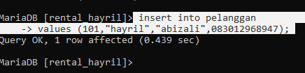
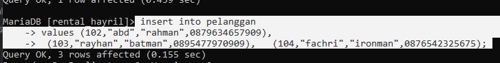
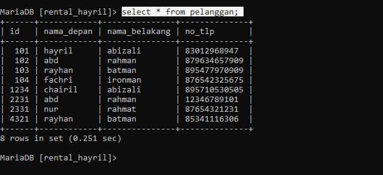
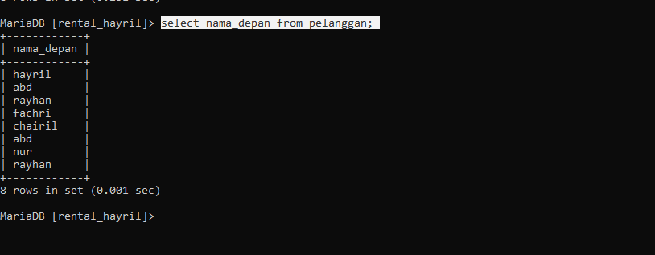
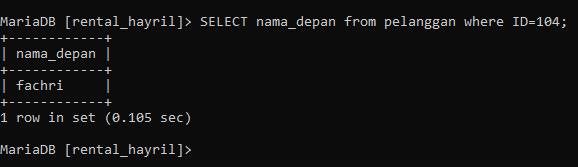
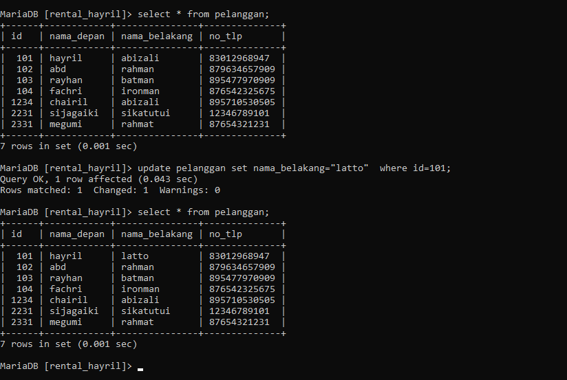
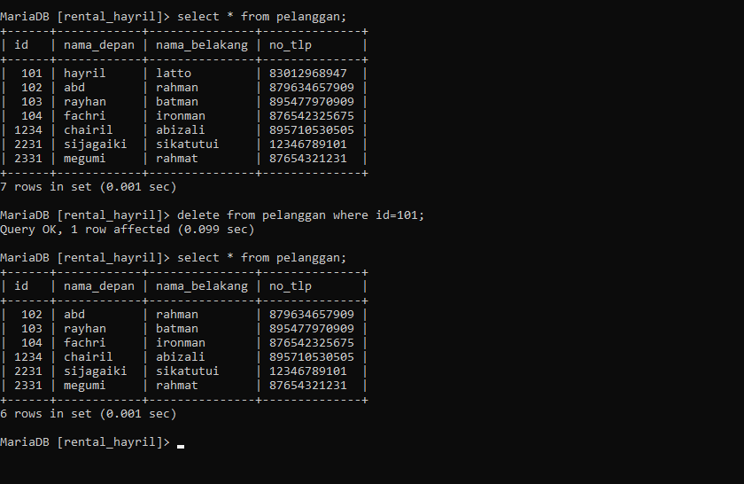
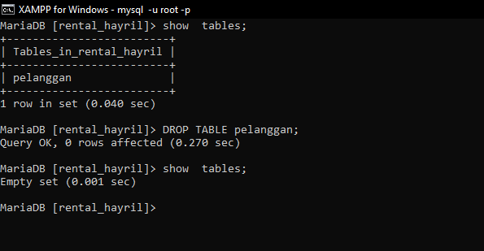

	# INSERT
## INSERT 1 DATA
 STRUKTUR 
```mysql
INSERT INTO [NAMA_TABEL]
VALUES (nilai1,nilai2,nilai3);
```
CONTOH
```mysql
INSERT INTO pelanggan
VALUES (101,"hayril","abizali",0895710530505)
```

ANALISA:
`INSERT INTO` adalah perintah untuk memasukkan data kedalam tabel dengan nama **pelanggan** sebagai inisialisasi nama tabel yang ingin dimasukkan data. `VALUE` sebagai  penentu nilai yang akan dimasukkan,angka *101* sebagai nilai untuk mengisi kolom pertam pada tabel **pelanggan** sebagai ID pelanggan,*"hayril"* sebagai data untuk mengisi tabel nama depan pada tabel **pelanggan**, *"abizali"* sebagai data untuk mengisi tabel nama belakang pada tabel **pelanggan**, *"0895710530505"* adalah data untuk mengisi tabel no telpon pada tabel **pelanggan**.



## INSERT >1 DATA

STRUKTUR

```mysql
INSERT INTO pelanggan
VALUES (101,"hayril","abizali",0895710530505),
	   (102,"abd","rahman",0879634657909),
	   (103,"rayhan","batman",0895477970909),
	   (104,"fachri","ironman",0876542325675);

```

CONTOH:



# SELECT
## SELECT SELURUH DATA

STRUKTUR
```MYSQL
SELECT * FROM [nama_table];
```

CONTOH:

```MYSQL
SELECT * FROM pelanggan;
```



ANALISA:
- `SELECT` perintah untuk menampilkan data.
- `*` adalah perintah untuk keseluruhan.
- `from` adalah perintah untuk pemanggilan dari tabel.
- `pelanggan` berfungsi untuk sebagai nama tabel yang dipanggil. 
KESIMPULAN:
- SELECT * FROM pelanggan; adalah query perintah untuk menampilkan data table secara keseluruhan.

## SELECT menyebutkan kolom 

STRUKTUR
```MYSQL
SELECT [nama_kolom] from [nama_table];
```

CONTOH
```MYSQL 
SELECT nama_depan from pelanggan;
```


ANALISA:
-  `SELECT` perintah untuk menampilkan data.
- `nama_depan` adalah nama dari salah satu kolom pada tabel
- `from` adalah perintah untuk pemanggilan dari tabel.
- `pelanggan` berfungsi untuk sebagai nama tabel yang dipanggil. 

KESIMPULAN:
- SELECT nama_depan FROM pelanggan; adalah query perintah untuk menampilkan seluruh data tabel pada kolom nama depan  .
## KLAUSA WHERE

STRUKTUR 
```MYSQL
SELECT [nama_kolom/] from [nama_table] where [kondisi];
```

CONTOH
```MYSQL
SELECT nama_depan from pelanggan where ID=104;
```


ANALISA:
-  `SELECT` perintah untuk menampilkan data.
- `nama_depan` adalah salah satu nama kolom pada tabel.
- `from` adalah perintah untuk pemanggilan dari tabel.
- `pelanggan` sebagai nama tabel yang ditujukan.
- `where` perintah yang berfungsi menentukan letak data yang dipilih.
- `ID=104`adalah letak data yang ingin di tampilkan.
KESIMPULAN:
- SELECT nama_depan from pelanggan where ID=104; adalah query perintah untuk menampilkan data tabel pada kolom nama depan pada data yang id 104.

# UPDATE 

STRUKTUR:
```MYSQL 
update [nama_tabel] set [nama_kolom]="data yang diubah" where kodisi;
```

CONTOH
```MYSQL
update pelanggan set nama_depan="latto" where id=101;
```



ANALISA:
- `update` adalah perintah query untuk melakukan update atau pembaharuan data.
- `pelanggan` sebagai nama tabel yang dipanggil. 
- `set` adalah perintah untuk setting 
- `nama_depan` adalah sebagai nama kolom.
- `where` perintah yang berfungsi menentukan letak data yang dipilih.
- `ID=104`adalah letak data yang ingin dipilih.
KESIMPULAN:
- Update pelanggan set nama_depan="latto" where id=101; adalah perintah untuk memperbaharui data ber-id=101 pada kolom nama_depan dengan data yang baru berupa "latto".
# DELETE 

STRUKTUR:

```MYSQL
 delete from pelanggan where kondisi;
```

CONTOH:
```MYSQL 
 delete from pelanggan where id=101;
```


ANALISA:
- `DELETE` adalah perintah query yang befungsi untuk menghapus data;
- `from` adalah perintah untuk pemanggilan dari tabel.
- `pelanggan` sebagai nama tabel yang ditujukan.
-  `where` perintah yang berfungsi menentukan letak data yang dipilih.
- `ID=101`adalah letak data yang ingin dipilih.
KESIMPULAN:
-  delete from pelanggan where id=101; adalah perintah query untuk menghapus seluruh data yang ber-id=101. 
# HAPUS TABEL

STRUKTUR:
```MYSQL
DROP TABLE [nama_table];
```

CONTOH:
```MYSQL
DROP TABLE pelanggan;
```



ANALISA:
- `DROP TABLE` adalah perintah untuk menghapus.
- `pelanggan` adalah sebuah nama tabel.
KESIMPULAN:
- DROP TABLE pelanggan; adalah sebuah perintah untuk menghapus sebuah tabel yang bernamakan **pelanggan**.
