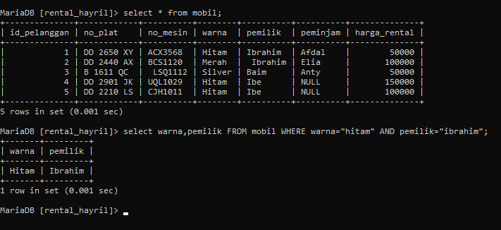
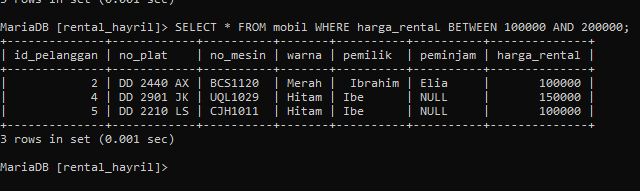
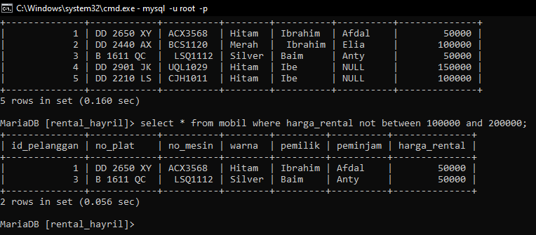
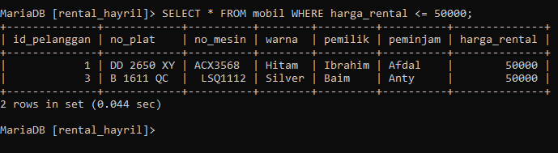
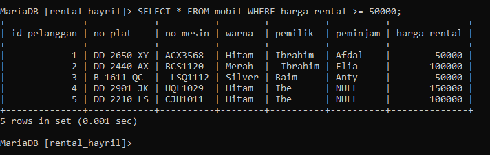
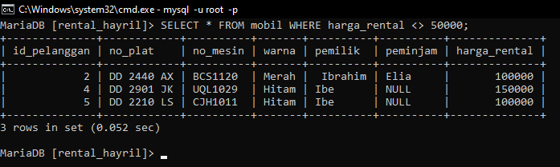

# SELECT LANJUTAN 
## AND 
select AND ini akan menampilkan data dengan  "nilai1" dan "nilai2".
CONTOH:
```MYSQL
 select warna,pemilik FROM mobil WHERE warna="hitam" AND pemilik="ibrahim";
```



## OR 
select OR ini akan menampilkan data dengan  "nilai1"  atau "nilai2".
CONTOH:
```MYSQL
 select warna,pemilik FROM mobil WHERE warna="hitam" OR pemilik="ibrahim";
```


##  BETWEEN- AND
select between-and ini akan menampilkan data antara "nilai1" dan "nilai2".karena didukung dengan AND.
CONTOH:
```MySQL
 select * FROM mobil WHERE harga_rental BETWEEN 100000 AND 200000;
```



## NOT BETWEEN 
untuk NOT BETWEEN ini akan menampilkan  yang bukan antara "nilai1" dan "nilai2".
CONTOH:
```MYSQL
SELECT * FROM mobil WHERE harga_rental NOT BETWEEN 100000 AND 200000;
```


## <= 
untuk **<=** ini akan menampilkan **"data"** yang lebih kecil atau sama dengan **"nilai_data** yang telah ditentukan.
CONTOH:
```mysql 
SELECT * FROM mobil WHERE harga_rental <= 50000;
```



## >= 
untuk **>=** ini akan menampilkan **"data"** yang lebih besar atau sama dengan **"nilai_data** yang telah ditentukan.
CONTOH:
```mysql
SELECT * FROM mobil WHERE harga_rental >= 50000;
```



## <> atau != 
untuk **<>atau !=** ini akan menampilkan **"data"** yang tidak  sama dengan **"nilai_data** yang telah ditentukan.
CONTOH:
```mysql
SELECT * FROM mobil WHERE harga_rental <> 50000;
```


