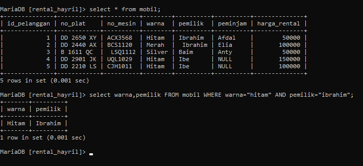
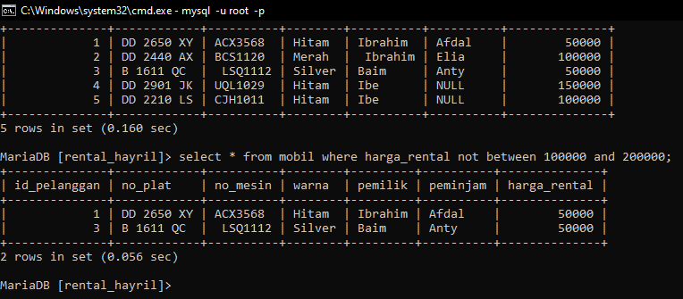
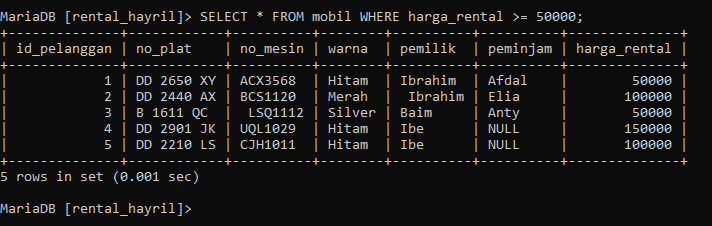
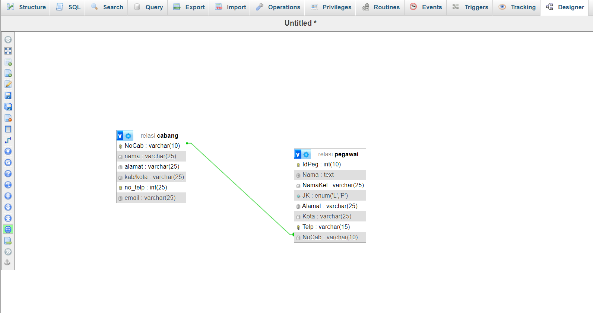

## AND 
select AND ini akan menampilkan data dengan  "nilai1" dan "nilai2".
### STRUKTUR:
```MYSQL
select [nama_kolom],[nama_kolom] FROM [nama_tabel] WHERE [nama_kolom]=["nama_data"] AND [nama_kolom]=["nama_data"];
```
### CONTOH:
```MYSQL
 select warna,pemilik FROM mobil WHERE warna="hitam" AND pemilik="ibrahim";
```

### HASIL:


### ANALISIS:
- **SELECT** adalah sebuah perintah query yang tugas memilih.
- **WARNA** adalah sebuah nama kolom pada tabel mobil.
- **PEMILIK** adalah sebuah nama kolom juga pada tabel mobil.
- **FROM** adalah sebuah perintah query yang tugas nya untuk pemanggilan dari.
- **WHERE** adalah sebuah perintah query yang tugas untuk menentukan pemanggilan yang mana ditujukannya.
- **hitam** adalah nama data pada sebuah kolom
- **AND** adalah sebuah perintah query DAN menujukkan bahwa pemilihan data nya lebih dari 1.
- **ibrahim** adalah nama data pada sebuah kolom

### KESIMPULAN:
query diatas adalah perintah untuk menampilkan sebuah data dari tabel mobil yang bertujukan pada kolom warna dengan data "hitam" dan kolom pemilik dengan data "ibrahim"


## OR 
select OR ini akan menampilkan data dengan  "nilai1"  atau "nilai2".

### STRUKTUR
```mysql
select [nama_kolom],[nama_kolom] FROM [nama_tabel] WHERE [nama_kolom]=["nama_data"] OR [nama_kolom]=["nama_data"];
```
### CONTOH:
```MYSQL
 select warna,pemilik FROM mobil WHERE warna="hitam" OR pemilik="ibrahim";
```

### HASIL:

### ANALISIS:
- **SELECT** adalah sebuah perintah query yang tugas memilih.
- **WARNA** adalah sebuah nama kolom pada tabel mobil.
- **PEMILIK** adalah sebuah nama kolom juga pada tabel mobil.
- **FROM** adalah sebuah perintah query yang tugas nya untuk pemanggilan dari.
- **WHERE** adalah sebuah perintah query yang tugas untuk menentukan pemanggilan yang mana ditujukannya.
- **hitam** adalah nama data pada sebuah kolom
- **OR** adalah sebuah perintah query ATAU menujukkan bahwa pemilihan data yang ditampilkan adalah salah satu dari syarat yang  ditentukan.
- **ibrahim** adalah nama data pada sebuah kolom

### KESIMPULAN:
query diatas adalah perintah untuk menampilkan sebuah data dari tabel mobil yang bertujukan pada kolom warna dengan data "hitam" atau kolom pemilik dengan data "ibrahim" jadi hanya data hitam dan ibrahim lah yang akan tampil.

##  BETWEEN- AND
select between-and ini akan menampilkan data antara "nilai1" dan "nilai2".karena didukung dengan AND.

### STRUKTUR
```mysql
 select * FROM [nama_tabel] WHERE [nama_kolom] BETWEEN [nilai_data1] AND [nilai_data2];
```
### CONTOH:
```MySQL
 select * FROM mobil WHERE harga_rental BETWEEN 100000 AND 200000;
```

### HASIL:


### ANALISIS:

- **SELECT** adalah sebuah perintah query yang tugas memilih.
- **FROM** adalah sebuah perintah query yang tugas nya untuk pemanggilan dari.
- **WHERE** adalah sebuah perintah query yang tugas untuk menentukan pemanggilan yang mana ditujukannya.
- **MOBIL** adalah sebuah nama tabel.
- **BETWEEN** adalah sebuah perintah query ANTARA menujukkan bahwa pemilihan data yang ditampilkan adalah DI ANTARA salah satu data  dari syarat yang  ditentukan.
- **AND** adalah sebuah perintah query DAN menujukkan bahwa pemilihan data nya lebih dari 1.
- **harga_rental** adalah sebuah nama kolom.
- **100000** adalah nama data pada sebuah kolom.
- **200000** adalah nama data pada sebuah kolom.

### KESIMPULAN:
query diatas adalah perintah untuk menampilkan sebuah data dari tabel mobil yang bertujukan pada kolom *harga rental* dengan data antara "100000" dan  data "200000"  jadi hanya data dengan jumlah **100000** sampai dengan **200000** yang akan tampil.

## NOT BETWEEN 
untuk NOT BETWEEN ini akan menampilkan  yang bukan antara "nilai1" dan "nilai2".
### STRUKTUR:
```MYSQL
SELECT * FROM [nama_tabel] WHERE [nama_kolom] NOT BETWEEN [nama_data] AND [nama_data];
```
### CONTOH:
```MYSQL
SELECT * FROM mobil WHERE harga_rental NOT BETWEEN 100000 AND 200000;
```

### HASIL:


### ANALISIS:
- **SELECT** adalah sebuah perintah query yang tugas memilih.
- **FROM** adalah sebuah perintah query yang tugas nya untuk pemanggilan dari.
- **WHERE** adalah sebuah perintah query yang tugas untuk menentukan pemanggilan yang mana ditujukannya.
- **MOBIL** adalah sebuah nama tabel.
- **NOT BETWEEN** adalah sebuah perintah query ANTARA menujukkan bahwa pemilihan data yang ditampilkan adalah  TIDAK DI ANTARA salah satu data  dari syarat yang  ditentukan.
- **AND** adalah sebuah perintah query DAN menujukkan bahwa pemilihan data nya lebih dari 1.
- **harga_rental** adalah sebuah nama kolom.
- **100000** adalah nama data pada sebuah kolom.
- **200000** adalah nama data pada sebuah kolom.

### KESIMPULAN:
query diatas adalah perintah untuk menampilkan sebuah data dari tabel mobil yang bertujukan pada kolom *harga rental* dengan data tidak di antara "100000" dan  data "200000"  jadi hanya data  dengan jumlah **100000** sampai dengan **200000** yang tidak akan tampil.


## <= 
untuk **<=** ini akan menampilkan **"data"** yang lebih kecil atau sama dengan **"nilai_data** yang telah ditentukan.

### STRUKTUR:
```MYSQL
SELECT * FROM [nama_tabel] WHERE [nama_kolom] <= [nama_data];
```
### CONTOH:
```mysql 
SELECT * FROM mobil WHERE harga_rental <= 50000;
```

### HASIL:


### ANALISIS:
- **SELECT** adalah sebuah perintah query yang tugas memilih.
- **FROM** adalah sebuah perintah query yang tugas nya untuk pemanggilan dari.
- **WHERE** adalah sebuah perintah query yang tugas untuk menentukan pemanggilan yang mana ditujukannya.
- **MOBIL** adalah sebuah nama tabel.
- **harga_rental** adalah sebuah nama kolom.
- **500000** adalah nama data pada sebuah kolom.
- **<=** adalah perintah query yang betugas menentukan syarat *kurang dari atau sama dengan*.

### KESIMPULAN:
query diatas adalah perintah untuk menampilkan sebuah data dari tabel mobil yang bertujukan pada kolom *harga rental* dengan data *KURANG DARI ATAU SAMA DENGAN*  **500000**  jadi hanya data  dengan jumlah kurang dari 500000 atau setara dengan 500000 yang akan ditampilkan.

## >= 
untuk **>=** ini akan menampilkan **"data"** yang lebih besar atau sama dengan **"nilai_data** yang telah ditentukan.

### STRUKTUR:
```MYSQL
SELECT * FROM [nama_tabel] WHERE [nama_kolom] >= [nama_data];
```
### CONTOH:
```mysql
SELECT * FROM mobil WHERE harga_rental >= 50000;
```

### HASIL:

### ANALISIS:
- **SELECT** adalah sebuah perintah query yang tugas memilih.
- **FROM** adalah sebuah perintah query yang tugas nya untuk pemanggilan dari.
- **WHERE** adalah sebuah perintah query yang tugas untuk menentukan pemanggilan yang mana ditujukannya.
- **MOBIL** adalah sebuah nama tabel.
- **harga_rental** adalah sebuah nama kolom.
- **500000** adalah nama data pada sebuah kolom.
- **>=** adalah perintah query yang betugas menentukan syarat *lebih dari atau sama dengan*.

### KESIMPULAN:
query diatas adalah perintah untuk menampilkan sebuah data dari tabel mobil yang bertujukan pada kolom *harga rental* dengan data *LEBIH DARI ATAU SAMA DENGAN*  **500000**  jadi hanya data  dengan jumlah lebih dari 50000 atau setara dengan 500000 yang akan ditampilkan.

## <> atau != 
untuk **<>atau !=** ini akan menampilkan **"data"** yang tidak  sama dengan **"nilai_data** yang telah ditentukan.
### STRUKTUR:
```MYSQL
SELECT * FROM [nama_tabel] WHERE [nama_kolom] <> [nama_data];
```
### CONTOH:
```mysql
SELECT * FROM mobil WHERE harga_rental <> 50000;
```

### HASIL:

### ANALISIS:
- **SELECT** adalah sebuah perintah query yang tugas memilih.
- **FROM** adalah sebuah perintah query yang tugas nya untuk pemanggilan dari.
- **WHERE** adalah sebuah perintah query yang tugas untuk menentukan pemanggilan yang mana ditujukannya.
- **MOBIL** adalah sebuah nama tabel.
- **harga_rental** adalah sebuah nama kolom.
- **500000** adalah nama data pada sebuah kolom.
- **<>** adalah perintah query yang betugas menentukan syarat *kurang dari atau lebih dari *.

### KESIMPULAN: 
query diatas adalah perintah untuk menampilkan sebuah data dari tabel mobil yang bertujukan pada kolom *harga rental* dengan data *LEBIH DARI ATAU  KURANG DARI  **500000**  jadi hanya data  dengan jumlah lebih dari 50000 atau kurang dari  500000 yang akan ditampilkan (selain dari nilai 500000 yang akan ditampilkan).

## Tantangan
Untuk tantangan saya akan mengambil nama pemilik "baim" dengan cara memanggilnya dengan syarat nomor pelatnya yaitu "B 1611 QC" lalu hasilnya akan seperti berikut :
	

## IN 

### STRUKTUR:
```MYSQL 
 select * from nama_tabel where nama_kolom in ("nama_data","nama_data");
```

### CONTOH:
```MYSQL 
 select * from data_mobil where warna in ("silver","merah");
```

### HASIL:


### ANALISIS:
- **SELECT** adalah sebuah perintah query yang tugas memilih.
- **FROM** adalah sebuah perintah query yang tugas nya untuk pemanggilan dari.
- **WHERE** adalah sebuah perintah query yang tugas untuk menentukan pemanggilan yang mana ditujukannya.
- **DATA_MOBIL** adalah sebuah nama tabel.
- **WARNA** adalah sebuah nama kolom.
- **SILVER DAN MERAH** adalah nama data pada sebuah kolom.
- **IN** adalah perintah query yang betugas menentukan seluruh data yang sesuai dengan kondisi ditentukan, menghindari penulisan berulang query dengan kondisi yang sama.

### KESIMPULAN:
query diatas adalah perintah untuk menampilkan sebuah data dari tabel  data mobil yang bertujukan pada kolom *warna* dengan data yang hanya **silver dan merah**  jadi hanya data silver dan merah yang akan ditampilkan (tanpa menggunaka query dengan kondisi yang sama).

## IN+AND

### STRUKTUR:
```MYSQL
 select * from data_mobil
    -> where nama_kolom IN ("nama_data","nama_data")
    -> AND nama_kolom = nama_data;
```

### CONTOH:
```mySQL
	select * from data_mobil
    -> where warna IN ("hitam","silver")
    -> AND harga_rental = 50000;
```

### HASIL:


### ANALISIS:
- **SELECT** adalah sebuah perintah query yang tugas memilih.
- **FROM** adalah sebuah perintah query yang tugas nya untuk pemanggilan dari.
- **WHERE** adalah sebuah perintah query yang tugas untuk menentukan pemanggilan yang mana ditujukannya.
- **DATA_MOBIL** adalah sebuah nama tabel.
- **WARNA** adalah sebuah nama kolom.
- **HITAM DAN SILVER** adalah nama data pada sebuah kolom.
- **IN** adalah perintah query yang betugas menentukan seluruh data yang sesuai dengan kondisi ditentukan, menghindari penulisan berulang query dengan kondisi yang sama.
- **AND** adalah sebuah perintah query DAN menujukkan bahwa pemilihan data nya lebih dari 1
- **HARGA_RENTAL** adalah sebuah nama kolom.
- **50000** adalah nama data pada sebuah kolom.

### KESIMPULAN:
query di atas adalah perintah untuk menampilkan sebuah data yang berkondisikan data warna hitam,silver dan memiliki harga rental 50000.

## IN+OR

### STRUKTUR:
```MYSQL
 select * from data_mobil
    -> where nama_kolom IN ("nama_data","nama_data")
    -> OR nama_kolom = nama_data;
```

### CONTOH:
```mySQL
	select * from data_mobil
    -> where warna IN ("hitam","silver")
    -> OR harga_rental = 50000;
```

### HASIL:


### ANALISIS:
- **SELECT** adalah sebuah perintah query yang tugas memilih.
- **FROM** adalah sebuah perintah query yang tugas nya untuk pemanggilan dari.
- **WHERE** adalah sebuah perintah query yang tugas untuk menentukan pemanggilan yang mana ditujukannya.
- **DATA_MOBIL** adalah sebuah nama tabel.
- **WARNA** adalah sebuah nama kolom.
- **HITAM DAN SILVER** adalah nama data pada sebuah kolom.
- **IN** adalah perintah query yang betugas menentukan seluruh data yang sesuai dengan kondisi ditentukan, menghindari penulisan berulang query dengan kondisi yang sama.
- **OR** adalah sebuah perintah query ATAU menujukkan bahwa pemilihan dari salah satu data 
- **HARGA_RENTAL** adalah sebuah nama kolom.
- **50000** adalah nama data pada sebuah kolom.

### KESIMPULAN:
query di atas adalah perintah untuk menampilkan sebuah data yang berkondisikan data warna hitam,silver atau yang memiliki harga rental 50000.

## IN+AND+OPERATOR 

### STRUKTUR:
```MYSQL
 select * from nama_tabel
    -> where nama_kolom in ("nama_data","nama_data")
    -> and nama_kolom > nama_data;
    ```

```mysqL
 select * from nama_tabel
    -> where nama_kolom in ("nama_data","nama_data")
    -> and nama_kolom < nama_data;
```

### CONTOH:
```mySQL
select * from data_mobil
    -> where  warna in ("hitam","silver")
    -> and harga_rental > 50000;
```

```MYSQL
select * from data_mobil
    -> where  warna in ("hitam","silver")
    -> and harga_rental < 100000;
```

### HASIL:


### ANALISIS:
- **SELECT** adalah sebuah perintah query yang tugas memilih.
- **FROM** adalah sebuah perintah query yang tugas nya untuk pemanggilan dari.
- **WHERE** adalah sebuah perintah query yang tugas untuk menentukan pemanggilan yang mana ditujukannya.
- **DATA_MOBIL** adalah sebuah nama tabel.
- **WARNA** adalah sebuah nama kolom.
- **HITAM DAN SILVER** adalah nama data pada sebuah kolom.
- **IN** adalah perintah query yang betugas menentukan seluruh data yang sesuai dengan kondisi ditentukan, menghindari penulisan berulang query dengan kondisi yang sama.
- **DAN** adalah sebuah perintah query DAN menujukkan bahwa kondisi yang ditentukan lebih dari 1 
- **HARGA_RENTAL** adalah sebuah nama kolom.
- **>** adalah peritah lebih dari data yang ditentukan.
- **<** adalah perintah kurang dari data yang ditentukan
- **50000** adalah nama data pada sebuah kolom.
- **100000** adalah nama data pada sebuah kolom.

### KESIMPULAN:
1. query pertama di atas adalah perintah untuk menampilkan  kondisi dengan data warna hitam,silver dan yang memiliki harga rental lebih dari 50000.
2. query kedua diatas adalah perintah untuk menampikan kondisi dengan data warna hitam,silver dan yang memiliki harga rental kurang dari 100000.

## LIKE 

1. MENCARI AWALAN
### STRUKTUR:
```MYSQL 
 select * from nama_tabel
    -> where nama_kolom like 'nama_pola';
```
### CONTOH:
```MYSQL
 select * from data_mobil
    -> where pemilik like 'ib%';
```
### HASIL:

### ANALISIS:
 - **SELECT** adalah sebuah perintah query yang tugas memilih.
- **FROM** adalah sebuah perintah query yang tugas nya untuk pemanggilan dari.
- **WHERE** adalah sebuah perintah query yang tugas untuk menentukan pemanggilan yang mana ditujukannya.
- **DATA_MOBIL** adalah sebuah nama tabel.
- **PEMILIK** adalah sebuah nama kolom.
- **LIKE** adalah perintah query yang betugas menentukan hasil berdasarkan pola teks tertentu.
- **IB%** adalah sebuah pola awalan tertentu yang ingin ditampilkan.
KESIMPULAN: query diatas adalah perintah untuk menampilkan data pada kolom pemilik yang berpola ib% artinya data dengan awalan ib pada kolom pemilik yang akan ditampilkan.

2.  MENCARI AKHIRAN 
### STRUKTUR:
```MYSQL 
 select * from nama_tabel
    -> where nama_kolom like 'nama_pola';
```
### CONTOH:
```MYSQL
 select * from data_mobil
    -> where pemilik like '%M';
```
### HASIL:

### ANALISIS:
 - **SELECT** adalah sebuah perintah query yang tugas memilih.
- **FROM** adalah sebuah perintah query yang tugas nya untuk pemanggilan dari.
- **WHERE** adalah sebuah perintah query yang tugas untuk menentukan pemanggilan yang mana ditujukannya.
- **DATA_MOBIL** adalah sebuah nama tabel.
- **PEMILIK** adalah sebuah nama kolom.
- **LIKE** adalah perintah query yang betugas menentukan hasil berdasarkan pola teks tertentu.
- **%M** adalah sebuah pola akhiran tertentu yang ingin ditampilkan.
KESIMPULAN: query diatas adalah perintah untuk menampilkan data pada kolom pemilik yang berpola %m artinya data dengan akhiran M pada kolom pemilik yang akan ditampilkan.

3. MENCARI AWALAN DAN AKHIRAN
### STRUKTUR:
```MYSQL 
 select * from nama_tabel
    -> where nama_kolom like 'nama_pola';
```
### CONTOH:
```MYSQL
 select * from data_mobil
    -> where pemilik like 'B%M';
```
### HASIL:

### ANALISIS:
 - **SELECT** adalah sebuah perintah query yang tugas memilih.
- **FROM** adalah sebuah perintah query yang tugas nya untuk pemanggilan dari.
- **WHERE** adalah sebuah perintah query yang tugas untuk menentukan pemanggilan yang mana ditujukannya.
- **DATA_MOBIL** adalah sebuah nama tabel.
- **PEMILIK** adalah sebuah nama kolom.
- **LIKE** adalah perintah query yang betugas menentukan hasil berdasarkan pola teks tertentu.
- **B%M** adalah sebuah pola awalan dan akhiran tertentu yang ingin ditampilkan.
KESIMPULAN: query diatas adalah perintah untuk menampilkan data pada kolom pemilik yang berpola b%m artinya data dengan awalan B dan akhiran M pada kolom pemilik yang akan ditampilkan.

4. MENCARI BERDASARKAN TOTAL KARAKTER
### STRUKTUR:
```MYSQL
select * from nama_tabel
    -> where nama_kolom like 'nama_pola';
```
### CONTOH:
```MYSQL
select * from data_mobil
    -> where pemilik like 'i__';
```
HASIL:

### ANALISIS:
 - **SELECT** adalah sebuah perintah query yang tugas memilih.
- **FROM** adalah sebuah perintah query yang tugas nya untuk pemanggilan dari.
- **WHERE** adalah sebuah perintah query yang tugas untuk menentukan pemanggilan yang mana ditujukannya.
- **DATA_MOBIL** adalah sebuah nama tabel.
- **PEMILIK** adalah sebuah nama kolom.
- **LIKE** adalah perintah query yang betugas menentukan hasil berdasarkan pola teks tertentu.
- **'I__'** adalah pola karakter tertentu yang ingin ditampilkan.
### KESIMPULAN:
query adalah perintah untuk menampilkan data pada kolom pemilik yang berawalan i dan memiliki 2 karakter yang lainnya(hanya menampilkan nama pemilik dengan 3 kata dan berawalan i).

5. KOMBINASI 
### STRUKTUR:
```MYSQL
SELECT * FROM NAMA_TABEL
-> WHERE NAMA_KOLOM LIKE 'NAMA_POLA';
```
### CONTOH:
```MYSQL
SELECT * FROM DATA_MOBIL
-> WHERE PEMILIK LIKE '__R%';
```
### HASIL:

### ANALISIS:
- **SELECT** adalah sebuah perintah query yang tugas memilih.
- **FROM** adalah sebuah perintah query yang tugas nya untuk pemanggilan dari.
- **WHERE** adalah sebuah perintah query yang tugas untuk menentukan pemanggilan yang mana ditujukannya.
- **DATA_MOBIL** adalah sebuah nama tabel.
- **PEMILIK** adalah sebuah nama kolom.
- **LIKE** adalah perintah query yang betugas menentukan hasil berdasarkan pola teks tertentu.
- **'__R%'** adalah pola karakter tertentu dari salah satu data yang ingin ditampilkan.
### KESIMPULAN:
query adalah perintah untuk menampilkan data pada kolom pemilik yang  huruf ketiganya adalah R  .

6. NOT LIKE
### STRUKTUR:
```MYSQL
SELECT * FROM NAMA_TABEL WHERE NAMA_KOLOM NOT LIKE 'NAMA_POLA'
```
### CONTOH:
```MYSQL
 SELECT * FROM DATA_MOBIL WHERE PEMINJAM NOT LIKE 'A%';
```
### HASIL:

### ANALISIS:
 - **SELECT** adalah sebuah perintah query yang tugas memilih.
- **FROM** adalah sebuah perintah query yang tugas nya untuk pemanggilan dari.
- **WHERE** adalah sebuah perintah query yang tugas untuk menentukan pemanggilan yang mana ditujukannya.
- **DATA_MOBIL** adalah sebuah nama tabel.
- **PEMINJAM** adalah sebuah nama kolom.
- **NOT LIKE** adalah perintah query yang betugas menentukan hasil yang tidak sesuai berdasarkan pola teks tertentu.
- **'A%'** adalah pola yang tidak boleh ditampilkan.
### KESIMPULAN:
query adalah perintah untuk menampilkan data pada kolom peminjam yang tidak memiliki huruf A pada datanya.

## NULL & NOT NULL
1. MENCARI DATA KOSONG 
### STRUKTUR:
```MYSQL
 SELECT * FROM NAMA_TABEL WHERE NAMA_KOLOM IS NOT NULL;
```
### CONTOH:
```MYSQL
 SELECT * FROM DATA_MOBIL WHERE PEMINJAM IS NOT NULL;
```
### HASIL:

### ANALISIS:
 - **SELECT** adalah sebuah perintah query yang tugas memilih.
- **FROM** adalah sebuah perintah query yang tugas nya untuk pemanggilan dari.
- **WHERE** adalah sebuah perintah query yang tugas untuk menentukan pemanggilan yang mana ditujukannya.
- **DATA_MOBIL** adalah sebuah nama tabel.
- **PEMINJAM** adalah sebuah nama kolom.
- **IS  NULL** adalah perintah query yang betugas menampilkan suatu kolom yang  memiliki  data.
### KESIMPULAN:
query adalah perintah untuk menampilkan tabel yang pada kolom peminjamnya tidak memiliki data atau NULL.

2. NOT NULL 
### STRUKTUR:
```MYSQL
 SELECT * FROM NAMA_TABEL WHERE NAMA_KOLOM IS NOT NULL;
```
### CONTOH:
```MYSQL
 SELECT * FROM DATA_MOBIL WHERE PEMINJAM IS NOT NULL;
```
### HASIL:

### ANALISIS:
 - **SELECT** adalah sebuah perintah query yang tugas memilih.
- **FROM** adalah sebuah perintah query yang tugas nya untuk pemanggilan dari.
- **WHERE** adalah sebuah perintah query yang tugas untuk menentukan pemanggilan yang mana ditujukannya.
- **DATA_MOBIL** adalah sebuah nama tabel.
- **PEMINJAM** adalah sebuah nama kolom.
- **IS NOT NULL** adalah perintah query yang betugas menampilkan suatu kolom yang  memiliki nilai .
### KESIMPULAN:
query adalah perintah untuk menampilkan tabel yang pada kolom peminjamnya 
terdapat sebuah data atau NOT NULL.

## ORDER BY LIMIT

1. ASC
### STRUKTUR:
```MYSQL
SELECT * FROM NAMA_TABEL ORDER BY NAMA_KOLOM ASC;
```
### CONTOH:
```MYSQL
 SELECT * FROM DATA_MOBIL ORDER BY PEMILIK ASC;
```
### HASIL:

### ANALISIS:
 - **SELECT** adalah sebuah perintah query yang tugas memilih.
- **FROM** adalah sebuah perintah query yang tugas nya untuk pemanggilan dari.
- **ORDER BY** adalah sebuah perintah query yang  untuk mengurutkan pemanggilan berdasarkan nilai.
- **DATA_MOBIL** adalah sebuah nama tabel.
- **PEMINJAM** adalah sebuah nama kolom.
- **ASC** adalah perintah query yang betugas menampilkan suatu data secara berurutan ke atas.
### KESIMPULAN:
query adalah perintah untuk menampilkan tabel dengan data pada kolom peminjam sesuai dengan alfabet dari A-Z.

2. DESC
### STRUKTUR:
```MYSQL
SELECT * FROM NAMA_TABEL ORDER BY NAMA_KOLOM DESC;
```
### CONTOH:
```MYSQL
 SELECT * FROM DATA_MOBIL ORDER BY PEMILIK DESC;
```
### HASIL:

### ANALISIS:
 - **SELECT** adalah sebuah perintah query yang tugas memilih.
- **FROM** adalah sebuah perintah query yang tugas nya untuk pemanggilan dari.
- **ORDER BY** adalah sebuah perintah query yang  untuk mengurutkan pemanggilan berdasarkan nilai.
- **DATA_MOBIL** adalah sebuah nama tabel.
- **PEMINJAM** adalah sebuah nama kolom.
- **DESC** adalah perintah query yang betugas menampilkan suatu data secara berurutan ke bawah .
### KESIMPULAN:
query di atas adalah perintah untuk menampilkan tabel dengan data pada kolom peminjam sesuai dengan alfabet dari Z-A.

3. LIMIT 
### STRUKTUR:
```MYSQL
SELECT * FROM NAMA_TABEL ORDER BY NAMA_KOLOM ASC;
```
### CONTOH:
```MYSQL
 SELECT * FROM DATA_MOBIL ORDER BY PEMILIK ASC;
```
### HASIL:

### ANALISIS:
 - **SELECT** adalah sebuah perintah query yang tugas memilih.
- **FROM** adalah sebuah perintah query yang tugas nya untuk pemanggilan dari.
- **ORDER BY** adalah sebuah perintah query yang  untuk mengurutkan pemanggilan berdasarkan nilai.
- **DATA_MOBIL** adalah sebuah nama tabel.
- **PEMINJAM** adalah sebuah nama kolom.
- **ASC** adalah perintah query yang betugas menampilkan suatu data secara berurutan ke atas.
### KESIMPULAN:
query adalah perintah untuk menampilkan tabel dengan data pada kolom peminjam sesuai dengan alfabet dari A-Z.

3. LIMIT 
### STRUKTUR:
```MYSQL
SELECT * FROM NAMA_TABEL WHERE NAMA_KOLOM="NAMA_DATA" ORDER BY NAMA_KOLOM ASC LIMIT 2;
```

### CONTOH:
```MYSQL

SELECT * FROM DATA_MOBIL WHERE WARNA="HITAM" ORDER BY HARGA_RENTAL ASC LIMIT 2;
```

### HASIL:

### ANALISIS:
 - **SELECT** adalah sebuah perintah query yang tugas memilih.
- **FROM** adalah sebuah perintah query yang tugas nya untuk pemanggilan dari.
  **ORDER BY** adalah sebuah perintah query yang  untuk mengurutkan pemanggilan berdasarkan nilai.
- **DATA_MOBIL** adalah sebuah nama tabel.
- **WHERE** adalah sebuah perintah query yang tugas untuk menentukan pemanggilan yang mana ditujukannya.
- **PEMINJAM & WARNA** adalah sebuah nama kolom.
- **ASC** adalah perintah query yang betugas menampilkan suatu data secara berurutan ke atas.
- **HITAM** adalah nama data pada sebuah kolom.
- **LIMIT 2** adalah perintah untuk membatasi jumlah baris yang ingin ditampilkan.

### KESIMPULAN:
Query di atas adalah perintah untuk menampilkan tabel dengan data hitam pada kolom warna yang sesuai dengan alfabet A-Z  tapi ditampilkan hanya 2 baris .

## DISTINCT 

### STRUKTUR:
```MYSQL 
SELECT DISTINCT(NAMA_KOLOM) FROM NAMA_TABEL;
```

### CONTOH:
```MYSQL
SELECT DISTINCT(PEMILIK) FROM DATA_MOBIL;
```

### HASIL:


### ANALISIS:
- **SELECT** adalah perintah query yang tugas nya memilih.
- **DISTINCT** adalah perintah untuk mengembalikan nilai unik dari hasil query.
- **PEMILIK** adalah sebuah nama kolom.
- **FROM** adalah sebuah pemanggilan dari data yang ditujukan.
- **DATA_MOBIL** adalah sebuah nama tabel.

### KESIMPULAN:
query di atas perintah ini akan mengembalikan setiap nilai yang berbeda dari kolom "PEMILIK", tanpa adanya duplikasi. Ini berguna untuk melihat daftar pemilik mobil yang berbeda yang terdapat dalam tabel tersebut.

## CONCAT,CONCAT_WS,AS

1. CONCAT
### STRUKTUR:
```MYSQL
SELECT CONCAT(NAMA_TABEL,NAMA_KOLOM) FROM NAMA_TABEL;
```

### CONTOH:
```MYSQL
SELECT CONCAT(PEMILIK,WARNA) FROM DATA_MOBIL;
```

### HASIL:

### ANALISIS:
- **SELECT** adalah perintah query yang tugas nya memilih.
- **CONCAT** adalah perintah untuk menggabungkan sebuah kolom untuk ditampilkan.
- **PEMILIK & WARNA** adalah sebuah nama kolom.
- **FROM** adalah sebuah pemanggilan dari data yang ditujukan.
- **DATA_MOBIL** adalah sebuah nama tabel.
### KESIMPULAN:
query di atas adalah perintah untuk menggabungkan kolom pemilik dan warna untuk ditampilkan

2. CONCAT_WS
### STRUKTUR:
```MYSQL
SELECT CONCAT_WS ("PEMISAH",NAMA_KOLOM,NAMA_KOLOM,NAMA_KOLOM) FROM NAMA_TABEL;
```

### CONTOH:
```MYSQL
SELECT CONCAT_WS ("-",NO_PLAT,NO_MESIN,ID_MOBIL) FROM DATA_MOBIL;
```

### HASIL:

### ANALISIS:
- **SELECT** adalah perintah query yang tugas nya memilih.
- **CONCAT_WS** adalah perintah untuk menggabungkan nilai nilai sebuah kolom dan memiliki pemisah tertentu untuk ditampilkan.
- **NO_PLAT,NO_MESIN,ID_MOBIL** adalah sebuah nama kolom.
- **"-"** adalah pemisah dari kolom yang di satukan.
- **FROM** adalah sebuah pemanggilan dari data yang ditujukan.
- **DATA_MOBIL** adalah sebuah nama tabel.
### KESIMPULAN:
query di atas adalah perintah untuk menggabungkan kolom no_plat,no_mesin,id_mobil menggunakan "-" sebagai pemisah untuk ditampilkan.

3. AS
### STRUKTUR:
```MYSQL
SELECT CONCAT_WS ("PENGHUBUNG",NAMA_KOLOM,NAMA_KOLOM) FROM NAMA_TABEL;
```

### CONTOH:
```MYSQL
SELECT CONCAT_WS ("+",PEMILIK,PEMINJAM) FROM DATA_MOBIL;
```

### HASIL:

### ANALISIS:
- **SELECT** adalah perintah query yang tugas nya memilih.
- **CONCAT_WS** adalah perintah untuk menggabungkan nilai nilai sebuah kolom dan memiliki pemisah tertentu untuk ditampilkan.
- **PEMILIK,PEMINJAM** adalah sebuah nama kolom.
- **"+"** adalah penghubung dari kolom yang di satukan.
- **FROM** adalah sebuah pemanggilan dari data yang ditujukan.
- **DATA_MOBIL** adalah sebuah nama tabel.
### KESIMPULAN:
query di atas adalah perintah untuk menggabungkan kolom pemilik dan peminjam menggunakan "+" sebagai penghubung untuk ditampilkan.

## VIEW
1. MEMBUAT TABEL VIRTUAL
### STRUKTUR:
```MYSQL
CREATE VIEW NAMA_TABEL_VIRTUAL AS
SELECT NAMA_KOLOM,NAMA_KOLOM,NAMA_KOLOM,NAMA_KOLOM
FROM NAMA_TABEL
WHERE NAMA_KOLOM="NAMA_DATA";
```

### CONTOH:
```MYSQL
CREATE VIEW INFO_NO_PLAT AS
SELECT ID_MOBIL,NO_PLAT,PEMILIK,PEMINJAM
FROM DATA_MOBIL
WHERE PEMILIK="IBRAHIM";
```

### HASIL:

### ANALISIS:
- **SELECT** adalah perintah query yang tugas nya memilih.
- **CREATE VIEW** adalah perintah untuk membuat sebuah tabel virtual
- **ID_MOBIL,NO_PLAT,PEMILIK,PEMINJAM** adalah sebuah nama kolom.
- **FROM** adalah sebuah pemanggilan dari data yang ditujukan.
- **DATA_MOBIL** adalah sebuah nama tabel.
- **WHERE** adalah sebuah perintah query yang tugas untuk menentukan pemanggilan yang mana ditujukannya.
- **IBRAHIM** adalah nama data pada suatu kolom
### KESIMPULAN:
query diatas adalah perintah untuk membuat sebuah tabel virtual yang ditampilkan adalah kolom id_mobil,no_plat,pemilik,peminjam yang sesuai dengan data ibrahim pada kolom pemilik.

2. MENAMPILKAN TABEL VIRTUAL 
### STRUKTUR:
```MYSQL
SELECT * FROM NAMA_TABEL_VITUAL;
```

### CONTOH:
```MYSQL
SELECT * FROM INFO_NO_PLAT;
```

### HASIL:

### ANALISIS:
- **SELECT** adalah perintah query yang tugas nya memilih.
- **FROM** adalah perintah query dari.
- **INFO_NO_PLAT** adalah sebuah nama tabel virtual yang telah dibuat
KESIMPULAN:
query di atas adalah perintah untuk menampilkan tabel virtual yang dibuat tadi.

3. MENGHAPUS TABEL VIRTUAL 
### STRUKTUR:
```MYSQL
DROP VIEW NAMA_TABEL_VITUAL;
```

### CONTOH:
```MYSQL
DROP VIEW INFO_NO_PLAT;
```

### HASIL:

### ANALISIS:
query di atas adalah perintah untuk menghapus tabel yang telah dibuat tadi.

## AGREGASI 
1. MENGHITUNG TOTAL
### STRUKTUR:
```MYSQL
SELECT SUM(NAMA_KOLOM) AS NAMA_KOLOM FROM NAMA_TABEL
```
### CONTOH:
```MYSQL
SELECT SUM(HARGA_RENTAL) AS TOTAL_HARGA FROM DATA_MOBIL;
```
### HASIL:

### ANALISIS:
- **SELECT** adalah perintah untuk memilih suatu kolom 
- **SUM** adalah perintah untuk menghitung semua total jumlah
- **HARGA_RENTAL** adalah sebuah nama kolom
- **AS** adalah perintah untuk memberikan nama lain dari perintah tersebut.
- **TOTAL_HARGA** nama lain dari kolom pada perintah tersebut
- **DATA_MOBIL** adalah sebuah nama tabel.
### KESIMPULAN:
query di atas adalah perintah untuk menghitung total data dari kolom harga rental dan diubah nama nya menjadi total harga
2. MENGHITUNG JUMLAH BARIS
### STRUKTUR:
```MYSQL
SELECT COUNT(NAMA_KOLOM) AS NAMA_KOLOM FROM NAMA_TABEL
```
### CONTOH:
```MYSQL
SELECT COUNT(PEMILIK) AS JUMLAH_PEMILIK FROM DATA_MOBIL;
```
### HASIL:

### ANALISIS:
- **SELECT** adalah perintah untuk memilih suatu kolom 
- **COUNT** adalah perintah untuk menghitung semua jumlah baris.
- **JUMLAH_PEMILIK** adalah sebuah nama kolom
- **AS** adalah perintah untuk memberikan nama lain dari perintah tersebut.
- **PEMILIK** nama lain dari kolom pada perintah tersebut
- **DATA_MOBIL** adalah sebuah nama tabel.
### KESIMPULAN:
query di atas adalah perintah untuk menghitung jumlah data pada kolom pemilik.

3. MENGHITUNG NILAI TERENDAH
### STRUKTUR:
```MYSQL
SELECT MIN(NAMA_KOLOM) AS NAMA_KOLOM FROM NAMA_TABEL
```
### CONTOH:
```MYSQL
SELECT MIN(HARGA_RENTAL) AS MINIMUM FROM DATA_MOBIL;
```
### HASIL:

### ANALISIS:
- **SELECT** adalah perintah untuk memilih suatu kolom 
- **MIN** adalah perintah untuk menghitung jumlah data yang paling terkecil.
- **HARGA_RENTAL** adalah sebuah nama kolom
- **AS** adalah perintah untuk memberikan nama lain dari perintah tersebut.
- **MINIMUM** nama lain dari kolom pada perintah tersebut
- **DATA_MOBIL** adalah sebuah nama tabel.
### KESIMPULAN:
query di atas adalah perintah untuk menghitung jumlah data  terkecil dari kolom harga rental dan ditampilkan dengan kolom baru yaitu MINIMUM.
4. MENGHITUNG NILAI TERTINGGI 
### STRUKTUR:
```MYSQL
SELECT MAX(NAMA_KOLOM) AS NAMA_KOLOM FROM NAMA_TABEL
```
### CONTOH:
```MYSQL
SELECT MAX(HARGA_RENTAL) AS MAXIMUM FROM DATA_MOBIL;
```
### HASIL:

### ANALISIS:
- **SELECT** adalah perintah untuk memilih suatu kolom 
- **MAX** adalah perintah untuk menghitung data yang paling tinggi.
- **HARGA_RENTAL** adalah sebuah nama kolom
- **AS** adalah perintah untuk memberikan nama lain dari perintah tersebut.
- **MAXIMUM** nama lain dari kolom pada perintah tersebut
- **DATA_MOBIL** adalah sebuah nama tabel.
### KESIMPULAN:
query di atas adalah perintah untuk menghitung jumlah data tertinggi dari kolom harga rental dan ditampilkan dengan kolom baru yaitu MAXIMUM.
5. MENAMPILKAN NILAI RATA RATA
### STRUKTUR:
```MYSQL
SELECT AVG(NAMA_KOLOM) AS NAMA_KOLOM FROM NAMA_TABEL
```
### CONTOH:
```MYSQL
SELECT AVG(HARGA_RENTAL) AS RERATA FROM DATA_MOBIL;
```
### HASIL:

### ANALISIS:
- **SELECT** adalah perintah untuk memilih suatu kolom 
- **AVG** adalah perintah untuk menghitung jumlah rata rata
- **HARGA_RENTAL** adalah sebuah nama kolom
- **AS** adalah perintah untuk memberikan nama lain dari perintah tersebut.
- **RERATA** nama lain dari kolom pada perintah tersebut
- **DATA_MOBIL** adalah sebuah nama tabel.
KESIMPULAN:
query di atas adalah perintah untuk menghitung rata rata jumlah data dari kolom harga rental dan ditampilkan dengan kolom baru yaitu RERATA.

# Tantangan Table Virtual

1. buat kan table virtual yang peminjamnya tidak ada dan tampilkan datanya

### QUERY:
```mysql
CREATE VIEW mobil_Tanpa_peminjam AS Select no_plat,peminjam From mobil WHERE peminjam IS NULL ;
```
### HASIL:

 
### ANALISIS:
1. `CREATE VIEW mobil_Tanpa_peminjam AS`: Perintah ini digunakan untuk membuat view baru dengan nama `mobil_Tanpa_peminjam`.
2. `SELECT no_plat, peminjam FROM mobil WHERE peminjam IS NULL;`: Query ini akan mengambil nilai dari kolom `no_plat` dan `peminjam` dari tabel `mobil` dimana nilai `peminjam` adalah NULL.

### KESIMPULAN:
 Perintah `CREATE VIEW mobil_Tanpa_peminjam AS` digunakan untuk membuat view baru dengan nama `mobil_Tanpa_peminjam`. View ini akan menampilkan semua data mobil yang tidak memiliki peminjam. Query `SELECT no_plat, peminjam FROM mobil WHERE peminjam IS NULL;` akan mengambil nilai dari kolom `no_plat` dan `peminjam` dari tabel `mobil` dimana nilai `peminjam` adalah NULL.

2. ganti salah satu data peminjam dari table mobil dengan nilai null dan tampilkan isi data pada table virtual hasil nya akan tiga data yang tampil

### QUERY:
```mysql
UPDATE mobil SET peminjam = NULL where peminjam =  'Elia' ;
```

### HASIL:

### ANALISIS:
1. `UPDATE mobil`: Perintah ini digunakan untuk mengupdate data dalam tabel `mobil`.
2. `SET peminjam = NULL`: Bagian ini menentukan bahwa nilai kolom `peminjam` akan diubah menjadi NULL.
3. `WHERE peminjam = 'Elia'`: Kondisi ini membatasi pengubahan hanya untuk baris-baris dimana nilai kolom `peminjam` adalah 'Elia'.

### KESIMPULAN:
 perintah `UPDATE mobil SET peminjam = NULL WHERE peminjam = 'Elia'` akan mengubah nilai kolom `peminjam` menjadi NULL hanya untuk baris-baris di mana nilai kolom `peminjam` adalah 'Elia' dalam tabel `mobil`

3. berikan kesimpulan mengapa table virtual ini di buat.
### KESIMPULAN:
View dapat digunakan untuk menyaring data yang sesuai dengan kriteria tertentu, seperti menampilkan entri yang memiliki nilai NULL pada kolom tertentu atau mengubah salah satu data peminjam menjadi NULL. memberikan pandangan yang jelas tentang mobil yang tersedia untuk disewakan atau yang belum dipinjam.  
Dengan membuat view dapat membatasi akses ke data sensitif atau kolom tertentu dari tabel yang mungkin tidak perlu diakses oleh semua pengguna.  
Dengan membuat view untuk kueri yang sering digunakan, Anda dapat menghindari pengulangan kode SQL yang sama di beberapa tempat dalam aplikasi atau prosedur penyimpanan.

# Relasi Tabel

## Data Tabel Pegawai


## Update Struktur Table

### Before


### After 


## Update Tabel Pegawai dan Cabang

### Pegawai
#### Before

#### After


### Cabang
#### Before

#### After


## Relasi Tabel Pegawai dan Cabang



### Query 


# Group By and Having

## 1. Tampilkan Jumlah data mobil dan kelompok berdasarkan warna nya sesuai dengan tabel mobil kalian

### Struktur
```mySQL 
select data 2,COUNT(Data 1) AS nama_sementara FROM nama_tabel GROUP BY data 2;
```

### Contoh

```mySQL
SELECT warna,
COUNT(id_mobil) AS jumlah_warna 
FROM data_mobil GROUP BY warna;
```

### Hasil 

### Analisis

- `SELECT warna, COUNT(id_mobil) AS jumlah_warna`: Memilih kolom `warna` dan menghitung jumlah baris `id_mobil` untuk setiap warna.
- `FROM mobil`: Menentukan tabel yang ingin di tampilkan, yaitu `data_mobil`.
- `GROUP BY warna`: Mengelompokkan hasil berdasarkan kolom `warna`.

### Kesimpulan 
Query di atas berfungsi untuk mengelompokkan hasil sesuai dengan jumlah mobil berdasarkan warnanya.

## 2. Berdasarkan Query in tampilkan yang lebih besar dari 3 atau sama dengan 3 pemilik mobilnya 

### Struktur

```mySQL 
select data 3,COUNT(id_mobil) AS nama_sementara from nama_tabel GROUP BY data 3 HAVING COUNT(data 1) >= 3;
```

### Contoh 

```mySQL
select pemilik,COUNT(id_mobil) AS jumlah_mobil from data_mobil GROUP BY pemilik HAVING COUNT(id_mobil) >= 3;
```

### Hasil 


### Analisis

- `SELECT`: Perintah untuk memilih kolom yang akan ditampilkan dalam hasil query.
- `pemilik`: Kolom yang menyimpan informasi tentang pemilik mobil.
- `COUNT(id_mobil) AS jumlah_mobil`: Menghitung jumlah baris dalam setiap grup yang memiliki nilai `id_mobil` dan memberikan alias `jumlah_mobil` pada hasil hitungan tersebut.
- `FROM`: Menentukan tabel sumber data yang digunakan dalam query.
- `data_mobil`: Nama tabel yang berisi data mobil termasuk informasi tentang pemilik dan id mobil.
- `GROUP BY`: Mengelompokkan hasil query berdasarkan kolom tertentu.
- `pemilik`: Kolom yang digunakan untuk mengelompokkan data.
- `HAVING`: Klausul yang digunakan untuk menyaring grup berdasarkan hasil agregat.
- `COUNT(id_mobil) >= 3`: Kondisi penyaringan yang hanya menyertakan grup di mana jumlah `id_mobil` adalah 3 atau lebih.

### Kesimpulan
Query di atas adalah perintah untuk mengelompokkan nama pemilik yang memiliki jumlah mobil lebih atau sama dengan 3.

## 3.Tampilkan semua pemilik dengan jumlah mobilnya yang memiliki atau sama dengan 3 mobil 

### Struktur

```mySQL 
SELECT nama_data,COUNT(nama_data) AS nama_sementara FROM nama_tabel GROUP BY nama_data;
```

### Contoh 

```mySQL 
SELECT pemilik, 
COUNT(id_mobil) AS jumlah_mobil 
FROM data_mobil GROUP BY pemilik;
```

### Hasil 


### Analisis
- `SELECT` : adalah perintah untuk memilih kolom yang akan ditampilkan 
- `pemilik`:adalah nama kolom yang telah dipilih
- `COUNT(id_mobil) AS jumlah_mobil`: Menghitung jumlah mobil yang dimiliki oleh setiap pemilik dan memberikan alias `jumlah_mobil` pada hasil hitungan tersebut.
- `FROM data_mobil`: adalah perintah untuk mengambil data dari tabel `data_mobil`.
- `GROUP BY pemilik`: adalah perintah untuk mengelompokkan hasil berdasarkan kolom `pemilik`.

### Kesimpulan
Query di atas adalah perintah untuk mengelompokkan data pemilik mobil dan menghitung jumlah mobil yang dimiliki setiap `pemilik`

## 4.Berdasarkan Query yang ada pada praktikum 5 bagian 7 tampilkan data pada tabel mobil dengan mengelompokkan SUM TOTAL pendapat pemilik berdasarkan harga rental

### Struktur 

```mySQL 
select data 3,SUM(data 5) AS nama_sementara from nama_tabel GROUP BY data 3;
```

### Contoh
```mySQL 
SELECT pemilik,
SUM(harga_rental) AS total_pendapatan
FROM data_mobil GROUP BY pemilik;
```

### Hasil 


### Analisis

- `SELECT` : adalah perintah untuk memilih kolom yang akan ditampilkan 
- `pemilik`:adalah nama kolom yang telah dipilih
- `SUM(harga_rental)`: Fungsi perhitungan yang menjumlahkan nilai `harga_rental` dalam setiap grup.
- `AS total_pendapatan`: adalah perintah untuk membuat kolom hasil penjumlahan, membuat hasil lebih mudah dibaca.
- `FROM data_mobil`: adalah perintah untuk mengambil data dari tabel `data_mobil`.
- `GROUP BY pemilik`: adalah perintah untuk mengelompokkan hasil berdasarkan kolom `pemilik`.

### Kesimpulan

Query di atas adalah perintah untuk menjumlahkan setiap data `harga_rental` dan mengelompokkan dalam hasil nya dalam kolom `hasil_pendapatan`.

## 5. Berdasarkan praktikum 5 query no 8 tampilkan jumlah pemasukan pemilik berdasarkan harga rental kelompokkan berdasarkan pemiliknya dan seleksi yang total pemasukannya atau harga rentalnya mencapai lebih besar atau sama dengan 300k

### Struktur
```mysql
select data_mobil,SUM(data_mobil) AS nama_sementara from nama_tabel GROUP BY data_mobil HAVING SUM(data_mobil) >= 300000;
```

### Query
```mysql
SELECT pemilik,
SUM(harga_rental) AS total_pemasukan
FROM data_mobil GROUP BY pemilik
HAVING SUM(harga_rental) >= 300000;
```

### Hasil 


### Analisis
 - `SELECT` : adalah perintah untuk memilih kolom yang akan ditampilkan 
- `pemilik`:adalah nama kolom yang telah dipilih
- `SUM(harga_rental)`: Fungsi perhitungan yang menjumlahkan nilai `harga_rental` dalam setiap grup.
- `AS total_pendapatan`: adalah perintah untuk membuat kolom hasil penjumlahan, membuat hasil lebih mudah dibaca.
- `FROM data_mobil`: adalah perintah untuk mengambil data dari tabel `data_mobil`.
- `GROUP BY pemilik`: adalah perintah untuk mengelompokkan hasil berdasarkan kolom `pemilik`.
- `HAVING SUM(harga_rental) >= 300000;`:adalah perintah untuk mengelompokkan dan menyeleksi data kolom `harga_rental` yang jumlah nya lebih atau sama dengan 300.000

### Kesimpulan

Query di atas adalah perintah untuk menghitung jumlah `harga_rental` setiap `pemilik` dan mengelompokkan dalam kolom `total_pemasukan` yang jumlahnya lebih atau sama dengan 300.000

## 6.Berdasarkan Praktikum 6 NO.12 Tampilkan Rata Rata pemasukkan pemilik mobil kelompokkan berdasarkan pemiliknya

### Struktur 

```mySQL 
select nama_data,AVG(nama_data) AS nama_sementara from nama_tabel GROUP BY nama_data;
```

### Contoh 
```mySQL
SELECT pemilik,
AVG(harga_rental) AS total_pemasukan
FROM data_mobil GROUP BY pemilik;
```

### Hasil 


### Analisis

- `SELECT` : adalah perintah untuk memilih kolom yang akan ditampilkan 
- `pemilik`:adalah nama kolom yang telah dipilih
- `AVG(harga_rental)`: Fungsi perhitungan yang menghitung nilai rata-rata `harga_rental` dalam setiap grup.
- `AS total_pemasukan`: adalah perintah untuk membuat kolom hasil penjumlahan, membuat hasil lebih mudah dibaca.
- `FROM data_mobil`: adalah perintah untuk mengambil data dari tabel `data_mobil`.
- `GROUP BY pemilik`: adalah perintah untuk mengelompokkan hasil berdasarkan kolom `pemilik`.

### Kesimpulan

Query di atas adalah perintah untuk menghitung nilai rata rata setiap data `harga_rental` dan mengelompokkan dalam hasil nya dalam kolom `hasil_pemasukan`.

## 7.Berdasarkan Praktikum 5 NO.16 tampilkan pemasukan terbesar dan pemasukan terkecil kelompokkan berdasarkan pemiliknya dan seleksi data pemilik yang tampil atau jumlah mobil lebih besar dari 1

### Struktur 
```mySQL 
select nama_data,MAX(nama_data) AS nama_sementara,MIN(nama_data) AS nama_sementara from nama_tabel GROUP BY nama_data HAVING COUNT(nama_data) >= 1;
```

### Contoh
```mySQL 
SELECT pemilik, 
MAX(harga_rental) AS pemasukan_terbesar, 
MIN(harga_rental) AS pemasukan_terkecil
FROM data_mobil GROUP BY pemilik
HAVING COUNT(id_mobil) > 1;
```

### Hasil


### Analisis

- `SELECT` : adalah perintah untuk memilih kolom yang akan ditampilkan 
- `pemilik`:adalah nama kolom yang telah dipilih
- `MAX(harga_rental)`: Fungsi perhitungan yang menghitung nilai  terbesar `harga_rental` dalam setiap grup.
- `MIN(harga_rental)`: Fungsi perhitungan yang menghitung nilai  terkecil `harga_rental` dalam setiap grup.
- `GROUP BY pemilik`: adalah perintah untuk mengelompokkan hasil berdasarkan kolom `pemilik`.
- `HAVING`: Klausul yang digunakan untuk menyaring grup berdasarkan hasil agregat.
- `COUNT(id_mobil) > 1`: Kondisi penyaringan yang hanya menyertakan grup di mana jumlah `id_mobil` adalah 1 .

### Kesimpulan

Query di atas adalah perintah untuk menghitung data terbesar dan terkecil kolom `harga_rental` dan mengelompokkan kemudian membagi menjadi 2 kolom yaitu terbesar dan terkecil nya.