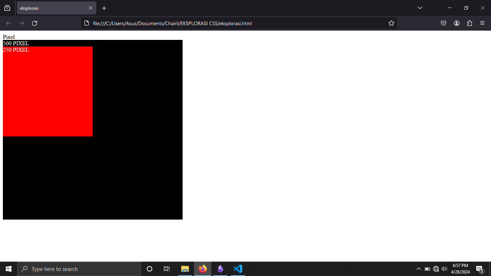
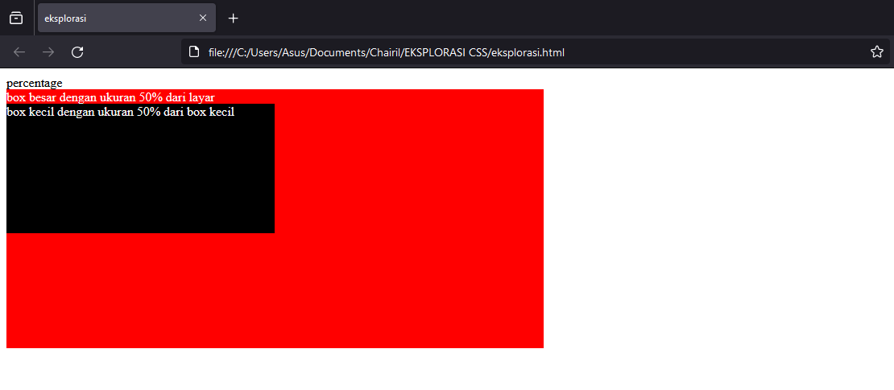
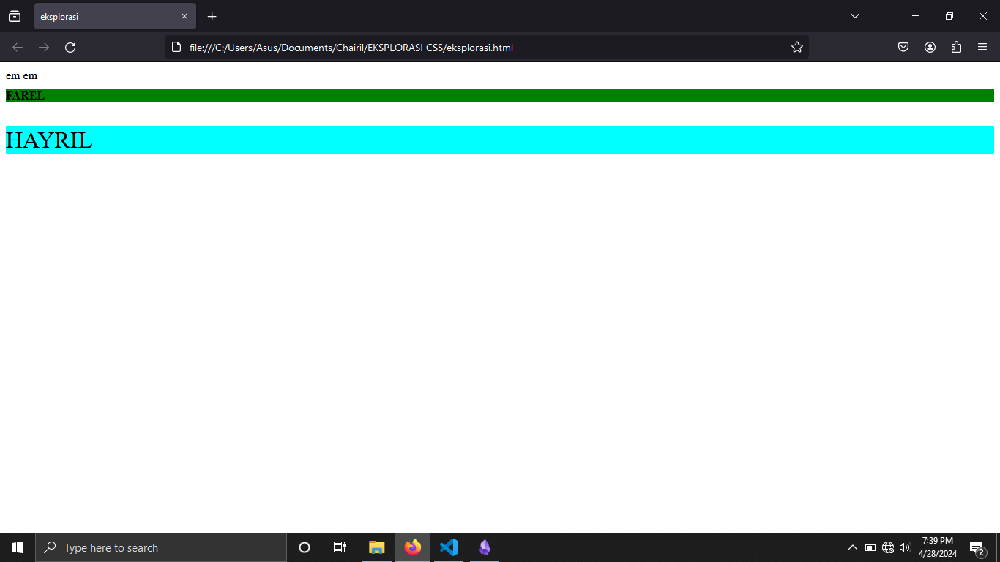

MATERI : CSS UNITS / CSS LENGTH (PX,EM,REM,VH,WH,DLL)
KELAS : XI  RPL 1
NAMA ANGGOTA KELOMPOK:
1. MUH. ALFAHREZI RAIHAN
2. CHAIRIL ABIZALI


## MATERI 
1. PENGERTIAN  
**CSS units** adalah cara untuk menentukan ukuran atau jarak pada elemen-elemen dalam CSS (Cascading Style Sheets). Dalam CSS, ada beberapa jenis unit yang dapat digunakan untuk mengukur jarak, panjang, lebar, dan ukuran lainnya.

2. jenis jenis CSS units:

	1. **Unit Absolute**:
    - **px (pixel)**: Satu piksel pada layar adalah unit terkecil yang dapat ditampilkan. Meskipun namanya "pixel", ukurannya tidak selalu sama di setiap perangkat karena adanya DPI (dots per inch) yang berbeda.
    - **in (inch)**: Satu inci sama dengan 96 piksel pada kebanyakan layar monitor komputer.
    - **cm (centimeter)**: Satu sentimeter sama dengan 1/2,54 inci.
    - **mm (milimeter)**: Satu milimeter sama dengan 1/10 sentimeter.
    
	2. **Unit Relative**:
    - **% (persentase)**: Ukuran relatif terhadap ukuran elemen induk. Misalnya, jika sebuah div memiliki lebar 300px dan Anda menetapkan lebar anak elemen tersebut menjadi 50%, maka lebarnya akan menjadi 150px.
    - **em**: Ukuran relatif terhadap ukuran font elemen induk. Misalnya, jika ukuran font elemen induk adalah 16px, 1em akan sama dengan 16px.
    - **rem**: Mirip dengan em, tetapi ukurannya relatif terhadap ukuran font elemen root (biasanya elemen `<html>`). Hal ini membuat rem lebih mudah untuk digunakan dalam desain yang responsif.
    - **vw (viewport width)**: Ukuran relatif terhadap lebar viewport (bagian terlihat dari halaman web). 1vw sama dengan 1% dari lebar viewport.
    - **vh (viewport height)**: Ukuran relatif terhadap tinggi viewport. 1vh sama dengan 1% dari tinggi viewport.
    - **vmin**: Ukuran relatif terhadap nilai minimum dari lebar atau tinggi viewport.
    - **vmax**: Ukuran relatif terhadap nilai maksimum dari lebar atau tinggi viewport.
    
	3. **Unit Text**:
    - **ex**: Ukuran relatif terhadap tinggi huruf "x" dalam font yang digunakan.
    - **ch**: Ukuran relatif terhadap lebar karakter "0" (nol) dalam font yang digunakan.
    
	4. **Unit Color**:
    - **deg**: Digunakan untuk menentukan sudut dalam gradient.
    - **rad**: Sama seperti deg, tetapi dalam radian.

## CONTOH PROGRAM DAN HASIL 

1. CONTOH PROGRAM DARI PIXEL:

```HTML
<!DOCTYPE html>
<html lang="en">
<head>
    <meta charset="UTF-8">
    <meta name="viewport" content="width=
    , initial-scale=1.0">
    <title>eksplorasi</title>
     Pixel
    <style>
        .container {
            background-color: black;
            color: white;
            height: 500px;
            width: 500px;
        }
        .item {
            background-color: red;
            height: 250px;
            width: 250px;
        }
    </style>
</head>
<body>
    <div class="container">500 PIXEL
        <div class="item">250 PIXEL
        </div>
    </div>
</body>
</html>
```
 
HASIL:


2. CONTOH PROGRAM DARI PERCENTAGE:
```HTML
<!DOCTYPE html>
<html lang="en">
<head>
<meta charset="UTF-8">
<meta name="viewport" content="width=device-width, initial-scale=1.0">
<title>Contoh Penggunaan Unit CSS</title>
    <style>
        body {
            height: 100vh;
        }
        .box-besar {
            color: white;
            width: 50%;
            height: 50%;
            background-color: red;
        }
        .box-kecil {
            height: 50%;
            width: 50%;
            background-color: black;
        }
    </style>
 </head>
 <body>
 <div class="box-besar">box besar dengan ukuran 50% dari layar
        <div class="box-kecil">box kecil dengan ukuran 50% dari box kecil
        </div>
    </div>
</body>
</html>
```

HASIL:

3. CONTOH PROGRAM DARI EM:
```HTML
  
<!DOCTYPE html>

<html lang="en">

<head>

    <meta charset="UTF-8">

    <meta name="viewport" content="width=

    , initial-scale=1.0">

    <title>eksplorasi</title>
     em
    <style>
         .item {
            font-size: 16px;
        }
        .item h1 {
            font-size: 1em;
            background-color:green;
        }
        .item p {
            font-size: 2em;
            background-color:aqua;
       }
    </style>
    </head>
    <body>
    <div class="container">
        <div class="item">
            <h1>FAREL</h1>
            <p>HAYRIL</p>
        </div>
    </div>
    </body>
    </html>
```

HASIL:



4. CONTOH PROGRAM DARI REM:
```HTML
<!DOCTYPE html>
<html lang="en">
<head>
<meta charset="UTF-8">
<meta name="viewport" content="width=device-width, initial-scale=1.0">
<title>Contoh Penggunaan Unit CSS</title>
    <style>
        html {
            font-size: 12px;
        }
        .item {
            font-size: 14px;
        }
        .item h1 {
            font-size: 1rem;
        }
        .item p {
            font-size: 2rem;
        }
    </style>
 </head>
 <body>
     <div class="container">
        <div class="item">
            <h1>FAREL</h1>
            <p>HAYRIL</p>
        </div>
	    </div>
</body>
</html>
```

HASIL:
Berikut adalah contoh penggunaan CSS unit jenis REM .
 **rem**: Mirip dengan em, tetapi ukurannya relatif terhadap ukuran font elemen root (biasanya elemen `<html>`). Hal ini membuat rem lebih mudah untuk digunakan dalam desain yang responsif.


PRORAM HTML:
```HTML
<!DOCTYPE html>
<html lang="en">
<head>
<meta charset="UTF-8">
<meta name="viewport" content="width=device-width, initial-scale=1.0">
<title>Contoh Penggunaan Unit CSS</title>
 <style>
        .container {
            background-color: aqua;
            height: 80vh;
            align-content: center;
            text-align: center;
        }
    </style>
</head>
<body>
     <div class="container"><h1>80vh</h1></div>
     <h1>HELLO WORLD</h1>
 </body>
 </html>
```

HASIL:
Berikut adalah contoh penggunaan CSS unit jenis VW dan VH.
 **vw (viewport width)**: Ukuran relatif terhadap lebar viewport (bagian terlihat dari halaman web). 1vw sama dengan 1% dari lebar viewport.
 **vh (viewport height)**: Ukuran relatif terhadap tinggi viewport. 1vh sama dengan 1% dari tinggi viewport.


## IMPLEMENTASI 

CONTOH PENGIMPLEMENTASIAN pada pembuatan web site adalah:

```html
<!DOCTYPE html>

<html lang="en">

  <head>

    <meta charset="UTF-8" />

    <meta name="viewport" content="width=device-width, initial-scale=1.0" />

    <title>Implementasi</title>

  

    <style>

      .container {

        height: 200vh;

        width: 100vw;

        background-color: black;

        font-size: 14px;

        border: solid red 5px;

      }

  

      .pixel {

        background-color: aqua;

        width: 100px;

        height: 100px;

        margin-bottom: 10px;

      }

  

      .percentage {

        background-color: aquamarine;

        width: 100%;

        height: 30%;

        margin-bottom: 10px;

      }

  

      .em {

        background-color: red;

        font-size: 2em;

        margin-bottom: 10px;

      }

  

      .rem {

        background-color: blue;

        font-size: 2rem;

        margin: 10px;

        margin-bottom: 10px;

      }

  

      .vhvw {

        background-color: purple;

        height: 100vh;

        width: 100vw;

        margin: 10px;

      }

    </style>

  </head>

  <body>

    <div class="container">

      <div class="pixel">Pixel, tinggi 100px lebar 100px</div>

      <div class="percentage">Persen, tinggi 30% lebar 100%</div>

      <div class="em">em, fontnya 2em</div>

      <div class="rem">rem, fontnya 3rem</div>

      <div class="vhvw">vh dan vw, tinggi 100vh lebar 100vw</div>

    </div>

  </body>

</html>
```

HASIL:


