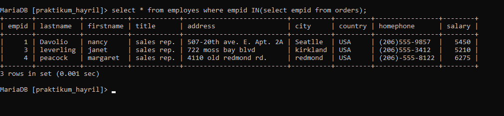
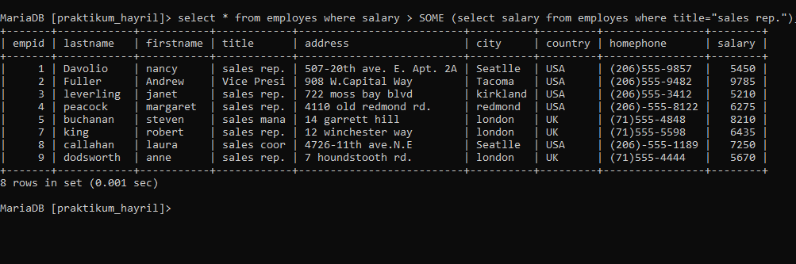
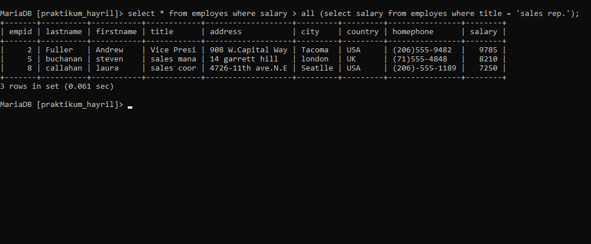
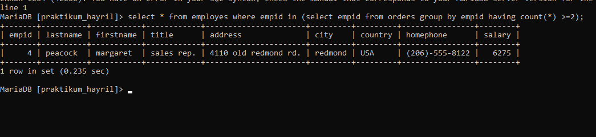

# nomor 1
## Query
```mysql
SELECT OrderID, CustID, OrderDate, RequiredDate, ShippedDate
FROM orders WHERE EmpID = (SELECT EmpID FROM Emloyees WHERE FirstName='Margaret');
```
## Hasil query

## Analisis
- `SELECT` : untuk memilih kolam mana saja yang ingin ditampilkan. 
- `OrderID, CustID, OrderDate, RequiredDate, ShippedDate` : merupakan nama-nama kolom yang dipilih untuk ditampilkan.
- `FROM orders` : untuk memilih dari tabel mana kolom tersebut dipilih. `orders` adalah nama dari tabel yang dipilih
- `EmpID = (SELECT EmpID FROM Emloyees WHERE FirstName='Margaret')` : merupakan kondisi dari WHERE yang harus dipenuhi.
- HASILNYA : jadi dalam query ada subquery ya itu pada bagian kondisi `WHERE` ada lagi `SELECT` yang kedua, dalam situ dia memilih kolom `EmpID` dari tabel `Employees` yang kolom `FirstName` nya berisi `Margaret`. Kondisinya ada lah mereka hanya menampilkan data yang kolom `EmpID` nya memiliki data yang sama dengan kolom `EmpID` pada tabel `Employees` yang kolom `FirstName` nya `Margaret`. Iya itu 5. Jadi barisan data yang memiliki `EmpID` 5 yang akan ditampilkan yaitu barisan data `EASTC` , `SEVES` , `MAISD` , `ALFKI` , dan `ISLAT`
## tabel orders

## tabel employees


#  NOMOR 2-4 
## 2.QUERY:
```MYSQL 
 select * from employes where salary > (select AVG(salary) from employes);
```

## HASIL:
## ANALISIS:
- `select` perintah untuk menampilkan data.
- `from` adalah perintah untuk pemanggilan dari tabel.
- `employes` berfungsi untuk sebagai nama tabel yang dipanggil. 
 - `salary` adalah nama dari salah satu kolom pada tabel
 - `where` adalah sebuah perintah query yang tugas untuk menentukan pemanggilan yang mana ditujukannya
 - `AVG` adalah sebuah perintah untuk mencari rata-rata.

## KESIMPULAN:
QUERY diatas merupakan perintah untuk mencari rata-rata pada sebuah kolom salary pada tabel employes,kemudian mencari data yang lebih besar dari rata-rata data pada kolom salary.

## 3. QUERY:
```MYSQL
	 select * from employes where empid IN(select empid from orders);
```

## HASIL:

## ANALISA:
- `select` perintah untuk menampilkan data.
- `from` adalah perintah untuk pemanggilan dari tabel.
- `employes` berfungsi untuk sebagai nama tabel yang dipanggil. 
 - `EmpID` adalah nama dari salah satu kolom pada tabel
 - `IN` adalah perintah query yang betugas menentukan seluruh data yang sesuai dengan kondisi ditentukan.
 - `where` adalah sebuah perintah query yang tugas untuk menentukan pemanggilan yang mana ditujukannya
 - `(select empid from orders)` adalah query untuk memilih seluruh data pada kolom empid pada tabel orders.

## KESIMPULAN:
QUERY diatas adalah perintah menampilkan data yang sama pada kolom empid tabel orders dengan tabel employes, yaitu pada tabel orders kolom empid hanya memiliki angka 1,3 dan 4 maka perintah akan menampilkan data pada tabel employes yang empid nya ada 1,3,dan 4.

## 4. QUERY:
```MYSQL
select * from employes where salary > SOME (select salary from employes where title="sales rep.");
```

## HASIL:

## ANALISA:
- `select` perintah untuk menampilkan data.
- `from` adalah perintah untuk pemanggilan dari tabel.
- `employes` berfungsi untuk sebagai nama tabel yang dipanggil. 
 - `where` adalah sebuah perintah query yang tugas untuk menentukan pemanggilan yang mana ditujukannya.
 - `salary` adalah sebuah nama kolom pada tabel.
 - ``salary > SOME:`` Ini menunjukkan bahwa gaji dari baris yang akan dipilih harus lebih besar dari setidaknya satu nilai gaji yang dikembalikan oleh subquery.
 - ``(select salary from employes where title="sales rep.")``: Ini adalah subquery yang mengambil gaji dari semua karyawan yang memiliki jabatan "sales rep".

## KESIMPULAN:
QUERY diatas adalah perintah untuk menampilkan secara keseluruhan, query ini akan menghasilkan baris-baris dari tabel "employes" di mana gaji setiap karyawan lebih besar dari setidaknya satu gaji karyawan dengan jabatan "sales rep."

## tabel orders

## tabel employees


# Nomor 5-6

## 5.Query:

```mysql 
 select * from employes where salary > all (select salary from employes where title = 'sales rep.');
```

## Hasil 


## Analisis
- `select * from employes` adalah menampilkan seluruh data employes.
- `where` adalah perintah mencari dimana data yang ingin ditampilkan.
- `salary > all (select salary from employes where title = 'sales rep.');` adalah perintah untuk menampilkan data baris yang memenuhi kondisi salary > salary tertinggi (6575)

## Kesimpulan
query di atas berfungsi untuk menjadikan hasil barisan data empid 2,5 dan 8 yang memenuhi kondisi salary lebih besar dari 6575.

## 6.Query
```mysql
select * from employes where empid in (select empid from orders group by empid having count(*) >=2);
```

## Hasil 


## Analisis
- `select * from employes` adalah menampilkan seluruh data employes.
- `where` adalah perintah mencari dimana data yang ingin ditampilkan.
- `empid in (select empid from orders group by empid having count(*) >=2);` untuk menentukan kriteria yang terdiri atas banyak nilai.adapun count untuk menghitung banyak data sesuai kelompok nya (group by).

## Kesimpulan
Query di atas adalah perintah untuk menampilkan hanya data empid yang banyak datanya lebih besar atau sama dengan 2. 


