# CARA PEMANGGILAN CSS

CSS adalah bahasa pemrograman yang digunakan untuk mengatur tampilan dan gaya dari elemen-elemen HTML pada halaman web. Dengan CSS, Anda dapat mengontrol warna, ukuran, jenis huruf, posisi, dan banyak lagi atribut-atribut lainnya dari elemen-elemen HTML.
cara pemanggilan CSS terbagi menjad 3 yaitu secara INLINE,INTERNAL,dan EKSTERNAL.

BERIKUT ADALAH CONTOH PEMANGGILAN CSS:
## INLINE 
Selector css inline adalah perintah style yang di deklarasikan lansung pada tag yang ingin di modifikasi. Ini berguna untuk menerapkan gaya langsung pada elemen tanpa harus membuat file CSS terpisah.

CONTOH PROGRAM:
```html
<!DOCTYPE html>
<html lang="en">
<head>
    <title>selector</title>
</head>
<body>
    <p style="color: red;">belajar css </p>
    </body>
</html>
```

HASIL PROGRAM:


## INTERNAL
cara pemanggilan internal adalah perintah style yang di deklarasikan lansung pada file yang sama dengan program. Ini berguna untuk menerapkan gaya langsung pada file yang sama tapi tidak pada tag tanpa harus membuat file CSS terpisah.

CONTOH PROGRAM:
```HTML
<!DOCTYPE html>
<html>
    <head>
        <title>Pengenalan css</title>
    </head>
    <body>
        <style>
       p{
            color:red;
           font-family:arial;
         }
        </style>
        <p>WELCOME CSS</p>
    </body>
</html>
```
 
HASIL PROGRAM:
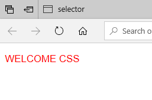

## EKSTERNAL 

cara pemanggilan EKSTERNAL adalah perintah style yang di deklarasikan pada file yang berbeda dengan program,pemanggilan tersebut dipanggil menggunakan tag `<link>`.Pada pemanggilan EKSTERNAL program CSS menggunakan file berbeda dengan HTML tetapi pemanggilan program CSS tersebut menggunakan program HTML.

BERIKUT ADALAH CONTOH PEMANGGILAN FILE CSS MENGGUNAKAN TAG `<LINK>` DARI FILE HTML:
```HTML
<!DOCTYPE html>
<html lang="en">
<head>
    <title>selector</title>
    <link rel="stylesheet" href="style.css" >
</head>
<body>
    <p style="background-color: aqua;">belajar css </p>
    <p class="merah">ini warna merah</p>
    <p id="rpl">ini warna merah</p>    
    
    </body>
</html>
```

BERIKUT ADALAH CONTOH FILE CSS YANG DIPANGGIL OLEH TAG `<LINK>`
```CSS
.p{
    color: darkgreen;
}
 .merah{
    color: red;
 }
 #rpl{
    font-size: 50px;
    color: green;
 }
```

HASIL PROGRAM:
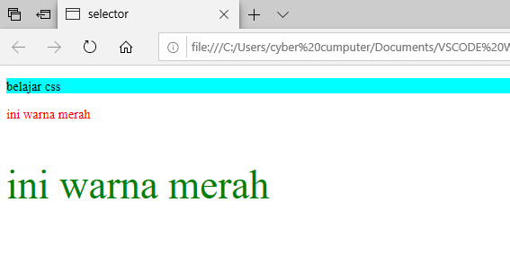
# SELECTOR CSS
Selector CSS adalah cara untuk menentukan elemen-elemen HTML yang akan diberi gaya atau ditentukan perilakunya dalam sebuah dokumen web menggunakan CSS (Cascading Style Sheets). Selector CSS memungkinkan pengguna untuk menargetkan elemen-elemen HTML berdasarkan tag, class, ID.

## SELECTOR ELEMEN
Selector Elemen adalah metode dalam CSS (Cascading Style Sheets) yang digunakan untuk memilih elemen HTML tertentu pada sebuah halaman web. Dengan menggunakan selector elemen, Anda dapat mengatur gaya atau tampilan dari elemen-elemen tersebut, seperti warna, ukuran, font, dan lainnya

## SELECTOR CLASS
Selector class adalah sebuah konsep dalam pemrograman yang digunakan untuk mengidentifikasi dan memilih elemen-elemen tertentu di dalam sebuah dokumen HTML atau dalam sebuah struktur pemrograman lainnya, seperti CSS. Dengan menggunakan selector class, pengembang dapat menargetkan dan melakukan styling terhadap elemen-elemen tersebut sesuai dengan kebutuhan aplikasi atau desain yang diinginkan.

## SELECTOR ID  
Selector ID adalah sebuah metode dalam CSS (Cascading Style Sheets) yang digunakan untuk mengidentifikasi dan merujuk ke elemen HTML berdasarkan ID unik yang diberikan pada elemen tersebut. Selector ID ditandai dengan tanda pagar (#) diikuti dengan nama ID dari elemen yang ingin dipilih. Ini memungkinkan pengguna untuk secara spesifik menggaya atau menerapkan gaya tertentu pada elemen dengan ID tersebut.

CONTOH PROGRAM HTML :
```HTML
<!DOCTYPE html>
<html lang="en">
<head>
    <title>selector</title>
    <link rel="stylesheet" href="style.css" >
</head>
<body>

	<!-- contoh selector elemen--> 
    <p style="background-color: aqua;">belajar css </p>
    
    <!-- contoh selector class -->
    <p class="merah">ini warna merah</p>
    <p class="blue">ini warna biru</p>
    <p class="yellow">ini warna kuning</p>

	<!-- contoh selector id--> 
    <p id="rpl">ini warna hijau <label class="bukan">bukan hijau</label></p>
    </body>
</html>
```

CONTOH PROGRAM CSS:
```CSS
.p{
    color: darkgreen;
    font-size: 50px;
}
.merah{
    color: red;
    font-size: 50px;
 }
.blue{
    color: blue;
    font-size: 50px;
 }
.yellow{
    color: yellow;
    font-size: 50px;
 }
 #rpl{
    font-size: 50px;
    color: green;
 }
 .bukan{
    color: aqua;
    font-size: 50px;
 }
```

HASIL PROGRAM:


# PROPERTY DASAR CSS

## TEXT 
Di CSS (Cascading Style Sheets), "**text**" properti yang mengontrol tampilan dan penataan teks di dalam elemen HTML. 
 jenis-jeni text:
- **text-align**: Properti ini mengatur penataan horizontal teks di dalam elemen, seperti "left" (kiri), "right" (kanan), "center" (tengah), atau "justify" (rata kanan dan kiri).
- **text-decoration**: Properti ini mengatur dekorasi teks, seperti "none" (tanpa dekorasi), "underline" (garis bawah), "overline" (garis di atas), "line-through" (garis tengah), atau kombinasi dari yang lain.
- **text-transform**: Properti ini mengatur transformasi teks, seperti "uppercase" (huruf besar), "lowercase" (huruf kecil), "capitalize" (huruf pertama setiap kata menjadi huruf besar), atau "none" (tanpa transformasi). 
- **text-indent**: properti CSS yang digunakan untuk menentukan jarak indentasi dari awal baris pertama dari sebuah teks di dalam sebuah elemen. Anda dapat mengatur indentasi teks baik dalam nilai positif (untuk membuat indentasi ke kanan) maupun negatif (untuk membuat teks keluar dari margin kiri).
- **Letter-spacing:** properti yang digunakan untuk menentukan jarak antara karakter dalam teks. Properti ini memungkinkan Anda untuk mengatur spasi antara huruf dalam sebuah elemen HTML.
- **line-height**: adalah properti dalam CSS yang mengontrol tinggi dari baris teks dalam sebuah elemen. Properti ini menentukan jarak vertikal antara garis dasar dari satu baris teks dengan garis dasar dari baris teks di atasnya dalam sebuah elemen.

berikut adalah program pemanggilan css :
```html
<!DOCTYPE html>
<html>
<head>
    <link rel="stylesheet" href="property_dasar.css">
    <title>Box Model</title>
</head>
<body>
  <p class="p">Klik</p>
</body>
</html>
```

berikut adalah program css:
```css
.p{
    text-align: center;
    text-decoration: underline;
    text-transform: capitalize;
    text-indent: 200px;
    letter-spacing: 20px;
    line-height: 200px;
    word-spacing: 200px;
}
```

HASIL PROGRAM:


## FONT
Font dalam CSS mengatur pada bagian jenis huruf atau gaya pengetikan yang digunakan untuk menampilkan teks di halaman web. Font dapat mengubah tampilan dan model dari teks yang ditampilkan, memberikan elemen desain yang penting dalam pengalaman pengguna.

jenis jenis font:
- FONT-SIZE
`Font-size `pada CSS adalah properti yang digunakan untuk menentukan ukuran teks pada elemen HTML. Properti ini memungkinkan pengembang web untuk mengatur ukuran teks sehingga sesuai dengan desain dan tata letak halaman web.
- FONT-FAMILY
 `font-family` adalah properti yang digunakan untuk menentukan jenis font yang akan digunakan untuk teks pada suatu elemen HTML. Properti ini memungkinkan Anda untuk menentukan beberapa jenis font dalam urutan yang diinginkan.
 - FONT-STYLE
`font-style` adalah properti yang digunakan untuk mengatur gaya huruf (font style) dari teks di dalam elemen HTML. Properti ini dapat memiliki tiga nilai utama:

1. `normal`: Ini adalah nilai default. Teks ditampilkan dengan gaya huruf standar.
    
2. `italic`: Teks ditampilkan dalam gaya miring (italic). Ini sering digunakan untuk menekankan teks.
    
3. `oblique`: Ini mirip dengan `italic`, tetapi dalam beberapa font, jika tidak ada gaya miring yang tersedia, gaya oblique akan merotasi teks secara miring.

- FONT-WEIGHT:
`font-weight` adalah sebuah properti yang digunakan untuk menentukan ketebalan atau tebalnya teks pada elemen HTML. Properti ini dapat memiliki nilai yang berbeda-beda, seperti normal, bold, lighter, atau sebuah angka yang menentukan ketebalan relatif.

berikut adalah program pemanggilan  css:
```HTML
<!DOCTYPE html>

<html>

<head>

    <link rel="stylesheet" href="property_dasar.css">
    <title>PROPERTY DASAR</title>
</head>
<body>
  <p class="p">ini bapak budi</p>
</body>
</html>
```


berikut adalah program css:
```css
.p{
 font-size: 200px;
 font-family: Arial, Helvetica, sans-serif;
 font-weight: 600;
 font-style:italic;
}
```

hasil program:
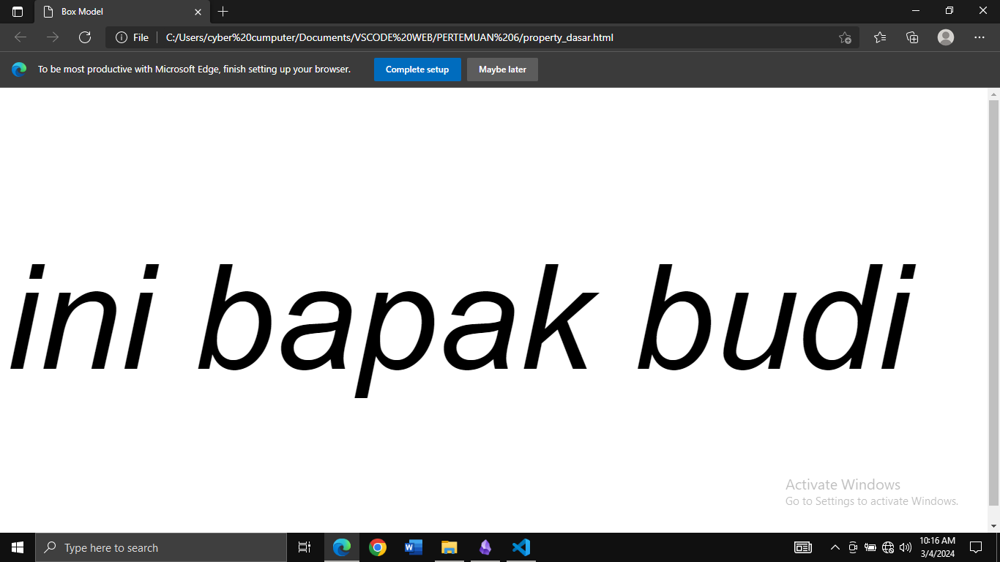

## background 

`background` adalah properti yang digunakan untuk mengatur latar belakang suatu elemen HTML. Properti ini memungkinkan Anda untuk menentukan gambar latar belakang, warna latar belakang, posisi, ulang, dan efek latar belakang lainnya.

- BACKGROUND-IMAGE 
`background-image` adalah sebuah properti dalam CSS yang digunakan untuk menentukan gambar latar belakang dari sebuah elemen HTML. Properti ini memungkinkan pengguna untuk menambahkan gambar sebagai latar belakang dari elemen tersebut.

contoh program:
```css
.background{
    background-image: url(./MEDIA/paraikatte.jpg);
}
```

HASIL PROGRAM:


## BACKGROUND-SIZE

`Background size` adalah properti CSS yang digunakan untuk mengontrol ukuran gambar latar belakang (background) dari sebuah elemen HTML. Properti ini memungkinkan Anda untuk menentukan seberapa besar atau kecil gambar latar belakang tersebut akan ditampilkan dalam elemen tersebut.

1. **`Cover`**: Membuat gambar latar belakang ditampilkan dengan ukuran yang cukup besar sehingga seluruh area elemen tercakup oleh gambar, meskipun mungkin gambar harus dipotong agar sesuai dengan proporsi elemen tersebut.
    
2. `**Contain**`: Membuat gambar latar belakang ditampilkan secara proporsional dan seutuhnya di dalam elemen, tanpa adanya potongan. Ini berarti bahwa seluruh gambar akan terlihat, tetapi mungkin akan ada ruang kosong di sekitarnya.
    
3. `**Length atau Percentage**`: Anda juga bisa menentukan ukuran gambar latar belakang dengan menggunakan panjang (length) atau persentase (percentage). Misalnya, Anda bisa menentukan lebar dan tinggi gambar latar belakang dengan menggunakan nilai piksel (px), sentimeter (cm), atau persentase dari ukuran elemen tersebut.

CONTOH PROGRAM:
```css
.background{
    background-image: url(./MEDIA/paraikatte.jpg);
    background-size:200px;
}
```

HASIL PROGRAM:


### BACKGROUND-REPEAT
`background-repeat` adalah properti CSS yang digunakan untuk menentukan apakah gambar latar belakang (background image) pada suatu elemen HTML akan diulang atau tidak ketika gambar tersebut tidak cukup besar untuk mengisi seluruh area elemen tersebut.

Nilai-nilai yang umum digunakan untuk properti background repeat adalah:
1. **repeat**: Gambar latar belakang akan diulang secara horizontal dan vertikal sampai seluruh area elemen tercakup.
2. **repeat-x**: Gambar latar belakang hanya akan diulang secara horizontal.
3. **repeat-y**: Gambar latar belakang hanya akan diulang secara vertikal.
4. **no-repeat**: Gambar latar belakang tidak akan diulang. Gambar akan ditampilkan hanya sekali, tanpa pengulangan.  
CONTOH PROGRAM:
```css
.background {
    width: 600px;
    height: 600px;
    background-size: 50px;
    background-image: url(./MEDIA/paraikatte.jpg);  
    background-repeat: repeat;
}
```

HASIL PROGRAM:
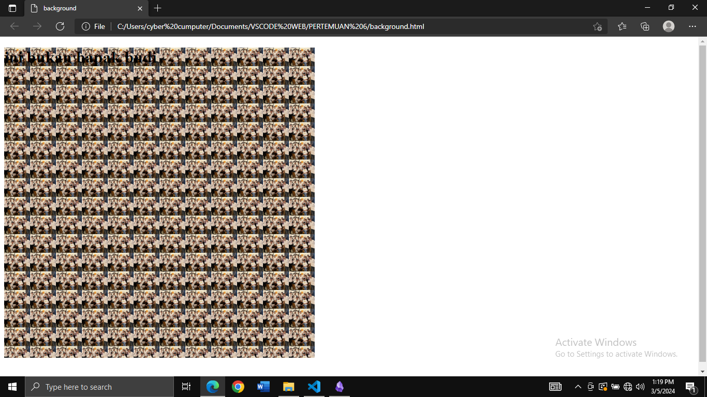
### BACKGROUND-ATTACHMENT
`Background attachment` adalah properti CSS yang menentukan apakah gambar latar belakang (background image) sebuah elemen HTML akan bergulir bersamaan dengan konten halaman atau tetap diam ketika halaman digulir. Properti ini memiliki dua nilai utama:
1. **scroll**: Gambar latar belakang akan bergulir bersamaan dengan konten saat halaman digulir. Ini adalah nilai defaultnya.
2. **fixed**: Gambar latar belakang akan tetap diam relatif terhadap jendela penampilan saat halaman digulir. Artinya, saat Anda menggulir halaman, gambar latar belakang akan tetap pada posisi yang sama di jendela penampilan.
```css
.background {
    width: 600px;
    height: 600px;
    background-size: 100%;
    background-image: url(./MEDIA/paraikatte.jpg);  
    background-position: 0% 100%;
    background-repeat: repeat;
    background-attachment: fixed;
}
```

HASIL PROGRAM:

### BACKGROUND POSITION
`Background position` adalah properti CSS yang mengatur posisi sebuah gambar latar belakang di dalam sebuah elemen. Properti ini memungkinkan Anda untuk menentukan posisi awal dari gambar latar belakang yang diterapkan ke elemen HTML.

- Kata kunci, seperti `top`, `bottom`, `left`, `right`, atau `center`, yang mengatur posisi gambar latar belakang sesuai dengan tepi atau titik tengah elemen.

CONTOH PROGRAM:
```css
.background {
    width: 600px;
    height: 600px;
    background-size: 300px;
    background-image: url(./MEDIA/paraikatte.jpg);  
    background-position: 0% 100%;
}
```

HASIL PROGRAM:


# BOX MODEL
  
**Box model** adalah salah satu konsep fundamental dalam desain web menggunakan CSS (Cascading Style Sheets). Box model menggambarkan bagaimana elemen HTML 
## BORDER 
  
**Border** dalam model kotak CSS adalah garis yang mengelilingi konten, padding, dan margin dari sebuah elemen HTML. Border ini dapat didefinisikan dalam gaya, warna, dan ketebalan tertentu.

- BORDER-WIDTH
**Border width** dalam model kotak CSS merujuk pada ukuran lebar dari garis tepi (border) yang mengelilingi sebuah elemen HTML. Border width bisa diatur menggunakan properti CSS `border-width`. Properti ini dapat memiliki nilai tunggal atau empat nilai untuk menentukan lebar garis tepi pada setiap sisi elemen (atas, kanan, bawah, kiri) secara terpisah

- BORDER-COLOR
**Border color** dalam model kotak (box model) CSS merujuk pada warna yang diterapkan pada batas (border) dari sebuah elemen HTML. Dalam CSS, Anda dapat menentukan warna yang berbeda untuk batas-batas sebuah elemen menggunakan properti `border-color`.

- BORDER-STYLE 
  
**Border style** dalam model kotak CSS mengacu pada properti yang mengatur gaya garis yang mengelilingi suatu elemen HTML. Garis tersebut berada di sekitar padding dan konten elemen tersebut. Properti ini memungkinkan Anda untuk menentukan jenis, warna, dan lebar garis.

Beberapa nilai umum untuk properti border-style adalah:
1. **solid**: Membuat garis solid.
2. **dashed**: Membuat garis dengan putus-putus.
3. **dotted**: Membuat garis dengan titik-titik.
4. **double**: Membuat garis ganda.
5. **groove**: Membuat garis seperti cekung.
6. **ridge**: Membuat garis seperti tonjolan.
7. **inset**: Membuat garis seperti terkubur.
8. **outset**: Membuat garis seperti menonjol

- BORDER-RASIO:
**Border ratirsuatu elemen HTML dengan lebar atau tinggi border-nya. Lebih spesifik, border ratio adalah rasio antara lebar (atau tinggi) dari elemen tersebut dan lebar (atau tinggi) border-nya.

CONTOH PROGRAM:
```css
.button{
	border-width: 10px;
    border-color: black;
    border-style: solid;
    border-radius: 20px 0px 20px 0px;
}
```

HASIL PROGRAM:


# TANTANGAN II

CONTOH PROGRAM :
```HTML
	<!DOCTYPE html>
<html>
<head>
 <title>box model</title>
 <style>
    .background {
    background-color: purple;
}
.span {
    font-size: 80px;
    color: white;
    margin-top: 135px;
    margin: left 10px;
} 
.font{
    font-family: Arial, Helvetica, sans-serif;
}
.foto {
    display: block;
    height: 400px;
    width: 400px;
    margin-left: 700px;
    margin-top: -200px;
    border-width: 10px;
    border-color: white;
    border-style: solid;
    border-radius: 1000px;
}
.button {
    display:block;
    width: 160px;
    height: 85px;
    background-color: transparent;
    border-width: 3px;
    border-color: rgb(247, 43, 43);
    color:rgb(247, 43, 43) ;
    border-style: solid;
    margin-top: -150px;
    margin-left: 400px;
    padding-top:10px;
    padding-bottom: 20px;
    padding-right: 40px;
    padding-left: 40px;
} 
 </style>

</head>
<body class="background">
     <Span>
        <div class="span">
         Selamat datang
         </div>
    </Span><br>
    <span class="span">di <b class="font">Web PANTAI !</b></span>
    
    <button class="button">Klik Disini</button>
</body>
</html>
```

HASIL:
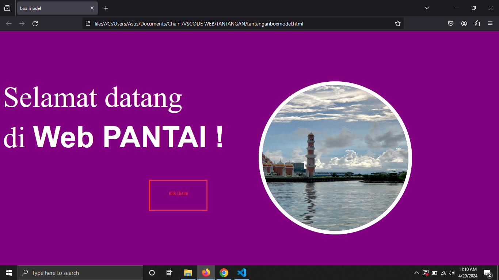

## PADDING
  
**Padding** dalam model kotak CSS mengacu pada ruang tambahan di sekitar konten elemen HTML di dalam kotak tersebut. Jadi, secara sederhana, padding adalah ruang kosong di sekitar konten dalam sebuah elemen HTML yang memisahkan konten dari batas elemen.

```css
.button{
   padding-left: 20px;
   padding-bottom: 10px;
   padding-top: 40px;
   padding-right:50px;
}
```


HASIL PROGRAM:


## MARGIN

 **Margin** pada CSS merujuk pada ruang kosong di sekitar elemen HTML. Lebar margin menentukan jarak antara tepi luar elemen dan elemen-elemen lain di sekitarnya. Dengan kata lain, margin adalah spasi di sekitar elemen HTML yang memisahkan elemen tersebut dari elemen-elemen lain di sekitarnya.
Terdapat empat properti utama yang dapat Anda gunakan untuk mengontrol margin dalam CSS:
1. `margin-top`: Menentukan margin di bagian atas elemen.
2. `margin-right`: Menentukan margin di bagian kanan elemen.
3. `margin-bottom`: Menentukan margin di bagian bawah elemen.
4. `margin-left`: Menentukan margin di bagian kiri elemen.

CONTOH PROGRAM:
```css
.button{
 margin-left: 50px;
 margin-top: 50px;
}
```

HASIL PROGRAM:
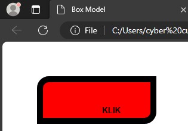

## TEXT-TRANSFROM

`text-transform` digunakan untuk mengontrol tampilan teks dalam sebuah elemen HTML. Properti ini memungkinkan Anda untuk melakukan transformasi pada teks, seperti mengubah semua huruf menjadi huruf besar (uppercase), mengubah semua huruf menjadi huruf kecil (lowercase), atau membuat teks pertama dari setiap kata menjadi huruf besar (capitalize).

Berikut adalah nilai-nilai yang dapat digunakan untuk properti `text-transform`:

1. `none`: Teks tidak mengalami transformasi apa pun.
2. `capitalize`: Membuat teks pertama dari setiap kata menjadi huruf besar.
3. `uppercase`: Mengubah semua huruf menjadi huruf besar.
4. `lowercase`: Mengubah semua huruf menjadi huruf kecil.

CONTOH PROGRAM:
```CSS
.uppercase-text {
    text-transform: uppercase;
}
```

HASIL:
==**BEFORE**==
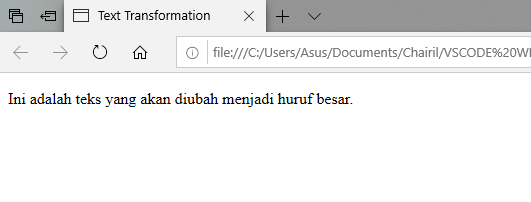
==**AFTER**==
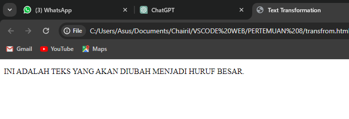

## TEXT INDENT
`Text-indent` adalah properti CSS yang digunakan untuk mengatur jarak atau indentasi awal dari paragraf atau teks di dalam sebuah elemen

Berikut adalah nilai-nilai yang dapat digunakan untuk properti `text-transform`:

1. `lettersapcing`: Letter spacing adalah properti CSS yang digunakan untuk mengatur jarak antara karakter (huruf) dalam teks.
2. `wordspacing`: Word spacing adalah properti CSS yang digunakan untuk mengatur jarak antara kata-kata dalam teks
3. `lineheight`: Line height adalah properti CSS yang digunakan untuk mengatur tinggi baris di dalam sebuah elemen teks.

CONTOH PROGRAM:
```CSS
.halaman-1{
       letter-spacing : 100 px ;
       }
```

HASIL:
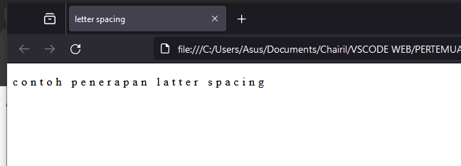

# PSEUDO CLASSES

##  HOVER

==**Hover**== adalah sebuah pseudo-class yang digunakan untuk menentukan gaya atau tata letak elemen ketika pengguna mengarahkan kursor mouse ke atas elemen tersebut.

Ketika pengguna mengarahkan kursor mouse ke atas elemen yang memiliki pseudo-class `:hover`, gaya atau tata letak elemen tersebut dapat berubah sesuai dengan aturan yang ditentukan dalam CSS. Ini memungkinkan untuk membuat efek interaktif yang dinamis, seperti perubahan warna, perbesaran, pergeseran, atau efek lainnya ketika pengguna berinteraksi dengan elemen.

CONTOH PROGRAM:
```CSS
.makan{
    width: 100px;
    height: 50px;
    background-color:red;
    color:black;
    cursor: pointer;
  }
  /* Efek hover */
  .makan:hover {
  height: 100px;
  width: 250px;
  background-color: black;
  border: 5px dashed white;
  color: red;
  border-style: solid;
  font-size: 30px;
  font-weight: bold;
  cursor: pointer;
  transform: scale(0.5);
  transition: all 1s ease-in-out;
  }
```

HASIL:
==**BEFORE**==
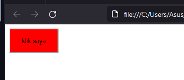
==**AFTER**==


## Active
`button:active`: adalah pseudo-class selector yang menargetkan tombol (`button`) ketika tombol tersebut sedang dalam keadaan "active", atau tombol sedang ditekan. 
`color: yellow;`: Properti memberikan warna kuning pada teks ketika tombol sedang active atau tombol sedang ditekan. 

CONTOH PROGRAM :
```CSS
button:active{
  color: yellow ;
}
```

HASIL:
==**BEFORE**==
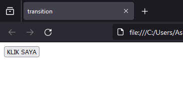

==**AFTER**==
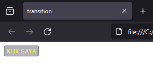
## TRANSITION

+ `Transition`:  untuk mengatur pertunjukan perubahan, mengubah penampilan elemen dari satu keadaan ke keadaan lain, memberikan dinamika visual yang menarik dalam desain web Anda.
+ `Transition-delay`: properti ini memberikan momen kejutan atau antisipasi sebelum perubahan yang dijanjikan terjadi, menambah dramatisasi pada tampilan elemen.
- `Transition-duration`: menentukan lamanya waktu ketika elemen berubah, memungkinkan Anda untuk mengatur seberapa lama penonton (pengguna) menikmati perubahan tersebut.
- `Transition-property`: menentukan apa yang akan berubah, seperti warna, ukuran, atau posisi, menciptakan efek transisi yang beragam dan menarik.
- `Transition-timing-function`:  properti ini mengatur ritme perubahan, menentukan apakah transisi akan bergerak dengan lembut dan halus seperti aliran air, atau tiba-tiba dan dramatis seperti petir yang menyambar.

CONTOH PROGRAM:
```CSS
   button:hover{
   
  padding: 10px 20px;
  font-size: 16px;
  border: none;
  background-color: #007bff;
  color: white;
  cursor: pointer;
  transition: background-color 0.3s ease;
  }
```

HASIL:
**==BEFORE==**


==**AFTER**==
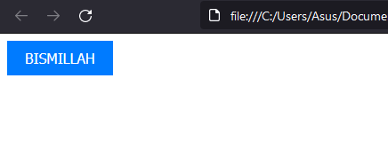

## TRANSFROM

- `transform: scale(0.5);`= Mengubah ukuran elemen menjadi setengah dari ukuran aslinya.
- `transform: scalex(0.5);`= Hanya mengubah skala elemen secara horizontal menjadi setengah dari ukuran aslinya.
- `transform: rotate(45deg);`= Memutar elemen sebesar 45 derajat searah jarum jam.
- `transform: skewX(-25deg);`= Membengkokkan elemen secara horizontal sebesar -25 derajat (ke arah kiri).
- `transform: skew(25deg,5deg);`= Membengkokkan elemen sebesar 25 derajat secara horizontal (ke kanan) dan 5 derajat secara vertikal (ke atas).
- `transform: translate(50px,52px);`= Menggeser elemen sebesar 50 piksel ke kanan dan 52 piksel ke bawah.
- `transform: matrix(0.7,-0.5,0.5,0.4,0.5,0.7);`= Menggambarkan transformasi menggunakan matriks 2D den. 

CONTOH PROGRAM:
```CSS
    button:active{
  transform:matrix(0.7,-0.5,0.5,0.4,0.5,0.7);
  height: 300px;
  width: 200px;
  }
```

HASIL:
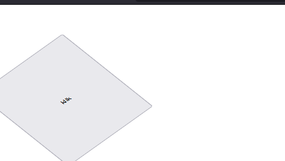

# TANTANGAN III

CONTOH PROGRAM:
```HTML
<!DOCTYPE html>
<html>
<head>
    <title>Belajar CSS3</title>

   <style>
    body{
  background-color:purple;
}
.main-container {
    background-color: purple;
}
.box-item-1{
    font-size: 50px;
    color: white;
    Margin-top:10px;
    }
.box-item-2{
   font-size: 50px;
    color: white;
    margin-top:10px;
} 
.button:hover {
    background-color: purple;
    margin-left:200px;
    padding-left:29px;
    padding-top:20px;
    padding-bottom:25px;
    padding-right:29px;
    color: orangered;
    border-color:orangered;
    margin-top: 50px;
    margin-right:60px;
    margin-bottom:90px;
   transition:all 2s ease-in;
}
 button:active{
  transform:rotate(45deg);
}  
img{
    width: 250px;
    height: 250px;
    border-radius: 200px;
    border-color: white;
    border-style: solid;
    margin-left: 400px;
    margin-top: -400px;
}
   </style>
</head>
<body class="main-container">
    <div class="hero-container">
    <div class="box-container">
    <h1 class="item box-item-1">
    Selamat Datang
    </h1>
    <h1 class="item box-item-2">
    di <b>Web Panlos</b>
    </h1>
    <div class="item box-item-3">
    <button class="button">Klik ini kanda</button>
    </div>
    </div>
    <div class="box-container">
    <div class="item-box">
    
    </div>
        </div>
    </div>
</body>
</html>
```

HASIL:
==**before**==


==**after**==
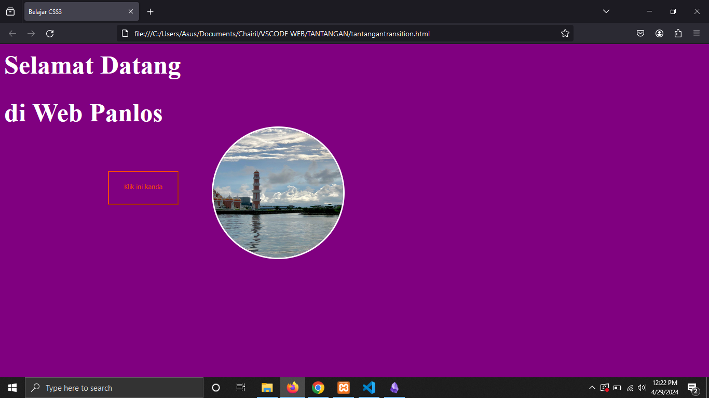

# Flexbox 
## Flex Container
### Display Flex
`display: flex`, kita dapat dengan mudah mengatur tata letak elemen-elemen di dalamnya dengan properti-properti seperti `flex-direction`, `justify-content`, `align-items`, dan lain-lain.

### Kesimpulan
`display: flex`, kita dapat dengan mudah mengatur tata letak elemen-elemen di dalamnya menggunakan properti-properti seperti `flex-direction`, `justify-content`, `align-items`, dan properti lainnya yang terkait dengan model tata letak flexbox.

1.==**Flex-Direction**==
- `flex-direction: column;`: Mengatur tata letak dari flex container menjadi vertikal, sehingga flex items diatur dari atas ke bawah.
- `flex-direction: column-reverse;`: Mengatur tata letak dari flex container menjadi vertikal terbalik, sehingga flex items diatur dari bawah ke atas.
- `flex-direction: row;`: Mengatur tata letak dari flex container menjadi horizontal, sehingga flex items diatur dari kiri ke kanan.
- `flex-direction: row-reverse;`: Mengatur tata letak dari flex container menjadi horizontal terbalik, sehingga flex items diatur dari kanan ke kiri.

```css
.container {
  display: flex;
}

.item {
  flex: 1;
  background-color: #007bff;
  color: white;
  text-align: center;
  padding: 10px;
  margin: 5px;
}

```

HASIL:


2. ==**Align-Items**==
- `align-items: center;`: Flex items akan diatur di tengah-tengah sumbu silang dari flex container.
- `align-items: flex-start;`: Flex items akan diatur pada awal sumbu silang dari flex container.
- `align-items: flex-end;`: Flex items akan diatur pada akhir sumbu silang dari flex container.
- `align-items: baseline;`: Flex items akan diatur sedemikian rupa sehingga garis dasar dari teks pada masing-masing item berada pada level yang sama.
- `align-items: stretch;`: Flex items akan diperpanjang untuk mencapai tinggi maksimal flex container, mengisi ruang kosong di sepanjang sumbu silang.

CONTOH PROGAM:
```CSs
    .container {
  display: flex;
  height: 200px;
  border: 2px solid;
  align-items: center;
  background-color: black;
}
.item {
  background-color:red;
  color:white;
  padding: 10px;
  margin: 5px;
  text-align: center;
}
```

HASIL:


3. ==**JUSTIFY-CONTENT**==
 - `justify-content: flex-start;`: Mengatur fleks item ditempatkan di bagian awal (mulai) dari sumbu utama flex container.
- `justify-content: flex-end;`: Mengatur fleks item ditempatkan di bagian akhir (akhir) dari sumbu utama flex container.
- `justify-content: center;`: Mengatur fleks item ditempatkan di tengah-tengah sumbu utama flex container.
- `justify-content: space-around;`: Mengatur fleks item didistribusikan secara merata di sekitar sumbu utama flex container, dengan ruang yang sama di antara mereka.
- `justify-content: space-between;`: Mengatur fleks item didistribusikan secara merata di sepanjang sumbu utama flex container, dengan ruang yang sama di antara fleks item pertama dan terakhir, tetapi tidak ada ruang di antara fleks item yang berdekatan.

CONTOH PROGRAM:
```CSS
.container {
  display: flex;
  width: 100%; /* Memberikan lebar penuh pada kontainer */
  height: 200px; /* Memberikan tinggi pada kontainer untuk visualisasi */
  border: 2px solid #ccc; /* Garis tepi untuk memvisualisasikan ukuran kontainer */
  justify-content: space-between; /* Menyamakan item secara merata dalam kontainer */
} 
.item {
  background-color: black;
  color:red;
  padding: 10px;
  text-align: center;
  flex: 1; /* Memberikan fleksibilitas yang sama pada setiap item */
}
```

HASIL:
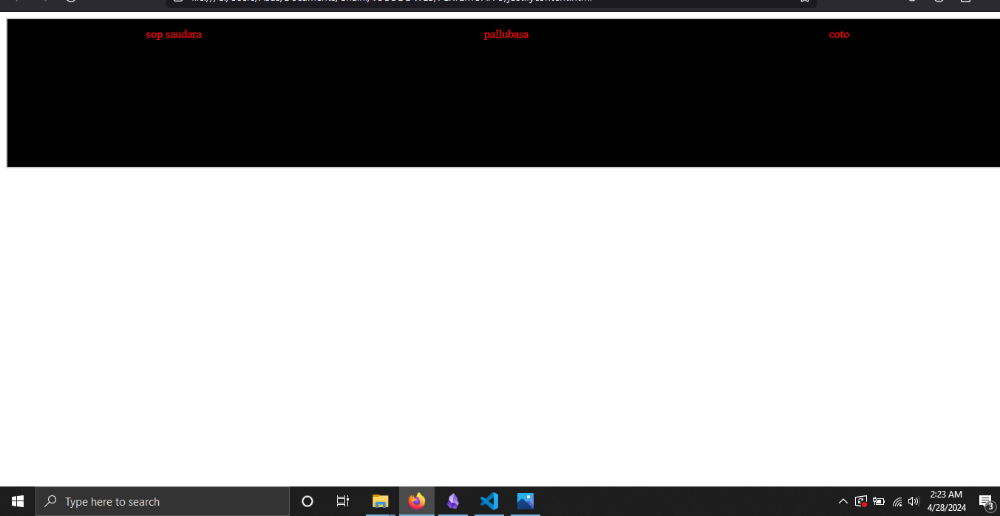

## FLEX ITEMS 

==**Flex items**== adalah elemen-elemen di dalam sebuah flex container yang diatur oleh model tata letak fleksibel (flexbox). Mereka memiliki properti dan perilaku yang memungkinkan untuk disusun secara dinamis dalam arah tertentu (baris atau kolom), dengan fleksibilitas dalam ukuran, urutan, dan penempatan.
Jenis-jenis flex items yang umum meliputi:
1. **Flex Container**: Elemen yang memiliki konten yang disusun menggunakan flexbox. Ini adalah parent dari semua flex items.
2. **Flex Item**: Elemen yang langsung diatur oleh flexbox dan menjadi bagian dari tata letak fleksibel. Setiap elemen di dalam flex container dianggap sebagai flex item.
3. **Main Axis**: Sumbu utama dari flex container yang mengatur arah utama susunan flex items. Ini bisa berupa sumbu horizontal (disebut "row" dalam CSS) atau vertikal (disebut "column" dalam CSS).
4. **Cross Axis**: Sumbu tegak lurus terhadap main axis, yang memengaruhi penempatan flex items di sepanjang sumbu tersebut.
5. **Flex Basis**: Properti yang menentukan ukuran awal dari flex item sebelum fleksibilitasnya diperhitungkan, berdasarkan pada width atau height, tergantung pada arah main axis.

CONTOH PROGRAM:
```css
.container {
  display: flex; /* Membuat container menjadi flex container */
}
.item {
  flex: 1; /* Memberikan fleksibilitas yang sama pada semua item */
  background-color: red;
  border: 1px solid;
  padding: 10px;
  margin: 5px;
  text-align:center; 
}
```

HASIL:


# TANTANGAN IV

CONTOH PROGRAM:
```HTML
<!DOCTYPE html>
<html>
<head>
    <title>flex box</title>
    <style>
        body{
        background-color:purple;
      }
      .main-container {
        margin-top: 90px;
        margin-left:90px ;
          background-color: purple;
      }
      .box-item-1{
          font-size: 50px;
          color: white;
          margin-top:10px;
          }
      .box-item-2{
         font-size: 50px;
          color: white;
          margin-top:10px;
      }
      img{
          width: 250px;
          height: 250px;
          border-radius: 200px;
          border-color: white;
          border-style: solid;
          margin-left: 600px;
          margin-top: -400px;
      }
    </style>
</head>
<body class="main-container">
    <div class="hero-container">
    <div class="box-container">
    <h1 class="item box-item-1">Selamat Datang</h1>
    <h1 class="item box-item-2">di <b>Web PARAIKATTE</b></h1>
    <div class="item box-item-3">
    <button class="button">Klik disini</button>
    </div>
    </div>
    <div class="box-container">
    <div class="item-box">
    
    </div>
    </div>
    </div>
</body>
</html>
```

HASIL:
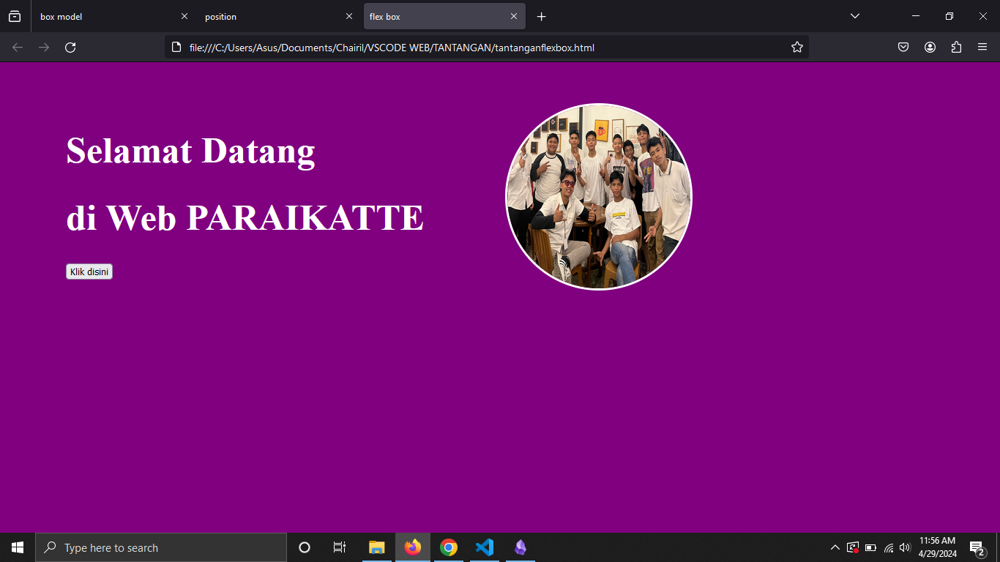

## POSITION

1. POSITION Static: Ini adalah posisi default untuk setiap elemen. Elemen-elemen dengan posisi statis ditempatkan berdasarkan alur dokumen biasa.
    
2. POSITION Relative: Elemen-elemen dengan posisi relatif ditempatkan relatif terhadap posisi normalnya. Dengan properti "top", "right", "bottom", dan "left", kita bisa menggeser elemen ini dari posisi normalnya.
    
3. POSITION Absolute: Elemen-elemen dengan posisi absolut ditempatkan relatif terhadap kontainer terdekat yang memiliki posisi non-static (biasanya orang menggunakan elemen yang berposisi relatif). Ini memungkinkan kita untuk menempatkan elemen secara tepat di dalam elemen induknya.
    
4. POSITION Fixed: Elemen-elemen dengan posisi tetap akan tetap berada di lokasi yang ditentukan dalam tata letak halaman, bahkan saat pengguna menggulir halaman. Ini sering digunakan untuk elemen yang ingin ditampilkan secara konsisten, seperti menu navigasi.
    
5. POSITION Sticky: Elemen-elemen dengan posisi "sticky" berperilaku seperti kombinasi antara "relative" dan "fixed". Mereka berperilaku seperti "relative" sampai mereka mencapai posisi tertentu dalam jendela browser, di mana mereka menjadi "fixed".

```CSS
    .container {
        position: relative; /* Memberikan posisi relatif sebagai referensi bagi elemen-elemen di dalamnya */
        width: 300px;
        height: 200px;
        border: 2px solid black;
    }
    .box {
        width: 100px;
        height: 100px;
        background-color: skyblue;
        border: 2px solid blue;
    }
    .absolute-box {
        position: absolute; /* Memberikan posisi absolut */
        top: 50px; /* Jarak dari atas */
        left: 50px; /* Jarak dari kiri */
        background-color: lightcoral;
    }
    .fixed-box {
        position: fixed; /* Memberikan posisi tetap */
        top: 20px;
        right: 20px;
        background-color: lightgreen;
    }
    .sticky-box {
        position: sticky; /* Memberikan posisi sticky */
        top: 10px;
        background-color: lightsalmon;
    }
```

HASIL:


>[! INFO ]-
> -Kita memiliki sebuah div dengan kelas "container" sebagai referensi relatif.
> -Di dalamnya, ada empat div dengan kelas "box". Satu di antaranya memiliki kelas tambahan sesuai dengan jenis position yang berbeda.
-"absolute-box" diberi posisi absolut relatif terhadap "container".
-"fixed-box" diberi posisi tetap di sudut kanan atas layar.
-"sticky-box" diberi posisi sticky, akan tetap di atas saat di-scroll.

# TANTANGAN IV

CONTOH PROGRAM:
```HTML
<!DOCTYPE html>
<html lang="en">
<head>
    <meta charset="UTF-8">
    <meta http-equiv="X-UA-Compatible" content="IE=edge">
    <meta name="viewport" content="width=device-width, initial-scale=1.0">
    <title>Tantangan Position</title>
<style>
  body{
 background-color: aqua;
         }        
        .container {
         display: flex;
         flex-direction: column;
         background-color: white;
         height: 458px;
         width: 300px;
         border-radius: 10px;
         margin-top: 150px;
         margin-left: 720px;
         position: relative;
        }      
         .item1{
          background-color: red;
          height: 250px;
          width: 300px;
          border-radius: 10px 10px 0px 0px;
         }        
         img {
           width:100%;
           height:100%;
           border-radius: 5px 5px 0px 0px;
         }      
         .item2{
           background-color: whitesmoke;
           height: 175px;
           width: 300px;
           justify-content: center;
           align-items: center;
         }        
         .text1 {
          font-size: small;
          font-family: Arial, Helvetica, sans-serif;
          margin-left: 20px;
         }        
         .text2 {
         font-size: 20px;
         font-family: Arial, Helvetica, sans-serif;
         margin-left: 20px;
         }        
         .text3 {
             margin-left: 20px;
           font-family: Arial, Helvetica, sans-serif;
           font-size: medium;
           margin-bottom: 30px;
         }        
         .item3 {
             display: flex;
             flex-direction: row;
             padding: 2px;
            background-color: gainsboro;
            border-radius: 0px 0px 5px 5px;
            width: 296px;
            justify-content: space-between;
            font-weight: bold;
         }        
         .text4 {
        margin-left: 20px;
        font-family: Arial, Helvetica, sans-serif;
         }        
         button {
             width: 62px;
               height: 55px;
               background-color: transparent;
               border: none;
               border-radius: 100px 100px 100px 100px;
               position: fixed;
               background-repeat: no-repeat;
               top: 350px;
                 right: 520px;        
         }        
         .like img {
          border-radius: 100% ;
          margin-right: 110px;
          margin-left: 190px;
          position: absolute;
         }        
         .item3 img {
          height: 30px;
          width: 30px;
          border-radius: 100% 100% ;
          align-items: center;
          justify-items: center;
          margin-right: 25px;
          margin-top: 10px;
         }
</style>
</head>
<body>
 <div class="container">
   <div class="item1">
    
   </div>
   <div class="item2">
     <p class="text1">Sabtu,13 Desember 2023</p>
     <h4 class="text2">Pantai Losari</h4>
     <p class="text3">Tempat terbaik mengeluarkan isi hati didengarkan oleh hembusan angin dan suara ombak </p>
   </div>
   <div class="item3">
   <p class="text4">Baca Selengkapnya</p>
    
   </div>
     <div class="like">
      <button>
      
</button>
 </div>
 </div>
</body>
</html>
```

HASIL:


=======
# Pengenalan Bootstrap
## Apa Itu Bootstrap?
Bootstrap adalah salah satu dari banyak framework front-end yang ada di web development. Framework-front end menyediakan serangkaian alat dan gaya bawaan untuk mempercepat proses pengembangan web dengan menyediakan komponen-komponen UI siap pakai dan sistem grid yang responsif. Bootstrap khususnya, terkenal dengan kemampuannya dalam menciptakan tata letak yang responsif dan komponen-komponen UI yang seragam.
# Instalasi Bootstrap
## Cara instalasi Bootstrap secara online / CDN.
sekarang kita akan menjelaskan bagaimana cara menginstall bootstrap secara online. Berikut langkah-langkahnya:

1. Masuklah ke website resmi Bootstrap dengan mengunjungi situs web resmi di https://getbootstrap.com/.
2. Di laman utama web Bootstrap, cari dan klik menu "Introduction" yang terletak pada sisi sebelah kiri website.
3. Pada bagian "Starter Template" di halaman Introduction, kita akan melihat kode yang dapat kita gunakan untuk menghubungkan website kita yang mau diterapkan Bootstrap.
4. Klik tombol "Copy" untuk menyalin seluruh kode tersebut.
5. Buatlah file baru dengan nama index.html atau nama yang kita inginkan menggunakan teks editor atau editor HTML yang kita biasa pakai.
6. Tempelkan(paste) kode yang telah kita salin dari langkah sebelumnya ke dalam file html yang baru kita buat. dengan menempelkan kode tersebut maka bootstrap kita sudah terhubung namun harus secara online.
7. kita dapat mulai memberikan gaya pada tag-tag atau elemen dalam file HTML tersebut dengan menggunakan kelas-kelas Bootstrap. kita dapat melihatnya pada website resmi Bootstrap untuk mempelajari lebih lanjut tentang kelas-kelas yang tersedia dan cara penggunaannya.
8. Untuk melihat hasilnya, buka file html tadi menggunakan web browser kita.
9. Halaman web yang ditampilkan akan menggunakan Bootstrap untuk gaya dan fungsionalitasnya

## Mengunduh dan menginstal Bootstrap secara lokal.
Untuk menginstal Bootstrap secara offline, kita perlu mengunduh file Bootstrap dan menyimpannya di folder proyek kita. Berikut adalah langkah-langkah untuk menginstal Bootstrap secara offline:
1. **Unduh File Bootstrap:** Kunjungi situs web resmi Bootstrap di https://getbootstrap.com/ dan cari tautan unduhan untuk versi Bootstrap yang diinginkan. Klik atau ikuti instruksi untuk mengunduh file ZIP Bootstrap.
2. **Ekstrak File Bootstrap:** Setelah mengunduh file ZIP Bootstrap, temukan file tersebut di komputer kita dan ekstrak isi file ZIP ke folder proyek kita. kita dapat menggunakan aplikasi pengarsipan file atau ekstraksi bawaan (Archiver, 7zip, dll) pada sistem operasi kita untuk mengekstrak file ZIP . Setelah diekstrak, kita akan memiliki folder Bootstrap yang berisi berkas-berkas Bootstrap yang diperlukan.
3. **Hubungkan Berkas Bootstrap pada Halaman HTML:** Buka file HTML proyek kita menggunakan teks editor atau editor HTML yang biasa kita gunakan. Di dalam tag pada halaman HTML , tambahkan tautan ke berkas CSS Bootstrap dan skrip JavaScript Bootstrap. Gunakan tag link di dalam tag head untuk tautan CSS dan tag script di dalam tag body untuk javascript. Berikut contoh tautan yang umum di bootstrap:
```html
<link href="path/to/bootstrap.min.css" rel="stylesheet">
// tautan bootstrap CSS
<script src="path/to/bootstrap.bundle.min.js"></script>
// tautan bootstrap Javascript
```
dengan menuliskan script diatas, maka kita telah menghubungkan antara file html kita dengan bootstrap yang kita unduh tadi.
4. **Gunakan Kelas Bootstrap:** Setelah tautan Bootstrap ditambahkan, Kita dapat menggunakan kelas-kelas Bootstrap dalam elemen HTML proyek Kita untuk menerapkan gaya dan fungsionalitas yang disediakan oleh bootstrap kita. Kita dapat masuk ke web resmi Bootstrap untuk mempelajari lebih lanjut tentang kelaskelas yang tersedia dan cara penggunaannya.
5. **Jalankan File HTML:** Setelah Kita selesai menghbungkan tautan dan menggunakan kelas Bootstrap, Kita dapat menjalankan halaman HTML kita di web browser Kita untuk melihat hasilnya. Buka file HTML menggunakan web browser Kita dan lihat hasilnya
# Komponen-Komponen Bootstrap
Bootstrap menyediakan berbagai komponen yang siap pakai untuk membangun tampilan website yang responsif dan menarik. Berikut adalah beberapa komponen utama yang disediakan oleh Bootstrap:
## Grid System
Grid system Bootstrap adalah sistem layout yang responsif dan fleksibel. kita dapat membagi halaman menjadi baris(rows) dan kolom(columns) yang membentuk grid. Grid terdiri dari 12 kolom, yang dapat kita susun sesuai kebutuhan. Dengan menggunakan kelas CSS yang disediakan oleh Bootstrap, kita dapat dengan mudah menentukan berapa banyak kolom yang akan digunakan oleh setiap elemen di halaman web kita. Grid system ini sangat berguna dalam menciptakan tata letak yang responsif dan dapat menyesuaikan diri dengan berbagai ukuran layar
## Typography
Komponen typography Bootstrap menyediakan gaya dan kelas CSS yang konsisten untuk tipografi di halaman web kita. kita dapat dengan mudah mengatur ukuran teks, gaya huruf, dan pengaturan lainnya menggunakan kelas-kelas yang telah ditentukan. Ini memastikan bahwa teks di halaman web kita memiliki tampilan yang konsisten dan mudah dibaca di berbagai perangkat.
## Button
Komponen tombol Bootstrap memungkinkan kita dengan mudah membuat tombol dengan tampilan yang menarik dan responsif. kita dapat menggunakan kelas-kelas Bootstrap untuk mengatur berbagai gaya tombol, termasuk ukuran (large, small), warna (default, primary, secondary, dll.), dan variasi lainnya. Tombol-tombol ini dapat digunakan untuk tindakan seperti mengirim formulir, memuat ulang halaman, atau memicu tindakan lainnya di aplikasi web kita.
## Forms
Bootstrap menyediakan komponen form yang mudah digunakan untuk membuat form input. Ini termasuk input teks, area teks, kotak centang (checkbox), tombol radio, dropdown, dan lain-lain. Komponen form Bootstrap telah dirancang dengan tampilan yang responsif dan mudah dikustomisasi. kita dapat dengan mudah menambahkan validasi form dan mengatur tampilan form kita dengan menggunakan kelas-kelas Bootstrap yang telah ditentukan.
## Navbar
Komponen navbar Bootstrap memungkinkan kita membuat navigasi yang responsif dan mudah dikustomisasi di halaman web. kita dapat menambahkan logo, menu, tombol, dan komponen lainnya ke navbar dengan mudah. Navbar Bootstrap juga menyediakan fitur seperti menu dropdown, navigasi yang terlipat untuk perangkat mobile, dan tata letak yang fleksibel.
## Cards
Cards adalah komponen yang digunakan untuk menampilkan informasi dalam format yang terstruktur. Komponen kartu Bootstrap memungkinkan kita untuk membuat kolom dengan gambar, teks, tombol, dan komponen lainnya. cards ini dapat digunakan untuk menampilkan artikel, produk, profil pengguna, atau konten lainnya dengan tampilan yang menarik.
## Modal
Komponen modal Bootstrap digunakan untuk menampilkan jendela pop-up yang tumpang tindih dengan konten utama halaman. Modal ini berfungsi untuk menyoroti konten tambahan, pesan, atau form yang membutuhkan fokus pengguna. kita dapat menyesuaikan tampilan modal, mengatur ukuran, menambahkan judul, dan mengatur perilaku saat modal ditampilkan atau ditutup.
## Carousel
Carousel adalah komponen Bootstrap yang digunakan untuk membuat tampilan slide gambar atau konten lainnya. kita dapat menambahkan gambar, teks, tombol navigasi, dan indikator slide untuk membuat tampilan yang menarik dan interaktif. Carousel Bootstrap mendukung navigasi otomatis, kontrol manual, dan animasi transisi yang halus.
## Icons
Bootstrap sendiri menggunakan ikon dari Font Awesome, yang merupakan kumpulan ikon vektor yang sangat populer dan kaya akan fitur. kita dapat dengan mudah menambahkan ikon ke elemen seperti tombol, tautan, dan elemen lainnya menggunakan class-class ikon Bootstrap. Ini berfungsi untuk memperindah halaman web kita.
## Jumbotron
Jumbotron adalah komponen Bootstrap yang digunakan untuk menyoroti konten utama di halaman web. Biasanya ditempatkan di bagian atas halaman dengan judul besar danTerima kasih atas klarifikasinya.Komponen carousel Bootstrap digunakan untuk membuat tampilan slide yang interaktif. kita dapat menambahkan gambar, teks, dan tombol navigasi ke dalam carousel. Carousel Bootstrap mendukung navigasi otomatis, kontrol manual, dan animasi transisi. 

kita dapat menemukan daftar komponen lengkap dan dokumentasi resmi di situs web Bootstrap (https://getbootstrap.com/docs/).
# Contoh Penerapan Komponen Bootstrap
## Typography
1. Buka situs resmi Bootstrap di [getboostrap.com](getbootstrap.com)
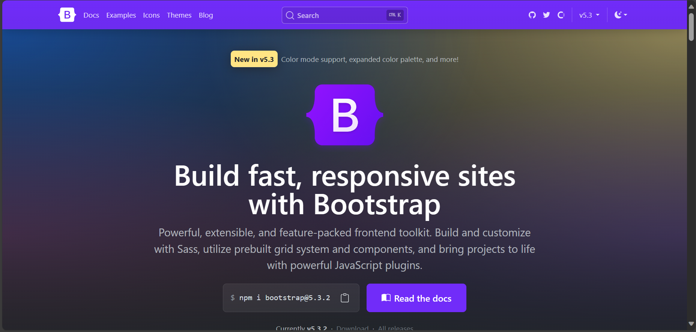
2. Klik "Read the docs". Maka kita akan diarahkan pada halaman web yang berisi berbagai macam Typografi (class Bootstrap).
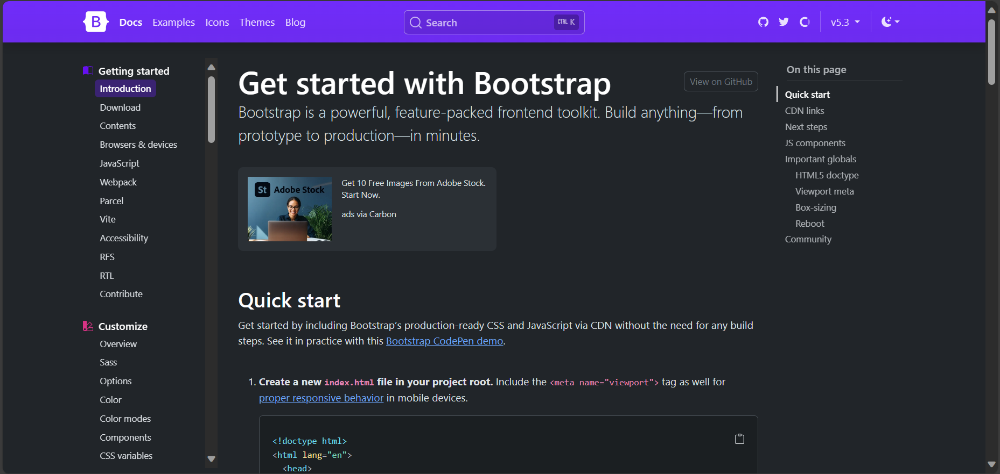
3. Misalnya kita akan membuat sebuah teks quotes seperti di bawah ini:
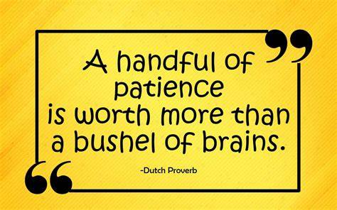
4. Ketikan "Typography" di kolom search lalu enter. Maka kita akan masuk ke halaman berikut:
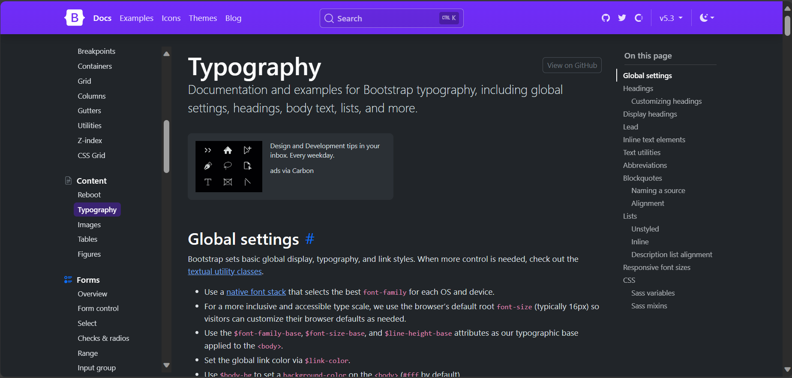
5. Carilah Subbab "Alignment":
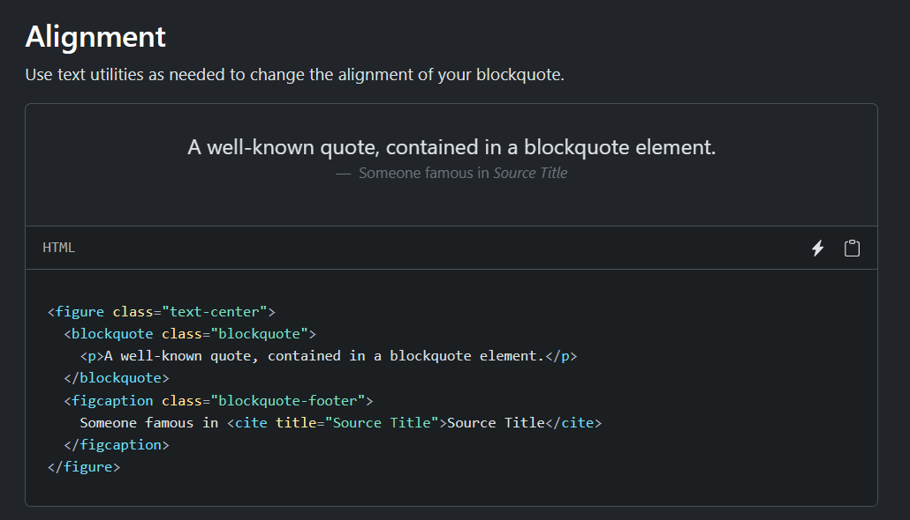
6. Salinlah kode yang tertera, lalu tempelkan di tag body pada halaman html yang telah kita hubungkan dengan Bootstrap kita
```html
<figure class="text-center">
<blockquote class="blockquote">
<p>A well-known quote, contained in a blockquote element.</p>
</blockquote>
<figcaption class="blockquote-footer">
Someone famous in 
<cite title="Source Title">Source Title </cite>
</figcaption>
</figure>
```

7. Hasilnya akan terlihat seperti berikut:
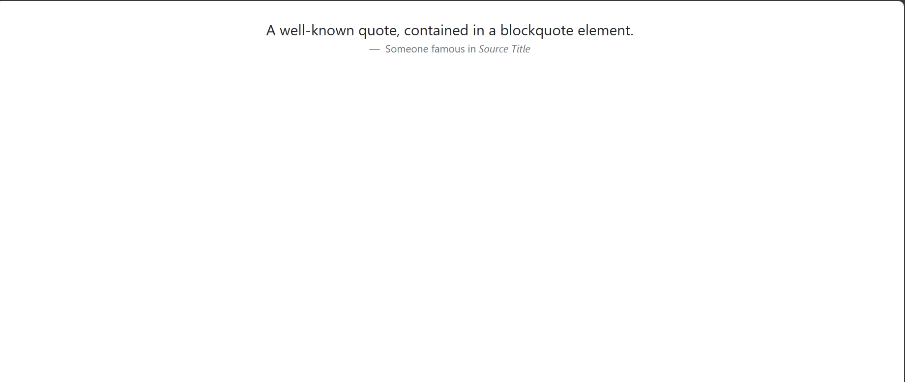
8. Kita bisa mengganti kata kata nya dengan cara mengganti teks yang ada di dalam tag p dan untuk teks kecil bagian bawah kita ganti pada bagian dalam tag figcaption
```html
<figure class="text-center">
  <blockquote class="blockquote">
    <p>Sebenarnya otak kita sama aja, yang <br>
    membedakan hanya siapa yang <br>
    mulai belajar duluan dan siapa yang <br>
    belajar terus menerus </p>
  </blockquote>
  <figcaption class="blockquote-footer">
    Dea Afrizal Doroboka<cite title="Source Title">Doroboka</cite>
  </figcaption>
</figure>
```
Hasilnya adalah sebagai berikut:
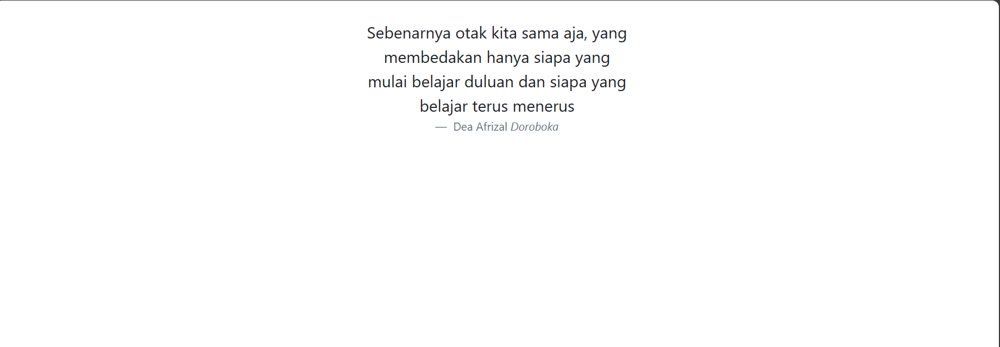
*Keterangan :*
1. ==`text-center`== pada ==`<figure>`==: Kelas ini diterapkan pada elemen ==`<figure>`== , yang mengakibatkan kontennya, termasuk elemen ==`<blockquote>`== dan ==`<figcaption>`== , akan diatur menjadi ketengah halaman maupun kontainer.
2. blockquote pada ==`<blockquote>`== : Kelas ini memberikan gaya khusus pada elemen ==`<blockquote>`== . Elemen ini digunakan untuk merinci sebuah kutipan atau teks yang dianggap signifikan. Penggunaan kelas ini dari Bootstrap mungkin memberikan tampilan tertentu, seperti memodifikasi gaya margin atau padding, untuk memberikan estetika yang lebih baik.
3. blockquote-footer pada ==`<figcaption>`== : Kelas ini memberikan gaya khusus pada elemen ==`<figcaption>`== yang berada di dalam ==`<figure>`== . Elemen ini kemungkinan berisi informasi tambahan atau keterangan terkait elemen-elemen lain dalam ==`<figure>`==.
	- **`Dea Afrizal Doroboka`**: Ini adalah teks yang berada di dalam elemen ==`<figcaption>`==, memberikan informasi tambahan atau keterangan terkait dengan kutipan atau elemen-elemen lain dalam ==`<figure>`==.
	-  **`<cite title="Source Title">Doroboka / cite>`**: Ini adalah elemen ==`<cite>`== yang memberikan judul sumber ("Source Title"). Penggunaan kelas `blockquote-footer` dari Bootstrap mungkin menyusun elemen ini dengan tata letak dan gaya tertentu, seperti menetapkannya sebagai teks kaki atau memberikan gaya yang konsisten dengan elemen lain dalam kelompok ==`<figure>`==.
*Keterangan*: 
Untuk bagian "Dea Afrizal" adalah nama seseorang yang mengatakan quotes tersebut dan "Doroboka" adalah sumber dimana orang tersebut mengatakn kata-kata itu. Kata- kata yang dituliskan yaitu berada dalam tag ==`p`== .
## Navbar
1. Bukalah Kembali [getbootstrap.com](getbootstrap.com) lalu ketik "navbar" dikolom "search" dan klik enter
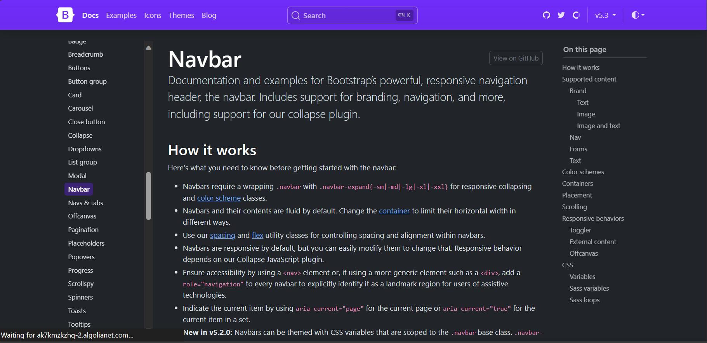
2. Carilah jenis navbar yang diinginkan.
	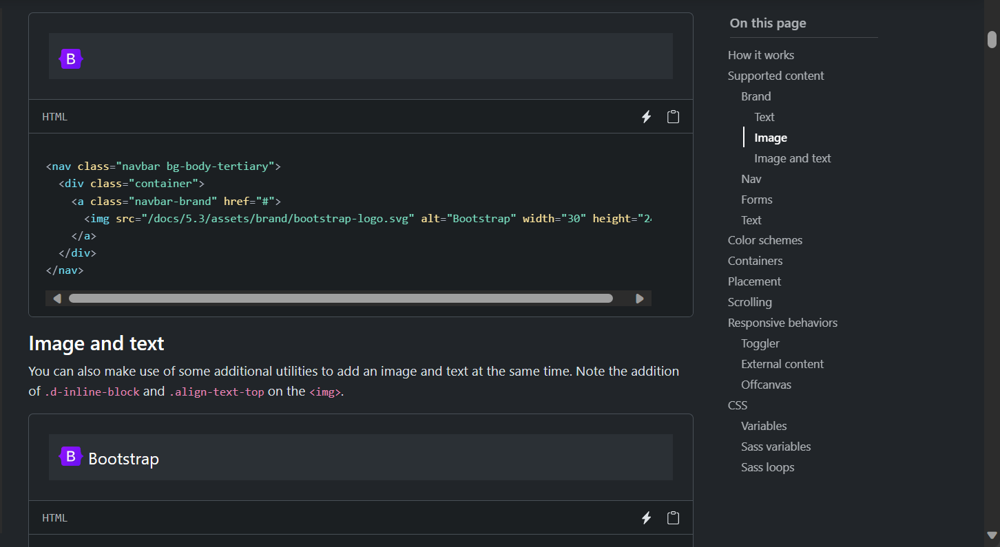
3. Jika misalnya kita telah menemukan jenis navbar yang kita inginkan, maka, salinlah kode program yang ada dibawah gambar contoh navbar tersebut
	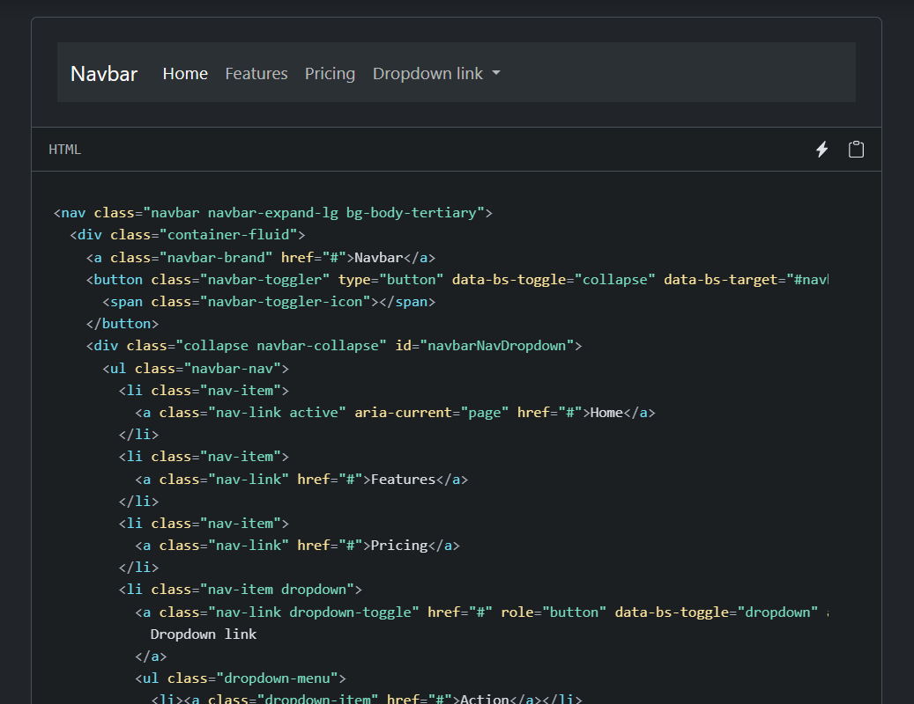
```html
<nav class="navbar navbar-expand-lg bg-body-tertiary">
    <div class="container-fluid">
        <a class="navbar-brand" href="#">Navbar</a>
        <button class="navbar-toggler" type="button" data-bs-toggle="collapse" data-bs-target="#navbarNavDropdown" aria-controls="navbarNavDropdown" aria-expanded="false" aria-label="Toggle navigation">
            <span class="navbar-toggler-icon"></span>
        </button>
        <div class="collapse navbar-collapse" id="navbarNavDropdown">
            <ul class="navbar-nav">
                <li class="nav-item">
                    <a class="nav-link active" aria-current="page" href="#">Home</a>
                </li>
                <li class="nav-item">
                    <a class="nav-link" href="#">Features</a>
                </li>
                <li class="nav-item">
                    <a class="nav-link" href="#">Pricing</a>
                </li>
                <li class="nav-item dropdown">
                    <a class="nav-link dropdown-toggle" href="#" role="button" data-bs-toggle="dropdown" aria-expanded="false">
                        Dropdown link
                    </a>
                    <ul class="dropdown-menu">
                        <li><a class="dropdown-item" href="#">Action</a></li>
                        <li><a class="dropdown-item" href="#">Another action</a></li>
                        <li><a class="dropdown-item" href="#">Something else here</a></li>
                    </ul>
                </li>
            </ul>
        </div>
    </div>
</nav>

```
4. Tempelkanlah kode program yang terlah kita salin ke dalam tag body di file html kita. Jangan lupa untuk menautkan file html kita dengan bootstrap seperti pada langkah-langkah sebelumnya
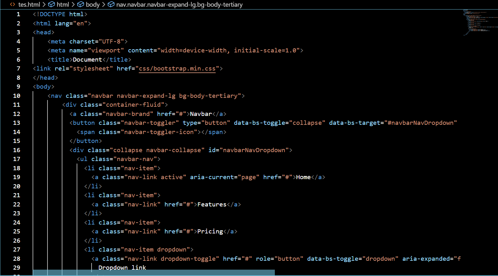
5. Jalankanlah file html yang sudah ditempeli kode program bootstrap tadi melalui web browser. Maka lihatlah hasilnya
	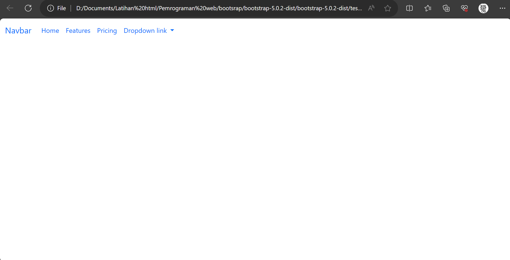
6. Misalnya kita ingin memberikan warna hijau pada background navbar kita. Pertama ketiklah "background" di kolom search
	
7. Carilah Warna yang kita inginkan. Misalnya dalam praktek ini adalah warna hijau
	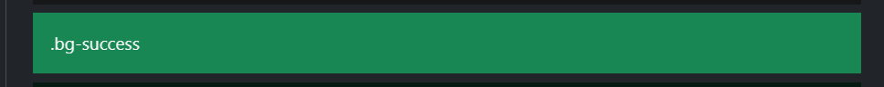
	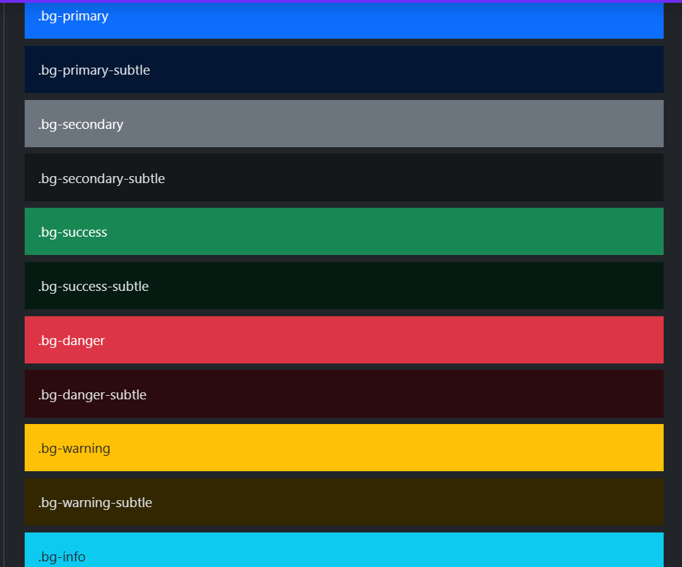
	Terdapat banyak jenis warna dalam bootstrap.
8. Karena kita ingin mengkostumisasi warna background kita menjadi hijau maka kita akan memakai bg-succes . ketikkan bg-succes pada class tag pembuka seperti di bawah ini
	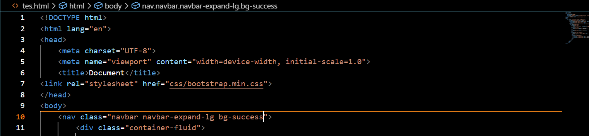
	*Keterangan*:
	Karena kita akan memberikan warna background pada navbar maka untuk menerapkannya, langsung terapkan class tag yang membungkus semua eleme-elemen yang ada pada tag tersebut.
9. Jika sudah maka hasilnya akan seperti ini:
	
10. Sekarang kita akan mengubah warna font yang ada pada navbar. Langkah pertama klik "Colors" pada bagian Utilities
	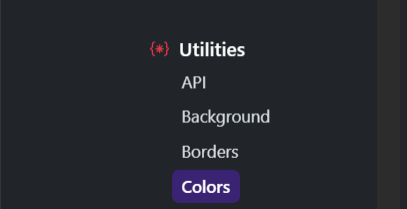
11. Maka kita akan diarahkan pada halaman yang memuat berbagai macam warna font
	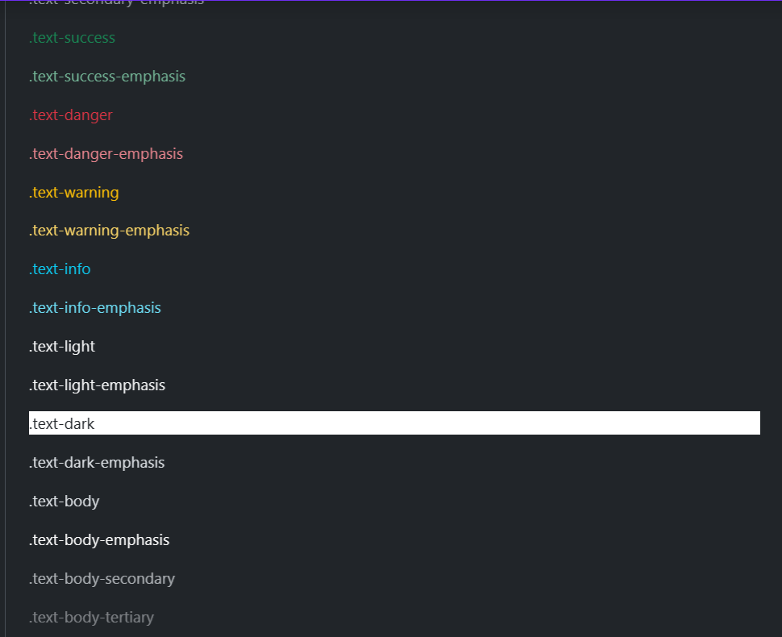
12. Carilah warna font yang kita inginkan. Misalnya pada kostumisasi navbar ini. Kita akan menggunakan warna font putih
	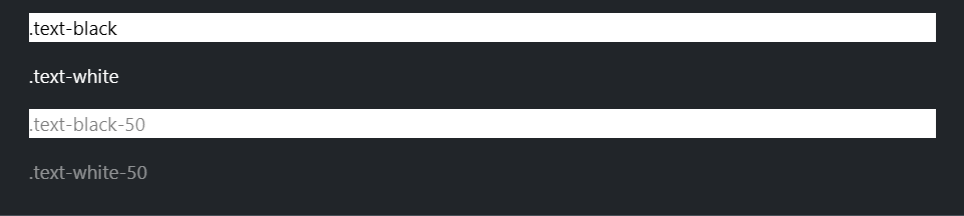
13. Karena kita ingin menggunakan warna font putih maka perintah yang digunakan adalah "text-white"
14. Masuklah kembali ke dalam file html kita
15. pada bagian class sebuah tag yang membungkus text yang akan kita ganti warna, ketiklah text-white . Contohny ada pada gambar berikut:
	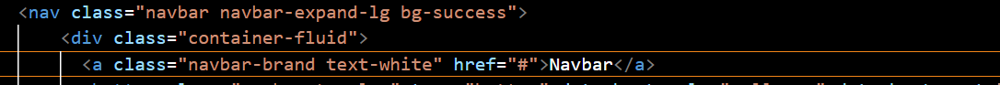
16. Hasilnya akan terlihat seperti di gambar ini:
	
17. Terapkanlah Text-White diseluruh class pada tag yang membungkus text-text itu seperti halnya pada text navbar tadi
	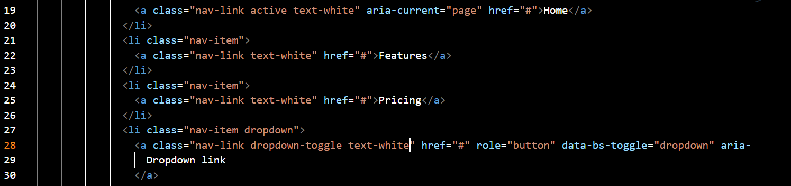
18. Jika file html dijalankan, hasilnya adalah sebagai berikut
	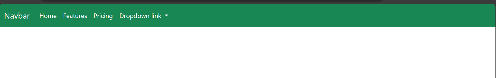
19. Sekarang kita akan mengganti text yang ada di navbar tersebut. Caranya sangat mudah, yaitu cukup kita ganti text-text tadi dengan kata kata yang kita inginkan. Misalnya adalah sebagai berikut:
	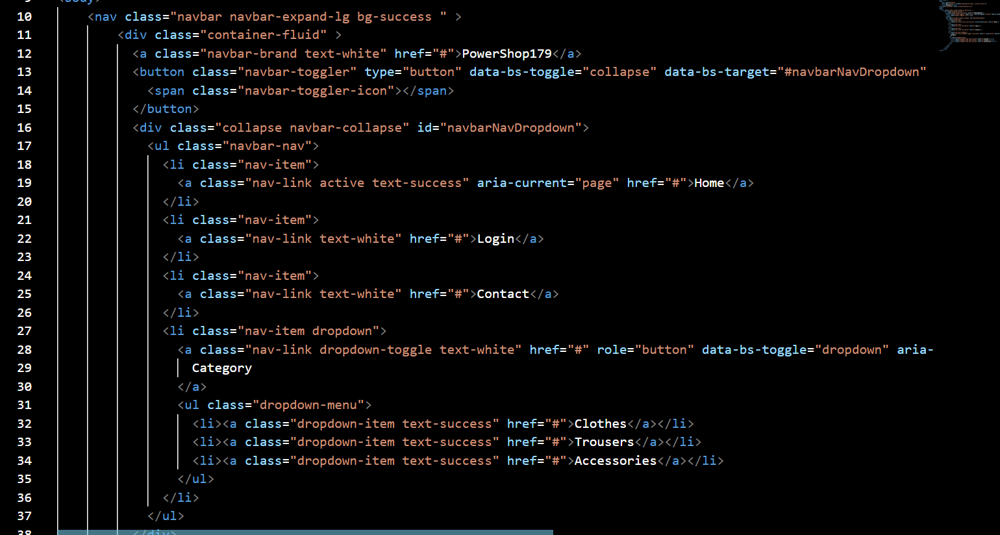
20. Maka hasilnya adalah sebagai berikut:
	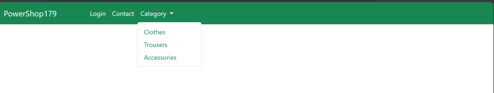
21. Sekarang kita akan menambahkan kolom search pada navbar kita. pada bagian navbar di [getbootstrap.com](getbootstrap.com) Scroll ke bawah hingga menemukan seperti pada gambar
	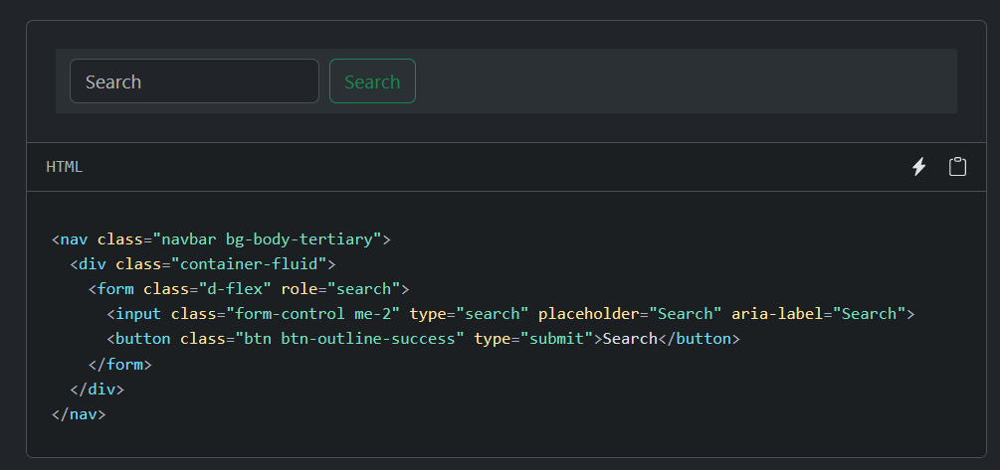
23. Salin kodenya lalu tempelkan di bagian bawah kode navbar kita tadi. Jadi jangan disatukan ke dalam kode navbar tadi.
```html
<nav class="navbar bg-body-tertiary">
    <div class="container-fluid">
        <form class="d-flex" role="search">
            <input class="form-control me-2" type="search" placeholder="Search" aria-label="Search">
            <button class="btn btn-outline-success" type="submit">Search</button>
        </form>
    </div>
</nav>
```
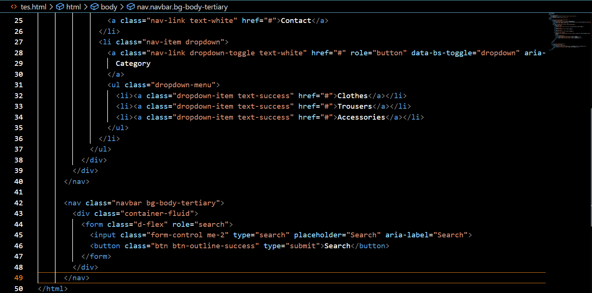

*Keterangan*:
1. ==`navbar`== : Kelas ini menunjukkan bahwa elemen ==`<nav>`== adalah bagian dari komponen navbar. Navbar adalah bagian dari Bootstrap yang menyediakan navigasi di bagian atas halaman web. Dengan memberikan kelas navbar , kita memberitahu Bootstrap untuk menerapkan gaya dan tata letak khusus yang terkait dengan navigasi.
2. ==`bg-body-tertiary`== : Kelas ini memberikan warna latar belakang pada navbar. Dalam hal ini, warna latar belakangnya diberi warna sesuai dengan warna "hijau" Warna latar belakang ini dapat disesuaikan sesuai kebutuhan desain
3. ==`container-fluid`== : Kelas ini diterapkan pada elemen ==`<div>`== yang membungkus elemen-elemen dalam navbar. Kelas ini memberikan padding yang sesuai dan membuat elemen-elemen di dalamnya menjaga lebar penuh dari layar (menggunakan grid system Bootstrap). Dengan kata lain, kontennya akan merespons secara baik pada berbagai lebar perangkat.
4. ==`d-flex`== : Kelas ini mengubah elemen ==`<form>`== menjadi kontainer flex. Flexbox adalah teknik tata letak yang kuat di CSS yang memudahkan pengaturan dan penataan elemen dalam satu atau dua dimensi. Dengan memberikan kelas d-flex , elemen form dan anak-anaknya dapat disusun secara fleksibel.
5. ==`form-control`== : Kelas ini diterapkan pada elemen ==`<input>`== untuk memberikan gaya yang konsisten pada elemen formulir. Di sini, elemen input diberi gaya Bootstrap standar untuk mengubahnya menjadi kontrol formulir yang responsif dan berada dalam baris yang sesuai.
6. ==`me-2`== : Ini adalah kelas Bootstrap yang memberikan margin kanan sebesar 2 pada elemen yang memilikinya. Dalam codingan ini, kelas ini diterapkan pada elemen input untuk memberikan jarak margin kanan.
7. ==`btn`== dan ==`btn-outline-success`== : Kelas ini memberikan gaya pada elemen ==`<button>`== . Kelas btn mengindikasikan bahwa ini adalah elemen tombol Bootstrap, sedangkan btn-outline-success memberikan gaya tombol dengan warna tepi hijau ("success" dalam Bootstrap).
8. ==`type="submit"`== pada tombol: Ini menentukan bahwa tombol tersebut bertindak sebagai tombol submit dalam formulir. Ketika ditekan, formulir akan dikirim.
9. Maka hasilnya adalah seperti berikut:
	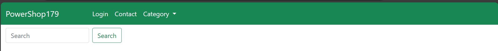
10. Untuk membuat agar navbar tersebut terlihat menyatu, berikan background-color yang sama pada navbar diatasnya, yaitu menggunakan kode bg-succes . Letakkan di class tag yang membungkus seluruh elemen search tadi.
	
11. Maka hasil yang muncul akan seperti ini
	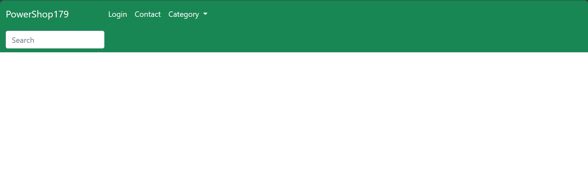
## Buttons
Pada praktek sebelumnya kita sudah mengatur navbar dan juga menambahkan kolom search. Namun ada masalah dengan tombolnya. Karena tombolnya memiliki warna yang sama dengan warna background yang digunakan yaitu hijau, Maka tombol tersebut tidak terlihat akibat warnanya menyatu. Pada bagian kali kita akan membahas cara mengatur sebuah tombol di bootstrap. Berikut caranya:

1. Permasalahan tadi ialah background color tombolnya yang menyatu dengan warna backgriund navbarnya. Untuk mengatur warna tombol, pertama di situs getbootstrap.com, carilah bagian "buttons" di Components
	
2. Jika sudah menemukan klik bagian tersebut, maka kita akan diarahkan pada bagian buttons seperti pada gambar
	
3. Scroll lah ke bawah hingga menemukan bagian "Outlines Buttons"
	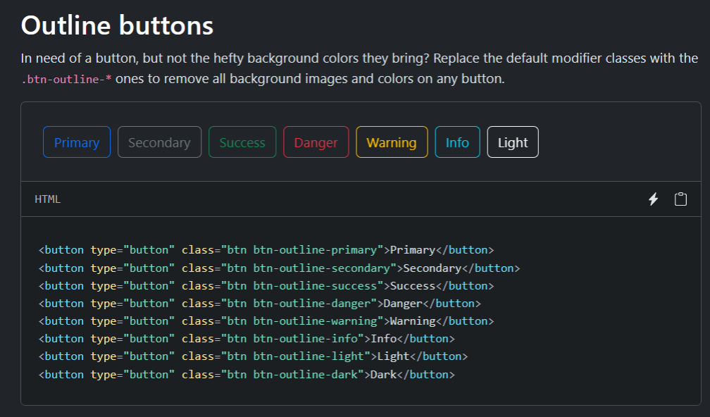
4. Saat ini kita akan menggunakan jenis warna putih agar tidak lagi menyatu dengan warna background navabrnya. Pada outline buttons yang berwarna putih, tertulis "Light". Oleh karena itu salinlah kode program yang ada tulisan "Light".
```html
<button type="button" class="btn btn-outline-light">Light</button>
```
5. Blok lah terlebih dahulu kode program yang mengatur tombol pada bagian search tadi
	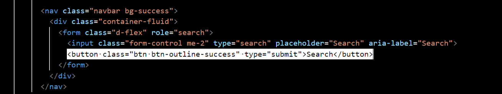
6. Tempelkanlah kode program outline light, untuk menggantikan kode program button yang lama
	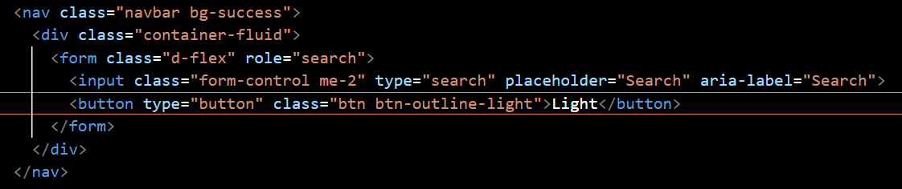
7. Maka hasilnya akan bagus seperti pada gambar dibawah ini:
	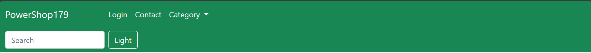
8. Ubahlah Text "Light" menjadi "Search"
	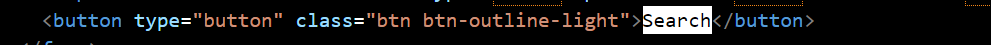
9. Maka hasilnya akan seperti ini:
	
## Cards dan Form
Sekarang kita akan membuat sebuah form, dimana form tersebut kita asumsikan sebagai login page dari web kita tadi. Dalam pembuatan form login ini, kita akan menggunakan cards sebagai layout/tata letak yang akan mengatur form login tadi. Berikut langkah-langkahnya:

1. Yang pertama kita tentunya harus menentukan layout cards nya terlebih dahulu. Hal ini bertujuan agar jika tata letak card sudah ada, maka kita tinggal mengatur form nya di dalam card tadi. Masuk ke situs bootstrap tadi lalu pilih cards
	
2. Scrol ke bawah hingga menemukan layout yang kita inginkan, misalnya seperti pada gambar:
	
3. Pada bagian bawah contoh, terdapat kode program. Salinlah kode program tersebut
```html
<div class="card">
    <div class="card-header">
        Featured
    </div>
    <div class="card-body">
        <h5 class="card-title">Special title treatment</h5>
        <p class="card-text">With supporting text below as a natural lead-in to additional content.</p>
        <a href="#" class="btn btn-primary">Go somewhere</a>
    </div>
</div>
```
4. Tempelkanlah kode program itu pada halaman html terkait. Tentu saja dengan bootstrap yang sudah ditautkan, baik offline, maupun online.
5. Maka hasil awalnya adalah sebagai berikut:
	
6. karena jarak atas antara card dengan batas website terlalu dekat maka pada class card tambahkan mt-2 .
```html
<div class="card mt-2">
    <div class="card-header">
        Featured
    </div>
    <div class="card-body">
        <h5 class="card-title">Special title treatment</h5>
        <p class="card-text">With supporting text below as a natural lead-in to additional content.</p>
        <a href="#" class="btn btn-primary">Go somewhere</a>
    </div>
</div>
```
7. Maka hasilnya adalah seperti ini:
	
8. Sekarang kita ingin membuatnya terlihat ke tengah. Maka buatlah sebuah div dengan class yaitu "container", lalu salin masuklah kode program card tadi. Dengan kata lain, bungkuslah kode program card dengan sebuah div dengan class="container".
```html
<div class="container">
    <div class="card mt-2">
        <div class="card-header">
            Featured
        </div>
        <div class="card-body">
            <h5 class="card-title">Special title treatment</h5>
            <p class="card-text">With supporting text below as a natural lead-in to additional content.</p>
            <a href="#" class="btn btn-primary">Go somewhere</a>
        </div>
    </div>
</div>
```
9. Berikut hasil dari di bungkusnya cards tadi.
	
10. Sekarang kita akan membuat form nya. Pertama-tama, kita perlu membuat judul form. Caranya adalah ganti tulisan "Featured" di html kita dengan kata yang kita inginkan. misalnya pada program ini kita akan mengganti tulisan menjadi "Form Login".
	
```html
<div class="container">
    <div class="card mt-2">
        <div class="card-header">
            <h5>Form Login</h5>
        </div>
        <div class="card-body">
            <h5 class="card-title">Special title treatment</h5>
            <p class="card-text">With supporting text below as a natural lead-in to additional content.</p>
            <a href="#" class="btn btn-primary">Go somewhere</a>
        </div>
    </div>
</div>
```
*Keterangan*:
	1. ==`container`== pada ==`<div class="container">`== : Kelas ini memberikan tata letak yang terkandung pada lebar tertentu (dalam pixel) dan ditengahkan di tengah halaman atau elemen yang memuatnya. Ini membantu dalam mengatur konten agar sesuai dengan standar desain Bootstrap.
	2. ==`card`== pada ==`<div class="card mt-2">`== : Kelas ini memberikan gaya dan tata letak khusus untuk elemen ==`<div>`== yang merupakan kartu (card). Kartu adalah elemen Bootstrap yang sering digunakan untuk menampilkan konten atau informasi dalam satu unit terpisah dengan gaya yang konsisten.
		- `mt-2` : Kelas ini memberikan margin atas (margin-top) sebesar 2 unit. Ini membantu memberikan ruang di bagian atas kartu dan memisahkannya dari elemen-elemen sekitarnya.
	3. ==`card-header`== pada ==`<div class="card-header">`== : Kelas ini memberikan gaya khusus untuk elemen ==`<div>`== yang berfungsi sebagai header kartu. Header kartu biasanya berisi judul atau informasi lain yang menandai atau menjelaskan konten kartu.
		- ==`<h5>Form Login / h5>`== : Ini adalah elemen judul level 5 (h5) di dalam header kartu yang memberikan judul "Form Login" pada kartu.
	4. ==`card-body`== pada ==`<div class="card-body">`== : Kelas ini memberikan gaya khusus untuk elemen ==`<div>`== yang berisi tubuh atau konten utama kartu. Ini membantu memisahkan dan memvisualisasikan konten utama kartu.
		- ==`<h5 class="card-title">Special title treatment / h5>`== : Ini adalah elemen judul level 5 (h5) di dalam tubuh kartu yang memberikan judul khusus.
		- ==`<p class="card-text">With supporting text below as a natural lead-in to additional content. / p>`== : Ini adalah elemen paragraf di dalam tubuh kartu yang memberikan teks pendukung atau keterangan untuk konten utama kartu.
		- ==`<a href="#" class="btn btn-primary">Go somewhere / a>`== : Ini adalah elemen anchor (tautan) yang merupakan tombol dengan kelas Bootstrap "btn" dan "btn-primary", memberikan tampilan dan warna tertentu sesuai dengan desain Bootstrap.
	**Perbedaan Container dengan Container-fluid**: 
	**container**: 
	- ==`container`== memberikan tata letak yang terpusat dan memiliki lebar yang tetap (fixed-width).
	- Lebar ==`container`== diatur dalam satuan piksel dan tetap konstan terlepas dari ukuran layar pengguna.
	- Digunakan untuk membuat tata letak yang terkonsentrasi di tengah halaman dan memberikan batasan pada lebar kontennya.
	**container-fluid**:
		- ==`container-fluid`== memberikan tata letak yang penuh lebar, mengisi seluruh lebar layar.
		- Lebar ==`container-fluid`== disesuaikan dengan lebar layar pengguna, sehingga konten dapat memanfaatkan seluruh lebar tampilan tanpa batasan piksel tertentu.
		- Digunakan ketika Anda ingin membuat tata letak yang menyesuaikan diri dengan lebar layar dan memberikan tampilan responsif.
11. Hasilnya adalah sebagai berikut
	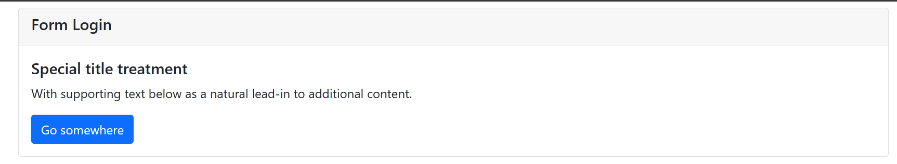
12. Sekarang pada bagian dalam div card-body hapus semua elemen yang ada didalamnya kecuali button:
```html
<div class="container">
    <div class="card mt-2">
        <div class="card-header">
            <h5>Form Login</h5>
        </div>
        <div class="card-body">
            <a href="#" class="btn btn-primary">Go somewhere</a>
        </div>
    </div>
</div>
```
13. Hasilnya akan seperti ini
	
14. Langkah selanjutnya adalah menambahkan elemen-elemen form ke dalam card-body untuk membuat formulir login. Anda dapat menggunakan elemen-elemen HTML seperti form , input , dan button untuk ini. bukalah kembali getbootstrap.com dan pilihlah form yang kita inginkan:
	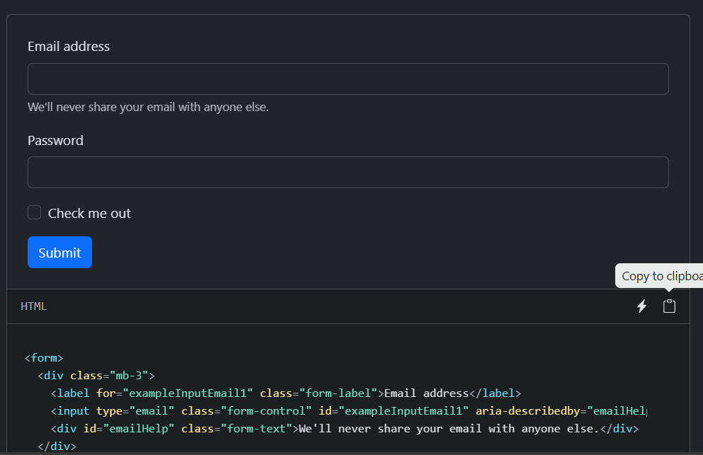
15. Salinlah kode program dibawah contoh forms tadi:
```html
<form>
    <div class="mb-3">
        <label for="exampleInputEmail1" class="form-label">Email address</label>
        <input type="email" class="form-control" id="exampleInputEmail1" aria-describedby="emailHelp">
        <div id="emailHelp" class="form-text">We'll never share your email with anyone else.</div>
    </div>
    <div class="mb-3">
        <label for="exampleInputPassword1" class="form-label">Password</label>
        <input type="password" class="form-control" id="exampleInputPassword1">
    </div>
    <div class="mb-3 form-check">
        <input type="checkbox" class="form-check-input" id="exampleCheck1">
        <label class="form-check-label" for="exampleCheck1">Check me out</label>
    </div>
    <button type="submit" class="btn btn-primary">Submit</button>
</form>
```
16. Tempelkanlah didalam cards-body tadi
	
17. Maka hasilnya adalah sepert ini:
	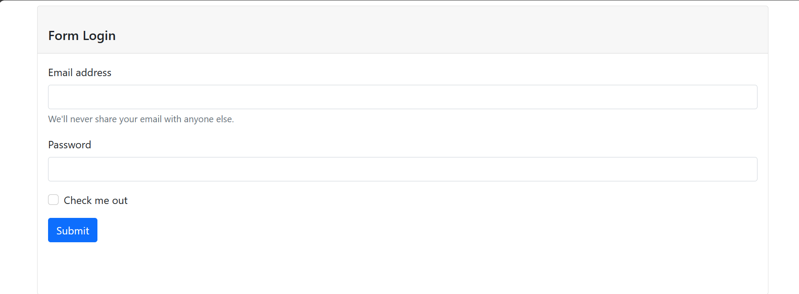
Dengan demikian kita sudah berhasil membuat layoutcards dimana form login sebagai kontennya
# Grid For Responsive Web/Layouting
Bootstrap memiliki sistem tata letak yang kuat yang bernama grid. Grid berguna untuk membuat tata letak yang responsif di halaman web kita. Sistem grid Bootstrap berdasarkan konsep kolom yang dapat diatur dalam baris. Berikut adalah beberapa hal penting yang perlu kita ketahui tentang grid dan layouting di Bootstrap:

1. **KONTAINER (Container)**
	Grid Bootstrap harus ditempatkan dalam elemen kontainer. Terdapat dua jenis kontainer yang tersedia, yaitu .container dan .container-fluid. .container memiliki lebar terbatas dan akan disesuaikan dengan lebar layar. .container ini digunakan ketika kita ingin membuat tata letak yang terpusat dan terbatas pada lebar tertentu. .container-fluid memiliki lebar penuh dan akan mengisi seluruh lebar layar. Kontainer ini digunakan ketika kita ingin membuat tata letak yang menyesuaikan dengan lebar layar penuh.
2. **BARIS (Row)**
	Baris digunakan untuk mengelompokkan kolom-kolom dalam tata letak. kita dapat menambahkan class .row pada elemen yang berfungsi sebagai wadah kolom. Baris ini akan memastikan bahwa kolom-kolom di dalamnya akan diatur secara horizontal.
3. **KOLOM (Column):**
	Kolom adalah bagian dasar dari sistem grid Bootstrap. Kolom- kolom ditempatkan di dalam baris dan digunakan untuk membagi horizontal ruang dalam grid. Setiap baris dipecah menjadi 12 kolom, yang dapat kita bagi sesuai kebutuhan.

	**Catatan**: kita dapat menggunakan kelas seperti .col- , .col-sm- , .col-md- , .col-lg- , atau .col-xl- untuk menentukan bagaimana kolom akan berperilaku di berbagai ukuran perangkat. Misalnya, .col-sm-6 akan membuat kolom tersebut memiliki lebar setengah dari baris pada ukuran layar kecil. kita dapat menggabungkan kelas kolom untuk ukuran layar yang berbeda untuk menciptakan tata letak yang responsif. Misalnya, .col-md-6 .col-lg-4 akan membuat kolom tersebut memiliki lebar setengah dari baris pada ukuran layar medium, dan memiliki lebar sepertiga dari baris pada ukuran layar besar.
4. **OFFSET**
	Kita dapat menggunakan kelas offset untuk memindahkan kolom ke samping. Misalnya, .offset-md-2 akan memindahkan kolom 2 satuan ke kanan pada layar dengan ukuran medium. Offset digunakan ketika Kita ingin membuat ruang kosong di antara kolom-kolom.
5. **Perilaku pada Ukuran Layar yang Berbeda**
	Kita dapat menggunakan kelas-kelas grid Bootstrap yang berbeda untuk mengontrol tampilan kolom pada ukuran layar yang berbeda. Misalnya, Kita dapat menggunakan .colsm- untuk ukuran layar kecil, .col-md- untuk ukuran layar medium, dan sebagainya. Dengan cara ini, Kita dapat membuat tata letak yang responsif untuk berbagai perangkat.
6. **NESTING**
	Nesting memungkinkan Kita menempatkan baris dan kolom di dalam kolom lainnya. Dengan cara ini, Kita dapat membuat tata letak yang lebih kompleks dengan komponen-komponen yang terkait. Misalnya, Kita dapat menempatkan sebuah baris di dalam kolom yang ada di dalam baris lainnya
7. **ORDER**
	Kita dapat menggunakan kelas .order- untuk mengubah urutan kolom pada ukuran layar tertentu. Misalnya, .order-first akan memindahkan kolom ke posisi pertama, dan .orderlast akan memindahkan kolom ke posisi terakhir. Dengan menggunakan kelas ini, Kita dapat mengatur ulang urutan kolom untuk mencapai tata letak yang diinginkan pada berbagai ukuran layar.

Itu adalah beberapa konsep penting dalam sistem grid Bootstrap. Dengan menggunakan sistem grid ini, kita dapat membuat tata letak yang responsif dan menyesuaikan tampilan elemen-elemen pada berbagai ukuran layar dengan mudah.
## Contoh Penggunaan dan Penjelasannya
Sekarang kita akan mencoba penggunaan grid yang dengan bantuan Bootstrap. Berikut langkah-langkahnya:

1. Masuklah kembali ke web getbootstrap.com.
	
2. carilah "Grid" di Kolom search lalu klik enter. Maka kita akan diarahkan pada halaman web yang berisi tentang grid.
	
3. Carilah layout atau tata letak grid yang kita inginkan. Misalnya pada praktek kali ini, kita akan menggunakan layout "Row columns".
	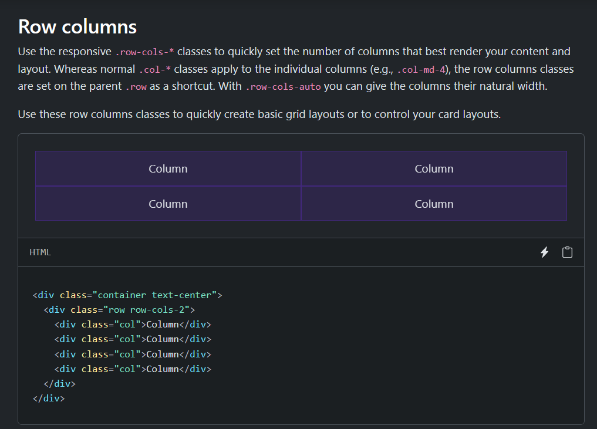
4. Salinlah kode program yang terletak di kode bawah contohnya.
```html
<div class="container text-center">
    <div class="row row-cols-2">
        <div class="col">Column</div>
        <div class="col">Column</div>
        <div class="col">Column</div>
        <div class="col">Column</div>
    </div>
</div>
```
5. Tempelah pada file html yang tentunya telah dihubungkan dengan tautan bootstrap, baik secara offline maupun online.
	
6. Maka hasilnya akan seperti berikut:
	
	*Keterangan:*
	Jadi tulisan "Column" adalah isi konten yang sudah teratur dalam grid ini. kita bisa mengganti "konten" ini dengan konten yang kita inginkan
7. Untuk mengganti kontennya hapuslah tulisan "Column" lalu gantilah dengan kontent yang kita inginkan.
```html
<div class="container text-center">
    <div class="row row-cols-2">
        <div class="col">
            <div>
                
                <h3>HTML</h3>
                <p>Lorem ipsum dolor sit amet consectetur adipisicing elit. <br>Nobis totam assumenda unde quod et vitae minus beatae, <br> quibusdam impedit laboriosam earum, <br> possimus consequatur quisquam dolore ex ipsa eaque cupiditate neque.</p>
            </div>
        </div>
        <div class="col">
            <div>
                
                <h3>CSS</h3>
                <p>Lorem ipsum dolor sit amet consectetur adipisicing elit. <br>Nobis totam assumenda unde quod et vitae minus beatae, <br> quibusdam impedit laboriosam earum, <br> possimus consequatur quisquam dolore ex ipsa eaque cupiditate neque.</p>
            </div>
        </div>
        <div class="col">
            <div>
                
                <h3>JavaScript</h3>
                <p>Lorem ipsum dolor sit amet consectetur adipisicing elit. <br>Nobis totam assumenda unde quod et vitae minus beatae, <br> quibusdam impedit laboriosam earum, <br> possimus consequatur quisquam dolore ex ipsa eaque cupiditate neque.</p>
            </div>
        </div>
        <div class="col">
            <div>
                
                <h3>JQuery</h3>
                <p>Lorem ipsum dolor sit amet consectetur adipisicing elit. <br> Nobis totam assumenda unde quod et vitae minus beatae, <br> quibusdam impedit laboriosam earum, <br> possimus consequatur quisquam dolore ex ipsa eaque cupiditate neque.</p>
            </div>
        </div>
    </div>
</div>
```
8. Hasil nya akan menjadi seperti berikut:
	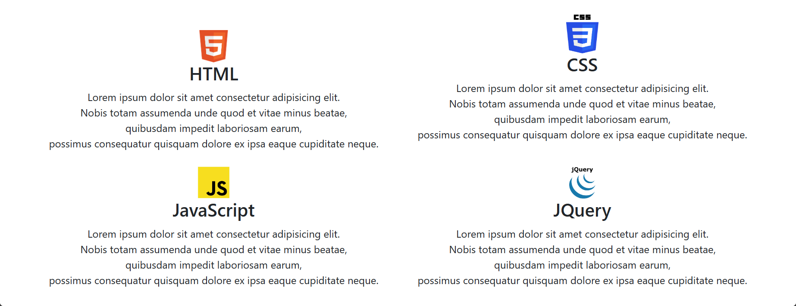
	*Keterangan:*
	Jadi Grid tadi mengatur Row dan Column dimana terdapat 2 baris berisi 4 kolom sebagai kontennya. Kontennya tadi kita ganti dengan konten yang kita inginkan
9. Apabila layar yang kita kecilkan, maka grid akan menyesuaikan ukurannya seperti pada gambar ini
	
	*Keterangan:*
	Jadi grid ini sudah mengatur mengenai penyesuaian ukuran layar kita, sehingga, dapat menyesuaikan di segala ukuran monitor.
10. Apabila kita melihatnya di perangkat, maka akan terlihat seperti ini:
	
	*Keterangan:*
	Jadi karena grid yang disediakan oleh bootstrap telah mendukung fitur responsive, maka ketika user melihat tampilan web kita di ponsel, maka tata letak akan mengikutinya sesuai dengan ukuran ponsel, seperti yang terlihat pada gambar di atas
## Contoh Penggunaan `col-md`, `col-lg` dan `col-sm`
Kelas ==`col-md`== , ==`col-lg`== , dan ==`col-sm`== adalah kelas-kelas kolom dalam Bootstrap yang digunakan untuk meresponsifkan tata letak halaman web sesuai dengan ukuran layar perangkat. Bootstrap menggunakan sistem grid yang terdiri dari 12 kolom, dan kelas-kelas ini memungkinkan Anda mengontrol sejauh mana elemen-elemen tersebut harus meluas pada layar yang berbeda.

- ==`col-sm`== : Digunakan untuk layar kecil (small), seperti pada perangkat mobile atau tablet dalam orientasi potret. Kolom ini akan berlaku untuk layar dengan lebar 576px atau lebih.
- ==`col-md`== : Digunakan untuk layar sedang (medium), yang mencakup perangkat seperti tablet dalam orientasi landscape. Kolom ini akan berlaku untuk layar dengan lebar 768px atau lebih.
- ==`col-lg`== : Digunakan untuk layar besar (large), yang mencakup desktop. Kolom ini akan berlaku untuk layar dengan lebar 992px atau lebih.

**Contoh**:
Sekarang kita akan coba untuk membuat sebuah tampilan dengan menggunakan class diatas tadi. Berikut contohnya: 
1. Bukalah kembali web getbootsrap lalu di kolom pencarian carilah "grid".
	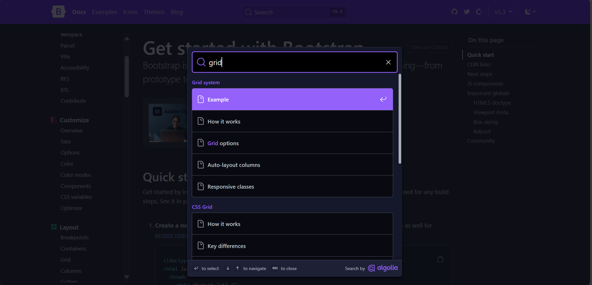
2. Cari dan copylah kembali codingan grid yang kita gunakan pada praktek sebelumnya.
	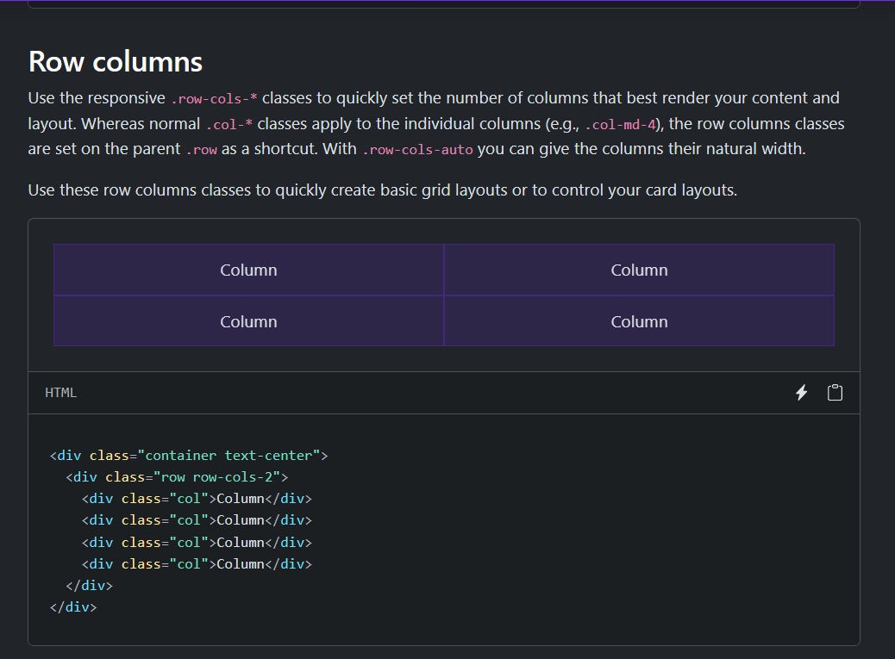
```html
<div class="container text-center">
    <div class="row row-cols-2">
        <div class="col">Column</div>
        <div class="col">Column</div>
        <div class="col">Column</div>
        <div class="col">Column</div>
    </div>
</div>
```
3. Tempelkanlah codingan tadi di visual studio kode pada file tempat kita mempraktekkan grid pada praktikum sebelumnya, agar kita bisa menggunakan satu file saja untuk praktek.
	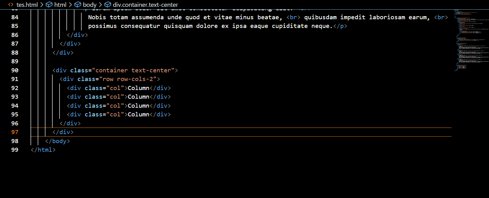
4. Maka akan terlihat seperti gambar di bawah ini:
	
	*Keterangan*:
	Perhatikanlah di bawah kolom JavaScript dan JQuery, terdapat tulisan column sebanyak 4 dan bersusun hal ini dikarenakan pada kodingan tadi, teks yang dipakai sebagai template di bootstrap adalah "Column", nanti pada tahap selanjutnya kita akan mengganti "Column" itu dengan text atau item yang kita inginkan.
5. Sekarang, pada codingan yang kita ambil dari web bootstrap tadi pada bagian ==`<div class="col">`== yang pertama, tambahkanlah -md sehingga menjadi ==`<div class="col-md>"`== . Kemudian pada ==`<div class="col">`== yang kedua, tambahkanlah - lg sehingga menjadi ==`<div class="col-lg">`== , dan terakhir pada ==`<div class="col">`== yang ketiga, tambahkanlah -sm sehingga menjadi ==`<div class="col-sm">`== , sementara pada ==`<div class="col">`== yang terakhir kita biarkan saja seperti bawaan.
```html
<div class="container text-center">
    <div class="row row-cols-2">
        <div class="col-md">Column</div>
        <div class="col-lg">Column</div>
        <div class="col-sm">Column</div>
        <div class="col">Column</div>
    </div>
</div>
```

6. Maka hasilnya akan menjadi seperti ini:
	**Sebelum:**
	
	**Sesudah:**
	

*Keterangan:*
- ==`col-md`== :Dengan menambahkan -md pada codingan tadi akan membuat kolom tersebut mengambil sebagian besar lebar tersedia (12 kolom) pada layar dengan lebar medium (768px atau lebih).
- ==`col-lg`== : Sama seperti col-md , tetapi ditujukan untuk layar lebar (large, 992px atau lebih). col-sm : Sama seperti col-md , tetapi ditujukan untuk layar kecil (small, 576px atau lebih).
7. Tambahkanlah teks ataupun item dari yang kita inginkan dengan cara hapuslah teks "Column" tadi, dan ditempat teks "Column" yang sudah dihapus, tempelkan lah item atau teks yang kita inginkan
```html
<div class="container text-center">
    <div class="row row-cols-2">
        <div class="col-md">
            <div>
                
                <h3>HTML</h3>
                <p>Lorem ipsum dolor sit amet consectetur adipisicing elit. <br>
                    Nobis totam assumenda unde quod et vitae minus beatae, <br> quibusdam impedit laboriosam earum, <br>
                    possimus consequatur quisquam dolore ex ipsa eaque cupiditate neque.</p>
            </div>
        </div>
        <div class="col-lg">
            <div>
                
                <h3>CSS</h3>
                <p>Lorem ipsum dolor sit amet consectetur adipisicing elit. <br>
                    Nobis totam assumenda unde quod et vitae minus beatae, <br> quibusdam impedit laboriosam earum, <br>
                    possimus consequatur quisquam dolore ex ipsa eaque cupiditate neque.</p>
            </div>
        </div>
        <div class="col-sm">
            <div>
                
                <h3>JavaScript</h3>
                <p>Lorem ipsum dolor sit amet consectetur adipisicing elit. <br>
                    Nobis totam assumenda unde quod et vitae minus beatae, <br> quibusdam impedit laboriosam earum, <br>
                    possimus consequatur quisquam dolore ex ipsa eaque cupiditate neque.</p>
            </div>
        </div>
        <div class="col">
            <div>
                
                <h3>JQuery</h3>
                <p>Lorem ipsum dolor sit amet consectetur adipisicing elit. <br>
                    Nobis totam assumenda unde quod et vitae minus beatae, <br> quibusdam impedit laboriosam earum, <br>
                    possimus consequatur quisquam dolore ex ipsa eaque cupiditate neque.</p>
            </div>
        </div>
    </div>
</div>
```
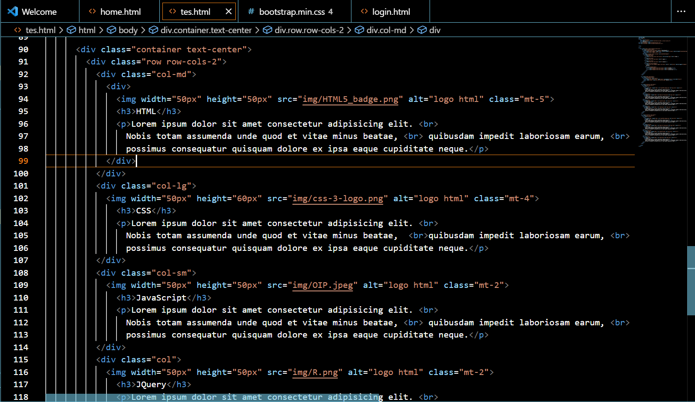
8. Maka hasilnya akan seperti ini:
	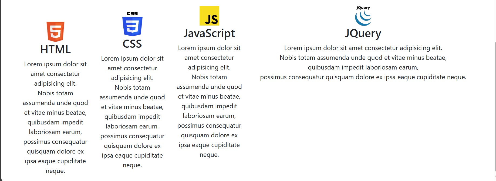
	*Keterangan:*
	Jadi pada praktek sebelumnya tanpa adanya tambahan pada class bootstrap tadi maka elemen akan menyesuaikan lebar pada pembungkus menjadi full, sedangkan untuk praktek yang saat ini kita tampilkan, item dan teks nya menyesuaikan ukurannya sesuai dengan tambahannnya. Untuk penjelasan ukurannya **Penjelasannya telah kami sediakan di langkah ke-6**.
# Penggunaan Tema
Dalam Bootstrap, tema dasarnya terdiri dari sejumlah variabel CSS yang mengontrol aspek-aspek seperti warna, ukuran teks, jarak, dan banyak lagi. Untuk melakukan kostumisasi tema, kita dapat mengganti nilai-nilai variabel ini sesuai dengan preferensi kita.

Berikut adalah langkah-langkah umum untuk melakukan kostumisasi tema Bootstrap:
1. **Menentukan gaya desain**: Pertama, tentukan gaya desain yang ingin kita terapkan pada situs web kita. Apakah kita ingin tampilan yang lebih minimalis, warna yang cerah, atau mungkin tampilan yang lebih kustom dengan elemen desain yang unik? Menentukan gaya desain akan membantu kita memutuskan bagaimana mengubah tema Bootstrap.
2. **Menggunakan Sass atau CSS**: Bootstrap menyediakan versi Sass (Syntactically Awesome Style Sheets) dari file sumbernya. Sass adalah bahasa pemrograman yang memungkinkan kita menulis CSS dengan sintaks yang lebih kuat dan fleksibel. Jika kita memiliki pengetahuan tentang Sass, kita dapat mengunduh versi Sass Bootstrap dan mengedit variabel-variabelnya. Jika kita tidak familiar dengan Sass , kita masih dapat mengedit file CSS Bootstrap langsung.
3. **Membuat file kustom**: Buat file kustom yang akan berisi kostumisasi tema kita. Dalam file ini, kita dapat menetapkan nilai-nilai variabel yang ingin kita ubah. Misalnya, kita dapat mengubah warna primer, warna latar belakang, ukuran huruf, dan lain sebagainya.
4. **Mengganti variabel**: Temukan variabel yang relevan dalam file sumber Bootstrap dan ubah nilainya sesuai dengan preferensi kita. Misalnya, jika kita ingin mengubah warna primer, cari variabel ==`$primary-color`== atau sejenisnya dalam file sumber dan ubah nilainya menjadi warna yang diinginkan.
5. **Mengompilasi tema kustom**: Setelah kita selesai mengedit file kustom, kita perlu mengompilasinya ke dalam file CSS yang dapat digunakan pada situs web kita. Jika kita menggunakan Sass, kita perlu mengompilasi file Sass menjadi CSS . Jika kita mengedit file CSS langsung, kita dapat menggunakan file tersebut langsung.
6. **Menerapkan tema kustom**: Setelah kita memiliki file CSS tema kustom, kita perlu menggantikan file Bootstrap default dengan file tema kustom kita pada situs web kita. Pastikan untuk menghubungkan file CSS tema kustom kita setelah file Bootstrap default sehingga kostumisasi kita akan ditimpa pada tema default. Kita dapat membuat tema kostuminasi Bootstrap yang sesuai dengan kebutuhan dan gaya desain kita. Penting untuk diingat bahwa jika kita menggunakan versi Bootstrap yang lebih baru, beberapa variabel atau struktur file mungkin telah berubah.

Kita dapat membuat tema kostuminasi Bootstrap yang sesuai dengan kebutuhan dan gaya desain kita. Penting untuk diingat bahwa jika kita menggunakan versi Bootstrap yang lebih baru, beberapa variabel atau struktur file mungkin telah berubah.
# Contoh Penggunaan Tema dalam Bootstrap
1. Jadi misalnya kita ingin memberikan tema pada website yang telah kita buat sebelumnya
	
2. Bukalah website bootswacth.com dimana website ini menyediakan tema tema yang dapat digunakan untuk web bootstrap kia.
	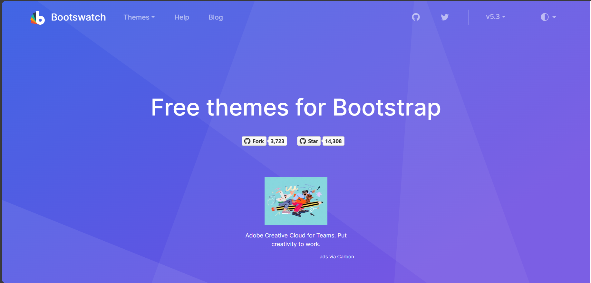
3. Scroll lah ke bawah hingga kita menemukan kumpulan tema tema yang telah disediakaan oleh website ini
	
4. Misalnya kita akan memilih tema "Darkly", oleh karena itu, klik download pada bagian bawah contoh tema tersebut.
	
5. Jika sudah mendownloadnya maka kita telah mendapatkan file css untuk tema tersebut
	
6. Pindahkanlah file css tersebut ke dalam folder yang berisi file html yang akan kita berikan tema
	
7. Sekarang, masuklah ke dalam file html yang akan kita berikan tema bootstrap, lalu panggillah secara eksternal file css tema tadi ke dalam file html tersebut
	
8. Maka hasilnya adalah sebagai berikut dengan demikian kita sudah berhasil memberikan tema gelap pada tampilan html kita menggunakan tema dark pada bootstrap
	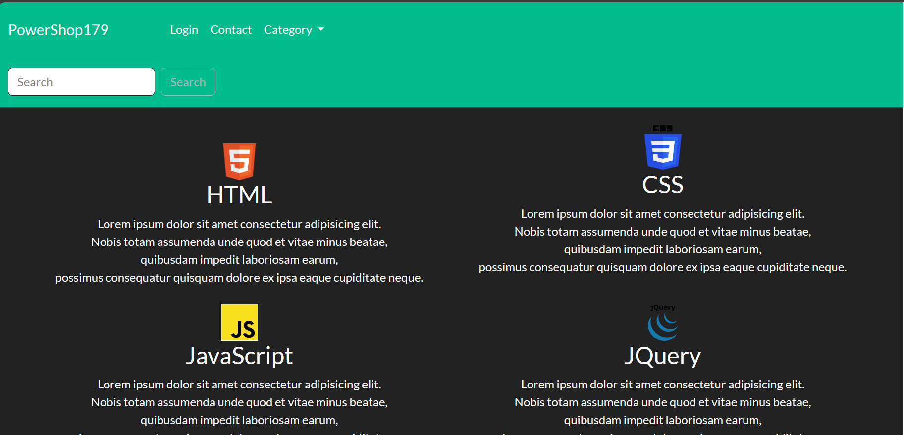
	dengan demikian kita sudah berhasil memberikan tema gelap pada tampilan html kita menggunakan tema dark pada bootstrap
# Modifikasi Template Bootstrap 
Kostumasisasi dalam bootstrap adalah menggunakan template bootstrap kemudian kita akan memodifikasi template tersebut sesuai dengan keinginan kita.

Template dalam Bootstrap adalah struktur dasar atau kerangka kerja yang telah dirancang sebelumnya dan dapat digunakan sebagai dasar untuk membangun halaman web. Bootstrap adalah sebuah framework front-end yang populer digunakan untuk pengembangan web responsif. Dalam konteks Bootstrap, template menyediakan struktur HTML dan gaya CSS dasar yang dapat digunakan sebagai dasar untuk membangun halaman web yang responsif dan mudah diatur.

Dengan menggunakan template Bootstrap, kita dapat menghemat waktu dan usaha dalam merancang tata letak dan gaya dasar dari suatu proyek web. Template ini biasanya sudah mencakup elemen￾elemen umum seperti navigasi, grid system, tombol, formulir, dan banyak lagi. Dengan cara ini, kita dapat fokus pada konten dan fitur unik dari situs web kita tanpa harus memulai dari awal.

Template dalam Bootstrap juga mendukung konsep responsivitas, yang berarti halaman web atau aplikasi yang dibangun dengan menggunakan template ini dapat menyesuaikan diri dengan berbagai ukuran layar, mulai dari perangkat seluler hingga desktop, tanpa perlu penyesuaian tambahan. Ini membuat pengembangan web lebih efisien dan memastikan pengalaman pengguna yang konsisten di berbagai perangkat.

Berikut cara mengkostumisasi template bootstrap:

1. Pertama adalah kita akan membuka sebuah website yang menyediakan template bootstrap. Kali ini web akan kita gunakan adalah themewagon.com
	
2. Masuklah ke dalam website tersebut
	
3. Carilah template yang ingin kita sesuaikan dengan cara mensearch ataupun menscroll hingga menemukan tema yang sesuai
	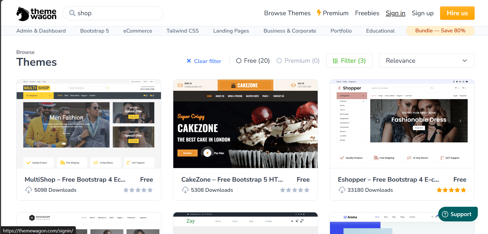
4. Jika sudah menemukan template yang kita inginkan, masuk ke template tersebut lalu klik download pada bagian kanan sebelah, contoh gambar dibawah ini.
	
5. Jika sudah mendownloadnya maka kita telah mendapatkan file template bootsrap kita dalam bentuk zip. File ini berisi asset gambar, style css, index tml, maupun javascript yang menyusun komponen template ini
	
6. Ekstraklah file tersebut hingga berbentuk seperti file biasa dengan cara klik kanan pada file zip tadi lalu pilih "Extract All".
	
7. Jika proses ekstrak sudah selesai maka kita tela mendapatkan folder template tersebut dalam bentuk folder biasa
	
8. Masuklah ke dalam folder template yang telah diekstrak tadi
	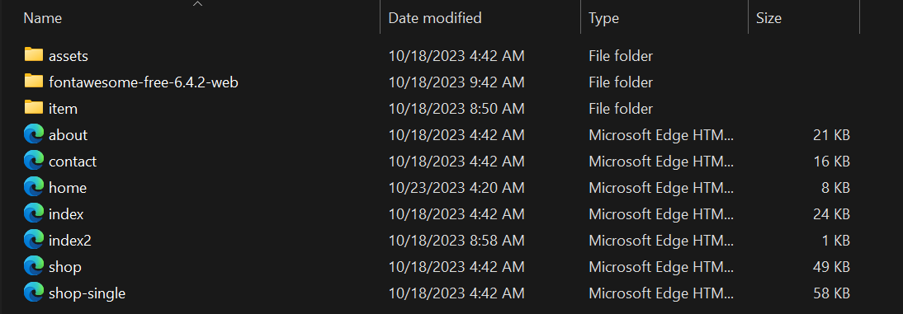
9. Masuklah ke dalam folder index.html. didalam sana terdapat tampilan template kita
	
10. Sekarang kita akan mengkostumasisasi tampilan web template ini. Caranya adalah buka file template nya di visual studio code
	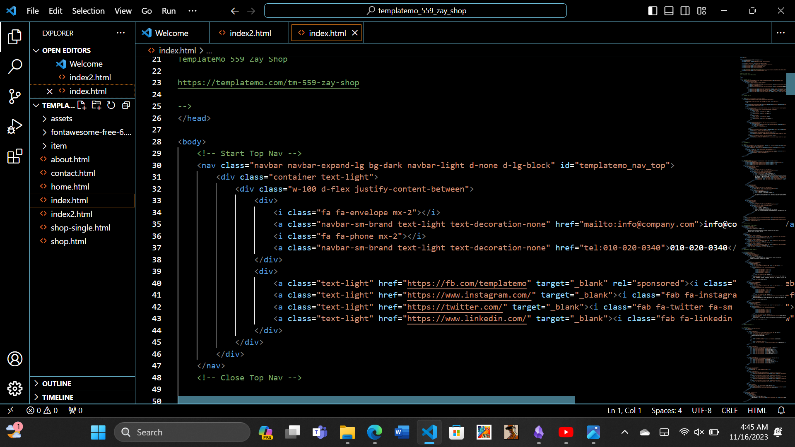
11. Mulailah mengganti konten-konten seperti teks, gambarm dan lainnya seperti yang kita inginkan. Misalnya saya akan mengganti teks yang ada di gambar ini
	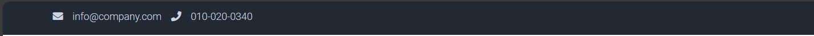
12. Buka kembali visual studio dan masuk ke file index.html tersebut lalu carilah penyusun konten itu
	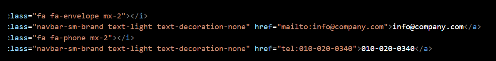
13. Gantilah kalimat dan tujuan email dan nomor telp itu dengan yang kita inginkan
```html
<a class="navbar-sm-brand text-light text-decoration-none" href="mailto:powershop179@gmail.com">powershop179@gmail.com</a>
<i class="fa fa-phone mx-2"></i>
<a class="navbar-sm-brand text-light text-decoration-none" href="tel:082133273167">082133273167</a>
```
Maka hasilnya akan terlihat seperti dibawah ini:
	
14. Mulailah mengganti elemen-elemen lainnya sesuai keinginan kita. Misalnya kita ingin juga mengganti logo yang ada di website ini
	
```html
<a class="navbar-brand text-success logo h1 align-self-center" href="index.html">
    Powershop179
</a>
```
15. Hasil setelah diganti adalah seperti ini
	
16. Sekarang kita akan mengganti Nama web kita yang ada di slide carousel
	
```html
<div class="col-lg-6 mb-0 d-flex align-items-center">
    <div class="text-align-left align-self-center">
        <h1 class="h1 text-success"><b>PowerShop179</b> eCommerce</h1>
        <h3 class="h2">Tiny and Perfect eCommerce Template</h3>
        <p>
            PowerShop179 is an eCommerce HTML5 CSS template with the latest version of Bootstrap 5 (beta 1).
            This template is 100% free provided by <a rel="sponsored" class="text-success" href="https://templatemo.com" target="_blank">TemplateMo</a> website. Image credits go to
            <a rel="sponsored" class="text-success" href="https://stories.freepik.com/" target="_blank">Freepik Stories</a>,
            <a rel="sponsored" class="text-success" href="https://unsplash.com/" target="_blank">Unsplash</a> and
            <a rel="sponsored" class="text-success" href="https://icons8.com/" target="_blank">Icons 8</a>.
        </p>
    </div>
</div>

```
Hasilnya akan menjadi seperti ini:
	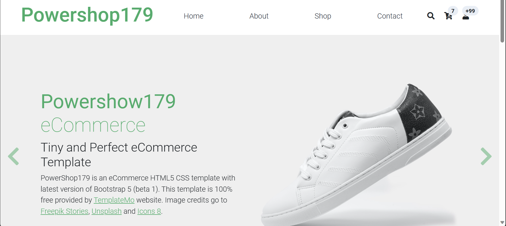
17. bagaimana jika kita ingin mengganti gambar? Misalnya kita akan mengganti gambar yang ada di card ini
	
18. Masuklah ke visual studio code dan ke index.html tadi lalu carilah kode penyusun untuk gambar ini, kemudian gantilah di bagian src gambar yang sudah ada dengan gambar yang kita inginkan
```html
<a href="shop-single.html">

</a>
```
Maka haslinya akan menjadi seperti ini:
	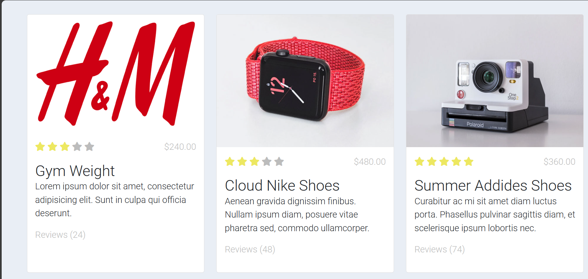
Demikianlah kostumisasi template bootstrap ini. Kesimpulanya kita dapat mengganti text, gambar, link tujuan, atau menambahkan elemen tertentu sesuai dengan kebutuhan kita. Ini tentunya sangat menghemat waktu dan tenaga, dimana kita hanya fokus pada konten yang kita sajikan dibanding harus menyusun grid, responsif, dan lainnya dari awal
# Studi Kasus Pengaplikasian Bootstrap dalam Desain Web
**Contoh Desain Web Yang Akan di Implementasikan**:
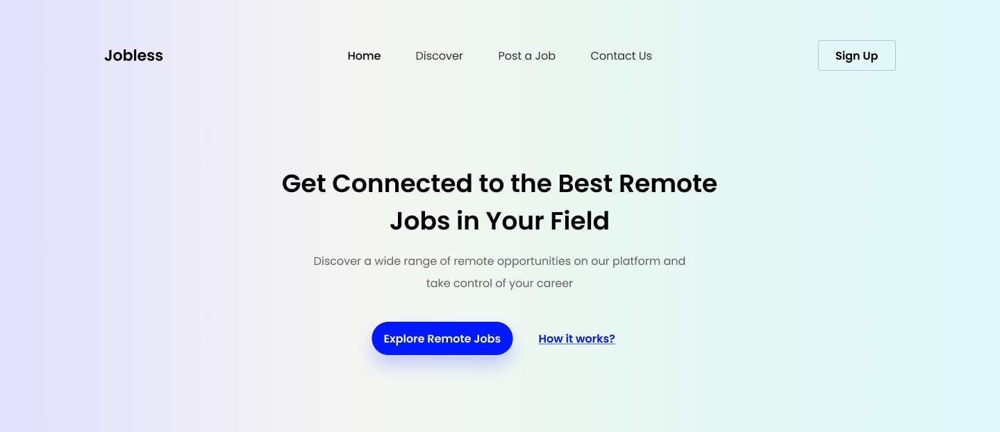
1. dalam desain web tersebut terdapat beberapa komponen, yaitu
   - Navbar, Hero Section, Button dll
2. Pertama-tama kita perlu Inisialisasikan class ==`container`== agar dapat memberikan tata letak konten yang sesuai dengan desainnya.
```html
<div class="container">
</div>
```
*Keterangan*:
- pada ==`<div class="container">`== : Kelas ini memberikan tata letak yang terkandung pada lebar tertentu (dalam pixel) dan ditengahkan di tengah halaman atau elemen yang memuatnya. Ini membantu dalam mengatur konten agar sesuai dengan standar desain Bootstrap.

3. Selanjutnya kita akan implementasikan navbarnya, bukalah kembali web getbootsrap lalu di kolom pencarian carilah "navbar".
	   
4. Cari dan copylah codingan komponen navbar yang mungkin sesuai dengan desainnya.
	   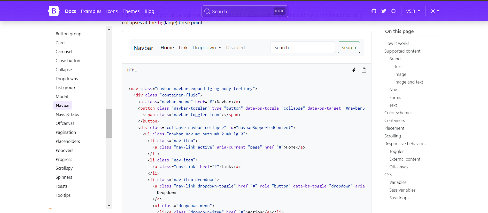
```html
<nav class="navbar navbar-expand-lg bg-body-tertiary"> <div class="container-fluid"> <a class="navbar-brand" href="#">Navbar</a> <button class="navbar-toggler" type="button" data-bs-toggle="collapse" data-bs-target="#navbarSupportedContent" aria-controls="navbarSupportedContent" aria-expanded="false" aria-label="Toggle navigation"> <span class="navbar-toggler-icon"></span> </button> <div class="collapse navbar-collapse" id="navbarSupportedContent"> <ul class="navbar-nav me-auto mb-2 mb-lg-0"> <li class="nav-item"> <a class="nav-link active" aria-current="page" href="#">Home</a> </li> <li class="nav-item"> <a class="nav-link" href="#">Link</a> </li> <li class="nav-item dropdown"> <a class="nav-link dropdown-toggle" href="#" role="button" data-bs-toggle="dropdown" aria-expanded="false"> Dropdown </a> <ul class="dropdown-menu"> <li><a class="dropdown-item" href="#">Action</a></li> <li><a class="dropdown-item" href="#">Another action</a></li> <li> <hr class="dropdown-divider"> </li> <li><a class="dropdown-item" href="#">Something else here</a></li> </ul> </li> <li class="nav-item"> <a class="nav-link disabled" aria-disabled="true">Disabled</a> </li> </ul> <form class="d-flex" role="search"> <input class="form-control me-2" type="search" placeholder="Search" aria-label="Search"> <button class="btn btn-outline-success" type="submit">Search</button> </form> </div> </div> </nav>
```
*Keterangan*:
	1. ==`navbar`== : Kelas ini menunjukkan bahwa elemen ==`<nav>`== adalah bagian dari komponen navbar. Navbar adalah bagian dari Bootstrap yang menyediakan navigasi di bagian atas halaman web. Dengan memberikan kelas navbar , kita memberitahu Bootstrap untuk menerapkan gaya dan tata letak khusus yang terkait dengan navigasi.
	2. ==`bg-body-tertiary`== : Kelas ini memberikan warna latar belakang pada navbar. Dalam hal ini, warna latar belakangnya diberi warna sesuai dengan warna "hijau" Warna latar belakang ini dapat disesuaikan sesuai kebutuhan desain.
	3. ==`container-fluid`== : Kelas ini diterapkan pada elemen ==`<div>`== yang membungkus elemen-elemen dalam navbar. Kelas ini memberikan padding yang sesuai dan membuat elemen-elemen di dalamnya menjaga lebar penuh dari layar (menggunakan grid system Bootstrap). Dengan kata lain, kontennya akan merespons secara baik pada berbagai lebar perangkat.
	4. ==`d-flex`== : Kelas ini mengubah elemen ==`<form>`== menjadi kontainer flex. Flexbox adalah teknik tata letak yang kuat di CSS yang memudahkan pengaturan dan penataan elemen dalam satu atau dua dimensi. Dengan memberikan kelas d-flex , elemen form dan anak-anaknya dapat disusun secara fleksibel.
	5. ==`me-2`== : Ini adalah kelas Bootstrap yang memberikan margin kanan sebesar 2 pada elemen yang memilikinya. Dalam codingan ini, kelas ini diterapkan pada elemen input untuk memberikan jarak margin kanan.

5. Tempelkanlah kode program itu didalam class ==`container`== sebelumnya pada halaman html terkait. Tentu saja dengan bootstrap yang sudah ditautkan, baik offline, maupun online.
6. Maka hasilnya akan seperti ini:
	   
7. Sekarang pada bagian dalam div `navbar-collapse` hapus elemen form:
```html
<form class="d-flex" role="search"> <input class="form-control me-2" type="search" placeholder="Search" aria-label="Search" /> <button class="btn btn-outline-success" type="submit">Search</button> </form>
```

8. Hasilnya akan seperti ini:
	   
9. Langkah Selanjutnya kita perlu mengganti list list serta nama logo pada navbarnya
```html
<ul class="navbar-nav me-auto mb-2 mb-lg-0"> <li class="nav-item"> <a class="nav-link active fw-bold" aria-current="page" href="#">Home</a> </li> <li class="nav-item"> <a class="nav-link text-muted" href="#">Discover</a> </li> <li class="nav-item"> <a class="nav-link text-muted" href="#">Post a Job</a> </li> <li class="nav-item"> <a class="nav-link text-muted" href="#">Contact Us</a> </li> </ul>
```
*Keterangan*:
	1. Disini kita mengganti text list item, dari sebelumnya default dari bootstrap ke desain yang akan diimplementasikan seperti: home,discover,post a job dan contact us
	2. ==`fw-bold`== dalam Bootstrap digunakan untuk memberikan tebal pada teks. Kelas ini merupakan bagian dari utilitas ==`font-weight`== yang disediakan oleh Bootstrap, yang memungkinkan Anda untuk dengan cepat mengubah berat font teks dengan kelas `.fw-*`. Kelas ==`fw-bold`== setara dengan berat font 700
	3. ==`text-muted`== digunakan untuk memberi gaya pada teks dengan warna yang redup. Kelas ini merupakan bagian dari utilitas ==`text-color`== yang disediakan oleh Bootstrap, yang memungkinkan Anda untuk dengan mudah mengubah warna teks dengan kelas ==`.text-*`.== Kelas ==`text-muted`== setara dengan warna ==`$gray-600`==, yang merupakan warna abu-abu yang redup.


10. Kemudian tambah tombol `sign-up`  di sebelah kanan, sama seperti form namun kita berikan tag anchor
```html
<a href="/sign-up" class="btn btn-outline-dark rounded-0 fw-bold"> Sign Up </a>
```
*Keterangan*:
	1. class ==`btn`==  digunakan untuk mengatur tampilan tombol. Class ini menambahkan beberapa stil ke tampilan tombol, seperti padding, margin, dan warna latar belakang.
	2. ==`btn-outline-dark`== digunakan untuk mengatur tampilan tombol dengan latar belakang transparan dan warna tekstu yang hitam.
	3. ==`rounded-0`==  digunakan untuk mengatur bentuk tombol dengan sudut yang tidak ada (0).
	4. ==`fw-bold`==  digunakan untuk mengatur font teks dengan berat font yang tebal.
	5.  ==`text-muted`==  digunakan untuk mengatur warna teks dengan warna yang redup.


11. Selanjutnya ganti background navbarnya dari `bg-body-tertiary` menjadi transparan dengan menggunakan class `bg-trasnparent`
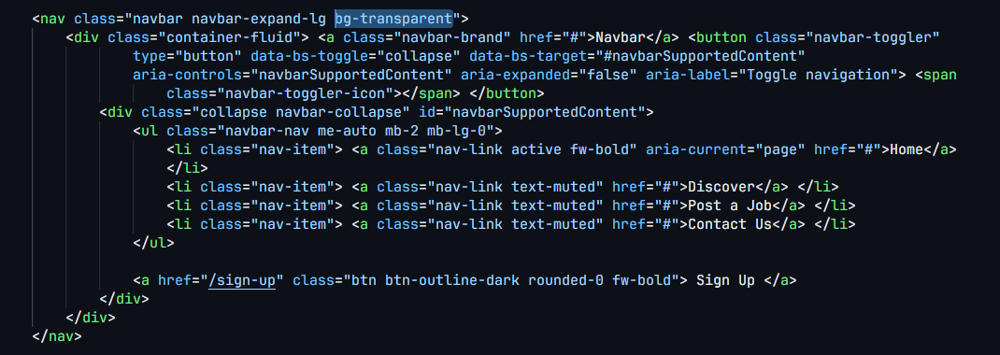
	
12. Sekarang kita akan menengahkan list navbarnya dengan menggunakan class `m-auto`

sebelum
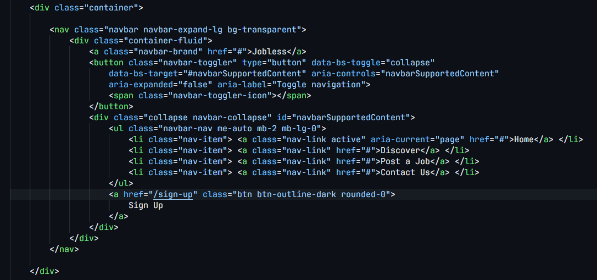
sesudah

13. Hasilnya akan seperti ini:
	
14. Sekarang kita akan implementasikan komponen hero section, tuliskan kode berikut.
```html
<section id="hero"></section>
```
15. dapat kita lihat pada komponen hero terdapat text dan tombol posisinya ditengah, nah disini kita bisa menggunakan grid system bootstrap agar dapat mengatur posisinya.
```html
<div class="row h-100 justify-content-center align-items-center text-center"> <div class="col-12"> <h1 class="fw-bold">Get Connected to the Best Remote <br />Jobs in Your Field </h1> <p class="text-muted">Discover a wide range of remote opportunities on our platform and<br />take control of your career</p> </div> </div>
```
*Keterangan*:
	1.  ==`row`== digunakan untuk mengatur tata letak konten dalam satu baris. Class ini menambahkan beberapa stil ke tata letak konten, seperti mengatur margin dan padding untuk konten yang berada di sisi.
	2.  ==`h-100`== adalah class Bootstrap yang digunakan untuk mengatur tinggi konten dalam sebuah halaman web. Class ini menambahkan stil yang memastikan konten berada pada tinggi penuh dari bagian atas ke bawah.d
	3.  ==`justify-content-center`== adalah class Bootstrap yang digunakan untuk mengatur posisinya konten di tengah bagian horizontal.
	4. class ==`align-items-center`== adalah class Bootstrap yang digunakan untuk mengatur posisinya konten di tengah bagian vertikal.
	5. class ==`text-center`== adalah class Bootstrap yang digunakan untuk mengatur posisi teks di tengah bagian konten.
	6. class ==`col-12`== adalah class Bootstrap yang digunakan untuk mengatur lebar konten. Class ini menambahkan stil yang memastikan konten berada pada lebar penuh dari bagian atas ke bawah.

16. Hasilnya akan seperti ini:
	
17. Disini text nya hanya ke tengah secara horizontal, agar dapat ke tengah secara vertikal perlu kita atur tinggi pada hero sectionnya dengan external style
```html
<style> #hero { height: 85vh; } </style>
```
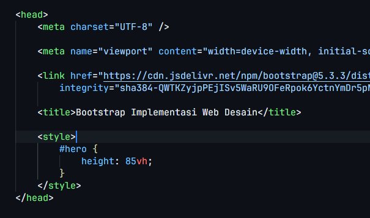
*Keterangan*:
	 ini mengatur tinggi dari elemen yang memiliki ID `hero` menjadi 85% dari tinggi viewport (viewport height).

18. Hasilnya akan seperti ini:
	
19. Sekarang kita akan implementasikan komponen button nya, dapat kita lihat pada desainnya terdapat dua button sejajar secara horizontal, maka kita perlu memakai flexbox yang disediakan oleh bootstrap.
```html
<div class="d-flex gap-4 justify-content-center align-items-center"> <a href="#" class="">Explore Remote Jobs</a> <a href="#" class="">How it works?</a> </div>
```
*Keterangan*:
	1. ==`d-flex`==  digunakan untuk mengatur tata letak konten dalam satu baris. Class ini menambahkan stil yang memastikan konten berada pada satu baris dan tidak berpindah ke baris baru.
	2. ==`gap-4`==  digunakan untuk mengatur jarak antara konten dalam satu baris. Class ini menambahkan stil yang membuat jarak antara konten berada 4 unit.
	3. ==`justify-content-center`== digunakan untuk mengatur posisinya konten di tengah bagian horizontal.
	4. ==`align-items-center`== digunakan untuk mengatur posisinya konten di tengah bagian vertikal.


20. Selanjutnya kita perlu beri space dari setiap buttonnya, dan beri warna pada button sebelah kiri
```html
<div class="d-flex gap-4 justify-content-center align-items-center"> <a href="#" class="p-2 px-3 text-decoration-none bg-primary rounded-5 text-white shadow-sm ">Explore Remote Jobs</a> <a href="#" class="p-2 px-3 text-primary rounded-5 fw-semibold">How it works?</a> </div>
```
*Keterangan*:
	1.  ==`p-2`== digunakan untuk mengatur padding pada tautan. Class ini menambahkan stil yang membuat padding pada tautan berada 0.5 unit pada sisi atas dan bawah, serta 0.75 unit pada sisi kiri dan kanan.
	2. ==`px-3`== digunakan untuk mengatur padding pada tautan. Class ini menambahkan stil yang membuat padding pada tautan berada 0.75 unit pada sisi kiri dan kanan.
	3. ==`text-decoration-none`== digunakan untuk mengatur dekorasi teks pada tautan. Class ini menghilangkan dekorasi garis bawah yang biasanya muncul pada tautan.
	4. ==`bg-primary`== digunakan untuk mengatur warna latar belakang pada tautan. Class ini menambahkan stil yang membuat latar belakang tautan berwarna hitam.
	5.  ==`rounded-5`== digunakan untuk mengatur bentuk tautan. Class ini menambahkan stil yang membuat bentuk tautan berbentuk lingkaran dengan jari-jari 5 unit.
	6. ==`text-white`== digunakan untuk mengatur warna teks pada tautan. Class ini menambahkan stil yang membuat warna teks tautan berwarna putih.
	7. ==`shadow-sm`== digunakan untuk mengatur gaya bagian atas tautan. Class ini menambahkan stil yang membuat bagian atas tautan berwarna abu-abu dengan efek shadow.
	8. ==`fw-semibold`== digunakan untuk mengatur font teks dengan berat font yang semibold.
	9. ==`text-primary`== digunakan untuk mengatur warna teks pada tautan. Class ini menambahkan stil yang membuat warna teks tautan berwarna hitam.


21. Sekarang kita akan mengganti background body nya
```html
<style> body { background-color: #F6FAFF; background-image: linear-gradient(90deg, #0500FF 0%, #F8FB76 35%, #4EFF75 64%, #00FFD1 100%); background-blend-mode: overlay; } </style>
```
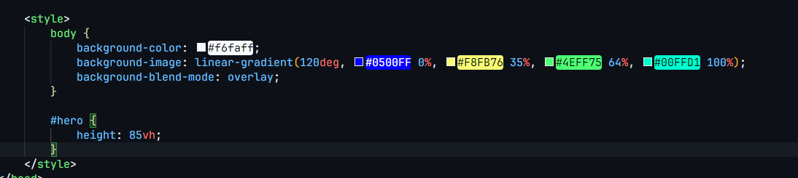
22. Hasilnya akan seperti ini:
	
# Best Practices dan Tips
## Gunakan Grid Sistem:
Manfaatkan grid sistem Bootstrap untuk mengatur tata letak (layout) situs Anda dengan baik. Gunakan kelas-kelas seperti `container`, `row`, dan `col` untuk membagi konten Anda menjadi bagian-bagian yang sesuai.
## Gunakan Komponen Bootstrap:
Manfaatkan komponen-komponen yang disediakan oleh Bootstrap seperti navbar, card, form, dll. Komponen-komponen ini sudah dirancang dan diuji untuk memastikan konsistensi dan fungsionalitas yang baik.
## Uji pada Berbagai Browser:
Pastikan situs Anda berfungsi dengan baik di berbagai browser, termasuk versi lama dan baru, dengan melakukan pengujian silang browser.

# Pengenalan Responsive Web Design
Responsive web design atau desain web responsif adalah sebuah teknik atau metode bagi web designer untuk membuat suatu layout website yang dapat menyesuaikan diri sesuai dengan ukuran layar pengguna. Baik dari ukuran huruf, user interface, gambar dan tata letak akan menyesuaikan dengan lebar layar dan resolusi device yang digunakan. 
Selain dapat memengaruhi apa yang ditampilkan pada perangkat tertentu, ini juga untuk meningkatkan kenyamanan pengguna dalam mengunjungi suatu website.

# Mengapa perlu CSS Responsive?
Pernahkah Anda mengunjungi situs web di smartphone Anda dan halaman webnya berantakan atau teksnya terlalu kecil untuk dibaca? Ini artinya situs web tersebut belum responsif. Dengan memakai css responsif maka web kita memungkinkan tampil optimal di berbagai perangkat, mulai dari desktop, laptop, tablet, hingga smartphone. Berikut alasan beberapa alasan mengapa css responsif penting: 
- **Tampilan yang Bagus di Semua Perangkat**
	CSS responsif memungkinkan tampilan situs web beradaptasi dengan baik terhadap berbagai perangkat dan ukuran layar, sehingga pengguna akan memiliki pengalaman yang konsisten dan optimal, baik mereka mengakses situs melalui desktop, tablet, atau ponsel.
- **Mudah Diakses**
	Situs yang responsif bisa diakses dengan mudah oleh lebih banyak orang, termasuk yang menggunakan ponsel untuk browsing.
- **Interaksi yang Lebih Baik**
	Situs yang responsif cenderung membuat orang merasa lebih nyaman dan lebih mudah berinteraksi. Ini bisa meningkatkan kemungkinan orang melakukan hal-hal seperti membeli produk atau menghubungi Anda.
# Teknik Dasar CSS Responsif
## Konsep Dasar
- **Grid System**: Menggunakan grid system dalam CSS untuk mempermudah penataan elemen pada halaman web.
- **Flexbox**: Memahami penggunaan flexbox untuk menata elemen secara responsif.
## Media Query
Media query adalah fitur CSS yang memungkinkan Anda menargetkan perangkat dan ukuran layar yang berbeda dengan aturan CSS yang spesifik. Hal ini sangat penting untuk membuat website yang responsif, yaitu website yang dapat menyesuaikan tata letak dan desainnya secara otomatis agar terlihat optimal di semua perangkat, mulai dari desktop, laptop, tablet, hingga smartphone.
### Cara Kerja Media Query
Media query menggunakan aturan `@media` untuk menargetkan perangkat dan ukuran layar yang berbeda. Aturan ini terdiri dari dua bagian:
- **Media type:** Menentukan jenis perangkat yang ingin Anda targetkan, seperti `screen` (untuk desktop, laptop, tablet, dan smartphone) atau `print` (untuk printer).
- **Media feature:** Menentukan karakteristik perangkat yang ingin Anda targetkan, seperti `max-width` (lebar layar maksimum), `min-width` (lebar layar minimum), `device-width` (lebar perangkat), dan `orientation` (orientasi perangkat).
### Breakpoints
Breakpoints adalah titik-titik di mana tata letak halaman web akan berubah. Breakpoints biasanya ditentukan berdasarkan lebar layar perangkat.

- **320px:** Lebar minimum untuk smartphone.
- **768px:** Lebar minimum untuk tablet.
- **1024px:** Lebar minimum untuk laptop.
- **1200px:** Lebar minimum untuk desktop.

```css
@media screen and (max-width: 768px) {
  /* Aturan CSS untuk perangkat mobile */
  body {
    font-size: 16px;
  }
  .container {
    width: 100%;
  }
}
```
## Unit Relatif
Unit relatif adalah unit yang digunakan dalam CSS untuk menentukan ukuran elemen secara proporsional. Berbeda dengan unit absolut seperti piksel dan sentimeter, unit relatif tidak memiliki nilai tetap dan dapat berubah tergantung pada konteksnya.
### Keuntungan
- **Fleksibilitas:** Unit relatif memungkinkan Anda membuat website yang responsif dan dapat menyesuaikan dengan berbagai ukuran layar dan perangkat.
- **Kemudahan Penggunaan:** Unit relatif lebih mudah digunakan untuk menentukan ukuran elemen yang proporsional dan konsisten di seluruh website.
- **Pemeliharaan:** Website yang menggunakan unit relatif lebih mudah dipelihara dan diubah karena ukuran elemen akan menyesuaikan secara otomatis.
### Jenis-jenis Unit Relatif:
- **em:** Ukuran font elemen induk
- **rem:** Ukuran font elemen root (biasanya elemen `<html>`)
- **vw:** Lebar viewport (layar perangkat pengguna)
- **vh:** Tinggi viewport (layar perangkat pengguna)
- **vmin:** Nilai terkecil antara vw dan vh
- **vmax:** Nilai terbesar antara vw dan vh
## Viewport Meta Tag
Viewport meta tag adalah sebuah elemen HTML yang memberitahu browser web bagaimana cara menampilkan website Anda pada perangkat pengguna. Tag ini sangat penting untuk website responsif, yaitu website yang dapat menyesuaikan tata letak dan desainnya secara otomatis agar terlihat optimal di semua perangkat, mulai dari desktop, laptop, tablet, hingga smartphone.

```html
<meta name="viewport" content="width=device-width, initial-scale=1.0">
```

- **width=device-width:** Menentukan lebar awal website agar sama dengan lebar perangkat pengguna.
- **initial-scale=1.0:** Mengatur skala awal website menjadi 100%.
# Best Practices
## Gunakan Mobile-First
Saat mendesain website, mulailah dengan mempertimbangkan tampilan website pada perangkat mobile. Hal ini akan membantu Anda membuat website yang lebih ringkas dan mudah digunakan di semua perangkat.

# Implementasi CSS Responsif
## Sebelum Responsif

## Sesudah Responsif
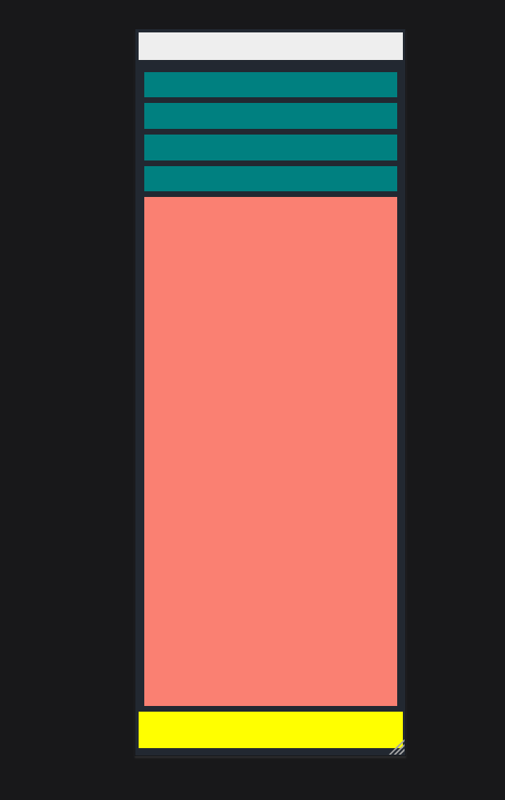
## Kode
### HTML
```html
<!DOCTYPE html>
<html>
  <head>
    <link rel="stylesheet" href="style.css" />
    <meta name="viewport" content="width=device-width, initial-scale=1" />
    <title>CSS Responsif</title>
  </head>
  <body>
    <header></header>
    <section class="container">
      <div class="list">
        <div class="item"></div>
        <div class="item"></div>
        <div class="item"></div>
        <div class="item"></div>
      </div>
      <aside></aside>
    </section>
    <footer></footer>
  </body>
</html>
```
### CSS
```css
body {
  background-color: #222831;
  color: white;
}

header {
  width: 100%;
  height: 77px;
  background-color: #EEEEEE;
}

.container {
  display: flex;
  justify-content: space-between;
}
.item {
  width: 250px;
  height: 70px;
  background-color: teal;
  margin: 1em 0;
}

aside {
  width: 300px;
  height: 70vh;
  background-color: salmon;
}

footer {
  width: 100%;
  height: 100px;
  background-color: yellow;
}

@media screen and (max-width: 768px) {
  .container {
    padding: 1rem;
    flex-direction: column;
  }
  .item {
    width: 100%;
  }
  aside {
    width: 100%;
  }
}
```
### Penjelasan Singkat
```css
body {
  background-color: #222831;
  color: white;
}
```
- `body`: Ini adalah elemen HTML yang menandakan seluruh konten halaman web.
- `background-color: #222831`: Ini mengatur warna latar belakang dari elemen "body" menjadi warna gelap dengan kode warna #222831 (hampir hitam).
- `color: white`: Ini mengatur warna teks di dalam elemen "body" menjadi putih.

```css
header {
  width: 100%;
  height: 77px;
  background-color: #EEEEEE;
}
```
- `header`:  elemen HTML yang menandakan bagian atas halaman web.
- `width: 100%`: membuat lebar elemen "header" sejajar dengan lebar area yang mengandungnya, yang mungkin adalah lebar jendela browser atau lebar elemen induk lainnya. Dengan memberikan nilai 100%, elemen "header" akan merentang ke seluruh lebar area tersebut.
- `height: 77px`: menetapkan tinggi elemen "header" menjadi 77 piksel. Jadi, meskipun lebarnya mengikuti lebar area induknya (100%), tingginya tetap diberikan secara spesifik dengan 77 piksel. Ini bertujuan untuk memastikan bahwa tinggi header tetap konsisten meskipun konten di dalamnya berubah.
- `background-color: #EEEEEE` : Ini mengatur warna latar belakang dari elemen "header" menjadi abu-abu muda dengan kode warna # EEEEEE.

```css
.container {
  display: flex;
  justify-content: space-between;
}
```
- `.container`: Ini adalah kelas CSS yang digunakan untuk menargetkan elemen HTML dengan kelas "container".
- `display: flex`: membuat elemen dengan kelas "container" menggunakan model tata letak flexbox.
- `justify-content: space-between`: Ini mengatur jarak antara elemen-elemen di dalam flexbox container agar rata di sepanjang sumbu utama (biasanya sumbu horizontal), dengan menjaga jarak yang sama antara elemen-elemen dan meletakkan mereka pada posisi ujung container.

```css
.item {
  width: 250px;
  height: 70px;
  background-color: teal;
  margin: 1em 0;
}
```
- `.item`: Ini adalah sebuah selektor CSS yang memilih elemen dengan kelas "item".
- `width: 250px`: Ini mengatur lebar elemen menjadi 250 piksel.
- `height: 70px;`: Ini mengatur tinggi elemen menjadi 70 piksel.
- `background-color: teal;`: Ini mengatur warna latar belakang elemen menjadi warna teal.
- `margin: 1em 0;`: Ini mengatur jarak antara elemen dengan elemen lainnya, dengan 1 em (ukuran relatif terhadap font-size) pada bagian atas dan bawah, dan 0 pada bagian kanan dan kiri.

```css
aside {
  width: 300px;
  height: 70vh;
  background-color: salmon;
}
```
- `aside`: Ini adalah sebuah elemen HTML yang biasanya digunakan untuk menunjukkan konten tambahan di samping konten utama.
- `width: 300px;`: Ini mengatur lebar elemen "aside" menjadi 300 piksel.
- `height: 70vh;`: Ini mengatur tinggi elemen "aside" menjadi 70% dari tinggi viewport.
- `background-color: salmon;`: Ini mengatur warna latar belakang elemen "aside" menjadi warna salmon.

```css
footer {
  width: 100%;
  height: 100px;
  background-color: yellow;
}
```
- `footer`: Ini adalah sebuah elemen HTML yang biasanya digunakan untuk menampilkan informasi tambahan di bagian bawah halaman web.
- `width: 100%;`: Ini mengatur lebar elemen "footer" agar mengisi seluruh lebar dari parent element (biasanya body atau container lainnya).
- `height: 100px;`: Ini mengatur tinggi elemen "footer" menjadi 100 piksel.
- `background-color: yellow;`: Ini mengatur warna latar belakang elemen "footer" menjadi warna kuning.

```css
@media screen and (max-width: 768px) {
  .container {
    padding: 1rem;
    flex-direction: column;
  }
  .item {
    width: 100%;
  }
  aside {
    width: 100%;
  }
}
```
- `@media screen and (max-width: 768px)`: Ini adalah aturan media query yang diterapkan ketika lebar layar kurang dari atau sama dengan 768 piksel.
- `.container`: Mengatur tampilan untuk elemen dengan kelas "container" ketika media query aktif.
    - `padding: 1rem;`: Memberikan padding sebesar 1 rem di sekitar elemen "container".
    - `flex-direction: column;`: Mengubah arah penataan elemen menjadi vertikal (kolom), sehingga elemen akan ditata dari atas ke bawah.
- `.item`: Mengatur tampilan untuk elemen dengan kelas "item" ketika media query aktif.
    - `width: 100%;`: Memberikan lebar sebesar 100% dari parent element, sehingga elemen akan mengisi lebar penuh.
- `aside`: Mengatur tampilan untuk elemen "aside" ketika media query aktif.
    - `width: 100%;`: Memberikan lebar sebesar 100% dari parent element, sehingga elemen "aside" akan mengisi lebar penuh.
