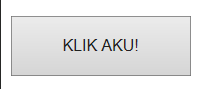
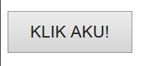

PENGENALAN WEB:
# Sejarah web development
pada tahun 1990-an,seorang insinyur bernama ==tim barnest lee==,menciptakan suatu konsep sistem yang memungkinkan sebuah dokumen bisa terhubung satu sama lain melalui internet,ia juga menciptakan ==protokol http yang jadi jembatan antara server dan client untuk saling mengirim data ==(http yg menjadi perantara).selain itu tim  barnest lee juga menciptakan **WWW**(**word wide web**) dan juga **HTTP** (**HYPER TEXT MARKUP PROTOCOl**),jadi tim batnest lee membuat http untuk transfer datanya,html untuk format datanya,dan www untuk menampilkan datanya.

# HTML
Ibarat manusia,==HTML bagaikan tulang yang mengatur setiap bagian tubuh web site yang dibuat==.setiap halaman di mulai dengan tag  `<html>` dan diakhiri `</html>`.
- setiap halaman harus memiliki `<head>` yang fungsi nya menyimpan informasi yang dibutuhkan web site contoh nya judul yang muncul di tab browser.
- setiap halaman juga harus memiliki`<body>` sebagai tempat komponen-komponen web site dibuat contohnya text,heading,paragraf,dan lain-lain.
```html
<html>
 <head>
 
   <title>ini adalah judul</title>
   
 </head> 
 <body>
 
 <span>ini teksnya</span>
 
 </body>
</html>
```

# CSS
**CSS** (Cascading Style Sheets) dibuat tahun *1994* bertujuan untuk styling web,dapat membuat web terlihat lebih menarik.pengguna,styling juga dapat dilakukan di **HTML** namun dapat membuat halaman kerja menjadi berantakan, sehingga programmer melakukan styling di **CSS**.

.jpeg)

> [! INFO ]-
> Gambar diatas adalah ilustrasi yang menjelaskan perbedaan antara *HTML*,*CSS*, dan *JAVASCRIPT*
> 
> 
> 

DESKRIPSI:

## HTML 
*HTML* bisa diibaratkan sebagai kerangka rumah .jadi *HTML* didefinisian sebagai  kerangka dari sebuah web site,maka dari itu ==fungsi dari *HTML* yang  menjadi struktur dasar web site yang dibuat.==

## CSS
*CSS* bisa diibaratkan sebagai rumah yang di cat dengan tujuan memperindah rumah tersebut.maka dari itu ==fungsi dari *CSS* yaitu sebagai sarana untuk memperindah sebuah web site==.

## JAVASCRIPT 
*JAVASCRIPT* sendiri di gambarkan sebagai rumah yang sudah jadi,dan memiliki kegiatan di dalamnya.==*JAVASCRIPT* berfungsi untuk membuat suatu web site menjadi interaktif dengan penggunanya jika digunakan.==

# HTML
# STRUKUR DASAR HTML

> [!INFO]-
> Berikut adalah contoh program yang akan dijalankan 
> 

```HTML
<!DOCTYPE htm!>

<html>

    <head>

        <title>Youtube.com</title>

    </head>

    <body>

 <p>titik tertinggi jadi tukang cukur yaitu mengikhlaskan dia

 cukur ditempat lain </p>

    </body>

</html>
```

- tag `<!DOCTYPE html>` memberitahukan web browser bahwa dokumen *HTML* adalah versi 5 
- tag pembuka `<html>` menandai awal sebuah dokumen *HTML* sampai dengan tag penutup `</html>`.
- apapun tag yang berada di antara tag pembuka `<body>` sampai dengan tag penutup `</body>` akan tampil di web browser.
# ANATOMI ELEMEN HTML

> [!INFO]-
> Berikut adalah contoh program hyperlink yang akan dijalankan 

```html
<!DOCTYPE htm!>

<html>

    <head>

        <title>Youtube.com</title>

    </head>

    <body>

 <p>buka link untuk dapat pahala </p>

 <a href="https://www.instagram.com">pahala cuy !</a>

    </body>

</html>
```

 Hasil program


> [!INFO]-
> Gambar dibawah ini adalah hasil jika mengklik link tersebut

 

# HEADING:
`<h>` adalah tag yang digunakan untuk menunjukkan sebuah bagian penting pada halaman website dan memiliki enam tingkatan yang berurutan yaitu `<h1>` hingga `<h6>`,dimana semakin tinggi angka pada tag heading maka semakin kecil ukuran heading.

CONTOH PROGRAM:


>[!info]-
>tag `<br` digunakan sebagai fungsi membuat baris baru
>

HASIL PROGRAM:


>[!note]-
>seperti yang telah dijelaskan tadi, heading dengan tag `<h1>` adalah heading dengan ukuran paling besar dan heading dengan tag `<h6>` adalah heading dengan ukuran paling kecil,dimana semakin angka pada tag maka akan membuat heading semakin mengecil


# TAG:
  - `<a>` adalah tag pembuka.
  - `</a>` adalah tag penutup.
  - `href` adalah sebuah nama atribut
  - `http://www.instagram.com` adalah sebuah nilai dari atribut
  - `<br>`adalah tag yang tidak memerlukan tag penutup 
  - `<p>` adalah tag untuk  membuat paragraf
  - `<b`  adalah tag untuk menebalkan teks
  - `<u>`adalah tag untuk menggaris bawahi teks
  - `<br>` adalah tag untuk membuat baris baru
  
  CONTOH PROGRAM:
  

HASIL PROGRAM:


# LINK:

 -  link adalah ==bagian dari antarmuka yang bisa menghubungkan suatu tujuan atau target==. pada pembuatan web site kita dapat menambahkan sebuah link agar dapat menghubungkan antara halaman web site dengan *link* yang biasa terhubung dengan bagian utama web site tersebut.pada program **HTML** kita dapat menambahkan sebuah *link* agar dapat terhubung dengan platfrom yang ditujukan *link* tersebut.

MENGAKSES LINK PADA PROGRAM HTML:
dimulai dengan tag `<a>` dan diakhiri dengan `</a>` ,dengan adanya tag `<a>` lalu dilanjutkan dengan tag `href` yang berperan sebagai *nama atribut* dan `"https://www.google.com"` sebagai *nilai atribut* dari program link, dan `klik link ini` adalah sebagai *konten/isi tagnya*.
contoh pemanggilan link:
`<a href="https://www.instagram.com">klik link ini</a>

contoh program
```html
<!DOCTYPE htm!>

<html>

    <head>

        <title>Youtube.com</title>

    </head>

    <body>

 <p>buka link untuk dapat pahala </p>

 <a href="https://www.instagram.com">klik link ini</a>

    </body>

</html>

```
 Hasil Program


2. **Atribut Align**
	di tag paragraf juga memiliki beberapa atribut yaitu align atribut ini berfungsi sebagai mengatur perataan teks atau paragraf seperti 
	 align="left" yang dimana  memiliki fungsi untuk megatur teks untuk rata kiri
	 align="right" yang dimana memiliki fungsi untuk mengatur teks utuk rata kanan
	 align="center" yang dimana memiliki fungsi untuk mengatur teks untuk rata tengah
	 align="justify" yang dimana memiliki fungsi untuk  teks untuk rata kiri dan kanan

```html
<doctype htm>
<html>
<head>
<title>bukan web site</title>
<head>
     <body>
                <h3>Belajar Menggunakan Elemen Tag html</h3>
        <p align="left">kiri 
        </p>
        <p align="right">kanan</p>
        <p align="center">tengah</p>
        <p align="justify">kiri kanan</p>
	</body>
</html>
```
HASIL PROGRAM:
.png)

# PENGENALAN CSS

## Percobaan II

##  KODE CSS
```css
        <style>
       p{
            color:red;
            font-family:arial;
       }
        button{
            width: 150px;
            height: 50px;
            
            color: red;
            background-color: black;
            font-size: 20px;
        }
        </style>
```

## font-size
==**FRONT-SIZE**==berfungsi sebagai perintah untuk mengatur ukuran dari  tulisan tersebut,seperti pada contoh berikut menggunakan perintah untuk mengubah ukuran tulisan.
### Before

### After

## Color
==**COLOR**== berfungsi sebagai perintah untuk membuat tulisan menjadi berwarna,seperti pada contoh berikut menggunakan perintah untuk mengubah warna tulisan tersebut.
### Before

### After

## Background-color
==**BACKGROUND - COLOR**== berfungsi sebagai perintah untuk membuat latar belakang tulisan menjadi berwarna,seperti pada contoh berikut menggunakan perintah untuk mengubah latar belakang tulisan.
### Before

### After


