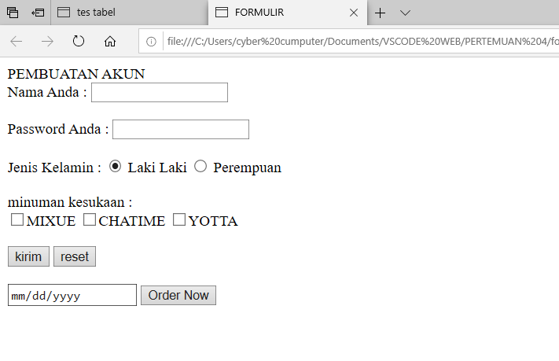

# LIST:
List jika diartikan kedalam bahasa indonesia berarti **daftar**, jadi ==list adalah kumpulan daftar daftar data yang telah terstruktur.== dalam program **HTML** ,terdapat 2 jenis *list* yaitu *list terurut dan list tidak terurut.* 
1. LIST TERURUT 
==LIST terurut adalah daftar data yang berurutan saat dibaca,list tersebut menggunakan angka agar pebaca tau harus membaca daftar tersebut darimana.==pada program **HTML** juga terdapat list,list tersebut harus dimulai dengan tag `<ol>`lalu diakhiri dengan akhiran `</ol>`,kemudian di dalamnya terdapat tag `<li>` dengan berakhiran tag `</li>`. 
contoh program:

HASIL PROGRAM:
.png)

2. LIST TIDAK TERURUT 
==LIST tidak terurut adalah daftar data yang tidak berurutan saat dibaca,karena list tersebut menggunakan simbol dan membuat pembaca tidak tau harus membaca daftar tersebut darimana.==pada program **HTML** juga terdapat list,list tidak berurutan tersebut harus dimulai dengan tag `<ul>`lalu diakhiri dengan akhiran `</ul>`,kemudian di dalamnya terdapat tag `<li>` dengan berakhiran tag `</li>`. 
CONTOH PROGRAM:
.png)
HASIL PROGRAM:

# KOMENTAR:
==komentar adalah suatu penjelasan baris atau bahkan kata yang biasanya dlampirkan pada suatu project==.pada program **HTML** terdapat juga komentar yang gunanya juga sama pada komentar pada umumnya,komentar yang digunakan untuk program **HTML** hanya berfungsi untuk memberi keterangan pada program.


>[!INFO]-
> program yang diblock adalah sebuah contoh penulisan komentar

==komentar berfungsi pada programnya saja,dan tidak bepengaruh pada hasil programnya==.komentar hanya digunakan programming untuk memberikan keterangan pada program yang ia bu
# MULTIMEDIA
## GAMBAR:**
pada program html juga bisa menambahkan gambar,agar web site dapat terlihat lebih menarik,Berikut penjelasan mengenai penambahan gambar.

Penambahan gambar pada *HTML* menggunakan tag `` dimulai dengan tag `` dengan adanya tag `` lalu dilanjutkan dengan tag `src` yang berperan sebagai *nama atribut* dan `"paraikatte.jpg"` sebagai *nilai atribut* dari pemaggilan gambar, dan `width dan height` adalah sebagai *pengatur ukuran dari gambar yang ditambahkan*

.png)

sebelum memasukkan gambar pada program yang dijalankan pada text editor,masukkan dahulu gambar pada folder text editor,agar mudah dipanggil saat memasukkan program.

.png)
HASIL PROGRAM:

.png)

## VIDIO:
sama seperti penambahan gambar,penambahan video dalam *HTML* juga dimulai dengan tag `<video>` dengan adanya tag `<video>` lalu dilanjutkan dengan tag `src` yang berperan sebagai *nama atribut* dan `"TEAICOTO.mp4"` sebagai *nilai atribut* dari pemaggilan video, dan `width dan height` adalah sebagai pengatur ukuran dari video yang ditambahkan.
```HTML
<!DOCTYPE htm!>
<html>
<head>
<title>"ini adalah web site"></title>
</head>
<body>
<p>"contoh video" </p>
<video src="./MEDIA/TEAICOTO.mp4" width="300" height="300"controls autoplay ></video>
</body>
</html>
```
  HASIL PROGRAM:
  .png)
  
## AUDIO:
Dalam *HTML* ada juga tag untuk menambahkan *AUDIO* kedalam web site yang telah dibuat,dengan dimulai dengan tag `<audio>` lalu dilanjutkan dengan tag `src` yang berperan sebagai *nama atribut* dan `"GALAU.mp3"` sebagai *nilai atribut* dari pemaggilan *AUDIO*, dan `width dan height` adalah sebagai pengatur ukuran dari video yang ditambahkan.
```HTML
<!DOCTYPE htm!>
<html>
<head>
    <title>ini web site</title>
</head>
<body>
<p>contoh MEDIA</p>
       <audio src="./MEDIA/GALAU.mp3" controls></audio>
</body>
</html>
```
HASIL PROGRAM:

## IFRAME
pada *HTML* terdapat juga tag `<iframe>` yag berfungsi sebagai tag untuk penambahan tampilan web lain yang bisa diselipkan ke dalam web site yang kita buat tag `<iframe>` fungsinya sama dengan tag penambahan media lainnya. yang dimulai dengan tag `<iframe>` lalu dilanjutkan dengan tag `src` yang berperan sebagai *nama atribut* dan memasukkan link web yang ingin kita masukka seperti `"https://www.smkn7makassar.sch.id/"` sebagai *nilai atribut* dari pemanggilan tampilan web site, dan `width dan height` adalah sebagai pengatur ukuran dari tampilan web site yang ditambahkan.

CONTOH PROGRAM:
```HTML
<!DOCTYPE html>

<html>
<head>
    <title>web site smk 7</title>
</head>
<body>
<p>INI ADALAH WEB SITE SMK 7</p>
       <!-- kode pemanggilan tampilan web-->
       <iframe src=" https://www.smkn7makassar.sch.id/" widht=""600"  heigt="500" controls></audio>
</body>
</html>
```

HASIL PROGRAM:

# TABEL 
pada *HTML* kita juga dapat membuat sebuah tabel,tabel tersebut berfungsi memberikan rangkuman data secara tersusun.
- Tabel dalam HTML didefinisikan dengan tag `<table>
	- setiap baris baru tabel dengan tag  `<tr>`
	- Header (judul) tabel didefinisikan dengan tag `<th>`. Secara default, header tabel memiliki teks tabel dan berada di tengah
	- Data tabel/sel didefinisikan dengan tag `<td>`. Karena sel merupakan bagian terkecil dari tabel maka dari itu tag ini berada di dalam tag `<tr>`.
	- Selain itu, terdapat pula beberapa atribut tabel yang penting untuk di ketahui yaitu;
	- rowspan merupakan atribut HTML yang berfungsi untuk menggabungkan beberapa baris (ke bawah)
	- colspan atau column span merupakan atribut HTML yang berfungsi untuk menggabungkan beberapa kolom (ke samping)
	- width berfungsi untuk mengatur lebar tabel yang nilainya didefinisikan dalam satuan pixel secara default
	- height berfungsi untuk mengatur tinggi tabel yang nilainya didefinisikan dalam satuan pixel secara default.
	- align berfungsi untuk mengatur perataan teks pada tabel. Nilai atribut yang tepat diberikan yaitu left untuk perataan teks ke kiri, right untuk perataan teks ke kanan, dan center untuk perataan teks ke tengah html.
	
	CONTOH PROGRAM:
	```HTML
	
 <table border="3">
    <tr>
        <th rowspan="2">Nama</th>
        <th colspan="2">institusi</th>
    </tr>
    <tr>
        <th>Sekolah</th>
        <th>Karir</th>
    </tr>
    <tr>
        <td>Chairil Abizali</td>
        <td>SMKN 7 Makassar</td>
        <td>DIREKTUR UTAMA PLN</td>
    </tr>
    <tr>
        <td>Fachri Ramadhan</td>
        <td rowspan="2">SMK 7 Makassar</td>
        <td align="center" rowspan="2">PENGACARA</td>
    </tr>
    <tr>
        <td>Rahmat Ramadhan</td>
    </tr>
    <tr>
        <td>Rayhan juli</td>
        <td>SMKN 7 Makassar</td>
        <td>KEPALA DINAS PETERNAKAN</td>
   </table>
   
   ```

HASIL PROGRAM:


# FORM

Elemen `<form>` HTML digunakan untuk mendefinisikan form yang digunakan untuk mengumpulkan inputan dari pengguna website. 
Dengan kata lain tag `<form>` merepresentasikan sebuah "formulir" di mana satu formulir bisa memiliki banyak kolom isian.
 Elemen `<form>`  digunakan untuk menampung macam-macam elemen yang berkaitan dengan sebuah form, seperti text fields, checkbox, radio button, tombol submit, dan banyak lagi yang dapat diedit kemudian ditulis untuk dikirim pada sebuah server untuk selanjutnya diproses guna mendapatkan informasi tertentu dari atau untuk user.
Umumnya, sebuah website selalu memiliki fitur form, contoh paling umum yang sering kita temui adalah seperti form login, form sign up, form komentar di suatu blog/media.
1. Input

Elemen `<input>` adalah elemen form yang paling penting. Elemen `<input>` dapat ditampilkan dalam beberapa cara, tergantung pada nilai atribut type yang digunakan. Berikut adalah beberapa contoh nilai dari atribut type:

- **text** digunakan untuk mengambil isian berupa teks. Contohnya seperti nama.

- **password** digunakan untuk mengambil isian berupa kata sandi atau sesuatu yang bersifat rahasia. Tipe ini akan mengubah semua karakter yang diketikkan ke dalam karakter bulat.
- **radio** digunakan sebagai kolom isian bertipe pilihan yang menawarkan beberapa opsi kepada user namun tetapi hanya satu opsi saja yang boleh dipilih. Contohnya seperti jenis kelamin atau agama.
>[!info]
Perlu diperhatikan bahwa untuk penggunaan tipe radio yang berkategori set pilihan yang sama mengharuskan nilai name -nya juga sama.

Opsi default dapat dilakukan dengan menambahkan atribut checked pada elemen opsi yang dijadikan sebagai opsi default.

- **checkbox** digunakan untuk memberikan daftar pilihan dalam satu set opsi. User dapat memilih satu atau bahkan lebih dari satu pilihan pada tipe ini. Hal ini berbeda dengan tipe sebelumnya yaitu *radio* yang hanya memungkinkan user untuk memilih satu pilhan saja. Contoh penggunaan *checkbox* seperti daftar makanan kesukaan, daftar olahraga yang tidak disukai, dan yang semisalnya.
- **number** digunakan untuk membatasi isian user hanya pada karakter numerik saja. Browser akan menambahkan dua buah tombol atas dan bawah untuk mengubah angka isian.

Beberapa atribut untuk tipe *number*:

- **min** - menentukan angka minimal

- **max** - menentukan angka maksimal

- **step** - menentukan kelipatan (nilai yang tidak sesuai kelipatan tidak bisa di-input, dan default dari atribut ini adalah 1)

- **date** digunakan untuk memberikan isian berupa tanggal. Atribut min dan max dapat pula difungsikan pada tipe ini untuk mengatur tanggal minimal dan tanggal maksimal yang diinginkan. Nilai *min* dan *max* tersebut ditulis dengan format: `YYYY-MM-dd

- **file** digunakan untuk memungkinkan pengguna memuat file. Atribut accept juga dapat disisipkan pada tipe ini dengan maksud untuk mengatur file apa saja yang boleh di-upload. Beberapa contoh value dari atribut *accept* yaitu:

- `accept="image/png,image/jpg, image/jpeg"` - untuk file gambar seperti *png*, *jpg*, atau *jpeg*.
- `accept-".pdf"` - untuk file pdf.
- `accept=".doc, .docx"` untuk file doc atau docx
- `accept=".ppt, .pptx` - untuk file ppt atau pptx

- **submit** ditampilkan dalam bentuk tombol untuk mengirim data pada `<form>` yang menjadi pembungkusnya. Atribut value digunakan untuk mengisi teks yang ingin ditampilkan pada tombol.

- **reset** berguna untuk mengembalikan state (keadaan) atau data dari suatu form ke nilai awalnya. Jika nilai awal sebuah input adalah kosong, maka ketika direset ia akan kembali kosong. Tapi jika nilai awalnya sudah terisi sesuatu, maka ketika direset datanya akan kembali seperti yang sudah diset sebelumnya.

- **button** berguna untuk membuat inputan berupa sebuah tombol. Tombol ini nantinya bisa difungsikan sesuai dengan keinginan dari pengembang web. 

```html
<!DOCTYPE html>

<html>

    <head>

        <title>FORMULIR</title>

    </head>

  

<body>

    <hi align="center ">PEMBUATAN AKUN</hi>

  

    <form action="">

        <label for="nama"> Nama Anda : </label>

        <input type="text" id="nama" required>

        <br><br>

        <label for="sandi"> Password Anda : </label>

        <input type="password" id="sandi">

        <br><br>

        <label for="jenis kelamin">Jenis Kelamin : </label>

        <input type="radio"checked name="jk">

        <label>Laki Laki</label>

        <input type="radio" name="jk">

        <label>Perempuan</label><br></br>

  

        <label>minuman kesukaan : </label><br>

        <input type="checkbox"name="minum"><label>MIXUE</label>

        <input type="checkbox"name="minum"><label>CHATIME</label>

        <input type="checkbox"name="minum"><label>YOTTA</label><br></br>

  

        <label>

            <input type="submit" value="kirim">

            <input type="reset" value="reset">

        </label><br></br>

        <label>

            <input type="date" accept="YYYY-MM-dd">

        </label>

        <label>

            <input type="button" value="Order Now">

        </label>

    </form>

</body>

</html>
```

HASIL PROGRAM:


# LABEL
- Elemen label memiliki fungsi khusus untuk melabeli sebuah kolom inputan. Ketika screen reader membaca konten halaman HTML, lalu menemukan sebuah inputan, ia akan membaca label yang bersangkutan.
- Fungsi lain dari tag `<label>` adalah ketika kita mengklik label, maka browser akan meletakkan fokus pada kolom isian yang terhubung dengannya. Syarat yang perlu diperhatikan yaitu dengan menghubungkan sebuah `<label>`dan `<input>` dengan atribut `<for>`untuk  `<label>`, dan atribut` <id>` pada  dengan nilai untuk kedua atribut tersebut mesti sama persis.
```html
<!DOCTYPE html>

<html>
    <head>
        <title>FORMULIR</title>
    </head>
<body>
    <hi align="center ">PEMBUATAN AKUN</hi>
    <form>
        <label for="nama"> Nama Anda : </label>
        <input type="text" id="nama" required>
        <br><br>
    </form>
</body>
```

HASIL PROGRAM:

# SELECT
- Elemen `<select>` berguna dalam mendefinisikan sebuah tombol ==dropdown== yang dimana user dapat memilih salah satu dari banyak pilihan. 
- `<aside>` Elemen `<select>` nantinya berperan sebagai kontainer atau pembungkus dari elemen `<option>` yang berperan sebagai daftar pilihan atau opsi `</aside>`
- Elemen `<select>` hampir mirip fungsinya dengan `<input type=”radio">` akan tetapi baiknya elemen`<select> ` digunakan untuk memilih satu pilihan yang terdapat banyak opsi di dalamnya, sedangkan `<input type=”radio">` lebih baiknya untuk digunakan jika  user diarahkan memilih hanya satu pilihan yang opsi pilihannya tidak terlalu banyak. Contoh penggunaan elemen ini seperti memasukkan pilihan berupa asal daerah atau yang semisalnya.Penting untuk diketahui  bahwasanya opsi yang aktif secara default adalah adalah opsi yang pertama. Akan tetapi, kita bisa mengatur opsi mana yang aktif secara default dengan menambahkan atribut selected pada suatu `<option>` yang ingin dijadikan sebagai opsi default.
```HTML
<!DOCTYPE html>

<html>

    <head>

        <title>FORMULIR</title>

    </head>

  

<body>

    <hi align="center ">MAKANAN MAKASSAR</hi><BR></BR>

<select>

    <option>COTOMAKASSAR</option>

    <option>PALLUBASA</option>

    <option>SOP SAUDARA</option>

    <option>PISANG IJO</option>

</select>

  

</body>
```

HASIL PROGRAM:

# TEXT AREA
- Elemen `<textarea>` berguna untuk mengambil inputan user berupa teks yang dapat memuat lebih dari satu baris. Jika dibandingkan dengan elemen `<input>` teks biasa, elemen `<textarea>` memiliki ukuran tinggi yang lebih besar. Element textarea bisa diisi lebih dari satu baris dengan menekan enter. Atribut yang dapat digunakan untuk mengatur kuran dari textarea yaitu rows untuk jumlah baris, sedangkan atribut cols untuk lebarnya.
```html
<!DOCTYPE html>

<html>

    <head>

        <title>textarea</title>

    </head>

    <body>
    
        <label><b>Alamat Pengiriman:</b></label><br>
        <textarea cols="30" rows="5"></textarea>
        
    </body>
</html>
```

HASIL PROGRAM:

# BUTTON
- Elemen `<button>` yang berada di dalam sebuah form akan otomatis dianggap sama fungsinya seperti `<input type="submit">`. Jika ingin membuat tombol biasa yang tidak men-submit `<form>` dapat dilakukan dengan menambahkan `atribut type="button"`.
- Beberapa atribut yang digunakan pada contoh di atas yang perlu untuk diperjelas yaitu sebagai berikut:

```html
<!DOCTYPE html>

<html>

    <head>

        <title>BUTTON</title>

    </head>

    <body>

        <label>TEKAN ORDER UNTUK MEMESAN</label><BR>

        <input type="button" value="Order">

    </body>

</html>
```

HASIL PROGRAM:
