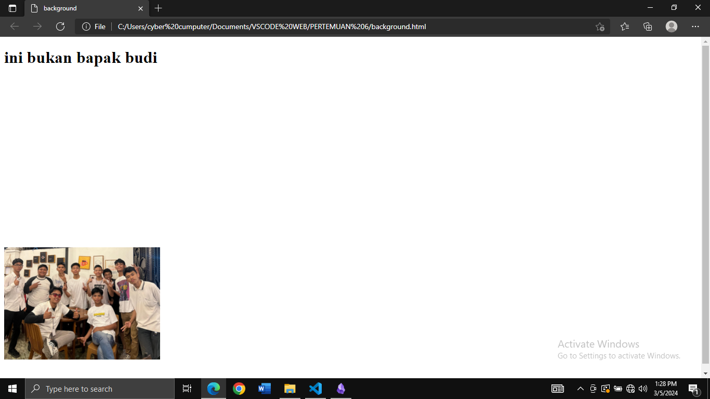
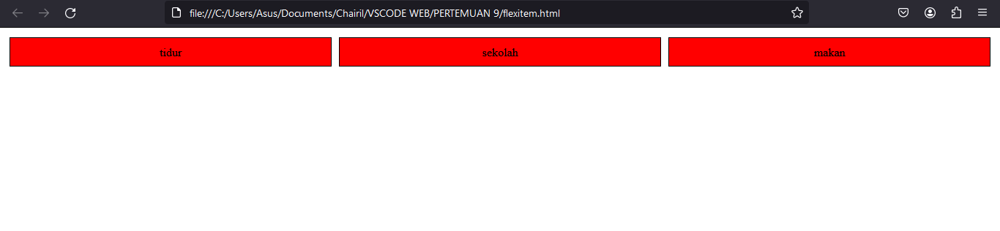

# CARA PEMANGGILAN CSS

CSS adalah bahasa pemrograman yang digunakan untuk mengatur tampilan dan gaya dari elemen-elemen HTML pada halaman web. Dengan CSS, Anda dapat mengontrol warna, ukuran, jenis huruf, posisi, dan banyak lagi atribut-atribut lainnya dari elemen-elemen HTML.
cara pemanggilan CSS terbagi menjad 3 yaitu secara INLINE,INTERNAL,dan EKSTERNAL.

BERIKUT ADALAH CONTOH PEMANGGILAN CSS:
## INLINE 
Selector css inline adalah perintah style yang di deklarasikan lansung pada tag yang ingin di modifikasi. Ini berguna untuk menerapkan gaya langsung pada elemen tanpa harus membuat file CSS terpisah.

CONTOH PROGRAM:
```html
<!DOCTYPE html>
<html lang="en">
<head>
    <title>selector</title>
</head>
<body>
    <p style="color: red;">belajar css </p>
    </body>
</html>
```

HASIL PROGRAM:


## INTERNAL
cara pemanggilan internal adalah perintah style yang di deklarasikan lansung pada file yang sama dengan program. Ini berguna untuk menerapkan gaya langsung pada file yang sama tapi tidak pada tag tanpa harus membuat file CSS terpisah.

CONTOH PROGRAM:
```HTML
<!DOCTYPE html>
<html>
    <head>
        <title>Pengenalan css</title>
    </head>
    <body>
        <style>
       p{
            color:red;
           font-family:arial;
         }
        </style>
        <p>WELCOME CSS</p>
    </body>
</html>
```
 
HASIL PROGRAM:


## EKSTERNAL 

cara pemanggilan EKSTERNAL adalah perintah style yang di deklarasikan pada file yang berbeda dengan program,pemanggilan tersebut dipanggil menggunakan tag `<link>`.Pada pemanggilan EKSTERNAL program CSS menggunakan file berbeda dengan HTML tetapi pemanggilan program CSS tersebut menggunakan program HTML.

BERIKUT ADALAH CONTOH PEMANGGILAN FILE CSS MENGGUNAKAN TAG `<LINK>` DARI FILE HTML:
```HTML
<!DOCTYPE html>
<html lang="en">
<head>
    <title>selector</title>
    <link rel="stylesheet" href="style.css" >
</head>
<body>
    <p style="background-color: aqua;">belajar css </p>
    <p class="merah">ini warna merah</p>
    <p id="rpl">ini warna merah</p>    
    
    </body>
</html>
```

BERIKUT ADALAH CONTOH FILE CSS YANG DIPANGGIL OLEH TAG `<LINK>`
```CSS
.p{
    color: darkgreen;
}
 .merah{
    color: red;
 }
 #rpl{
    font-size: 50px;
    color: green;
 }
```

HASIL PROGRAM:

# SELECTOR CSS
Selector CSS adalah cara untuk menentukan elemen-elemen HTML yang akan diberi gaya atau ditentukan perilakunya dalam sebuah dokumen web menggunakan CSS (Cascading Style Sheets). Selector CSS memungkinkan pengguna untuk menargetkan elemen-elemen HTML berdasarkan tag, class, ID.

## SELECTOR ELEMEN
Selector Elemen adalah metode dalam CSS (Cascading Style Sheets) yang digunakan untuk memilih elemen HTML tertentu pada sebuah halaman web. Dengan menggunakan selector elemen, Anda dapat mengatur gaya atau tampilan dari elemen-elemen tersebut, seperti warna, ukuran, font, dan lainnya

## SELECTOR CLASS
Selector class adalah sebuah konsep dalam pemrograman yang digunakan untuk mengidentifikasi dan memilih elemen-elemen tertentu di dalam sebuah dokumen HTML atau dalam sebuah struktur pemrograman lainnya, seperti CSS. Dengan menggunakan selector class, pengembang dapat menargetkan dan melakukan styling terhadap elemen-elemen tersebut sesuai dengan kebutuhan aplikasi atau desain yang diinginkan.

## SELECTOR ID  
Selector ID adalah sebuah metode dalam CSS (Cascading Style Sheets) yang digunakan untuk mengidentifikasi dan merujuk ke elemen HTML berdasarkan ID unik yang diberikan pada elemen tersebut. Selector ID ditandai dengan tanda pagar (#) diikuti dengan nama ID dari elemen yang ingin dipilih. Ini memungkinkan pengguna untuk secara spesifik menggaya atau menerapkan gaya tertentu pada elemen dengan ID tersebut.

CONTOH PROGRAM HTML :
```HTML
<!DOCTYPE html>
<html lang="en">
<head>
    <title>selector</title>
    <link rel="stylesheet" href="style.css" >
</head>
<body>

	<!-- contoh selector elemen--> 
    <p style="background-color: aqua;">belajar css </p>
    
    <!-- contoh selector class -->
    <p class="merah">ini warna merah</p>
    <p class="blue">ini warna biru</p>
    <p class="yellow">ini warna kuning</p>

	<!-- contoh selector id--> 
    <p id="rpl">ini warna hijau <label class="bukan">bukan hijau</label></p>
    </body>
</html>
```

CONTOH PROGRAM CSS:
```CSS
.p{
    color: darkgreen;
    font-size: 50px;
}
.merah{
    color: red;
    font-size: 50px;
 }
.blue{
    color: blue;
    font-size: 50px;
 }
.yellow{
    color: yellow;
    font-size: 50px;
 }
 #rpl{
    font-size: 50px;
    color: green;
 }
 .bukan{
    color: aqua;
    font-size: 50px;
 }
```

HASIL PROGRAM:


# PROPERTY DASAR CSS

## TEXT 
Di CSS (Cascading Style Sheets), "**text**" properti yang mengontrol tampilan dan penataan teks di dalam elemen HTML. 
 jenis-jeni text:
- **text-align**: Properti ini mengatur penataan horizontal teks di dalam elemen, seperti "left" (kiri), "right" (kanan), "center" (tengah), atau "justify" (rata kanan dan kiri).
- **text-decoration**: Properti ini mengatur dekorasi teks, seperti "none" (tanpa dekorasi), "underline" (garis bawah), "overline" (garis di atas), "line-through" (garis tengah), atau kombinasi dari yang lain.
- **text-transform**: Properti ini mengatur transformasi teks, seperti "uppercase" (huruf besar), "lowercase" (huruf kecil), "capitalize" (huruf pertama setiap kata menjadi huruf besar), atau "none" (tanpa transformasi). 
- **text-indent**: properti CSS yang digunakan untuk menentukan jarak indentasi dari awal baris pertama dari sebuah teks di dalam sebuah elemen. Anda dapat mengatur indentasi teks baik dalam nilai positif (untuk membuat indentasi ke kanan) maupun negatif (untuk membuat teks keluar dari margin kiri).
- **Letter-spacing:** properti yang digunakan untuk menentukan jarak antara karakter dalam teks. Properti ini memungkinkan Anda untuk mengatur spasi antara huruf dalam sebuah elemen HTML.
- **line-height**: adalah properti dalam CSS yang mengontrol tinggi dari baris teks dalam sebuah elemen. Properti ini menentukan jarak vertikal antara garis dasar dari satu baris teks dengan garis dasar dari baris teks di atasnya dalam sebuah elemen.

berikut adalah program pemanggilan css :
```html
<!DOCTYPE html>
<html>
<head>
    <link rel="stylesheet" href="property_dasar.css">
    <title>Box Model</title>
</head>
<body>
  <p class="p">Klik</p>
</body>
</html>
```

berikut adalah program css:
```css
.p{
    text-align: center;
    text-decoration: underline;
    text-transform: capitalize;
    text-indent: 200px;
    letter-spacing: 20px;
    line-height: 200px;
    word-spacing: 200px;
}
```

HASIL PROGRAM:


## FONT
Font dalam CSS mengatur pada bagian jenis huruf atau gaya pengetikan yang digunakan untuk menampilkan teks di halaman web. Font dapat mengubah tampilan dan model dari teks yang ditampilkan, memberikan elemen desain yang penting dalam pengalaman pengguna.

jenis jenis font:
- FONT-SIZE
`Font-size `pada CSS adalah properti yang digunakan untuk menentukan ukuran teks pada elemen HTML. Properti ini memungkinkan pengembang web untuk mengatur ukuran teks sehingga sesuai dengan desain dan tata letak halaman web.
- FONT-FAMILY
 `font-family` adalah properti yang digunakan untuk menentukan jenis font yang akan digunakan untuk teks pada suatu elemen HTML. Properti ini memungkinkan Anda untuk menentukan beberapa jenis font dalam urutan yang diinginkan.
 - FONT-STYLE
`font-style` adalah properti yang digunakan untuk mengatur gaya huruf (font style) dari teks di dalam elemen HTML. Properti ini dapat memiliki tiga nilai utama:

1. `normal`: Ini adalah nilai default. Teks ditampilkan dengan gaya huruf standar.
    
2. `italic`: Teks ditampilkan dalam gaya miring (italic). Ini sering digunakan untuk menekankan teks.
    
3. `oblique`: Ini mirip dengan `italic`, tetapi dalam beberapa font, jika tidak ada gaya miring yang tersedia, gaya oblique akan merotasi teks secara miring.

- FONT-WEIGHT:
`font-weight` adalah sebuah properti yang digunakan untuk menentukan ketebalan atau tebalnya teks pada elemen HTML. Properti ini dapat memiliki nilai yang berbeda-beda, seperti normal, bold, lighter, atau sebuah angka yang menentukan ketebalan relatif.

berikut adalah program pemanggilan  css:
```HTML
<!DOCTYPE html>

<html>

<head>

    <link rel="stylesheet" href="property_dasar.css">
    <title>PROPERTY DASAR</title>
</head>
<body>
  <p class="p">ini bapak budi</p>
</body>
</html>
```


berikut adalah program css:
```css
.p{
 font-size: 200px;
 font-family: Arial, Helvetica, sans-serif;
 font-weight: 600;
 font-style:italic;
}
```

hasil program:


## background 

`background` adalah properti yang digunakan untuk mengatur latar belakang suatu elemen HTML. Properti ini memungkinkan Anda untuk menentukan gambar latar belakang, warna latar belakang, posisi, ulang, dan efek latar belakang lainnya.

- BACKGROUND-IMAGE 
`background-image` adalah sebuah properti dalam CSS yang digunakan untuk menentukan gambar latar belakang dari sebuah elemen HTML. Properti ini memungkinkan pengguna untuk menambahkan gambar sebagai latar belakang dari elemen tersebut.

contoh program:
```css
.background{
    background-image: url(./MEDIA/paraikatte.jpg);
}
```

HASIL PROGRAM:


## BACKGROUND-SIZE

`Background size` adalah properti CSS yang digunakan untuk mengontrol ukuran gambar latar belakang (background) dari sebuah elemen HTML. Properti ini memungkinkan Anda untuk menentukan seberapa besar atau kecil gambar latar belakang tersebut akan ditampilkan dalam elemen tersebut.

1. **`Cover`**: Membuat gambar latar belakang ditampilkan dengan ukuran yang cukup besar sehingga seluruh area elemen tercakup oleh gambar, meskipun mungkin gambar harus dipotong agar sesuai dengan proporsi elemen tersebut.
    
2. `**Contain**`: Membuat gambar latar belakang ditampilkan secara proporsional dan seutuhnya di dalam elemen, tanpa adanya potongan. Ini berarti bahwa seluruh gambar akan terlihat, tetapi mungkin akan ada ruang kosong di sekitarnya.
    
3. `**Length atau Percentage**`: Anda juga bisa menentukan ukuran gambar latar belakang dengan menggunakan panjang (length) atau persentase (percentage). Misalnya, Anda bisa menentukan lebar dan tinggi gambar latar belakang dengan menggunakan nilai piksel (px), sentimeter (cm), atau persentase dari ukuran elemen tersebut.

CONTOH PROGRAM:
```css
.background{
    background-image: url(./MEDIA/paraikatte.jpg);
    background-size:200px;
}
```

HASIL PROGRAM:
	


### BACKGROUND-REPEAT
`background-repeat` adalah properti CSS yang digunakan untuk menentukan apakah gambar latar belakang (background image) pada suatu elemen HTML akan diulang atau tidak ketika gambar tersebut tidak cukup besar untuk mengisi seluruh area elemen tersebut.

Nilai-nilai yang umum digunakan untuk properti background repeat adalah:
1. **repeat**: Gambar latar belakang akan diulang secara horizontal dan vertikal sampai seluruh area elemen tercakup.
2. **repeat-x**: Gambar latar belakang hanya akan diulang secara horizontal.
3. **repeat-y**: Gambar latar belakang hanya akan diulang secara vertikal.
4. **no-repeat**: Gambar latar belakang tidak akan diulang. Gambar akan ditampilkan hanya sekali, tanpa pengulangan.  
CONTOH PROGRAM:
```css
.background {
    width: 600px;
    height: 600px;
    background-size: 50px;
    background-image: url(./MEDIA/paraikatte.jpg);  
    background-repeat: repeat;
}
```

HASIL PROGRAM:
	
### BACKGROUND-ATTACHMENT
`Background attachment` adalah properti CSS yang menentukan apakah gambar latar belakang (background image) sebuah elemen HTML akan bergulir bersamaan dengan konten halaman atau tetap diam ketika halaman digulir. Properti ini memiliki dua nilai utama:
1. **scroll**: Gambar latar belakang akan bergulir bersamaan dengan konten saat halaman digulir. Ini adalah nilai defaultnya.
2. **fixed**: Gambar latar belakang akan tetap diam relatif terhadap jendela penampilan saat halaman digulir. Artinya, saat Anda menggulir halaman, gambar latar belakang akan tetap pada posisi yang sama di jendela penampilan.
```css
.background {
    width: 600px;
    height: 600px;
    background-size: 100%;
    background-image: url(./MEDIA/paraikatte.jpg);  
    background-position: 0% 100%;
    background-repeat: repeat;
    background-attachment: fixed;
}
```

HASIL PROGRAM:

### BACKGROUND POSITION
`Background position` adalah properti CSS yang mengatur posisi sebuah gambar latar belakang di dalam sebuah elemen. Properti ini memungkinkan Anda untuk menentukan posisi awal dari gambar latar belakang yang diterapkan ke elemen HTML.

- Kata kunci, seperti `top`, `bottom`, `left`, `right`, atau `center`, yang mengatur posisi gambar latar belakang sesuai dengan tepi atau titik tengah elemen.

CONTOH PROGRAM:
```css
.background {
    width: 600px;
    height: 600px;
    background-size: 300px;
    background-image: url(./MEDIA/paraikatte.jpg);  
    background-position: 0% 100%;
}
```

HASIL PROGRAM:


# BOX MODEL
  
**Box model** adalah salah satu konsep fundamental dalam desain web menggunakan CSS (Cascading Style Sheets). Box model menggambarkan bagaimana elemen HTML 
## BORDER 
  
**Border** dalam model kotak CSS adalah garis yang mengelilingi konten, padding, dan margin dari sebuah elemen HTML. Border ini dapat didefinisikan dalam gaya, warna, dan ketebalan tertentu.

- BORDER-WIDTH
**Border width** dalam model kotak CSS merujuk pada ukuran lebar dari garis tepi (border) yang mengelilingi sebuah elemen HTML. Border width bisa diatur menggunakan properti CSS `border-width`. Properti ini dapat memiliki nilai tunggal atau empat nilai untuk menentukan lebar garis tepi pada setiap sisi elemen (atas, kanan, bawah, kiri) secara terpisah

- BORDER-COLOR
**Border color** dalam model kotak (box model) CSS merujuk pada warna yang diterapkan pada batas (border) dari sebuah elemen HTML. Dalam CSS, Anda dapat menentukan warna yang berbeda untuk batas-batas sebuah elemen menggunakan properti `border-color`.

- BORDER-STYLE 
  
**Border style** dalam model kotak CSS mengacu pada properti yang mengatur gaya garis yang mengelilingi suatu elemen HTML. Garis tersebut berada di sekitar padding dan konten elemen tersebut. Properti ini memungkinkan Anda untuk menentukan jenis, warna, dan lebar garis.

Beberapa nilai umum untuk properti border-style adalah:
1. **solid**: Membuat garis solid.
2. **dashed**: Membuat garis dengan putus-putus.
3. **dotted**: Membuat garis dengan titik-titik.
4. **double**: Membuat garis ganda.
5. **groove**: Membuat garis seperti cekung.
6. **ridge**: Membuat garis seperti tonjolan.
7. **inset**: Membuat garis seperti terkubur.
8. **outset**: Membuat garis seperti menonjol

- BORDER-RASIO:
**Border ratirsuatu elemen HTML dengan lebar atau tinggi border-nya. Lebih spesifik, border ratio adalah rasio antara lebar (atau tinggi) dari elemen tersebut dan lebar (atau tinggi) border-nya.

CONTOH PROGRAM:
```css
.button{
	border-width: 10px;
    border-color: black;
    border-style: solid;
    border-radius: 20px 0px 20px 0px;
}
```

HASIL PROGRAM:


# TANTANGAN II

CONTOH PROGRAM :
```HTML
	<!DOCTYPE html>
<html>
<head>
 <title>box model</title>
 <style>
    .background {
    background-color: purple;
}
.span {
    font-size: 80px;
    color: white;
    margin-top: 135px;
    margin: left 10px;
} 
.font{
    font-family: Arial, Helvetica, sans-serif;
}
.foto {
    display: block;
    height: 400px;
    width: 400px;
    margin-left: 700px;
    margin-top: -200px;
    border-width: 10px;
    border-color: white;
    border-style: solid;
    border-radius: 1000px;
}
.button {
    display:block;
    width: 160px;
    height: 85px;
    background-color: transparent;
    border-width: 3px;
    border-color: rgb(247, 43, 43);
    color:rgb(247, 43, 43) ;
    border-style: solid;
    margin-top: -150px;
    margin-left: 400px;
    padding-top:10px;
    padding-bottom: 20px;
    padding-right: 40px;
    padding-left: 40px;
} 
 </style>

</head>
<body class="background">
     <Span>
        <div class="span">
         Selamat datang
         </div>
    </Span><br>
    <span class="span">di <b class="font">Web PANTAI !</b></span>
    
    <button class="button">Klik Disini</button>
</body>
</html>
```

HASIL:


## PADDING
  
**Padding** dalam model kotak CSS mengacu pada ruang tambahan di sekitar konten elemen HTML di dalam kotak tersebut. Jadi, secara sederhana, padding adalah ruang kosong di sekitar konten dalam sebuah elemen HTML yang memisahkan konten dari batas elemen.

```css
.button{
   padding-left: 20px;
   padding-bottom: 10px;
   padding-top: 40px;
   padding-right:50px;
}
```


HASIL PROGRAM:


## MARGIN

 **Margin** pada CSS merujuk pada ruang kosong di sekitar elemen HTML. Lebar margin menentukan jarak antara tepi luar elemen dan elemen-elemen lain di sekitarnya. Dengan kata lain, margin adalah spasi di sekitar elemen HTML yang memisahkan elemen tersebut dari elemen-elemen lain di sekitarnya.
Terdapat empat properti utama yang dapat Anda gunakan untuk mengontrol margin dalam CSS:
1. `margin-top`: Menentukan margin di bagian atas elemen.
2. `margin-right`: Menentukan margin di bagian kanan elemen.
3. `margin-bottom`: Menentukan margin di bagian bawah elemen.
4. `margin-left`: Menentukan margin di bagian kiri elemen.

CONTOH PROGRAM:
```css
.button{
 margin-left: 50px;
 margin-top: 50px;
}
```

HASIL PROGRAM:


## TEXT-TRANSFROM

`text-transform` digunakan untuk mengontrol tampilan teks dalam sebuah elemen HTML. Properti ini memungkinkan Anda untuk melakukan transformasi pada teks, seperti mengubah semua huruf menjadi huruf besar (uppercase), mengubah semua huruf menjadi huruf kecil (lowercase), atau membuat teks pertama dari setiap kata menjadi huruf besar (capitalize).

Berikut adalah nilai-nilai yang dapat digunakan untuk properti `text-transform`:

1. `none`: Teks tidak mengalami transformasi apa pun.
2. `capitalize`: Membuat teks pertama dari setiap kata menjadi huruf besar.
3. `uppercase`: Mengubah semua huruf menjadi huruf besar.
4. `lowercase`: Mengubah semua huruf menjadi huruf kecil.

CONTOH PROGRAM:
```CSS
.uppercase-text {
    text-transform: uppercase;
}
```

HASIL:
==**BEFORE**==

==**AFTER**==


## TEXT INDENT
`Text-indent` adalah properti CSS yang digunakan untuk mengatur jarak atau indentasi awal dari paragraf atau teks di dalam sebuah elemen

Berikut adalah nilai-nilai yang dapat digunakan untuk properti `text-transform`:

1. `lettersapcing`: Letter spacing adalah properti CSS yang digunakan untuk mengatur jarak antara karakter (huruf) dalam teks.
2. `wordspacing`: Word spacing adalah properti CSS yang digunakan untuk mengatur jarak antara kata-kata dalam teks
3. `lineheight`: Line height adalah properti CSS yang digunakan untuk mengatur tinggi baris di dalam sebuah elemen teks.

CONTOH PROGRAM:
```CSS
.halaman-1{
       letter-spacing : 100 px ;
       }
```

HASIL:


# PSEUDO CLASSES

##  HOVER

==**Hover**== adalah sebuah pseudo-class yang digunakan untuk menentukan gaya atau tata letak elemen ketika pengguna mengarahkan kursor mouse ke atas elemen tersebut.

Ketika pengguna mengarahkan kursor mouse ke atas elemen yang memiliki pseudo-class `:hover`, gaya atau tata letak elemen tersebut dapat berubah sesuai dengan aturan yang ditentukan dalam CSS. Ini memungkinkan untuk membuat efek interaktif yang dinamis, seperti perubahan warna, perbesaran, pergeseran, atau efek lainnya ketika pengguna berinteraksi dengan elemen.

CONTOH PROGRAM:
```CSS
.makan{
    width: 100px;
    height: 50px;
    background-color:red;
    color:black;
    cursor: pointer;
  }
  /* Efek hover */
  .makan:hover {
  height: 100px;
  width: 250px;
  background-color: black;
  border: 5px dashed white;
  color: red;
  border-style: solid;
  font-size: 30px;
  font-weight: bold;
  cursor: pointer;
  transform: scale(0.5);
  transition: all 1s ease-in-out;
  }
```

HASIL:
==**BEFORE**==

==**AFTER**==


## Active
`button:active`: adalah pseudo-class selector yang menargetkan tombol (`button`) ketika tombol tersebut sedang dalam keadaan "active", atau tombol sedang ditekan. 
`color: yellow;`: Properti memberikan warna kuning pada teks ketika tombol sedang active atau tombol sedang ditekan. 

CONTOH PROGRAM :
```CSS
button:active{
  color: yellow ;
}
```

HASIL:
==**BEFORE**==


==**AFTER**==


## TRANSITION

+ `Transition`:  untuk mengatur pertunjukan perubahan, mengubah penampilan elemen dari satu keadaan ke keadaan lain, memberikan dinamika visual yang menarik dalam desain web Anda.
+ `Transition-delay`: properti ini memberikan momen kejutan atau antisipasi sebelum perubahan yang dijanjikan terjadi, menambah dramatisasi pada tampilan elemen.
- `Transition-duration`: menentukan lamanya waktu ketika elemen berubah, memungkinkan Anda untuk mengatur seberapa lama penonton (pengguna) menikmati perubahan tersebut.
- `Transition-property`: menentukan apa yang akan berubah, seperti warna, ukuran, atau posisi, menciptakan efek transisi yang beragam dan menarik.
- `Transition-timing-function`:  properti ini mengatur ritme perubahan, menentukan apakah transisi akan bergerak dengan lembut dan halus seperti aliran air, atau tiba-tiba dan dramatis seperti petir yang menyambar.

CONTOH PROGRAM:
```CSS
   button:hover{
   
  padding: 10px 20px;
  font-size: 16px;
  border: none;
  background-color: #007bff;
  color: white;
  cursor: pointer;
  transition: background-color 0.3s ease;
  }
```

HASIL:
**==BEFORE==**


==**AFTER**==


## TRANSFROM

- `transform: scale(0.5);`= Mengubah ukuran elemen menjadi setengah dari ukuran aslinya.
- `transform: scalex(0.5);`= Hanya mengubah skala elemen secara horizontal menjadi setengah dari ukuran aslinya.
- `transform: rotate(45deg);`= Memutar elemen sebesar 45 derajat searah jarum jam.
- `transform: skewX(-25deg);`= Membengkokkan elemen secara horizontal sebesar -25 derajat (ke arah kiri).
- `transform: skew(25deg,5deg);`= Membengkokkan elemen sebesar 25 derajat secara horizontal (ke kanan) dan 5 derajat secara vertikal (ke atas).
- `transform: translate(50px,52px);`= Menggeser elemen sebesar 50 piksel ke kanan dan 52 piksel ke bawah.
- `transform: matrix(0.7,-0.5,0.5,0.4,0.5,0.7);`= Menggambarkan transformasi menggunakan matriks 2D den. 

CONTOH PROGRAM:
```CSS
    button:active{
  transform:matrix(0.7,-0.5,0.5,0.4,0.5,0.7);
  height: 300px;
  width: 200px;
  }
```

HASIL:


# TANTANGAN III

CONTOH PROGRAM:
```HTML
<!DOCTYPE html>
<html>
<head>
    <title>Belajar CSS3</title>

   <style>
    body{
  background-color:purple;
}
.main-container {
    background-color: purple;
}
.box-item-1{
    font-size: 50px;
    color: white;
    Margin-top:10px;
    }
.box-item-2{
   font-size: 50px;
    color: white;
    margin-top:10px;
} 
.button:hover {
    background-color: purple;
    margin-left:200px;
    padding-left:29px;
    padding-top:20px;
    padding-bottom:25px;
    padding-right:29px;
    color: orangered;
    border-color:orangered;
    margin-top: 50px;
    margin-right:60px;
    margin-bottom:90px;
   transition:all 2s ease-in;
}
 button:active{
  transform:rotate(45deg);
}  
img{
    width: 250px;
    height: 250px;
    border-radius: 200px;
    border-color: white;
    border-style: solid;
    margin-left: 400px;
    margin-top: -400px;
}
   </style>
</head>
<body class="main-container">
    <div class="hero-container">
    <div class="box-container">
    <h1 class="item box-item-1">
    Selamat Datang
    </h1>
    <h1 class="item box-item-2">
    di <b>Web Panlos</b>
    </h1>
    <div class="item box-item-3">
    <button class="button">Klik ini kanda</button>
    </div>
    </div>
    <div class="box-container">
    <div class="item-box">
    
    </div>
        </div>
    </div>
</body>
</html>
```

HASIL:
==**before**==


==**after**==


# Flexbox 
## Flex Container
### Display Flex
`display: flex`, kita dapat dengan mudah mengatur tata letak elemen-elemen di dalamnya dengan properti-properti seperti `flex-direction`, `justify-content`, `align-items`, dan lain-lain.

### Kesimpulan
`display: flex`, kita dapat dengan mudah mengatur tata letak elemen-elemen di dalamnya menggunakan properti-properti seperti `flex-direction`, `justify-content`, `align-items`, dan properti lainnya yang terkait dengan model tata letak flexbox.

1.==**Flex-Direction**==
- `flex-direction: column;`: Mengatur tata letak dari flex container menjadi vertikal, sehingga flex items diatur dari atas ke bawah.
- `flex-direction: column-reverse;`: Mengatur tata letak dari flex container menjadi vertikal terbalik, sehingga flex items diatur dari bawah ke atas.
- `flex-direction: row;`: Mengatur tata letak dari flex container menjadi horizontal, sehingga flex items diatur dari kiri ke kanan.
- `flex-direction: row-reverse;`: Mengatur tata letak dari flex container menjadi horizontal terbalik, sehingga flex items diatur dari kanan ke kiri.

```css
.container {
  display: flex;
}

.item {
  flex: 1;
  background-color: #007bff;
  color: white;
  text-align: center;
  padding: 10px;
  margin: 5px;
}

```

HASIL:


2. ==**Align-Items**==
- `align-items: center;`: Flex items akan diatur di tengah-tengah sumbu silang dari flex container.
- `align-items: flex-start;`: Flex items akan diatur pada awal sumbu silang dari flex container.
- `align-items: flex-end;`: Flex items akan diatur pada akhir sumbu silang dari flex container.
- `align-items: baseline;`: Flex items akan diatur sedemikian rupa sehingga garis dasar dari teks pada masing-masing item berada pada level yang sama.
- `align-items: stretch;`: Flex items akan diperpanjang untuk mencapai tinggi maksimal flex container, mengisi ruang kosong di sepanjang sumbu silang.

CONTOH PROGAM:
```CSs
    .container {
  display: flex;
  height: 200px;
  border: 2px solid;
  align-items: center;
  background-color: black;
}
.item {
  background-color:red;
  color:white;
  padding: 10px;
  margin: 5px;
  text-align: center;
}
```

HASIL:


3. ==**JUSTIFY-CONTENT**==
 - `justify-content: flex-start;`: Mengatur fleks item ditempatkan di bagian awal (mulai) dari sumbu utama flex container.
- `justify-content: flex-end;`: Mengatur fleks item ditempatkan di bagian akhir (akhir) dari sumbu utama flex container.
- `justify-content: center;`: Mengatur fleks item ditempatkan di tengah-tengah sumbu utama flex container.
- `justify-content: space-around;`: Mengatur fleks item didistribusikan secara merata di sekitar sumbu utama flex container, dengan ruang yang sama di antara mereka.
- `justify-content: space-between;`: Mengatur fleks item didistribusikan secara merata di sepanjang sumbu utama flex container, dengan ruang yang sama di antara fleks item pertama dan terakhir, tetapi tidak ada ruang di antara fleks item yang berdekatan.

CONTOH PROGRAM:
```CSS
.container {
  display: flex;
  width: 100%; /* Memberikan lebar penuh pada kontainer */
  height: 200px; /* Memberikan tinggi pada kontainer untuk visualisasi */
  border: 2px solid #ccc; /* Garis tepi untuk memvisualisasikan ukuran kontainer */
  justify-content: space-between; /* Menyamakan item secara merata dalam kontainer */
} 
.item {
  background-color: black;
  color:red;
  padding: 10px;
  text-align: center;
  flex: 1; /* Memberikan fleksibilitas yang sama pada setiap item */
}
```

HASIL:


## FLEX ITEMS 

==**Flex items**== adalah elemen-elemen di dalam sebuah flex container yang diatur oleh model tata letak fleksibel (flexbox). Mereka memiliki properti dan perilaku yang memungkinkan untuk disusun secara dinamis dalam arah tertentu (baris atau kolom), dengan fleksibilitas dalam ukuran, urutan, dan penempatan.
Jenis-jenis flex items yang umum meliputi:
1. **Flex Container**: Elemen yang memiliki konten yang disusun menggunakan flexbox. Ini adalah parent dari semua flex items.
2. **Flex Item**: Elemen yang langsung diatur oleh flexbox dan menjadi bagian dari tata letak fleksibel. Setiap elemen di dalam flex container dianggap sebagai flex item.
3. **Main Axis**: Sumbu utama dari flex container yang mengatur arah utama susunan flex items. Ini bisa berupa sumbu horizontal (disebut "row" dalam CSS) atau vertikal (disebut "column" dalam CSS).
4. **Cross Axis**: Sumbu tegak lurus terhadap main axis, yang memengaruhi penempatan flex items di sepanjang sumbu tersebut.
5. **Flex Basis**: Properti yang menentukan ukuran awal dari flex item sebelum fleksibilitasnya diperhitungkan, berdasarkan pada width atau height, tergantung pada arah main axis.

CONTOH PROGRAM:
```css
.container {
  display: flex; /* Membuat container menjadi flex container */
}
.item {
  flex: 1; /* Memberikan fleksibilitas yang sama pada semua item */
  background-color: red;
  border: 1px solid;
  padding: 10px;
  margin: 5px;
  text-align:center; 
}
```

HASIL:


# TANTANGAN IV

CONTOH PROGRAM:
```HTML
<!DOCTYPE html>
<html>
<head>
    <title>flex box</title>
    <style>
        body{
        background-color:purple;
      }
      .main-container {
        margin-top: 90px;
        margin-left:90px ;
          background-color: purple;
      }
      .box-item-1{
          font-size: 50px;
          color: white;
          margin-top:10px;
          }
      .box-item-2{
         font-size: 50px;
          color: white;
          margin-top:10px;
      }
      img{
          width: 250px;
          height: 250px;
          border-radius: 200px;
          border-color: white;
          border-style: solid;
          margin-left: 600px;
          margin-top: -400px;
      }
    </style>
</head>
<body class="main-container">
    <div class="hero-container">
    <div class="box-container">
    <h1 class="item box-item-1">Selamat Datang</h1>
    <h1 class="item box-item-2">di <b>Web PARAIKATTE</b></h1>
    <div class="item box-item-3">
    <button class="button">Klik disini</button>
    </div>
    </div>
    <div class="box-container">
    <div class="item-box">
    
    </div>
    </div>
    </div>
</body>
</html>
```

HASIL:


## POSITION

1. POSITION Static: Ini adalah posisi default untuk setiap elemen. Elemen-elemen dengan posisi statis ditempatkan berdasarkan alur dokumen biasa.
    
2. POSITION Relative: Elemen-elemen dengan posisi relatif ditempatkan relatif terhadap posisi normalnya. Dengan properti "top", "right", "bottom", dan "left", kita bisa menggeser elemen ini dari posisi normalnya.
    
3. POSITION Absolute: Elemen-elemen dengan posisi absolut ditempatkan relatif terhadap kontainer terdekat yang memiliki posisi non-static (biasanya orang menggunakan elemen yang berposisi relatif). Ini memungkinkan kita untuk menempatkan elemen secara tepat di dalam elemen induknya.
    
4. POSITION Fixed: Elemen-elemen dengan posisi tetap akan tetap berada di lokasi yang ditentukan dalam tata letak halaman, bahkan saat pengguna menggulir halaman. Ini sering digunakan untuk elemen yang ingin ditampilkan secara konsisten, seperti menu navigasi.
    
5. POSITION Sticky: Elemen-elemen dengan posisi "sticky" berperilaku seperti kombinasi antara "relative" dan "fixed". Mereka berperilaku seperti "relative" sampai mereka mencapai posisi tertentu dalam jendela browser, di mana mereka menjadi "fixed".

```CSS
    .container {
        position: relative; /* Memberikan posisi relatif sebagai referensi bagi elemen-elemen di dalamnya */
        width: 300px;
        height: 200px;
        border: 2px solid black;
    }
    .box {
        width: 100px;
        height: 100px;
        background-color: skyblue;
        border: 2px solid blue;
    }
    .absolute-box {
        position: absolute; /* Memberikan posisi absolut */
        top: 50px; /* Jarak dari atas */
        left: 50px; /* Jarak dari kiri */
        background-color: lightcoral;
    }
    .fixed-box {
        position: fixed; /* Memberikan posisi tetap */
        top: 20px;
        right: 20px;
        background-color: lightgreen;
    }
    .sticky-box {
        position: sticky; /* Memberikan posisi sticky */
        top: 10px;
        background-color: lightsalmon;
    }
```

HASIL:


>[! INFO ]-
> -Kita memiliki sebuah div dengan kelas "container" sebagai referensi relatif.
> -Di dalamnya, ada empat div dengan kelas "box". Satu di antaranya memiliki kelas tambahan sesuai dengan jenis position yang berbeda.
-"absolute-box" diberi posisi absolut relatif terhadap "container".
-"fixed-box" diberi posisi tetap di sudut kanan atas layar.
-"sticky-box" diberi posisi sticky, akan tetap di atas saat di-scroll.

# TANTANGAN IV

CONTOH PROGRAM:
```HTML
<!DOCTYPE html>
<html lang="en">
<head>
    <meta charset="UTF-8">
    <meta http-equiv="X-UA-Compatible" content="IE=edge">
    <meta name="viewport" content="width=device-width, initial-scale=1.0">
    <title>Tantangan Position</title>
<style>
  body{
 background-color: aqua;
         }        
        .container {
         display: flex;
         flex-direction: column;
         background-color: white;
         height: 458px;
         width: 300px;
         border-radius: 10px;
         margin-top: 150px;
         margin-left: 720px;
         position: relative;
        }      
         .item1{
          background-color: red;
          height: 250px;
          width: 300px;
          border-radius: 10px 10px 0px 0px;
         }        
         img {
           width:100%;
           height:100%;
           border-radius: 5px 5px 0px 0px;
         }      
         .item2{
           background-color: whitesmoke;
           height: 175px;
           width: 300px;
           justify-content: center;
           align-items: center;
         }        
         .text1 {
          font-size: small;
          font-family: Arial, Helvetica, sans-serif;
          margin-left: 20px;
         }        
         .text2 {
         font-size: 20px;
         font-family: Arial, Helvetica, sans-serif;
         margin-left: 20px;
         }        
         .text3 {
             margin-left: 20px;
           font-family: Arial, Helvetica, sans-serif;
           font-size: medium;
           margin-bottom: 30px;
         }        
         .item3 {
             display: flex;
             flex-direction: row;
             padding: 2px;
            background-color: gainsboro;
            border-radius: 0px 0px 5px 5px;
            width: 296px;
            justify-content: space-between;
            font-weight: bold;
         }        
         .text4 {
        margin-left: 20px;
        font-family: Arial, Helvetica, sans-serif;
         }        
         button {
             width: 62px;
               height: 55px;
               background-color: transparent;
               border: none;
               border-radius: 100px 100px 100px 100px;
               position: fixed;
               background-repeat: no-repeat;
               top: 350px;
                 right: 520px;        
         }        
         .like img {
          border-radius: 100% ;
          margin-right: 110px;
          margin-left: 190px;
          position: absolute;
         }        
         .item3 img {
          height: 30px;
          width: 30px;
          border-radius: 100% 100% ;
          align-items: center;
          justify-items: center;
          margin-right: 25px;
          margin-top: 10px;
         }
</style>
</head>
<body>
 <div class="container">
   <div class="item1">
    
   </div>
   <div class="item2">
     <p class="text1">Sabtu,13 Desember 2023</p>
     <h4 class="text2">Pantai Losari</h4>
     <p class="text3">Tempat terbaik mengeluarkan isi hati didengarkan oleh hembusan angin dan suara ombak </p>
   </div>
   <div class="item3">
   <p class="text4">Baca Selengkapnya</p>
    
   </div>
     <div class="like">
      <button>
      
</button>
 </div>
 </div>
</body>
</html>
```

HASIL:


