# Web Dinamis
Pembagian jenis website di bagi menjadi dua bagian yaitu web statis dan web dinamis. Web statis adalah website yang hanya menampilkan sebuah output dari hasil program yang telah diketikkan sedangkan web dinamis adalah sebuah web yang lebih kompleks karena kita dapat memberi input pada website dan website tersebut dapat menyimpan data yang kita masukkan.
# PHP
PHP (Hypertext Preprocessor) adalah sebuah bahasa skrip dengan fungsi umum yang terutama digunakan untuk pengembangan sebuah web dinamis ataupun website interaktif. PHP juga mendukung banyak jenis database seperti MySQL, PostgreSQL dan Oracle sehingga pembangunan sebuah website dapat menjadi lebih kompleks.

## Penggunaan Awal PHP 
untuk penggunaan awal PHP kita harus mengikuti langkah langkah berikut.
1) Buka XAMPP lalu aktifkan "MySQL" dan "Apache". 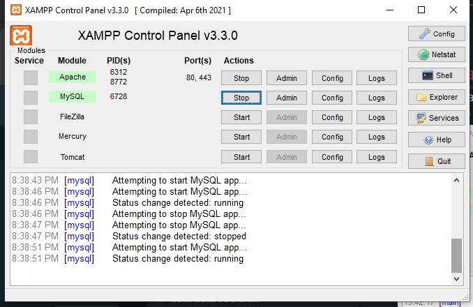
2) Masuk ke directory C.
   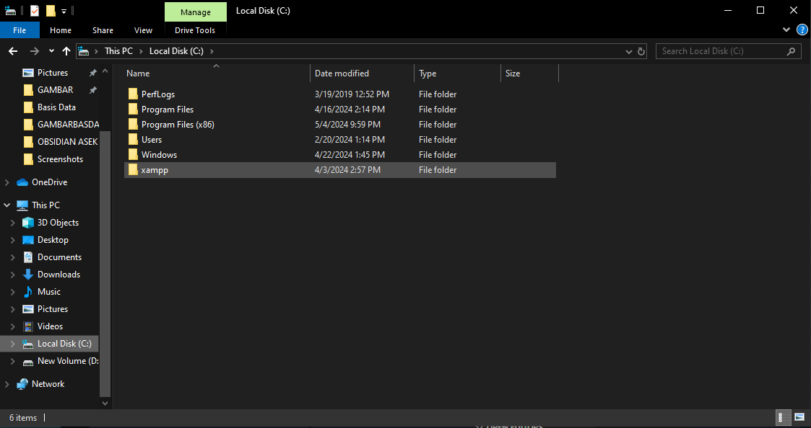
3) Buka folder XAMPP lalu buka folder Htdocs.
4) 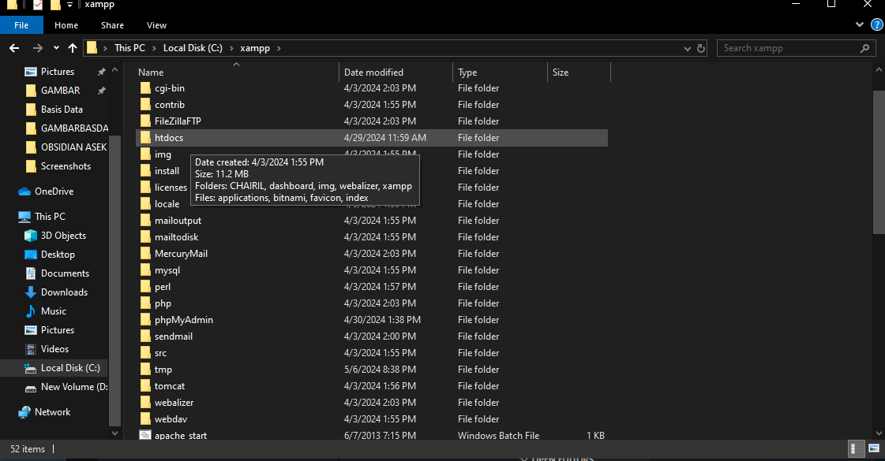
5)  Buat folder dengan nama yang anda inginkan.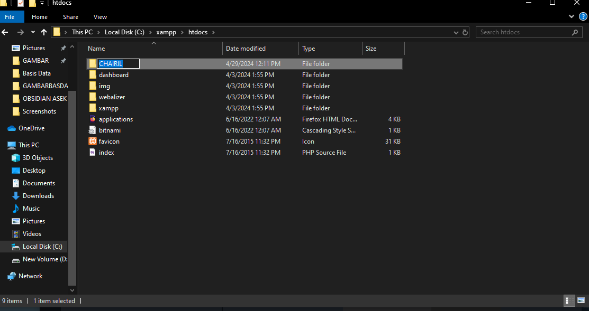
6) Kemudian Masuk ke VSCode lalu klik "Open Folder" dan pilih folder yang telah anda buat.
7) Buat Dokumen dengan ekstensi "php".
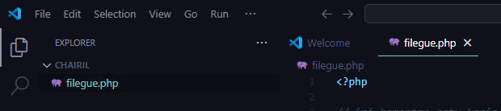

8) Anda telah dapat membuat kode program PHP sesuai dengan keinginan anda.
## Echo & Komentar 
Dalam php kita dapat mengetikkan sesuatu dengan kode "echo" dan menambahkan membuat sebuah komentar di penulisan program untuk penjelasan lebih lanjutnya akan dijelaskan di bawah ini. Dalam penulisan echo terdapat dua cara yaitu dengan kutip satu dan kutip dua, lalu untuk perbedaan antara keduanya akan dijelaskan lebih lanjut dibawah ini.
### Echo kutip satu
Untuk penulisan echo dengan kutip satu hasil yang akan tampil adalah seluruh yang ditulis di dalamnya dan hasil yang tampil akan terhitung sebagai string, walaupun ada variable yang dituliskan di dalam kutipnya. Untuk contoh programnya akan seperti berikut.
```php
echo 'Jumlah meja di kelas '. $meja . ' buah';
    echo "<br>";
```

### Echo kutip dua
Sedangkan untuk penulisan kutip dua akan menampilkan hasil dari variable maupun konstanta walapaun ditulis dalam kutip yang sama. Dan untuk contoh cara pengaplikasiannya akan seperti dibawah ini.
```php
echo "Shalat dlu, nabilang pak $wali_kelas dan $ketua_kelas";
    echo "<br>";
    echo "Kalau tidak, diracca' sama ketua gang $ketua_geng";
    echo "<br>";
```


### Komentar
Lalu untuk membuat komentar dalam kode program kita, kita dapat menggunakan dua cara yaitu // untuk komentar satu baris dan /* */ untuk komentar multi baris. Dan untuk cara pengaplikasiaanya akan seperti di bawah ini
```php
//ini komentar satu baris
/*ini komentar
multi baris*/
```

## Variable & Konstanta
Dalam php kita dapat menuliskan variable dan kosntanta untuk menyimpan data yang akan digunakan kedepannya, untuk penjelasan lebih lanjutnya akan dijelaskan di bawah ini.
### Variable
Untuk penulisan variable kita awali dengan $ lalu menuliskan nama variable nya dan menuliskan nilainya setelahnya dan di akhiri dengan ;. Untuk contoh penggunaannya akan seperti di bawah ini.
```php
$meja = 30;
    $tk_kelas = "XI";
    $ketua_kelas = "July";
    $wali_kelas = "Saleh";
```

### Konstanta
Untuk konstanta berfungsi untuk menetapkan nilai dari sebuah data agar tidak dapat di ganti ganti kedepannya. Lalu untuk cara penulisannya akan seperti di bawah ini.
```php
const KEPSEK = "Herwelis";
define ('kelas', 'RPL 1');
```

## Operator
Dalam php juga kita dapat menggunakan operator operator untuk memudahkan penulisan program kita, Untuk penjelasan lebih jelasnya akan di dijelaskan di bawah.
### Aritmatika
Operator aritmatika berfungsi untuk penjumlah, pengurangan, perkalian dan pembagian. Untuk penggunaan akan seperti di bawah ini.
PROGRAM:
```PHP
<?php
$uangfachri = 10;
$uanghayril= 5;

// Penambahan
$hasilTambah = $uangfachri + $uanghayril;
echo "Penambahan uang fachri dan hayril: $uangfachri + $uanghayril = $hasilTambah <br>";

// Pengurangan
$hasilKurang = $uangfachri - $uanghayril;
echo "Pengurangan uang fachri dan hayril: $uangfachri - $uanghayril = $hasilKurang <br>";

// Perkalian
$hasilKali = $uangfachri * $uanghayril;
echo "Perkalian uang fachri dan hayril: $uangfachri * $uanghayril = $uanghayril <br>";

// Pembagian
$hasilBagi = $uangfachri / $uanghayril;
echo "Pembagian uang fachri dan hayril: $uangfachri / $uanghayril = $hasilBagi <br>";
```
HASIL:
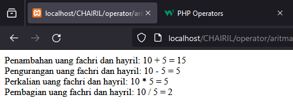
ANALISIS:
1. **Inisialisasi Variabel**: Variabel `$uangfachri` dan `$uanghayril` diinisialisasi dengan nilai masing-masing 10 dan 5.
2. **Penambahan**: Dilakukan penambahan antara nilai `$uangfachri` dan `$uanghayril`. Hasilnya disimpan dalam variabel `$hasilTambah` dan dicetak ke layar menggunakan echo.
3. **Pengurangan**: Dilakukan pengurangan antara nilai `$uangfachri` dan `$uanghayril`. Hasilnya disimpan dalam variabel `$hasilKurang` dan dicetak ke layar menggunakan echo.
4. **Perkalian**: Dilakukan perkalian antara nilai `$uangfachri` dan `$uanghayril`. Hasilnya disimpan dalam variabel `$hasilKali` dan dicetak ke layar menggunakan echo.
5. **Pembagian**: Dilakukan pembagian antara nilai `$uangfachri` dan `$uanghayril`. Hasilnya disimpan dalam variabel `$hasilBagi` dan dicetak ke layar menggunakan echo.
6. Setiap operasi aritmatika beserta hasilnya dicetak ke layar HTML dengan menggunakan tag `<br>` untuk membuat baris baru.

KESIMPULAN:
Program ini membantu memahami cara menggunakan operator aritmatika dasar dalam PHP untuk melakukan perhitungan matematika. Ini merupakan dasar penting dalam pengembangan aplikasi web yang melibatkan manipulasi data numerik.

### Perbandingan
Operator perbandingan atau operator perbandingan digunakan untuk membandingkan 2 operan atau lebih. Pada umumnya Operator perbandingan digunakan pada kondisi if-else sebagai penentu tingkat kesesuaian.
PROGRAM: 
```php
<?php
$a = 5;
$b = 10;
// Operator Perbandingan: == (sama dengan)
if ($a == $b) {
    echo "$a sama dengan $b";
} else {
    echo "$a tidak sama dengan $b";
}
echo "<br>";
// Operator Perbandingan: != (tidak sama dengan)
if ($a != $b) {
    echo "$a tidak sama dengan $b";
} else {
    echo "$a sama dengan $b";
}
echo "<br>";
// Operator Perbandingan: < (kurang dari)
if ($a < $b) {
    echo "$a kurang dari $b";
} else {
    echo "$a tidak kurang dari $b";
}
echo "<br>";
// Operator Perbandingan: > (lebih dari)
if ($a > $b) {
    echo "$a lebih dari $b";
} else {
    echo "$a tidak lebih dari $b";
}
echo "<br>";
// Operator Perbandingan: <= (kurang dari atau sama dengan)
if ($a <= $b) {
    echo "$a kurang dari atau sama dengan $b";
} else {
    echo "$a tidak kurang dari atau sama dengan $b";
}
echo "<br>";

// Operator Perbandingan: >= (lebih dari atau sama dengan)
if ($a >= $b) {
    echo "$a lebih dari atau sama dengan $b";
} else {
    echo "$a tidak lebih dari atau sama dengan $b";
}
?>
```

HASIL:

ANALISIS:
1. **Operator Perbandingan == (sama dengan)**:
    - Program mengecek apakah nilai $a sama dengan nilai $b.
    - Jika kondisi terpenuhi, program mencetak bahwa $a sama dengan $b. Jika tidak, mencetak bahwa $a tidak sama dengan $b.
2. **Operator Perbandingan != (tidak sama dengan)**:
    - Program mengecek apakah nilai $a tidak sama dengan nilai $b.
    - Jika kondisi terpenuhi, program mencetak bahwa $a tidak sama dengan $b. Jika tidak, mencetak bahwa $a sama dengan $b.
3. **Operator Perbandingan < (kurang dari)**:
    - Program mengecek apakah nilai $a kurang dari nilai $b.
    - Jika kondisi terpenuhi, program mencetak bahwa $a kurang dari $b. Jika tidak, mencetak bahwa $a tidak kurang dari $b.
4. **Operator Perbandingan > (lebih dari)**:
    - Program mengecek apakah nilai $a lebih dari nilai $b.
    - Jika kondisi terpenuhi, program mencetak bahwa $a lebih dari $b. Jika tidak, mencetak bahwa $a tidak lebih dari $b.
5. **Operator Perbandingan <= (kurang dari atau sama dengan)**:
    - Program mengecek apakah nilai $a kurang dari atau sama dengan nilai $b.
    - Jika kondisi terpenuhi, program mencetak bahwa $a kurang dari atau sama dengan $b. Jika tidak, mencetak bahwa $a tidak kurang dari atau sama dengan $b.
6. **Operator Perbandingan >= (lebih dari atau sama dengan)**:
    - Program mengecek apakah nilai $a lebih dari atau sama dengan nilai $b.
    - Jika kondisi terpenuhi, program mencetak bahwa $a lebih dari atau sama dengan $b. Jika tidak, mencetak bahwa $a tidak lebih dari atau sama dengan $b.
KESIMPULAN:
1. **Operator Perbandingan**: PHP menyediakan berbagai operator perbandingan seperti ==, !=, <, >, <=, dan >= untuk membandingkan nilai antara dua variabel atau ekspresi.
2. **Penanganan Kondisi**: Program menggunakan struktur kondisional if-else untuk menentukan tindakan yang akan diambil berdasarkan hasil perbandingan.
3. **Pemahaman Hasil Perbandingan**: Dengan menggunakan operator perbandingan, kita dapat memeriksa hubungan antara dua nilai dan melakukan tindakan berdasarkan hasilnya.

### Logika
  
Operator logika adalah simbol atau perintah yang digunakan dalam pemrograman dan logika untuk melakukan operasi logika pada nilai-nilai boolean (true atau false).
PROGRAM:
```php
	<?php

// Mendefinisikan variabel dengan nilai boolean

$fachri = true;

$hayril = false;

// Contoh penggunaan operator logika AND (&&)
if ($fachri && $hayril) {
    echo "mereka nongkrong di jl.singa.";
} else {
    echo " ada yang tidak tinggal di jl.singa.";
}
echo "<br>";

// Contoh penggunaan operator logika OR (||)
if ($fachri || $hayril) {
    echo "mereka nongkrong di jl.singa.";
} else {
    echo "pergi ke cpi.";
}
echo "<br>";

// Contoh penggunaan operator logika NOT (!)
if (!$fachri) {
    echo "dia tidak tinggal di jl.singa.";
} else {
    echo "dia tinggal di jl.singa.";
}
echo "<br>";
?>
```

HASIL:

ANALISIS:
1. Operator logika AND (&&): Dalam blok kode ini, kita menggunakan operator logika AND untuk mengecek apakah kedua variabel, `$fachri` dan `$hayril`, memiliki nilai true. Namun, variabel `$hayril` memiliki nilai false, sehingga ekspresi kondisionalnya tidak akan dievaluasi menjadi true. Akibatnya, program akan mencetak pesan "ada yang tidak tinggal di jl.singa."
2. Operator logika OR (||): Pada blok kode ini, kita menggunakan operator logika OR untuk mengecek apakah salah satu atau kedua variabel memiliki nilai true. Karena `$fachri` memiliki nilai true, maka ekspresi kondisionalnya akan dievaluasi menjadi true. Sehingga, program akan mencetak pesan "mereka nongkrong di jl.singa."
3. Operator logika NOT (!): Blok kode ini menggunakan operator logika NOT untuk membalikkan nilai dari variabel `$fachri`. Karena `$fachri` memiliki nilai true, maka NOT dari nilai tersebut adalah false. Oleh karena itu, program akan mencetak pesan "dia tinggal di jl.singa."

KESIMPULAN:
Program tersebut memberikan contoh sederhana penggunaan operator logika dalam PHP. Dengan menggunakan operator logika seperti AND, OR, dan NOT, kita dapat melakukan pengecekan kondisi dan pengambilan keputusan berdasarkan nilai-nilai boolean dari variabel-variabel yang diberikan.


## Conditional Statement
Conditional statement adalah fitur dalam pemrograman yang memungkinkan eksekusi kode tertentu berdasarkan kondisi yang didefinisikan.
### IF
**IF** adalah salah satu pernyataan yang digunakan untuk menguji kondisi tertentu dan mengeksekusi blok kode tertentu jika kondisi tersebut benar (true)

STRUKTUR:
```php
if (kondisi) { // Blok kode yang akan dieksekusi jika kondisi bernilai true }
```

PROGRAM:
```php
<?php $standarnilai = 80; 
if ($standarnilai >= 70) { 
echo "asikk naik kelas."; } ?>
```

HASIL:

ANALISIS:
1. Deklarasi variabel: `$standarnilai` diberi nilai 80.
2. Percabangan: Program menggunakan struktur percabangan if untuk mengevaluasi apakah `$standarnilai` lebih besar dari atau sama dengan 70.
3. Eksekusi: Jika nilai `$standarnilai` memenuhi kondisi yang ditentukan (lebih besar dari atau sama dengan 70), maka program akan mengeluarkan statement "asikk naik kelas.".
KESIMPULAN:
Program ini memberikan statement "asikk naik kelas." jika nilai `$standarnilai` sama dengan atau lebih besar dari 70.

### IF ELSE
if else adalah program untuk menjalankan suatu statement jika kondisi tertentu terpenuhi, dan menjalankan statement yang berbeda jika kondisi tersebut tidak terpenuhi.

STRUKTUR:
```PHP
if (kondisi) { // pernyataan yang akan dieksekusi jika kondisi benar } 
else { 
// pernyataan yang akan dieksekusi jika kondisi salah }
```

PROGRAM:
```php 
$umur = 18;

if ($umur >= 18) {
    echo "halo kak.";
} else {
    echo "masih kecil ki dek.";
}
```

HASIL:

ANALISIS:
1. Variabel `$umur` diberi nilai 18.
2. Program menggunakan  if else untuk mengevaluasi apakah nilai `$umur` lebih besar dari atau sama dengan 18.
3. Jika nilai `$umur` memenuhi kondisi yang ditentukan (lebih besar dari atau sama dengan 18), maka program akan mengeluarkan statement "halo kak.". Jika tidak, program akan mengeluarkan statement "masih kecil ki dek.".
KESIMPULAN:
Program ini memberikan pesan yang berbeda berdasarkan nilai dari variabel `$umur`. Jika `$umur` lebih besar dari atau sama dengan 18, maka program akan memberi salam "halo kak.". Jika tidak, program akan memberi pesan "masih kecil ki dek.

### IF ELSE ELSE
Struktur if else if else adalah cara untuk mengevaluasi beberapa kondisi secara berurutan yang lebih dari dua kondisi.

STRUKTUR:
```php
if (kondisi1) {
    // pernyataan yang akan dieksekusi jika kondisi1 benar
} elseif (kondisi2) {
    // pernyataan yang akan dieksekusi jika kondisi1 salah dan kondisi2 benar
} else {
    // pernyataan yang akan dieksekusi jika semua kondisi sebelumnya salah
}
```
PROGRAM:
```php 
$nilai = 75;
if ($nilai >= 80) {
    echo "anjay lulus.";
} elseif ($nilai >= 60) {
    echo "lumayan lah.";
} else {
    echo "nice try.";
}
```
HASIL:

ANALISIS:
1. Variabel `$nilai` diberi nilai 75.
2. Program menggunakan struktur if else if else untuk mengevaluasi nilai dari variabel `$nilai`.
3. program mengevaluasi apakah nilai `$nilai` lebih besar dari atau sama dengan 80. Karena 75 tidak memenuhi kondisi ini, program melanjutkan ke langkah berikutnya.
4. program mengevaluasi apakah nilai `$nilai` lebih besar dari atau sama dengan 60. Karena 75 memenuhi kondisi ini, blok pernyataan di dalam `else if` akan dieksekusi, yaitu mengeluarkan statement "lumayan lah.".
5. jika kedua kondisi tidak memenuhi syarat maka akan mengeluarkan statement "nice try".
KESIMPULAN:
Program memberikan umpan balik berdasarkan rentang nilai tertentu. Dalam hal ini, karena nilai `$nilai` adalah 75, pesan "lumayan lah." akan dicetak. Ini menunjukkan bahwa seseorang mendapatkan respons "lumayan" karena nilai mereka mencapai rentang tertentu (60 hingga 79), meskipun tidak cukup untuk memenuhi standar "lulus" (80 atau lebih).

### Switch Case
switch  case adalah program yang memungkinkan sebuah ekspresi dievaluasi satu kali, dan nilai ekspresi tersebut dibandingkan dengan serangkaian kasus. Setiap kasus berisi pernyataan yang akan dieksekusi jika nilai ekspresi sama dengan nilai kasus tersebut.

STRUKTUR:
```PHP
switch (ekspresi) {
    case nilai1:
        // pernyataan yang akan dieksekusi jika ekspresi sama dengan nilai1
        break;
    case nilai2:
        // pernyataan yang akan dieksekusi jika ekspresi sama dengan nilai2
        break;
    // dan seterusnya untuk setiap kasus yang diinginkan
    default:
        // pernyataan yang akan dieksekusi jika tidak ada kasus yang cocok
        break;
}
```

PROGRAM:
```PHP
$hari = "Selasa";

switch ($hari) {
    case "Senin":
        echo "Hari ini Senin.";
        break;
    case "Selasa":
        echo "Hari ini Selasa.";
        break;
    case "Rabu":
        echo "Hari ini Rabu.";
        break;
    default:
        echo "Hari ini bukan Senin, Selasa, atau Rabu.";
        break;
}
```

HASIL:

ANALISIS:
1. Struktur kontrol `switch` digunakan untuk mengevaluasi nilai dari ekspresi  (`$hari` ).
2. Setelah ekspresi dievaluasi, program akan mencocokkan nilai ekspresi dengan nilai-nilai yang terdaftar dalam kasus-kasus.
3. Jika nilai ekspresi cocok dengan salah satu kasus, blok pernyataan di dalam kasus tersebut akan mengeluarkan statement. Dalam contoh, jika nilai ekspresi adalah "Selasa", maka blok pernyataan di dalam kasus "Selasa" akan dijalankan
4. Setelah blok pernyataan di dalam kasus dieksekusi, program akan keluar dari struktur `switch`, kecuali jika ada pernyataan `break` yang menghentikan alur eksekusi.
5. Jika tidak ada kasus yang cocok, maka blok pernyataan dalam bagian `default` (opsional) akan dieksekusi.

KESIMPULAN:
Anda dapat memastikan bahwa eksekusi program keluar dari struktur `switch` setelah sebuah kasus berhasil dipilih, menghindari eksekusi tidak perlu dari kasus-kasus berikutnya. Jika tidak ada kasus yang cocok, Anda bisa memberikan umpan balik dalam blok `default`, memberikan respons yang diinginkan jika tidak ada pilihan yang sesuai.

## Array
  
Array dalam PHP adalah jenis variabel yang dapat menyimpan lebih dari satu nilai dalam satu waktu. Nilai-nilai tersebut dapat berupa string, angka, objek, atau bahkan tipe data lainnya, dan setiap nilai dalam array diidentifikasi oleh indeksnya.

### Array 1 dimensi
Array satu dimensi, juga dikenal sebagai indexed array, adalah jenis array di mana setiap elemen memiliki indeks numerik yang unik, dan nilai-nilai tersebut disimpan dalam urutan linear. Indeks dimulai dari 0 dan terus bertambah secara berurutan untuk setiap elemen dalam array.

STRUKTUR:
```PHP
$nama_array = array(nilai1, nilai2, nilai3, ...);
```
PROGRAM:
```PHP
<?php
// Deklarasi dan inisialisasi array
$buah = array("Apel", "Pisang", "Jeruk", "Anggur", "Mangga");

// Mengakses dan mencetak nilai array
echo "Buah favorit Anda adalah " . $buah[0] . "<br>"; // Output: Buah favorit Anda adalah Apel
echo "Buah kedua favorit Anda adalah " . $buah[1] . "<br>"; // Output: Buah kedua favorit Anda adalah Pisang
?>
```
HASIL:
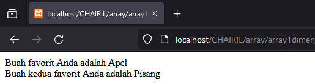
ANALISIS:

1.  Array `$buah` dideklarasikan dan diinisialisasi dengan beberapa nama buah: "Apel", "Pisang", "Jeruk", "Anggur", dan "Mangga".
2.  Program menggunakan nomor untuk mengakses nilai array. Dalam contoh ini, nilai array dicetak menggunakan pernyataan `echo`. Contoh ini mencetak "Buah favorit Anda adalah Apel" dan "Buah kedua favorit Anda adalah Pisang".
3. **Analisis**: Program ini menunjukkan cara mengakses nilai array menggunakan nomor. penghitungan elemen array dimulai dari 0 dan berturut-turut. Dalam contoh ini, "Apel" memiliki nomor 0, "Pisang" memiliki nomor 1, dan seterusnya. Dengan menggunakan nomor, Anda dapat mengakses nilai array secara terpisah untuk diproses atau ditampilkan.

KESIMPULAN:
Penggunaan array satu dimensi ini memudahkan pengelolaan kumpulan data yang serupa dalam satu variabel. Dengan array, Anda dapat menyimpan, mengakses, dan memanipulasi sejumlah nilai dengan cara yang efisien dan terstruktur.
### Array Asosiatif
Array asosiatif adalah jenis array di mana setiap elemen memiliki nama yang terkait dengan nilainya. Dalam array asosiatif, pemanggilan tidak berupa urutan nomor, tetapi berupa nama yang ditentukan oleh pengguna.

STRUKTUR:
```PHP
$umur = array("hayril" => 25, "fachri" => 30, "rayhan" => 35);
```

PROGRAM:
```php
$umur = array("hayril" => 25, "fachri" => 30, "rayhan" => 35);

echo "Umur Hayril adalah " . $umur["hayril"] . " tahun.<br>"; 
echo "Umur Fachri adalah " . $umur["fachri"] . " tahun.<br>";
echo "Umur Rayhan adalah " . $umur["rayhan"] . " tahun.";
```

HASIL:
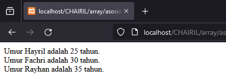
ANALISIS:
1. Program di atas mendeklarasikan array asosiatif `$umur` dengan tiga pasangan kunci-nilai. Setiap kunci adalah nama orang, dan nilainya adalah umur mereka.
2. Kemudian, program mengakses nilai array menggunakan kunci (nama orang) dan mencetak umur masing-masing orang.
KESIMPULAN:
Program ini menunjukkan cara menggunakan array asosiatif untuk menyimpan dan mengakses data dengan kunci yang bermakna. Dalam contoh ini, kita menyimpan informasi umur orang-orang dengan menggunakan nama mereka sebagai kunci.
## Array Multidimensi
Array multidimensi adalah jenis array di mana setiap elemen dalam array itu sendiri adalah array. Dengan kata lain, array multidimensi adalah array yang memiliki array sebagai elemen-elemennya.

STRUKTUR:
```PHP
$matriks = array(
    array(1, 2, 3),
    array(4, 5, 6),
    array(7, 8, 9)
);
```

PROGRAM:
```php
	$matriks = array(
	array(1, 2, 3),
	array(4, 5, 6),
	array(7, 8, 9)); 
	echo "nomor kamar kamu:" . $matriks[1][2] . "<br>";
	echo "nomor kamar temanmu: " . $matriks[2][0] . "<br>";
```

HASIL:
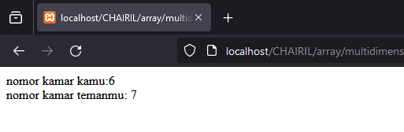
ANALISIS:
1. Masing-masing mewakili nomor kamar. Setiap baris mewakili nomor kamar dari kiri ke kanan.
2. program mengakses dan mencetak nilai dari dua elemen matriks menggunakan nomor. `$matriks[1][2]` digunakan untuk menampilkan nomor kamar di baris kedua dan kolom ketiga (indeks dimulai dari 0), sedangkan `$matriks[2][0]` digunakan untuk mencetak nomor kamar di baris ketiga dan kolom pertama.
KESIMPULAN:
Program ini memberikan contoh sederhana penggunaan array multidimensi dalam PHP. Ini mengilustrasikan bagaimana kita dapat menggunakan array multidimensi untuk menyimpan dan mengakses data yang lebih kompleks dengan cara yang terstruktur dan mudah dipahami.
## Var_Dump
Fungsi `var_dump()` adalah fungsi bawaan PHP yang digunakan untuk menampilkan informasi rinci tentang satu atau lebih variabel, termasuk tipe data dan nilai variabel tersebut. Ini sering digunakan untuk debugging dan pengembangan kode, karena memberikan informasi yang lebih lengkap tentang variabel daripada fungsi `echo` atau `print_r()`.

```php
$nama = "hayril";
$umur = 17;
$nilai = array(1, 2, 3);
$kosong = null;

var_dump($nama);
var_dump($umur);
var_dump($nilai);
var_dump($kosong);

```

ANALISIS:
1. **Penggunaan Fungsi var_dump()**: Program menggunakan fungsi var_dump() untuk menampilkan informasi rinci tentang beberapa variabel. Variabel yang ditampilkan meliputi string, integer, array, dan variabel null.
2. **Informasi yang Disajikan**: var_dump() memberikan informasi yang lebih lengkap tentang setiap variabel. Ini mencakup tipe data variabel (seperti string, integer, atau array) dan nilai yang terkait dengannya. Misalnya, untuk array, var_dump() juga menampilkan jumlah elemen dalam array.
3. **Keuntungan untuk Debugging**: var_dump() sangat berguna untuk debugging karena memberikan informasi yang lebih rinci tentang variabel daripada metode pencetakan biasa seperti echo atau print_r(). Dengan var_dump(), pengembang dapat dengan cepat melihat tipe data dan nilai variabel dalam kode mereka.

KESIMPULAN:
Penggunaan var_dump() dalam program memberikan informasi yang penting dan rinci tentang variabel yang ditampilkan. Dengan menyediakan tipe data dan nilai variabel, serta informasi tambahan seperti panjang string atau jumlah elemen dalam array, var_dump() memungkinkan pengembang untuk dengan cepat memahami struktur dan isi variabel dalam kode mereka.
 

## Looping (Pengulangan)
Pengulangan dalam PHP adalah proses yang memungkinkan Anda untuk menjalankan serangkaian pernyataan secara berulang berdasarkan kondisi tertentu atau sejumlah iterasi yang ditentukan.
### For
Pengulangan for memungkinkan Anda untuk mengeksekusi serangkaian pernyataan berdasarkan sejumlah iterasi tertentu.

STRUKTUR:
```PHP
for (inisalisasi; kondisi; kenaikan/pengurangan) {
    // pernyataan yang akan dieksekusi selama kondisi bernilai true
}
```

PROGRAM:
```php

// Mencetak angka 1 sampai 5 menggunakan perulangan for
for ($hayril = 1; $hayril <= 5; $hayril++) {
    echo $hayril . " ";
}
?>
```

HASIL:

ANALISIS:
1. **Inisialisasi Variabel**: Pada awal loop, variabel `$hayril` diinisialisasi dengan nilai 1 (`$hayril = 1`).
2. **Kondisi**: Kondisi loop (`$hayril <= 5`) diuji sebelum setiap iterasi. Jika kondisinya benar, iterasi dilanjutkan. Jika tidak, loop berakhir.
3. **Pernyataan Increment**: Setiap kali iterasi selesai dieksekusi, nilai variabel `$hayril` ditingkatkan satu unit (`$hayril++`). Ini memastikan bahwa loop berjalan hingga mencapai batas yang diinginkan.
4. **Pernyataan dalam Blok for**: Pada setiap iterasi, pernyataan dalam blok for (dalam hal ini, pernyataan `echo`) dieksekusi. Ini akan mencetak nilai variabel `$hayril`.
KESIMPULAN:
Program ini menggunakan pengulangan for untuk mencetak angka dari 1 hingga 5. Dengan menggunakan inisialisasi, kondisi, dan pernyataan increment, loop berjalan sesuai yang diharapkan.

### While
while adalah salah satu dari beberapa  pengulangan (looping) yang tersedia. Ini digunakan untuk melakukan pengulangan berulang kali selama kondisi tertentu bernilai true

STRUKTUR:
```php
while (kondisi) {
    // kode yang akan dijalankan berulang kali selama kondisi bernilai true
}
```

PROGRAM:
```php
$hayril = 1;

while ($hayril <= 10) {
    echo $hayril" ";
    $hayril++;
}
```

HASIL:

ANALISIS:
1. Langkah pertama adalah menginisialisasi variabel `$hayril` dengan nilai 1. Ini adalah langkah awal sebelum memasuki loop.
2.  Setelah variabel diinisialisasi, kondisi dalam pernyataan `while` dievaluasi. Pada kasus ini, kondisinya adalah `$hayril <= 10`. Ini berarti loop akan terus berjalan selama nilai `$hayril` tidak melebihi 10.
3. Jika kondisi dalam pernyataan `while` adalah true, maka blok kode di dalamnya dieksekusi. Dalam contoh ini, kode yang dieksekusi adalah mencetak nilai variabel `$hayril` diikuti oleh spasi.
4.  Setelah blok kode dieksekusi, variabel yang mengontrol iterasi (dalam hal ini, `$hayril`) diupdate. Dalam contoh ini, variabel `$hayril` ditambah satu setiap kali loop dieksekusi, dengan `$hayril++`.
5.  Setelah variabel kontrol diperbarui, kondisi dalam pernyataan `while` diperiksa lagi. Jika kondisi masih bernilai true, maka langkah 3 dan 4 diulangi. Jika kondisi menjadi false, maka eksekusi keluar dari loop.
KESIMPULAN:
Penggunaan `while` sangat berguna ketika Anda perlu melakukan iterasi berulang kali berdasarkan kondisi tertentu. Ini memungkinkan untuk menjalankan blok kode berulang kali selama kondisi yang ditentukan tetap benar. Penting untuk memastikan bahwa kondisi akan berubah di setiap iterasi untuk menghindari perulangan tak terbatas.
### Do-While
do-while adalah struktur pengulangan (looping) yang serupa dengan `while`, tetapi dengan perbedaan bahwa blok kode di dalamnya akan dieksekusi setidaknya satu kali, bahkan jika kondisinya tidak terpenuhi.

STRUKTUR:
```php
do {
    // kode yang akan dijalankan setidaknya sekali
} while (kondisi);
```
PROGRAM:
```php
$hayril = 1;
do {
    echo $hayril . " ";
    $hayril++;
} while ($hayril <= 10);
```
HASIL:

ANALISIS:
1. **Inisialisasi variabel**: Langkah pertama adalah menginisialisasi variabel `$hayril` dengan nilai 1.
2. **Eksekusi blok kode**: Blok kode di dalam `do` dieksekusi terlebih dahulu tanpa memeriksa kondisi. Dalam kasus ini, kode akan mencetak nilai dari variabel `$hayril` (dimulai dari 1) diikuti oleh spasi.
3. **Update variabel kontrol**: Setelah blok kode dieksekusi, variabel kontrol iterasi (dalam hal ini, `$hayril`) ditingkatkan dengan `$hayril++`. Ini berarti nilai `$hayril` akan bertambah satu setiap kali blok kode di dalam `do` dieksekusi.
4. **Evaluasi kondisi**: Setelah variabel kontrol diperbarui, kondisi dalam pernyataan `while` dievaluasi. Dalam contoh ini, kondisinya adalah `$hayril <= 10`, yang berarti loop akan terus berlanjut selama nilai `$hayril` kurang dari atau sama dengan 10.
5. **Keluar dari loop**: Jika kondisi dalam pernyataan `while` tidak lagi bernilai true, maka eksekusi keluar dari loop.
KESIMPULAN:
Kode di atas mencetak angka dari 1 hingga 10 menggunakan perulangan `do-while`. Karena `do-while` mengeksekusi blok kode minimal satu kali sebelum memeriksa kondisi, angka 1 akan dicetak terlebih dahulu, dan kemudian nilai `$hayril` akan ditingkatkan. Iterasi akan terus berlanjut hingga nilai `$hayril` mencapai atau melampaui 10. Kode ini akan mencetak angka dari 1 hingga 10 secara berurutan dengan spasi di antara setiap angka.
### Foreach
foreach adalah struktur pengulangan (looping) yang digunakan khusus untuk melakukan iterasi melalui setiap elemen dalam array atau objek.

STRUKTUR:
```php
`foreach ($array as $kunci => $nilai) {     // kode yang akan dieksekusi untuk setiap kunci dan nilai dalam array }`
```
PROGRAM:
```php
$colors = array("merah", "hijau", "biru", "kuning");

foreach ($colors as $color) {
    echo $color . " ";
}
```
HASIL:

ANALISIS:
1. **Inisialisasi Array**: Array `$colors` diinisialisasi dengan beberapa nilai warna.
2. **Pengulangan dengan `foreach`**: Perulangan `foreach` digunakan untuk mengiterasi melalui setiap elemen dalam array `$colors`.
3. **Eksekusi Blok Kode**: Pada setiap iterasi, nilai elemen saat ini disimpan dalam variabel `$color`.
4. **Cetak Nilai**: Nilai dari `$color` dicetak ke layar dengan spasi sebagai pemisah antara setiap nilai.
5. **Iterasi Berlanjut**: Perulangan berlanjut hingga semua elemen dalam array `$colors` diproses.
KESIMPULAN:
Program di atas adalah contoh sederhana penggunaan `foreach` dalam PHP untuk mengiterasi melalui array dan melakukan tindakan pada setiap elemennya. Struktur `foreach` menyederhanakan proses iterasi melalui array dengan menghilangkan kebutuhan untuk mengelola indeks atau iterator eksternal, sehingga membuat kode lebih mudah dibaca dan dipahami.
## Function
function (fungsi) adalah sekelompok perintah yang dapat diberi nama dan dipanggil dari bagian lain dalam kode. Fungsi digunakan untuk melakukan tugas tertentu dan dapat dikirimkan parameter (masukan) dan mengembalikan nilai (keluaran). Fungsi membantu dalam memecah kode menjadi bagian-bagian yang lebih kecil dan lebih mudah dikelola, serta mengurangi duplikasi kode.

STRUKTUR :
```PHP

function namaFungsi() {
    // Kode yang akan dijalankan
    echo "Hello, World!";
}
```

CONTOH:
```PHP

function hitungLuasPersegiPanjang($panjang, $lebar) {
    $luas = $panjang * $lebar;
    return $luas;
}
$panjang = 10;
$lebar = 5;
$luasPersegiPanjang = hitungLuasPersegiPanjang($panjang, $lebar);

echo "Luas persegi panjang dengan panjang $panjang dan lebar $lebar adalah $luasPersegiPanjang.";

```

HASIL:


ANALISIS:
- Fungsi `hitungLuasPersegiPanjang` didefinisikan dengan dua parameter: `$panjang` dan `$lebar`.
- Fungsi ini menghitung luas dengan mengalikan panjang dan lebar, kemudian mengembalikan hasilnya.
- Variabel `$panjang` dan `$lebar` diinisialisasi dengan nilai 10 dan 5.
- Fungsi `hitungLuasPersegiPanjang` dipanggil dengan parameter tersebut, dan hasilnya disimpan dalam variabel `$luasPersegiPanjang`.
- Hasil perhitungan ditampilkan menggunakan `echo`, dengan memanfaatkan interpolasi variabel dalam string untuk menyisipkan nilai panjang, lebar, dan luas.

KESIMPULAN:
- **Modularitas**: Fungsi `hitungLuasPersegiPanjang` memisahkan logika perhitungan dari bagian lain program, membuat kode lebih terstruktur dan modular.
- **Reusability**: Fungsi ini dapat dipanggil dengan berbagai nilai panjang dan lebar tanpa perlu menduplikasi kode perhitungan luas di beberapa tempat.
- **Maintainability**: Jika ada perubahan dalam cara menghitung luas, kita hanya perlu mengubah kode di dalam fungsi, bukan di seluruh program.

### Get Post Method

#### Form Get 

PROGRAM FROM GET:
```PHP
<!DOCTYPE html>
<html lang="en">
<head>
    <title>Document</title>
</head>
<body>
    <!-- Pada atribut action, kalian tuliskan nama file php yang bertugas untuk mengelola atau menangkap data dari form tersebut. -->
    <form action="proses_get.php" method="GET">
      <input type="text" name="nama" placeholder="Masukkan nama">
      <input type="number" name="umur" placeholder="Masukkan umur"> <br>
      <button type="submit">Kirim</button>
    </form>
</body>
</html>
```

HASIL FORM GET:


ANALISA:
- (`<input type="text" name="nama" placeholder="Masukkan nama">`) adalah sebuah program untuk memasukkan sebuah inputan berupa text untuk menginput nama.
- (`<input type="number" name="umur" placeholder="Masukkan umur">`).  adalah sebuah program untuk memasukkan sebuah inputan berupa angka untuk menginput umur.
- `<form>` menentukan file PHP yang akan menerima data dari formulir ini. Dalam kasus ini, data akan dikirimkan ke "proses_get.php".

KESIMPULAN:
Program tersebut adalah sebuah formulir HTML sederhana yang mengumpulkan data nama dan umur dari pengguna.Data yang dikumpulkan akan dikirimkan ke file PHP "proses_get.php" menggunakan metode GET.

#### Proses Get
PROGRAM PROSES GET:
```PHP
// Key dari array-nya, sesuai dengan nama dari atribut name di setiap input-nya
$nama = $_GET["nama"];
$umur = $_GET["umur"];
?>
<!DOCTYPE html>
<html lang="en">
<head>
    <meta charset="UTF-8">
    <meta name="viewport" content="width=device-width, initial-scale=1.0">
    <title>from get</title>
</head>
<body>
    <p>Nama anda
        <!-- Ini adalah versi singkatnya dari php echo,
             yang fungsinya untuk menampilkan data -->
        <?= $nama ?>
    </p>
    <p>Umur anda <?= $umur ?> tahun</p>
</body>
</html>
```

HASIL PROSES GET:


ANALISA:
- `$nama`  `$umur` sebagai variabel , program ini mengambil data "nama" dan "umur"  yang dikirimkan melalui URL sebagai bagian dari query string dan menyimpan nya kedalam variabel nama dan umur.
- `$_GET` mengambil Data yang dikirimkan melalui URL dengan metode GET.
- `<?= $nama ?>` dan `<?= $umur ?>` digunakan untuk menampilkan nilai variabel tersebut langsung dalam HTML tanpa menggunakan fungsi `echo`.
- `<meta charset="UTF-8">` digunakan untuk menentukan karakter set halaman web sebagai UTF-8, yang memastikan bahwa karakter Unicode dapat ditampilkan dengan benar.

KESIMPULAN:
Program ini adalah penggunaan PHP untuk memproses data formulir HTML yang dikirim melalui URL dengan metode GET.(program ini memproses data yang dijalakan pada program get dan menampilkan hasilnya).

#### Form posh

PROGRAM FORM POSH:
```php
<!DOCTYPE html>
<html lang="en">
<head>
    <title>Document</title>
</head>
<body>
    <!-- Pada atribut action, kalian tuliskan nama file php yang bertugas untuk mengelola atau menangkap data dari form tersebut. -->
    <form action="proses_posh.php" method="POST">
        <input type="text" name="nama_lengkap" placeholder="Masukkan nama">
        <input type="number" name="umur" placeholder="Masukkan umur">
        <input type="password" name="password" placeholder="Masukkan password"><br>
        <button type="submit">Kirim</button>
    </form>
</body>
</html>
```

HASIL FROM POSH:


ANALISA:
- `<form action="proses_posh.php" method="POST">`: Ini adalah tag pembuka untuk formulir. Atribut `action` menentukan lokasi file PHP yang akan menerima data dari formulir ini. Metode `POST` menentukan cara pengiriman data.
- `<input type="text" name="nama_lengkap" placeholder="Masukkan nama">`: Ini adalah input teks untuk memasukkan nama lengkap pengguna. Atribut `name` akan digunakan sebagai kunci untuk mengakses nilai di file PHP yang ditentukan dalam atribut `action`.
- - `<input type="number" name="umur" placeholder="Masukkan umur">`: Ini adalah input angka untuk memasukkan umur pengguna.
- `<input type="password" name="password" placeholder="Masukkan password">`: Ini adalah input sandi untuk memasukkan kata sandi pengguna. Jenis input ini akan menyembunyikan teks yang dimasukkan.
- `<button type="submit">Kirim</button>`: Ini adalah tombol yang akan digunakan pengguna untuk mengirimkan formulir. Ketika tombol ini ditekan, data akan dikirimkan ke lokasi yang ditentukan dalam atribut `action`.

KESIMPULAN:
Program tersebut adalah sebuah formulir HTML menggunakan metode posh yang meminta pengguna untuk memasukkan beberapa informasi, seperti nama lengkap, umur, dan password.Program ini bertujuan untuk mengumpulkan informasi yang dimasukkan oleh pengguna dan mengirimkannya ke server untuk diproses lebih lanjut.

PROGRAM PROSES POSH:
```PHP
<?php
// Key dari array-nya, sesuai dengan nama dari atribut name di setiap input-nya
//$nama = $_POST["nama"];
$umur = $_POST["umur"];
var_dump($_POST);
?>
<!DOCTYPE html>
<html lang="en">
<head>
    <title> XI RPL 1 - POST</title>
</head>
<body>
    <p>Nama anda <?= $_POST["nama_lengkap"] ?></p>
    <p>Umur anda <?= $umur ?> tahun</p>
    <p>Password anda aman!</p>
</body>
</html>
```

HASIL PROSES POSH:
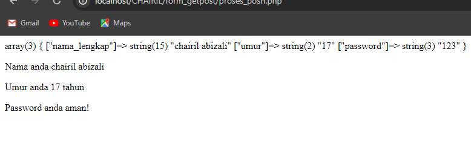

ANALISA:
- `$nama = $_POST["nama"];`: Baris ini mengambil nilai yang dikirimkan melalui formulir dengan inisialisasi "nama" menggunakan metode POST dan menyimpannya dalam variabel `$nama.
- `$umur = $_POST["umur"];`: Baris ini mengambil nilai yang dikirimkan melalui formulir dengan insialisasi "umur" menggunakan metode POST dan menyimpannya dalam variabel `$umur`.
- `var_dump($_POST);`: Fungsi `var_dump()` digunakan untuk menampilkan informasi terstruktur tentang variabel atau ekspresi, dalam hal ini, isi dari array `$_POST`.
- `<p>Nama anda <?= $_POST["nama_lengkap"] ?></p>`: Ini adalah paragraf yang menampilkan nama lengkap pengguna. Nilainya diambil dari array `$_POST` dengan kunci "nama_lengkap".
- `<p>Umur anda <?= $umur ?> tahun</p>`: Ini adalah paragraf yang menampilkan umur pengguna. Nilainya diambil dari variabel `$umur` yang sudah diambil dari array `$_POST`.
- `<p>Password anda aman!</p>`: Paragraf ini adalah statis dan memberikan pesan umum tentang kata sandi.

KESIMPULAN:
program menampilkan kembali informasi yang dimasukkan oleh pengguna sebelumya pada program form posh, seperti nama lengkap dan umur, di halaman web menggunakan tag HTML. Pesan "Password anda aman!" ditampilkan secara statis. Jadi, tujuan utama dari program ini adalah untuk menampilkan kembali data yang dikirimkan oleh pengguna.

# Koneksi Database

## Kode Program 

```php
//koneksi ke database
$koneksi = mysqli_connect('localhost', 'root', '', 'rental_hayril');
if ($koneksi) {
    echo "<br> koneksi aman <br>";
} else {
    echo "error, tidak bisa koneksi ke database";
}
```

## Hasil


## Analisis

- Menggunakan `mysqli_connect` untuk menghubungkan ke database MySQL.
- Menggunakan `localhost` sebagai server, `root` sebagai username, password kosong, dan `rental_hayril` sebagai nama database.
- jika koneksi berhasil,maka akan mencetak "koneksi aman",jika gagal maka akan mencetak "error,tidak bisa koneksi ke database".

## Kesimpulan

Program tersebut bertujuan untuk menghubungkan database MySQL dan memberi tahu apakah koneksi berhasil.

# Tampilkan Data 

## Kode Program

```php
<?php

//koneksi ke database
$koneksi = mysqli_connect('localhost', 'root', '', 'rental_rahmat');
  
if ($koneksi) {
    echo "<br> koneksi aman <br>";
} else {
    echo "error, tidak bisa koneksi ke database";
}
  
//jalankan query seleksi
$select = mysqli_query($koneksi, "SELECT * FROM daftar_mobil");

// //membuat array dan memecah data berdasarkan kolomnya
// $result = mysqli_fetch_assoc($select);
  
//menampilkan struktur array dari data tabel yang dijalankan di atas
// var_dump($result);
  
echo 'Berikut nama-nama pemilik mobil<br>';
$a = 1;
foreach($select as $key => $data){
    echo $a++ . ", " . $data ['no_plat'] . " : " . $data ['pemilik'] . '<br>';
}
  
// echo '<p>Halo ' . $result['pemilik'] . '!!</p><br>';
```

## Hasil


## Analisis

- Menghubungkan ke database MySQL dengan menggunakan `localhost` sebagai server, `root` sebagai username, password kosong, dan `rental_hayril` sebagai nama database.
- Memeriksa apakah koneksi berhasil dan menampilkan pesan yang sesuai.
- menampilkan semua data dari tabel `data_mobil` menggunanakan query.
- Menginisialisasi variabel `$a` untuk penomoran.
- Menggunakan loop `foreach` untuk iterasi melalui hasil query dan menampilkan nomor plat dan nama pemilik mobil.

## Kesimpulan
Program Tersebut bertujuan menghubungkan ke database,dan menjalankan query dari tabel `data_mobil` dan menampilkan nama-nama pemilik mobil.

# Tambahkan Data
## Kode Program
```PHP


//koneksi ke database

$koneksi = mysqli_connect('localhost', 'root', '', 'rental_hayril');


if ($koneksi) {
    echo "<br> koneksi aman <br>";
} else {
     echo "error, tidak bisa koneksi ke database";
}

//jalankan query seleksi
$select = mysqli_query($koneksi, "SELECT * FROM data_mobil");
//menampilkan struktur array dari data tabel yang dijalankan di atas
// var_dump($result);

echo 'Berikut nama-nama pemilik mobil<br>';
$a = 1;
foreach($select as $key => $data){
     echo $a++ . ", " . $data['no_plat'] . " : " . $data['pemilik'] . '<br>';

}
//Tambahkan data baru ke tabel daftar_mobil
$no_plat_baru = "DD 1312 UY";
$pemilik_baru = "Hayril";

$insert = mysqli_query($koneksi, "INSERT INTO data_mobil (no_plat, pemilik) VALUES ('$no_plat_baru', '$pemilik_baru')");
if ($insert) {
    echo "Data baru berhasil ditambahkan ke tabel data_mobil";
} else {
    echo "Gagal menambahkan data baru ke tabel data_mobil";
}
// echo '<p>Halo ' . $result['pemilik'] . '!!</p><br>';
```

## Hasil 
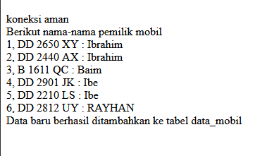

## Analisis

- Menggunakan fungsi `mysqli_connect()` untuk membuat koneksi ke database MySQL dengan parameter host ('localhost'), username ('root'), password (''), dan nama database ('rental_hayril').
- `$mysql_query`  menjalakan perintah query untuk menampilkan semua data dari tabel `data_mobil`
- Menjalankan query `INSERT` untuk menambahkan data baru ke tabel `data_mobil`.
- `if ($insert)` untuk menampilkan statement apakah berhasil atau tidak 

## Kesimpulan
Program di atas adalah perintah untuk menapikan data dari tabel `data_mobil` ,dan menambahakan data baru.

# Ubah Data

## Kode Program 
```php
<?php

//koneksi ke database

$koneksi = mysqli_connect('localhost', 'root', '', 'rental_hayril');

if ($koneksi) {
    echo "<br> koneksi aman <br>";
} else {
    echo "error, tidak bisa koneksi ke database";
} 

//jalankan query seleksi
$select = mysqli_query($koneksi, "SELECT * FROM data_mobil");
echo 'Berikut nama-nama pemilik mobil sebelum perubahan<br>';

$a = 1;
foreach($select as $key => $data){
    echo $a++ . ", " . $data['no_plat'] . " : " . $data['pemilik'] . '<br>';

}

//Ubah data dalam tabel data_mobil
$no_plat_lama = "DD 2812 UY";
$pemilik_baru = "Cia";

$update = mysqli_query($koneksi, "UPDATE data_mobil SET pemilik='$pemilik_baru' WHERE no_plat='$no_plat_lama'");
  
if ($update) {
    echo "Data berhasil diubah";
} else {
    echo "Gagal mengubah data";
}

//jalankan query seleksi setelah perubahan
$select_after_update = mysqli_query($koneksi, "SELECT * FROM data_mobil");
echo 'Berikut nama-nama pemilik mobil setelah perubahan<br>';

$a = 1;
foreach($select_after_update as $key => $data){
    echo $a++ . ", " . $data['no_plat'] . " : " . $data['pemilik'] . '<br>';
}
```

## Hasil 


## Analsis

- Menggunakan fungsi `mysqli_connect()` untuk membuat koneksi ke database MySQL dengan parameter host ('localhost'), username ('root'), password (''), dan nama database ('rental_hayril').
- `$mysql_query`  menjalakan perintah query untuk menampilkan semua data dari tabel `data_mobil` sebelum melakukan perubahan
- `$no_plat_lama = "DD 2812 UY";` adalah mendefinisika letak data yang ingin diubah.
- `$pemilik_baru = "Cia";` adalah data yang akan di ubah.
- Menjalankan query `update` untuk mengubah salah satu  data  yang ada pada tabel `data_mobil`.
- `if ($update)` untuk menampilkan statement apakah berhasil atau tidak 
- `foreach($select_after_update as $key => $data` adalah perintah menampilkan tabel setelah di ubah

## Kesimpulan
Program di atas adalah perintah untuk menampilkan semua data pada tabel `data_mobil` lalu mengupdate salah satu datanya kemudian menampilkan lagi data tabel `data_mobil` setelah diubah.

# Hapus Data

## Kode Program 
```php
// Koneksi ke database
$koneksi = mysqli_connect('localhost', 'root', '', 'rental_hayril');
if ($koneksi) {
  echo "<br> Koneksi aman <br>";
} else {
  echo "Error, tidak bisa koneksi ke database";
}

// Jalankan query seleksi
$select = mysqli_query($koneksi, "SELECT * FROM data_mobil");
echo 'Berikut nama-nama pemilik mobil sebelum penghapusan<br>';
$a = 1;
foreach ($select as $key => $data) {
 echo $a++ . ", " . $data['no_plat'] . " : " . $data['pemilik'] . '<br>';
}
// Hapus data dalam tabel daftar_mobil
$no_plat_hapus = "DD 1312 UY";

$delete = mysqli_query($koneksi, "DELETE FROM data_mobil WHERE no_plat='$no_plat_hapus'");
if ($delete) {
 echo "Data berhasil dihapus<br>";
} else {
 echo "Gagal menghapus data";
}

// Jalankan query seleksi setelah penghapusan
$select_after_delete = mysqli_query($koneksi, "SELECT * FROM data_mobil");
echo 'Berikut nama-nama pemilik mobil setelah penghapusan<br>';
$a = 1;
foreach ($select_after_delete as $key => $data) {
  echo $a++ . ", " . $data['no_plat'] . " : " . $data['pemilik'] . '<br>';
}
```

## Hasil 


## Analisis

- Menggunakan fungsi `mysqli_connect()` untuk membuat koneksi ke database MySQL dengan parameter host ('localhost'), username ('root'), password (''), dan nama database ('rental_hayril').
- `$mysql_query`  menjalakan perintah query untuk menampilkan semua data dari tabel `data_mobil` sebelum melakukan perubahan
- `$no_plat_hapus = "DD 1312 UY";` adalah mendefinisikan nomor plat yang akan dihapus
- Menjalankan query `delete` untuk menghapus salah satu  data  yang ada pada tabel `data_mobil`.
- `if ($delete)` untuk menampilkan statement apakah berhasil atau tidak 
- `foreach($select_after_delete as $key => $data` adalah perintah menampilkan tabel setelah di hapus.

## Kesimpulan
Program di atas adalah perintah untuk menampilkan semua data pada tabel `data_mobil` lalu menghapus salah satu datanya kemudian menampilkan lagi data tabel `data_mobil` setelah dihapus.

# Session/Login

## Session
### Kode Program Session
```php
<?php

  

session_start();

  

// $username = "Raihan";

// $alamat = "Bulsar";

  

// $_SESSION['username'] = $username;

// $_SESSION['alamat'] = $alamat;

  

if(isset($_POST['submit'])){

    $username = $_POST['username'];

    $password = $_POST['password'];

  

    $koneksi = mysqli_connect('localhost', 'root', '', 'praktikum_hayril') or die('error koneksi');

  

    $result = mysqli_query($koneksi, "SELECT * FROM user2 WHERE username = '$username' AND password = '$password'");

  

    $data = mysqli_fetch_assoc($result);

    var_dump($data);

  

if(isset($data)) {

    $_SESSION['Nama'] = $data['Nama'];

    $_SESSION['username'] = $data['username'];

    $_SESSION['status'] = 'login';

    header('Location: user.php');

} else {

    echo "username dan pasword salah";

}

}

  

?>

<!DOCTYPE html>

<html>

<head>  

    <title>Login Session</title>

</head>

<body>

    <form method="post">

        <label>Username</label>

        <input type="text" name="username">

        <br>

        <label>Password</label>

        <input type="password" name="password">

        <br></br>

        <button type="submit" name="submit">Login</button>

    </form>    

</body>
</html>
```
### Hasil Session


### Analisis Session
- `session_start();` sebagai perintah dimulainya session.
- HTML di bagian bawah program menyediakan form dengan metode `POST` yang memiliki dua input untuk username dan password serta sebuah tombol untuk submit.
- Jika tombol submit ditekan (`isset($_POST['submit'])`), maka nilai dari username dan password akan diambil dari input form.
- Koneksi ke database `praktikum_hayril` diinisialisasi.
- Query `SELECT` dijalankan untuk mencari pengguna dengan username dan password yang sesuai.
- Hasil query diambil sebagai array asosiatif dan diperiksa.
- Jika pengguna ditemukan (`isset($data)`), maka session akan diatur dengan informasi pengguna, dan pengguna akan diarahkan ke halaman `user.php`.
- Jika pengguna tidak ditemukan, pesan error akan ditampilkan.
### Analisis Session
Program di atas adalah perintah untuk membuat suatu program login dengan menampilkan syaratnya adalah dengan memasukkan username dan password.

## Login User 
### Kode Program User
```php
<?php

session_start();

if ($_SESSION['status'] == 'login' && $_SESSION['username'] == 'admin') {

    header("Location: admin.php");

}

if ($_SESSION['status'] != 'login') {

    header('Location: session.php');

}

  

?>

<!DOCTYPE html>

<html lang="en">

  

<head>

    <title>Document</title>

</head>

  

<body>

    <h1>Halaman User</h1>

  

    <h1>Halo, <?= $_SESSION['Nama'] ?></h1>

    <a href="logout.php">Logout</a>

  

</body>

  

</html>
```
### Hasil User

### Analisis Login User
- `session_start();` sebagai perintah dimulainya session.
- Program memeriksa apakah session `status` bernilai 'login' dan `username` bernilai 'admin'.
- Jika kondisi tersebut benar, pengguna diarahkan ke halaman `admin.php`.
- Jika session `status` tidak bernilai 'login', pengguna diarahkan ke halaman `session.php`.
- Jika pengguna lolos dari pengecekan di atas (berarti pengguna telah login dan bukan admin), maka halaman HTML akan ditampilkan.
- Halaman ini menampilkan sapaan kepada pengguna menggunakan nama yang disimpan dalam session (`$_SESSION['Nama']`).
- Terdapat juga link untuk logout yang mengarah ke `logout.php`.
### Kesimpulan Login User
Program di atas bertujuan untuk memastikan hanya pengguna dengan status login tapi tidak dengan username `admin` yang dapat mengakses halaman user.

## Login Admin

### Kode Program Admin
```php
<?php

session_start();

  

if ($_SESSION['status'] == 'login' && $_SESSION['username'] != 'admin') {

    header("Location: user.php");

}

  

if ($_SESSION['status'] != 'login') {

    header('Location: session.php');

}

  

?>

<!DOCTYPE html>

<html lang="en">

  

<head>

    <title>Document</title>

</head>

  

<body>

    <h1>Halaman Admin</h1>

  

    <h1>Halo, <?= $_SESSION['Nama'] ?></h1>

    <a href="logout.php">Logout</a>

  

</body>

  

</html>
```

### Hasil Admin


### Analisis Login Admin
-  `session_start();` sebagai perintah dimulainya session.
- Program memeriksa apakah session `status` bernilai 'login' dan `username` bernilai 'admin'.
- Jika kondisi tersebut benar, pengguna diarahkan ke halaman `admin.php`.
- Jika pengguna lolos dari pengecekan di atas (berarti pengguna telah login dan tercatat bahwa dia adalah admin), maka halaman HTML akan ditampilkan.
- Halaman ini menampilkan sapaan kepada pengguna menggunakan nama yang disimpan dalam session (`$_SESSION['admin']`).
- Terdapat juga link untuk logout yang mengarah ke `logout.php`.
### Kesimpulan Login Admin
Program PHP ini berfungsi untuk membatasi akses ke halaman admin hanya untuk pengguna yang berstatus login dan memiliki username 'admin'.

# Upload & Download
## Upload 

### Kode Program Upload
```php
<!DOCTYPE html>

<html lang="en">

<head>

    <meta charset="UTF-8">

    <meta name="viewport" content="width=device-width, initial-scale=1.0">

    <title>index tabel</title>

</head>

<body>

    <h2>Data Siswa Berprestasi</h2>

    <a href="tambah.php">+Tambah Data Baru</a><br><br>

    <p>

        <a href="export.php">Export Excel</a>

    </p>

    <table border="5">

    <tr>

        <th>id_siswa</th>

        <th>gambar</th>

        <th>nama</th>

        <th>email</th>

        <th>jenis_kelamin</th>

        <th>alamat</th>

        <th>Aksi</th>

    </tr>

  

    <?php

    include "koneksi.php";

    $i = 1;

    $query = mysqli_query($koneksi, "SELECT * FROM siswa");

    while ($data = mysqli_fetch_array($query)) {

    ?>

  

    <tr>

        <td><?php echo $i; ?></td>

        <td>

             " width=100px>

        </td>

        <td><?php echo $data['nama']; ?></td>

        <td><?php echo $data['email']; ?></td>

        <td><?php echo $data['jenis_kelamin']; ?></td>

        <td><?php echo $data['alamat']; ?></td>

  

        <td>

            <a href="ubah.php?id=<?= $data['id_siswa']; ?>">Ubah</a> |

            <a href="hapus.php?id=<?= $data['id_siswa']; ?>">Hapus</a> |

        </td>

    </tr>

    <?php

    $i++;

    }

    ?>

    </table>

</body>

</html>
```

```php
<!DOCTYPE html>

<html lang="en">

  

<head>

    <title>Document</title>

</head>

  

<body>

    <h2>Tambah Data</h2>

    <?php

  

    include "koneksi.php";

  

    function upload(): string

    {

        $nameImage = $_FILES['gambar']['name'];

        $directoryFile = $_FILES['gambar']['tmp_name'];

        $errorImage = intval($_FILES['gambar']['error']);

        $sizeFile = $_FILES['gambar']['size'];

  

        // cek apakah gambar ada

        if ($errorImage === 4) {

            echo "<script>alert('Anda Belum Upload Gambar')</script>";

            return false;

        }

  

        // mengambil ekstensi file

        $validType = ['svg', 'jpg', 'png', 'jpeg', 'webp'];

        $extensionFile = explode(".", $nameImage);

        $extensionValid = strtolower(end($extensionFile));

  

        // cek apakah yang diupload gambar atau bukan

        if (!in_array($extensionValid, $validType)) {

            echo "<script>alert('yang anda Upload bukan gambar')</script>";

            return false;

        }

  

        // cek size file

        if ($sizeFile > 3_000_000) {

            echo "<script>alert('Ukuran File Terlalu Besar!!(Maks 3MB)')</script>";

            return false;

        }

  

        // upload file

        $nameImage = uniqid() . "." . $extensionValid;

        move_uploaded_file($directoryFile, "img/{$nameImage}");

  

        // mengembalikan namafile yg sudah divalidasi

        return $nameImage;

    }

  
  

    if (isset($_POST['simpan'])) {

        $nama = $_POST['nama'];

        $email = $_POST['email'];

        $jenis_kelamin = $_POST['jenis_kelamin'];

        $alamat = $_POST['alamat'];

  

        $gambar = upload();

        if (!$gambar) {

            return false;

        }

  

        // * true / false

        $query = mysqli_query($koneksi, "INSERT into siswa(nama,email,jenis_kelamin,alamat,gambar)

  

        values ('$nama','$email','$jenis_kelamin','$alamat', '$gambar')");

  

        if ($query == true) {

            echo "<script>

            alert('Tambah data Berhasil')

            window.location.href='table.php'

            </script>";

        } else {

            echo '<script>alert("Tambah data gagal")</script>';

        }

    }

  
  

    ?>

    <form method="post" enctype="multipart/form-data">

        <table>

            <tr>

                <td>Nama</td>

                <td><input type="text" name="nama"></td>

            </tr>

            <tr>

                <td>Email</td>

                <td><input type="text" name="email"></td>

            </tr>

            <tr>

                <td>Jenis Kelamin</td>

                <td>>

                    <select name="jenis_kelamin">

                        <option>Laki-laki</option>

                        <option>Perempuan</option>

                    </select>

                </td>

            </tr>

  

            <tr>

                <td>Alamat</td>

                <td><input type="text" name="alamat"></td>

            </tr>

  

            <tr>

                <td>Gambar</td>

                <td><input type="file" name="gambar"></td>

            </tr>

  

            <tr>

                <td></td>

                <td>

                    <button name="simpan" type="submit">Simpan</button>

                    <button type="reset">Reset</button>

                    <a href="table.php">Kembali</a>

                </td>

            </tr>

        </table>

    </form>

  

</body>

  

</html>
```
### Hasil Upload


### Analisis Upload
- Membuat halaman HTML sederhana dengan form untuk menambahkan data.
- Menggunakan elemen `table` untuk menata form input.
- Form menggunakan metode POST dan memiliki atribut `enctype="multipart/form-data"` untuk menghandle upload file.
- Script ini mengimpor file `koneksi.php` yang diasumsikan berisi koneksi ke database.
- Mengecek apakah gambar telah di-upload.
- Memvalidasi ekstensi file yang diizinkan (`svg`, `jpg`, `png`, `jpeg`, `webp`).
- Memeriksa ukuran file (maksimal 3MB).
- Mengunggah file ke direktori `img/` dengan nama unik.
- Mengembalikan nama file yang telah divalidasi atau `false` jika ada kesalahan.
- Berisi input untuk `nama`, `email`, `jenis kelamin`, `alamat`, dan `gambar`.
- Tombol `Simpan` untuk mengirim data, `Reset` untuk menghapus isian form, dan `Kembali` untuk kembali ke halaman `table.php`.

### Kesimpulan Upload 
Program PHP ini membuat sebuah halaman web untuk menambahkan data siswa ke dalam database dengan upload gambar.
## Dowload 
### Kode Program Download
```php
<?php

include "koneksi.php";

  

$query = mysqli_query($koneksi, 'SELECT * FROM siswa');

  

$data = [];

$data[] = ["ID", "Nama","email","Jenis Kelamin", "Alamat"];

while ($row = mysqli_fetch_assoc($query)) {

    $data[] = [

        $row['id_siswa'],

        $row['nama'],

        $row['email'],

        $row['jenis_kelamin'],

        $row['alamat']

    ];

}

  

$namafile = "excel_data.xls";

header("Content-Type: application/vnd.ms-excel");

header("Content-Disposition: attachment;filename=\"$namafile\"");

header("Cache-Control: max-age=0");

  

$output = fopen("php://output", "w");

  

foreach ($data as $row) {

    fputcsv($output, $row, "\t");

}

  

fclose($output);

exit;
```

### Hasil Download


### Analisis Download

- `include="koneksi.php";` Script ini mengimpor file `koneksi.php` yang berisi koneksi ke database.
- `$query = mysqli_query` Melakukan query untuk mengambil semua data dari tabel `siswa`.
-  Membuat array `$data` untuk menyimpan hasil query.
- Menambahkan header kolom ke array `$data`
- Menggunakan `mysqli_fetch_assoc()` untuk mengambil setiap baris hasil query dan menambahkannya ke array `$data`.
- Mengatur header HTTP untuk menginformasikan bahwa konten yang dikirim adalah file Excel (`application/vnd.ms-excel`).
- Mengatur header untuk memaksa browser mengunduh file dengan nama `excel_data.xls`.
- Mengatur header untuk cache control.
- Membuka aliran keluaran (`php://output`) untuk menulis data.
- Menggunakan `fputcsv()` untuk menulis data ke aliran keluaran dalam format yang dipisahkan oleh tab (`\t`).
- Menutup aliran keluaran.
- Menghentikan eksekusi skrip dengan `exit`.
### Kesimpulan Download
Program PHP ini menghasilkan file Excel yang berisi data dari tabel `siswa` dalam database dan memaksa browser untuk mengunduh file tersebut.
